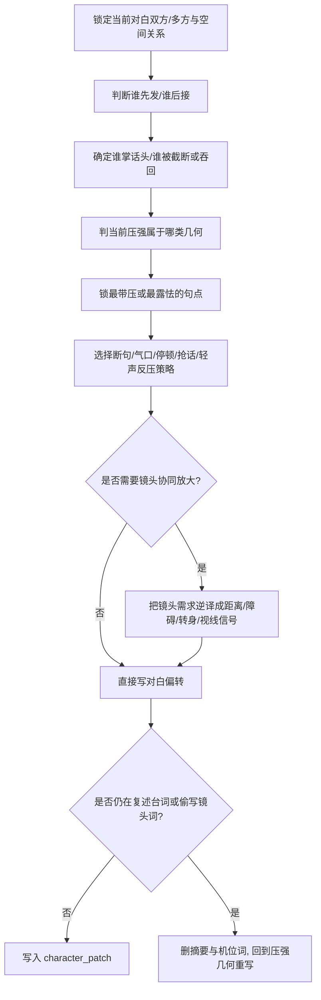
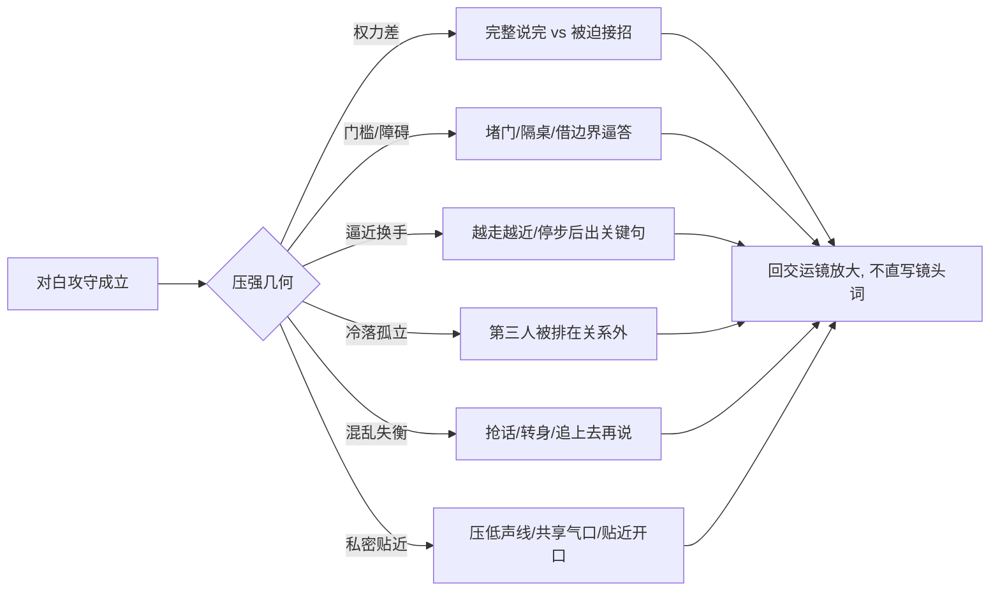

# 对话戏 模块说明

## 定位

- 本叶子负责参照共享 [角色表现总则](../module-spec.yaml)，把当前拍的对白、话轮攻守、抢话、吞话、截断、失口和气口控制压成可执行策略。
- 它不负责说明“关系复杂”，也不负责台词赏析；只负责把对白怎么发生、怎么带压、怎么露怯写成演员能执行的发法。
- 它不是展现对白内容本身；剧本原文里已经有“说了什么”，这里要回答的是“这句话怎么被说出来”，包括腔调、语态、断句、气口、停顿和潜台词如何落地。
- 它服务的是 `character_patch` 中的 `speech_turn_control / interruption_pattern / swallowed_reply / delivery_strategy`。
- 它要把可被镜头放大的对白压强先翻译成演员与空间的关系信号，但不直接裁决机位、焦段、推拉摇移或越轴。
- 当前拍没有明确对白或话轮时，本叶子默认不出 patch。

## 创作目标

- 让读者看见谁先发、谁截断、谁吞回、谁被迫改口。
- 让对白变化通过断句、停顿、气口和话轮控制成立，而不是靠总结句。
- 让潜台词通过语态、轻重音、句尾收放和停顿落出来，而不是额外补一句解释。
- 让互动本身带出张力收益，方便后续 prose 直接吃进人物话语温差。
- 让对白一出口就带人物气质和情绪压强，惟妙惟肖，但不卖弄腔调。
- 让对白先长出可被镜头消费的压强几何，例如门槛、障碍、逼近、冷落、混乱或私密贴近，供下游 `运镜手法` 放大。

## 思维·执行链

## 节点拆解

| 节点 | 思考问题 | 执行动作 | 结果要求 |
| --- | --- | --- | --- |
| `D1-话轮判定` | 这一拍谁先发，谁后接 | 根据问答顺序、抢话与停顿判定话轮主导 | 主导方向明确 |
| `D2-优势识别` | 当前话语优势落在谁手里 | 判断是谁掌握节奏、信息或情绪优势 | 张力有重心 |
| `D3-压强几何` | 当前对白属于哪类可拍压强 | 在权力差、门槛/障碍、逼近换手、冷落孤立、混乱失衡、私密贴近中锁一类 | 对白的空间压力被命名 |
| `D4-句点识别` | 哪一句最带压或最露怯 | 判断哪句被截断、吞回、改口或失口 | 压力点明确 |
| `D5-发法落地` | 双方通过什么发法较量 | 选择抢话、截断、留白、吞回、逼答、假松后收、轻声反压等策略 | 对白被写成发法 |
| `D6-镜头协同边界` | 是否需要回交运镜放大 | 若需要，只保留距离、障碍、转身、视线和站位压强，不直写镜头术语 | 下游有抓手，本叶子不越权 |
| `D7-话温转折` | 这一互动怎样改变话语温差 | 写明谁占上风、谁露怯、谁失口、谁夺回一拍 | 有明确 `delivery_strategy` |

## 具体创作方法

### 1. 先判断谁掌话头，再写谁被迫接招

- 话轮不清时，所有“关系复杂”“气氛紧绷”都只是空话。
- 最稳的入口永远是：谁先抛话、谁截住、谁吞回、谁被逼着接。
- 一旦进入对白戏，就要回答：哪句话先发，哪句话没能说完，哪句话把场面压住。

### 2. 对白变化要靠话轮和发法，而不是说明

- “她话到嘴边先断了一截，换气后才把后半句补完”比“她有点心虚”更像戏。
- “他笑着把称呼说得很轻，尾音却不让人退路”比“他表面温和其实在施压”更像戏。

### 3. 情绪不要挂标签，要落在断句、气口和潜台词落点上

- 有台词时，情绪最好落在发法：急、缓、硬、轻、虚、哑、卡顿、吞尾、抢话、停一拍再补刀。
- 断句不是文学装饰，而是权力变化。谁能说完整，谁被截断，谁说到半句改口，都是张力证据。
- 气口不是配音说明，而是表演入口。发紧、发虚、压低、气息不匀、稳得过头，都能带出关系冷热。
- 潜台词也不要另写成解释句。更稳的写法是让它藏在“笑着说重话”“尾音放轻但不让路”“先吞半句再补刀”这类发法里。

### 4. 对白张力最好落在一个主策略上

- 可选主策略通常只有一个：抢话、逼答、截断、吞回、轻声反压、笑里藏刀、半句收回、沉默顶住。
- 若把所有策略一起上，会削弱焦点。

### 5. 运镜知识要逆译成对白压强几何

- `低角度/高角度`、`短焦/长焦`、`推近/环拍/越轴` 这些词，不是本叶子要直接写进 patch 的结果；它们真正要被吸收的是“为什么这一拍值得这样被拍”。
- 更稳的写法是把它们逆译回演员与空间关系：
  - `权力差` -> 谁能说完整、谁被迫仰接、谁必须抬眼或缩住气口。
  - `门槛/障碍` -> 谁堵门、谁隔着桌沿或窗格逼答、谁隔着半步距离不让人进来。
  - `逼近换手` -> 谁越说越近、谁在停步或转身后抛出关键句、谁借位置交换夺回一拍。
  - `冷落孤立` -> 谁被夹在画面关系之外、谁明明在场却没人真正接他的话。
  - `混乱失衡` -> 谁越说越乱、转身再追、说到一半失口、场面开始失稳。
  - `私密贴近` -> 谁必须压低声线、贴近才开口、共享同一口气或同一块空气。
- 写到这一步就够了；具体该不该越轴、推近、长焦压缩或遮挡前景，交给 `运镜手法`。

### 6. 当前空间只作为对白打法约束

- 这里可以写“隔着桌沿逼问”“借门边停住再压一句”“人没动，话先把对方逼停”。
- 但不负责完整解释机位、景别或镜头调度。
- 一旦需要更细的路径逻辑，应回交 `运动表现/位置和方向`。

## 运镜协同判型

| 协同判型 | 典型来源 | 本叶子该写什么 | 留给 `运镜手法` 的放大权 |
| --- | --- | --- | --- |
| `权力压制型` | 强弱对比、身高差、信息优势 | 谁能把句子说完整，谁被迫抬眼、收气、吞回后半句 | 角度、焦段、高低位对比 |
| `门槛僵持型` | 门边、阈值、障碍物、边界处 | 谁堵门、谁隔着桌沿或门框逼答，谁半进不进 | 遮挡、前景虚化、门内外机位 |
| `逼近换手型` | 缩近距离、位置交换、停步转身 | 谁越说越近，谁在停下或转身后翻盘 | 推近、跟拍、弧线靠近 |
| `冷落孤立型` | Side-lined、Center Stage、Outsider | 谁在场却没被真正接话，谁被夹在关系之外 | 压缩构图、边缘留人、孤立式 framing |
| `混乱失衡型` | Crossing the Line、Claustrophobic、Argument in Motion | 谁越说越乱、谁说到一半改口、谁追着补下一句 | 越轴、摇拍、拥塞构图、突停 |
| `私密贴近型` | Secret Conversation、Whisper、Face to Face | 谁必须压低声线，谁贴近才敢开口，谁共享同一口气 | 推近、长焦隔离、窄幅亲密构图 |

## 常见判型

| 判型 | 典型信号 | 写法抓手 | 最佳关系转折 |
| --- | --- | --- | --- |
| `逼答型` | 一方持续推进、要求正面回应 | 短句逼答、不给缓冲气口 | 对方被逼退或露怯 |
| `回避型` | 一方不断躲闪、不正面接招 | 半句收回、答非所问、改口 | 主导权偏向进攻者 |
| `试探型` | 双方都不愿先亮底牌 | 留白停顿、话留半寸、先松后收 | 权力摇摆但未坐实 |
| `对刺型` | 双方句句见锋、谁都不退 | 抢话、截断、反问、语尾顶回去 | 话轮来回换手 |
| `反压型` | 原本弱势一方突然夺回主动 | 轻声顶回、慢一拍再补刀、稳住气口 | 话语温差突然翻面 |
| `失守泄口型` | 有人嘴上想稳，情绪先漏出来 | 断句失衡、换气发紧、重复某个词 | 隐藏态被对方抓住 |

## 写作抓手

- 话头：抢话、压话、递话、逼答、截断、绕开、装作没听见。
- 断句：硬折、吞尾、尾音拖长、半句收回、重复起句、说到一半改口。
- 气口：一口气顶出去、说前先吸住、说完不收、说轻却更逼人、气息乱掉暴露失守。
- 声态：低声压人、笑着扎针、发虚、发哑、平静得过头、越稳越危险。

## 延展变体

- 若当前组是典型对白戏，可以把 `对话戏` 写成“三步话战”：抛钩、截断、回刺，或试探、吞回、失守。
- 若当前组兼有强烈内在压力，让 `内心戏` 提供一个露馅点，再让 `对话戏` 决定“谁捕捉到了它”。
- 若当前组存在关键行为节点，保留 `对话戏` 的一个主策略即可，其余局面推进交给 `动作戏` 去完成。

## 失真与修正

- 若成稿像人物关系说明书，说明没有把关系落成动作。
- 若对白写清了内容，却读不出谁压谁、谁退谁，说明没有把发法写进去。
- 若满篇省略号、破折号和停顿词，却看不出戏剧功能，说明把断句当成了装饰，不是策略。
- 若一上来就在写推近、越轴、长焦、环拍，说明没有先把镜头知识逆译成对白压强几何。
- 若说“这场适合推近”却写不出谁在逼近、谁被堵住、谁被排除在关系外，说明运镜收益还没在人物层成立。
- 若开始讨论机位、景别或切接，说明越权到镜花层。
- 若不结合当前空间和站位就谈攻守，说明还没真正命中当前组的互动打法。
- 若互动没有压力方向，先把“谁压谁、谁躲谁、谁掌话头”补清楚再汇流。
