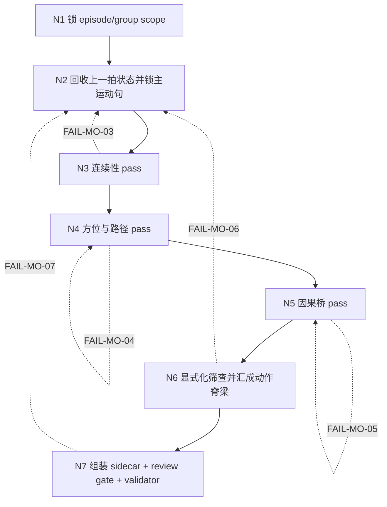
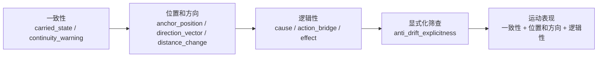
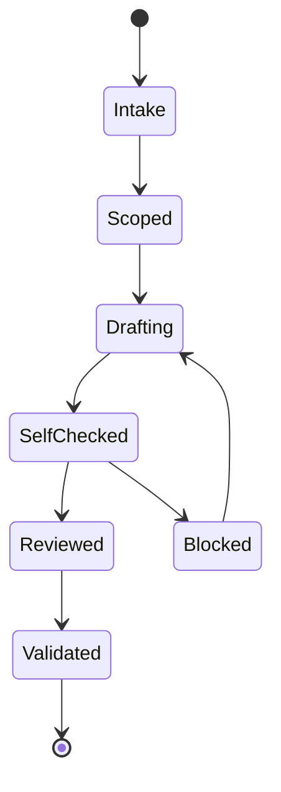

# 3-Detail / 1-水月 / 2-运动表现

## Context Loading Contract

- 每次调用本技能时，必须同时加载同目录 `CONTEXT.md`。
- 必须回读父层 `1-水月/SKILL.md`、`3-Detail/SKILL.md`、`3-Detail/_shared/branch-output-contract.md`、`3-Detail/_shared/branch-review-contract.md`。
- 必须回读 `3-Detail/_shared/node-pack-contract.md` 与 `3-Detail/_shared/creative-guidance-contract.md`，避免把局部 module guide 误升为第二真源。
- 必须同时回读同目录 `module-spec.yaml`、`module-guide.md` 与三个叶子模块目录：`一致性/`、`位置和方向/`、`逻辑性/`。
- 若 parent 已进入 progressive commit，上下文必须以最新 `projects/aigc/<项目名>/3-Detail/第N集.json` 为准，不得沿用旧快照。

## Business Requirement Analysis

- `business_goal`
  - 把 `分镜明细[].运动表现` 写成可拍、可演、可生成的动作脊梁，而不是零散动作词堆叠。
- `business_object`
  - 当前 episode root 内被选中的 group scope，以及其中每条 `分镜明细[].运动表现`。
- `constraint_profile`
  - 只拥有 `运动表现` 写权；必须保留 branch-owned 单一路径；必须写 branch process sidecar；必须让 AI 易漂移的连续性信息显式化。
- `success_criteria`
  - 一次阅读能看清谁因什么而往哪里动；`thinking_process` 真正支撑 `patch_payload`；review 和 validator 都能通过。
- `non_goals`
  - 不负责人物心理、关系评语、镜头语言、空间世界观总搭建，也不替父层做 bundle prose 聚合。
- `topology_fit`
  - 复杂度主要来自“顺序固定但局部失真点各不相同”，因此采用 `强主干串行 + 局部门禁回流`，而不是大分叉树或平行摘要。

## Canonical Sources

- `1-水月/SKILL.md`
- `3-Detail/SKILL.md`
- `3-Detail/_shared/branch-output-contract.md`
- `3-Detail/_shared/branch-review-contract.md`
- `3-Detail/_shared/node-pack-contract.md`
- `3-Detail/_shared/creative-guidance-contract.md`
- `module-spec.yaml`
- `module-guide.md`
- `一致性/module-spec.yaml + module-guide.md`
- `位置和方向/module-spec.yaml + module-guide.md`
- `逻辑性/module-spec.yaml + module-guide.md`
- `1-水月/templates/branch-process.template.json`
- `3-Detail/scripts/validate_branch_process_sidecar.py`

## Scope

- 只负责 `final_output.main_content.分镜组列表[].分镜明细[].运动表现`
- 输出 `projects/aigc/<项目名>/3-Detail/水月/运动表现/第N集.branch-patch.json`
- 必须把 `一致性 -> 位置和方向 -> 逻辑性` 汇成一条动作主链，不得写成三个叶子模块摘要并列
- 不得写 `角色表现 / 氛围表现 / 视觉强化 / 分镜构图 / 摄影美学 / 运镜手法 / 转场特效`

## Input Contract

### 必需输入

- 最新的 `projects/aigc/<项目名>/3-Detail/第N集.json`
- 当前轮选中的 `group_id / 分镜组 scope`
- 已声明的 `branch_owner = 运动表现`

### 可选输入

- `projects/aigc/<项目名>/1-Planning/3-分组/第N集.md`
- 已存在的 `projects/aigc/<项目名>/3-Detail/水月/运动表现/第N集.branch-patch.json`
- 已存在的 `projects/aigc/<项目名>/3-Detail/水月/第N集.field-patch.json`

### Hard Rules

1. 先读当前 root，再判断动作，不得从孤立 prose 直接改写。
2. merge 顺序固定为 `一致性 -> 位置和方向 -> 逻辑性`；显式化筛查发生在三者汇流后。
3. `运动表现` 只承载连续性、位置方向和因果桥，不得偷写人物主观解释。
4. 多动作 prose 必须先锁“主运动句”；其余动作只能服务该主链。
5. `target_json_paths[]` 只能命中 `final_output.main_content.分镜组列表[].分镜明细[].运动表现`。

## Output Contract

### Branch Process Sidecar

- 路径固定为：`projects/aigc/<项目名>/3-Detail/水月/运动表现/第N集.branch-patch.json`
- sidecar 结构必须兼容 `1-水月/templates/branch-process.template.json`
- 每个 `group_branch_patches[]` 至少包含：
  - `group_id`
  - `target_json_paths`
  - `thinking_process.context_anchor`
  - `thinking_process.creative_thesis`
  - `thinking_process.execution_steps`
  - `thinking_process.self_check`
  - `patch_payload.运动表现`
  - `review_trace.requested_reviewers`
  - `review_trace.key_findings`
  - `review_trace.apply_decision`

### Required Patch Shape

`patch_payload.运动表现` 至少包含：

- `逻辑性`
- `位置和方向`
- `一致性`

其中：

- `逻辑性` 对应 `逻辑性`
- `位置和方向` 对应 `位置和方向`
- `一致性` 对应 `一致性`

字段分工硬门：

1. `逻辑性` 只回答“为什么现在发生、这拍怎样接向下一拍”，不得退化成完整动作句复写。
2. `位置和方向` 只回答“谁相对什么锚点、往哪里动、方向怎么变”，不得代写因果。
3. `一致性` 只回答“这一拍接住了上一拍什么状态”，不得与前两槽机械同句。

## Thinking-Action Topology

## Thinking-Action Node Contract

| node_id | objective | inputs | actions | evidence | route_out | gate |
| --- | --- | --- | --- | --- | --- | --- |
| `N1-SCOPE-LOCK` | 锁定唯一 episode/group 与 target path | 最新 root、父层 scope、branch owner | 读取当前 root；定位本轮 group；确认只写 `运动表现` | `scope_note`、`target_json_paths[]` | pass -> `N2` | scope 唯一且无越权 path |
| `N2-MOTION-THESIS` | 回收上一拍状态并锁主运动句 | 当前组 prose、上一拍状态、已写回 root | 提炼 `context_anchor`；找一条主运动句；写 `creative_thesis` | `thinking_process.context_anchor`、`creative_thesis` | pass -> `N3` | 主动作明确，且不靠心理词驱动 |
| `N3-CONTINUITY-PASS` | 让动作先接得住 | `一致性` 模块、上一拍状态、主运动句 | 补 `连续性说明`；标出最容易丢的承接状态 | `execution_steps[]` 中的 continuity step、`连续性说明` | pass -> `N4` / fail -> `N2` | 不出现失忆式跳变，不发明新动作 |
| `N4-POSITION-PASS` | 让谁往哪动可被快速读懂 | `位置和方向` 模块、主参考系、主运动句 | 锁主锚点；明确相对位置、方向变化与距离变化；去掉地图式说明 | `位置和方向` | pass -> `N5` / fail -> `N4` | 一次阅读能形成站位变化，不生成第二套坐标 |
| `N5-CAUSAL-PASS` | 让动作不是为了好看才发生 | `逻辑性` 模块、触发点、位置和方向 | 写“为什么现在发生、下一拍怎么接”的最短因果桥 | `逻辑性` | pass -> `N6` / fail -> `N5` | 至少存在一条清晰因果短链，且节奏未拖慢 |
| `N6-EXPLICIT-MERGE` | 汇成单一动作脊梁并显式防漂移 | 前三 pass 结果、module-spec must_answer、quality_gates | 汇总成 `patch_payload.运动表现`；把易漂移信息吸收到 `一致性 / 位置和方向 / 逻辑性`，并写 `self_check` | `patch_payload.运动表现`、`thinking_process.self_check[]` | pass -> `N7` / fail -> `N2` | 不是三段摘要拼接，而是一条可拍动作主链 |
| `N7-SIDECAR-REVIEW` | 组装 sidecar 并完成 review/validator 门 | sidecar template、branch review contract、validator | 写 `review_trace`；必要时回流修改；用 `validate_branch_process_sidecar.py` 校验 | 完整 sidecar、`review_trace`、`validation_note` | pass -> done / fail -> `N2` | `thinking_process / patch_payload / review_trace` 完整且 validator 可通过 |

## Lite Field Map

| step_id | node_id | field_id | target_slot | core_question | execution_action | pass_standard | fail_code | rework_entry |
| --- | --- | --- | --- | --- | --- | --- | --- | --- |
| `S1` | `N1-SCOPE-LOCK` | `FIELD-MO-01` | `target_json_paths[]` | 本轮到底补哪一集哪一组哪一条字段 | 锁 scope 与唯一 target path | scope 唯一、无越权 | `FAIL-MO-01` | `S1` |
| `S2` | `N2-MOTION-THESIS` | `FIELD-MO-02` | `thinking_process.context_anchor / creative_thesis` | 这一拍最该被看懂的主动作是什么 | 回收上一拍状态并锁主运动句 | 有单一动作主轴 | `FAIL-MO-02` | `S2` |
| `S3` | `N3-CONTINUITY-PASS` | `FIELD-MO-03` | `运动表现.一致性` | 当前拍有没有接住上一拍留下的状态 | 写承接句并标出易丢状态 | 无失忆式跳变 | `FAIL-MO-03` | `S2` |
| `S4` | `N4-POSITION-PASS` | `FIELD-MO-04` | `运动表现.位置和方向` | 谁相对什么锚点往哪里动 | 锁主参考系与方向路径 | 站位变化清楚且不画地图 | `FAIL-MO-04` | `S4` |
| `S5` | `N5-CAUSAL-PASS` | `FIELD-MO-05` | `运动表现.逻辑性` | 为什么是现在发生、下一拍怎么接 | 写最短因果桥 | 至少一条清晰因果短链 | `FAIL-MO-05` | `S5` |
| `S6` | `N6-EXPLICIT-MERGE` | `FIELD-MO-06` | `运动表现三槽收束` | 哪些信息人会脑补但模型会丢 | 显式化筛查并汇成单一动作脊梁 | 不再依赖默认脑补 | `FAIL-MO-06` | `S2` |
| `S7` | `N7-SIDECAR-REVIEW` | `FIELD-MO-07` | `review_trace / validation_note` | sidecar 是否能支撑 review 和 validator | 组装 sidecar 并自检 | `thinking_process / patch_payload / review_trace` 完整 | `FAIL-MO-07` | `S2` |

## Review Contract

1. branch review 先看 `thinking_process` 是否真在支撑 `patch_payload.运动表现`。
2. reviewer 优先偏向 `导演组 / 武术组 / 摄影组`，但不得借 review 越权改写别的 branch 字段。
3. 若发现 `运动表现` 里混入人物心理、镜头机位或空间总论，必须回流 `N2` 重锁主动作与边界。
4. validator 失败时，不得只补壳字段；必须回到对应 fail code 的节点修正文义。

## Root-Cause Execution Contract

出现以下任一症状，必须先修源层而不是只补 prose：

- `运动表现` 退化成空泛动词串，没有主运动句
- 连续性、方位、因果被并列罗列，未汇成单一动作脊梁
- `一致性 / 位置和方向 / 逻辑性` 大面积同句复写，导致字段分工失效
- sidecar 里有 `thinking_process`，但它与 `patch_payload` 脱节
- 为了补动作而越权写入人物内心、镜头语言或环境总搭建
- progressive commit 场景下仍沿用旧 root 快照

上溯链固定为：

`Symptom -> 本地节点失真 -> 本地 SKILL.md / module-spec.yaml -> 3-Detail/_shared/node-pack-contract.md -> skill-知行合一`

Fix landing points:

- 先修本 `SKILL.md` 的节点、门禁、field map
- 再修 `module-spec.yaml / module-guide.md` 的局部配置或说明
- 若问题跨 branch 重复，再上收 `_shared/` 合同

## Completion Contract

只有同时满足以下条件，本技能才允许宣布完成：

1. `projects/aigc/<项目名>/3-Detail/水月/运动表现/第N集.branch-patch.json` 已写回。
2. 每个 `group_branch_patches[]` 的 `target_json_paths[]` 只命中 `运动表现`。
3. `patch_payload.运动表现` 至少包含 `逻辑性 / 位置和方向 / 一致性`。
4. `thinking_process / patch_payload / review_trace` 完整。
5. `validate_branch_process_sidecar.py` 可通过，且未出现 ownership / 越权问题。
