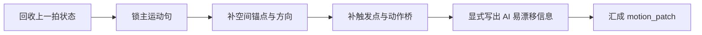

# 运动表现 模块说明

## 定位

- 本分支负责面向 AIGC 剧本作为生成信息母体的需求，锁定动作连续性、方位朝向和因果顺序，并把人类编导常默认不写明的信息显式言明，生成 `motion_patch`。
- 它拥有“谁往哪里动、为什么现在动、哪些隐含信息必须说出来”的判断权，不拥有人物内心解释权。

## 具体创作方法

- 先把运动理解成一条最短可见链，而不是若干零碎动作。每次只追问四件事：上一拍停在什么状态、这一拍先发生哪个动作、人物相对什么锚点移动、是什么触发了这个动作。
- `一致性` 不是泛泛而谈的“风格一致”或“节奏一致”，而是以上一拍末态为锚，明确这一拍如何延续朝向、相对方位、位移趋势与关键接触状态，防止人物无理由从东侧跳到西侧、从前压跳成后撤。
- 写作时优先抓“主运动句”。所谓主运动句，就是这一拍里最值得被读者一眼看懂的动作变化，例如“他侧身避开后退半步，顺手把门掩上”。其余信息都围绕这句补承接、补方向、补因果。
- 运动信息要服务“可拍、可演、可生成”，所以优先补对镜头消费最重要的隐含信息：手里是否还拿着东西、身体是否已转向、人与目标的距离是在逼近还是拉开、动作为什么此刻成立。
- 依次让 `一致性 / 位置和方向 / 逻辑性` 补齐状态、方位和因果，再做一次收束：删掉地图式说明，保留能撑住主动作的最小真相。

## 思维·执行节点

1. `状态回收`
   先看上一拍人物、道具、身体朝向、相对位置和接触状态停在哪。没有这个起点，后面的移动会像凭空刷新。
2. `主运动句锁定`
   从当前拍里挑一个最关键的动作变化作为主轴。若一段 prose 里有多个动作，先确定哪个动作承担推进，其他动作只能辅助它。
3. `方位落点`
   用一个主参考系交代人物与目标的站位关系。常用写法是“相对门/桌/窗/对手/出口”的方向和距离变化，而不是完整空间图。
4. `因果补桥`
   回答“为什么是现在发生”。是被逼退、被看见、被阻断、抢先出手，还是顺势接上上一拍的动作余势。
5. `显式化筛查`
   反问哪些信息人类会默认脑补、但模型会丢失，例如“他仍握着刀”“她没有转身，只是偏头看去”“两人此刻只隔一臂”。
6. `汇流收束`
   最终 `motion_patch` 应该像一条清楚的动作脊梁，而不是三个叶子模块的并排摘要。

## 节点延展

- 若本组是 `action-push` 型，可以适度提高 `位置和方向` 与 `逻辑性` 的密度，让动作路线和触发点先于修辞出现。
- 若本组是 `dialogue-tension` 型，运动表现要重点托住距离、视线、逼近和回避，不必把每个动作都写满。
- 若本组动作不多，但存在关键交接，例如递物、让路、碰撞、关门、回头，这一分支依然应启用，因为这些都是 AI 最容易误读的连续性节点。
- 延展的上限是“把主动作讲透”，不是“把整个空间讲透”。一旦出现环境游记式说明，说明已经越过本分支边界。

## 失真与修正

- 若人物表现很强，但谁站哪儿看不清，优先回到本分支补方位。
- 若动作之间像跳接，说明 `逻辑性` 没有把触发点补出来。
- 若人物或物件忽然换边、换向或像瞬移，优先回查 `一致性` 是否真的回收了上一拍末态，而不是补更多动作动词。
- 若人类编导觉得“这不是常识吗”，但 AI 下游仍可能误读，说明还需要在本分支继续言明。
- 若空间说明过长，删掉地图式描述，只保留与主动作相关的方位变化。
- 若 prose 里动作很多却没有主轴，删掉次要动作，先保住“谁因什么而往哪里动”这一条主链。
