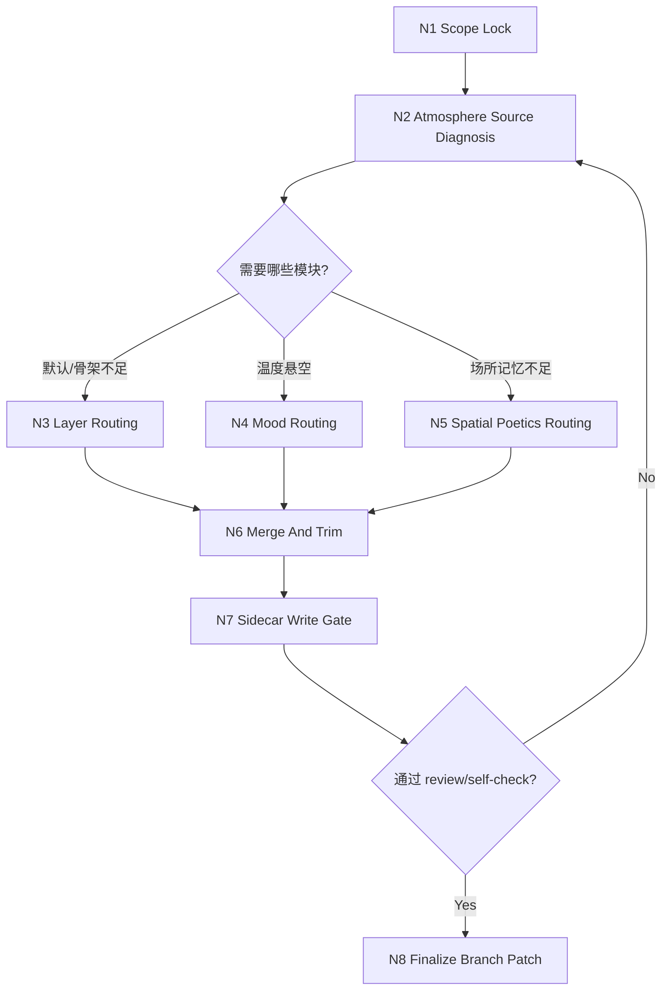
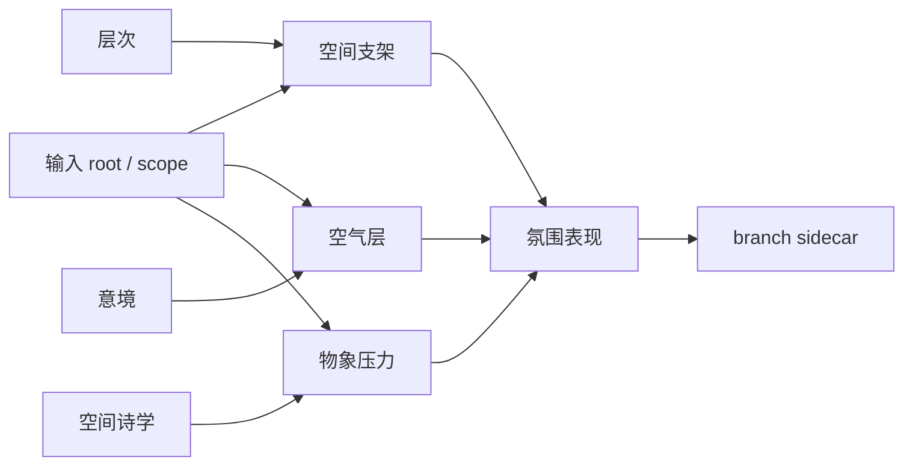
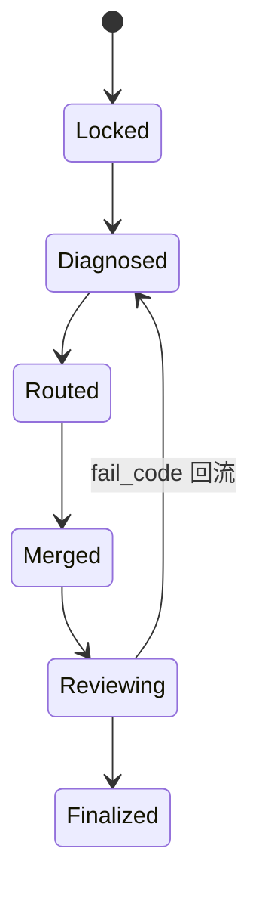

# 3-Detail / 1-水月 / 3-氛围表现

## Context Loading Contract

- 每次调用本技能时，必须同时加载同目录 `CONTEXT.md`。
- 必须回读父层 `1-水月/SKILL.md`、`3-Detail/SKILL.md` 与 `_shared/branch-output-contract.md`。
- 必须同时回读同目录 `module-spec.yaml`、`module-guide.md` 与三个叶子模块目录：
  - `层次/`
  - `意境/`
  - `空间诗学/`
- 冲突优先级：用户显式请求 > 根 `AGENTS.md` / 上层技能 > 本 `SKILL.md` > 本 `CONTEXT.md` > 叶子模块说明。

## Parent Positioning

### 本 branch 拥有

- `分镜明细[].氛围表现` 的 branch-owned 创作与 patch 落盘
- `thinking_process / patch_payload / review_trace` 的本地 sidecar 完整性
- 对 `层次 / 意境 / 空间诗学` 的选择性调度、汇流与删空

### 本 branch 不拥有

- 代写 `角色表现 / 运动表现 / 视觉强化 / 分镜构图 / 摄影美学 / 运镜手法 / 转场特效`
- 用抽象情绪词替代真实空间承载
- 把“设计感 / 气氛感”写成脱离动作与人物处境的散文

## Canonical Sources

- `3-Detail/SKILL.md`
- `1-水月/SKILL.md`
- `3-Detail/_shared/branch-output-contract.md`
- `module-spec.yaml`
- `module-guide.md`
- `层次/module-spec.yaml + module-guide.md`
- `意境/module-spec.yaml + module-guide.md`
- `空间诗学/module-spec.yaml + module-guide.md`

## Business Requirement Analysis Contract

| analysis_slot | 当前结论 |
| --- | --- |
| `business_goal` | 为命中 scope 的 `分镜明细[]` 生成可落盘、可回审、可被后续 branch 读取的 `氛围表现`，让空间先站住，再显温度，最后留下可记忆的场所压力。 |
| `business_object` | `projects/aigc/<项目名>/3-Detail/第N集.json` 中命中的 `分镜明细[]`，以及 `projects/aigc/<项目名>/3-Detail/水月/氛围表现/第N集.branch-patch.json`。 |
| `constraint_profile` | 只写 `氛围表现`；必须服务人物处境与冲突推进；必须保留物理承载；不得把氛围写成角色心理总评或镜头语言。 |
| `success_criteria` | patch 中每条 `氛围表现` 都能回答“空间怎样托住戏、空气怎样施压、哪个物象/结构最可记住”；sidecar 可追踪模块路由与删空依据。 |
| `non_goals` | 不追求独立抒情段落；不替父层做 bundle 装配；不把空间美感当作单独卖点。 |
| `complexity_source` | 复杂度来自“先搭支架、再定温度、后锁锚点”的顺序判断，以及三个叶子模块并非每次都全开。 |
| `topology_fit` | 最适配的拓扑是“scope lock -> source diagnosis -> conditional module routing -> merge & trim -> sidecar gate -> review trace”。 |
| `step_strategy` | 以 `层次` 为默认骨架；只有当空间已成立但温度悬空时再强化 `意境`；只有当场所性和结构收益成立时才启用 `空间诗学`。 |

## Scope

- 只负责 `final_output.main_content.分镜组列表[].分镜明细[].氛围表现`
- 输出 `projects/aigc/<项目名>/3-Detail/水月/氛围表现/第N集.branch-patch.json`
- 不得写抽象抒情总评，不得把环境句写成背景画册说明

## Total Input Contract

### 必需输入

- 当前 episode root：`projects/aigc/<项目名>/3-Detail/第N集.json`
- 命中 scope 的 `分镜组列表[] / 分镜明细[]`

### 推荐输入

- 父层已 progressive commit 的 `角色表现`、`运动表现`
- 已存在的 `氛围表现/第N集.branch-patch.json`（若本轮是修订）

### 硬规则

1. 开始本 branch 前，必须读取当前最新 root，而不是沿用旧快照。
2. `氛围表现` 只能引用前序 branch 已批准并写回的上下文，不得反向改写它们。
3. 若空间支架都不存在，不得直接先写“情绪很好”的结论。
4. 若三个叶子模块都不成立，默认最少走一次 `层次`，先补空间承载。

## One-Shot Output Contract

### canonical landing

- `projects/aigc/<项目名>/3-Detail/水月/氛围表现/第N集.branch-patch.json`

说明：

- canonical 路径末端未与技能包名同名，是因为该 branch 必须服从 `3-Detail` 已声明的共享 runtime 命名真源，不能自行改写父层路径合同。

### sidecar 最低要求

- `thinking_process`
- `patch_payload`
- `review_trace`
- `target_json_paths[]`
- `module_routes[]`

### `氛围表现` 最低字段

- `层次`
- `空间诗学`
- `意境`

字段分工硬门：

1. `空间支架` 只回答“哪一层空间在拦、承、托”，不得直接抄成情绪判断。
2. `空气层` 只回答“温度/湿度/光气/声气怎样显影”，不得和 `空间支架` 同句复写。
3. `物象压力` 只回答“哪个物象或结构特征在施压”，不得把前三槽重新拼成第二份 prose。

### 输出禁区

- 不输出第二份 prose 主稿
- 不把叶子模块说明原封不动抄进最终 patch
- 不保留互相冲突的多版 `氛围表现`
- `空间支架 / 空气层 / 物象压力` 不得机械同句、互相包含或只做轻微改词复写

## Module Routing Contract

| module | 何时命中 | 必须回答的问题 | 产出作用 |
| --- | --- | --- | --- |
| `层次` | 只有总感受，没有空间骨架；人物像贴在背景上；环境元素只是清单 | 哪一层拦、哪一层承、哪一层托 | 产出 `空间支架` 主体 |
| `意境` | 空间已有，但情绪温度空泛；景与情各说各话；需要把温度绑回物象 | 哪个物象承情，这股温度怎样显影 | 产出 `空气层` 主体 |
| `空间诗学` | 场所结构有记忆点；建筑/地形秩序强；空间需要形成可回忆压迫 | 哪个结构特征最值得被记住，它如何参与人物处境 | 产出 `物象压力` 主体 |

默认规则：

1. `层次` 是默认骨架模块。
2. `意境` 与 `空间诗学` 只在判型成立时启用，不强制每次全开。
3. 三个模块同时命中时，顺序固定为 `层次 -> 意境 -> 空间诗学`。

## Mermaid Topology

## Thinking-Action Network

| node_id | objective | inputs | actions | evidence | route_out | gate |
| --- | --- | --- | --- | --- | --- | --- |
| `N1-SCOPE-LOCK` | 锁定唯一 episode/group/frame scope 与当前 root | `第N集.json`、父层 scope、前序已写回字段 | 读取命中 `分镜明细[]`，确认只处理 `氛围表现` target path | `scope_lock_note`、`target_json_paths[]` | pass -> `N2`；fail -> `FAIL-ATM-01` | 命中 scope 唯一且 ownership 清楚 |
| `N2-SOURCE-DIAGNOSIS` | 判断当前氛围缺口来自支架、温度还是场所记忆 | 当前镜头文本、前序 branch 字段、`module-guide.md` | 识别环境条件、动作承载和可记忆结构，生成模块命中结论 | `diagnosis_note`、`module_routes[]` | `层次/意境/空间诗学` -> `N3~N5`；若都弱 -> 强制 `N3` | 至少有一个明确模块入口 |
| `N3-LAYER-ROUTING` | 用 `层次` 搭起空间支架 | `层次/module-guide.md`、当前镜头空间元素 | 提取近/中/远或里/外关系，写出 `空间支架` | `layer_note`、`patch_payload.空间支架` | -> `N6` | 支架能指回真实空间层 |
| `N4-MOOD-ROUTING` | 用 `意境` 让空气温度落到可感物象 | `意境/module-guide.md`、当前镜头温度信号 | 锁单一主温度，绑定光/气/声/色/距离物象，写 `空气层` | `mood_note`、`patch_payload.空气层` | -> `N6` | 温度不悬空，不写纯抽象情绪词 |
| `N5-POETICS-ROUTING` | 用 `空间诗学` 提取场所记忆与结构压力 | `空间诗学/module-guide.md`、空间结构特征 | 锁一个 `poetic_anchor`，写 `物象压力` | `poetics_note`、`patch_payload.物象压力` | -> `N6` | 只保留一个主锚点，且与人物处境相关 |
| `N6-MERGE-TRIM` | 把三个模块结果压成单一 `氛围表现`，并删空词 | `patch_payload.*`、`module_routes[]` | 合并字段，删除越权修辞与重复句，校准与前序 branch 一致性 | `merge_note`、完整 `patch_payload.氛围表现` | pass -> `N7`；fail -> 回相应模块节点 | `空间支架 / 空气层 / 物象压力` 三槽位完整 |
| `N7-SIDECAR-GATE` | 写 sidecar 并完成自检、review trace | `thinking_process`、`patch_payload`、`review_trace` | 写 branch sidecar，校验 target path、ownership、字段完整性 | `write_note`、`validation_note` | pass -> `N8`；fail -> `FAIL-ATM-07/08` | sidecar 完整且只命中 `氛围表现` |
| `N8-FINALIZE` | 生成可供父层 progressive commit 的单一分支结果 | 已通过 gate 的 sidecar | 收束本 branch 输出并显式记录未命中模块 | `branch_patch_verdict` | done | 结果可被父层直接 review / commit |

## Lite Field Map

| step_id | field_id | intent | failure_signal | rework_entry |
| --- | --- | --- | --- | --- |
| `S1` | `FIELD-ATM-01` | 锁 root、scope 与 target path | scope 混用，或把别的字段带进来 | 回 `N1-SCOPE-LOCK` |
| `S2` | `FIELD-ATM-02` | 找出氛围缺口与模块命中理由 | 直接写氛围结论，没有诊断依据 | 回 `N2-SOURCE-DIAGNOSIS` |
| `S3` | `FIELD-ATM-03` | 建立 `空间支架` | 只剩情绪词，没有空间承载 | 回 `N3-LAYER-ROUTING` |
| `S4` | `FIELD-ATM-04` | 建立 `空气层` | 温度没有物象承载，句子悬空 | 回 `N4-MOOD-ROUTING` |
| `S5` | `FIELD-ATM-05` | 建立 `物象压力` | 空间漂亮但不可记忆，或与人物无关 | 回 `N5-POETICS-ROUTING` |
| `S6` | `FIELD-ATM-06` | 汇流成单一 `氛围表现` | 三个模块互相重复，或出现越权散文 | 回 `N6-MERGE-TRIM` |
| `S7` | `FIELD-ATM-07` | 写 sidecar 并通过路径校验 | `thinking_process / patch_payload / review_trace` 缺槽，或 target path 越权 | 回 `N7-SIDECAR-GATE` |
| `S8` | `FIELD-ATM-08` | 产出可供父层 commit 的最终 branch patch | 结果不能被父层直接 review / progressive commit | 回 `N8-FINALIZE` |

## Failure Codes

| fail_code | meaning | default_rework_entry |
| --- | --- | --- |
| `FAIL-ATM-01` | scope 或 target path 未锁定 | `N1-SCOPE-LOCK` |
| `FAIL-ATM-02` | 未先做氛围来源诊断就直接写结论 | `N2-SOURCE-DIAGNOSIS` |
| `FAIL-ATM-03` | `空间支架` 缺失或不可指回真实空间 | `N3-LAYER-ROUTING` |
| `FAIL-ATM-04` | `空气层` 只剩情绪判断，没有物象承载 | `N4-MOOD-ROUTING` |
| `FAIL-ATM-05` | `物象压力` 没有形成可记忆结构锚点 | `N5-POETICS-ROUTING` |
| `FAIL-ATM-06` | merge 后三槽位不完整或越权写散文 | `N6-MERGE-TRIM` |
| `FAIL-ATM-07` | sidecar 缺 `thinking_process / patch_payload / review_trace` | `N7-SIDECAR-GATE` |
| `FAIL-ATM-08` | 输出无法被父层直接 review/commit | `N8-FINALIZE` |

## Convergence Contract

1. 只允许收束为一份 branch sidecar，不得保留多版 `氛围表现` 并列待选。
2. `层次 / 意境 / 空间诗学` 是局部模块，不是并列终稿；最终只保留它们汇流后的 `氛围表现`。
3. merge 时优先级固定为：
   - `可见/可触空间承载`
   - `空气温度`
   - `结构记忆点`
   - `诗性修辞`
4. 若发现与 `角色表现 / 运动表现` 重复，本 branch 只保留环境如何施压，不代写人物心理与动作逻辑。

## Root-Cause Execution Contract

出现以下任一症状时，必须先修源层而不是只润色结果：

- 输出只剩“压抑/潮湿/孤独”等抽象词
- 空间很美，但和人物处境、动作推进无关
- 三个叶子模块都被机械全开，导致 patch 冗长重复
- `空间支架 / 空气层 / 物象压力` 槽位失去分工，变成同一句的三次投影
- branch sidecar 没记录模块命中和删空依据

强制追溯链：

`Symptom -> Direct Technical Cause -> Rule Source -> Meta Rule Source -> Fix Landing Points`

默认上溯：

1. 本 `SKILL.md` 的 `Business Requirement Analysis Contract`
2. 本 `SKILL.md` 的 `Module Routing Contract / Thinking-Action Network`
3. `1-水月/SKILL.md` 的 branch ownership 合同
4. `3-Detail/_shared/branch-output-contract.md`
5. 根 `AGENTS.md`

## Completion Contract

只有同时满足以下条件，本 branch 才允许宣布完成：

1. `thinking_process / patch_payload / review_trace` 已写回 sidecar。
2. target path 只命中 `分镜明细[].氛围表现`。
3. `空间支架 / 空气层 / 物象压力` 三槽位完整。
4. sidecar 明确记录本轮命中的模块与未命中的模块。
5. 输出可被父层直接进入 review 与 progressive commit。
