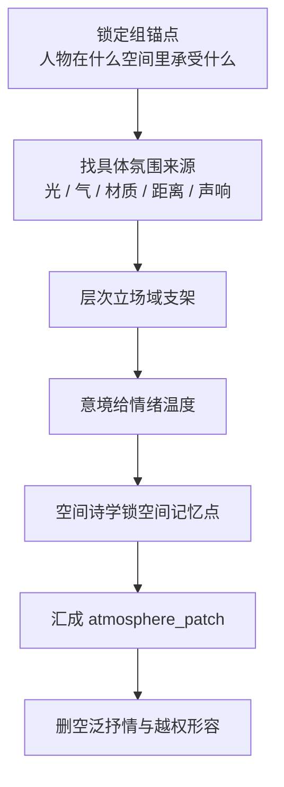

# 氛围表现 模块说明

## 定位

- 本分支负责把空气、层次、情绪温度和空间记忆感汇成 `atmosphere_patch`。
- 它拥有场感判断权，但不拥有脱离人物和冲突独立抒情的权力。

## 判型入口

- 当前组只有“紧张 / 压抑 / 空旷 / 阴冷”一类总感受，没有空间支架时，先重打 `层次`。
- 当前组已经有空间，但情绪温度仍停在抽象判断时，重打 `意境`。
- 当前组空间不平凡、建筑感强、关系压迫明显，或需要留下可记忆的场所印象时，重打 `空间诗学`。
- 三个叶子同时命中时，顺序固定为：`层次 -> 意境 -> 空间诗学`，先立支架，再收温度，最后锁记忆点。

## 思维·执行主线

## 节点

| 节点 | 要想清楚什么 | 执行动作 | 产出倾向 |
| --- | --- | --- | --- |
| `A1 氛围来源` | 这股场感到底由什么产生 | 先找可见、可触、可听的具体条件 | 不从情绪词起笔，从环境条件起笔 |
| `A2 空间支架` | 哪些空间层在托动作与情绪 | 用 `层次` 把前中后或里外远近分开 | 让场域先站住 |
| `A3 温度显影` | 当前主感受偏冷、闷、悬还是柔 | 用 `意境` 把感受绑定到物象、光色、空气 | 让景承情、情染景 |
| `A4 记忆锚点` | 这个空间最该被记住的是什么 | 用 `空间诗学` 选一个结构特征和人物关系 | 让场景不是普通布景 |
| `A5 汇流收口` | 哪些句子能真正进入 prose | 保留条件、支架、温度、锚点；删抒情口号 | 输出单一 `atmosphere_patch` |

## 具体创作方法

- 第一步先把“氛围”翻译成条件，而不是先写结论。不要先写“压抑”，先写低顶、回声、潮气、逼仄距离、被切碎的光。
- 第二步让 `层次` 回答“人物周围有什么在近处拦、在中段承、在远处压”。只要前后两层能托住戏，场感就开始成立。
- 第三步再让 `意境` 处理温度，不写“悲凉”，而写景物怎样把悲凉显影出来，例如光被风吹碎、空气发涩、湿气贴衣。
- 第四步用 `空间诗学` 选择一个最值得留下的空间记忆点，例如狭长甬道、下压梁架、空庭回声、门洞切割人物身位。
- 最后把三条结果压回一句或两句 prose 中：先让读者看见空间，再感到温度，最后记住这个场所怎样和人物发生关系。

## 延展

- 若当前组是对峙场，优先强化压迫、遮挡、回声和人物之间被空间切开的距离。
- 若当前组是潜行或悬疑场，优先强化视线盲区、阴影边界、空气停滞和局部声响。
- 若当前组是抒情或回忆场，允许 `意境` 比重稍高，但仍要保留一个明确空间支点。
- 若当前组是过渡场，氛围不必写满，只保留最能托住下一个动作的空间条件即可。

## 汇流口径

- 汇流时优先保留：`可感知条件 > 空间支架 > 情绪温度 > 诗性修辞`。
- `atmosphere_patch` 最好回答三件事：人物身处何种场域、这个场域怎样施加温度、读者最后记住哪个空间特征。
- 若和 `角色表现 / 运动表现` 抢写同一信息，氛围分支只保留环境如何托住人物与动作，不代写角色心理和动作逻辑。

## 失真与修正

- 若只剩“昏暗、压抑、空旷”等平面词，说明层次没站住。
- 若意境句悬空，回到 `层次 + 空间诗学` 给它找物象和空间支点。
- 若氛围盖过信息清晰度，先删形容词，保留能托住冲突的环境细节。
- 若空间很美但读者记不住，说明还没锁到 `poetic_anchor`，回 `空间诗学` 只保留一个结构记忆点。
