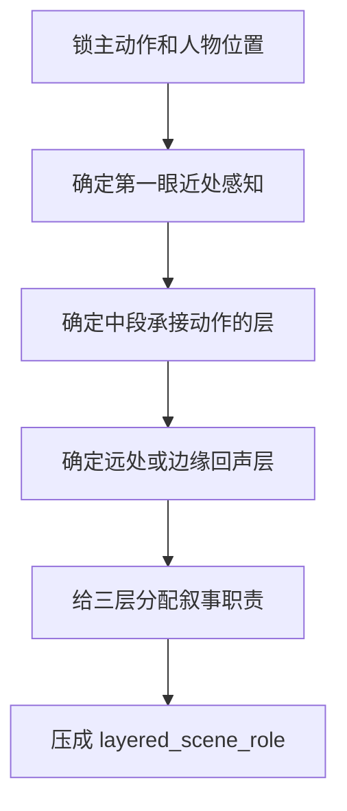

# 层次 模块说明

## 定位

- 本叶子负责围绕场景桥段中的前景、中景、背景建立层次化支架，让空间成为可被读懂的场域，而不是一张平面背景。
- 它不负责直接定义情绪结论，只负责把动作、情绪和空间的承载层搭出来。

## 判型入口

- 当前 prose 只有整体气氛，没有“近处先看见什么、远处再感到什么”的阅读顺序时，命中本叶子。
- 人物动作成立，但像贴在一张平面背景上时，命中本叶子。
- 场景元素很多，却都像清单罗列，没有叙事分工时，命中本叶子。

## 思维·执行主线

## 节点

| 节点 | 要想清楚什么 | 执行动作 | 结果要求 |
| --- | --- | --- | --- |
| `L1 近处入口` | 读者最先撞上的是什么 | 选一个最近、最先被感知的材质或遮挡 | 不要空写“前景” |
| `L2 中段承接` | 哪一层真正承动作 | 让人物主要动作落在可读的中段空间 | 中景不是摆件，而是行动平面 |
| `L3 远处回声` | 远处怎样托住情绪 | 用背景、边缘或空气层给压迫/松弛回声 | 背景必须服务当前戏 |
| `L4 分工校准` | 三层是否各有职责 | 检查谁拦、谁承、谁托 | 不能三层都在说同一件事 |

## 具体创作方法

- 先回答“近处卡什么，中段发生什么，远处回什么”，不要先回答“画面很有层次”。
- 近处优先写材质、遮挡、压近物，例如门框、帘影、桌角、湿墙、栏杆、雾气。
- 中段优先留给人物行动、视线交换、停顿或碰撞，让戏真正发生在一个可读平面上。
- 远处不负责摆景，而负责托情绪，可以是空窗、回廊尽头、灯影、风口、远墙回声。
- 若信息太密，至少保住“一近一远”两层，也比整段平铺更有效。

## 延展

- 室内逼仄场：多用遮挡、低顶、贴身物件和短距离透视。
- 室外空场：多用空气层、远景回声和人物与空地的比例差。
- 走廊/门洞场：优先强调纵深、切割线和出入口关系。
- 群像场：不要给每个人都配一层，只保留最能托住主行动的一条空间轴。

## 失真与修正

- 若成稿只有整体氛围词，说明空间层没有真正被分开。
- 若只写出“前景有桌子、背景有窗”这种摆件清单，说明层次还没有进入叙事。
- 若写成大段环境描写却和人物无关，说明越权。
- 若信息太多，保留最能托住动作的一前一后两个层面即可。
- 若人物已经很满、空间仍发虚，补一个中段动作平面，通常比再加形容词更有效。
