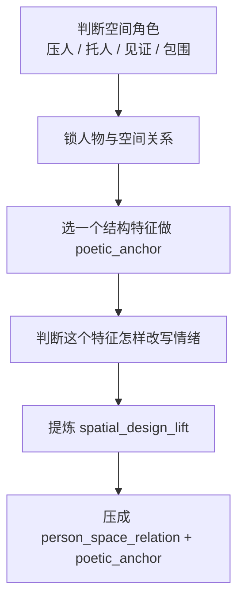

# 空间诗学 模块说明

## 定位

- 本叶子负责借建筑与空间设计中的深层概念，提升场景布景和空间组织的设计感，让空间既参与叙事，也摆脱平凡布景。
- 它不负责单独歌颂空景，必须始终围绕人物与空间关系以及空间结构本身的设计气质。

## 判型入口

- 当前场景有明确建筑、器物、地形或空间秩序，但 prose 没把这种结构收益写出来时，命中本叶子。
- 当前空间“好看”却不参与人物处境时，命中本叶子。
- 想让场景摆脱普通布景感、形成可被记住的场所性时，命中本叶子。

## 思维·执行主线

## 节点

| 节点 | 要想清楚什么 | 执行动作 | 结果要求 |
| --- | --- | --- | --- |
| `P1 空间角色` | 空间此刻在做什么 | 判断它是在压、托、见证还是包围人物 | 空间必须参与叙事 |
| `P2 人空关系` | 人物怎样进入这个空间 | 写清贴近、躲避、侵入、被困、被吞没等关系 | 不是空写环境 |
| `P3 诗性锚点` | 哪个结构最值得被记住 | 选门洞、梁架、台阶、回廊、窗格、立柱等一项 | 只锁一个主锚点 |
| `P4 设计抬升` | 什么让它摆脱普通布景 | 把“高级感”改写成可见组织方式 | 产出 `spatial_design_lift` |

## 具体创作方法

- 先不要急着写“空间很美”，先判断这个空间此刻怎样对人物施力。
- 再选一个结构特征作为 `poetic_anchor`，例如低梁压顶、长廊透视、门洞切割、空庭回声、逼仄转角、台阶抬落差。
- 让这个结构特征和人物动作、站位、视线发生关系，而不是只存在于背景。
- 把“设计感”翻译成组织关系，例如压缩、围合、切割、透空、回响、抬升、包裹，而不是“很高级、很有美感”。
- 最终写法应让读者同时知道：人物在什么关系里、空间凭什么被记住、这份记忆怎样反过来给场景增压或留白。

## 延展

- 建筑 interior：优先抓梁、柱、门、窗、廊道、台阶造成的压缩与切割。
- 自然场地：优先抓坡度、风口、水岸、树阵、崖壁造成的包围与暴露。
- 宗教/仪式空间：优先抓轴线、空场、回声、抬升关系，不要只写庄严。
- 破败/旧址空间：优先抓结构残损怎样影响人物行动与感知，不要只写陈旧质感。

## 失真与修正

- 若空间只剩“漂亮/古旧/巨大”，说明没有参与叙事。
- 若空间只剩“很有设计感/很高级”一类评价，说明还没落成结构设计。
- 若开始脱离人物写环境散文，立刻收回到人物-空间关系。
- 若空间信息过密，保留最能压出情绪的一个结构特征即可。
- 若空间参与了叙事却仍无记忆点，说明 `poetic_anchor` 还不够聚焦，删到只剩一个结构动作组合。
