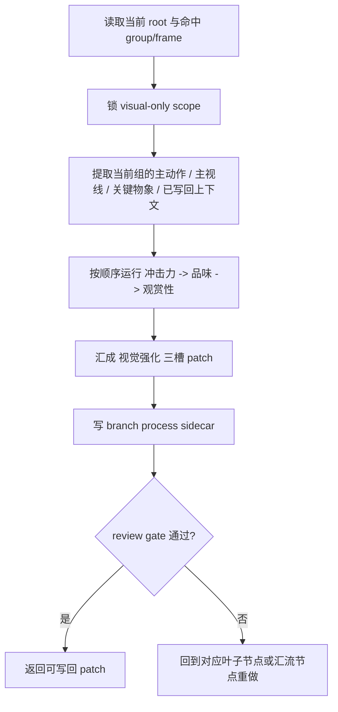
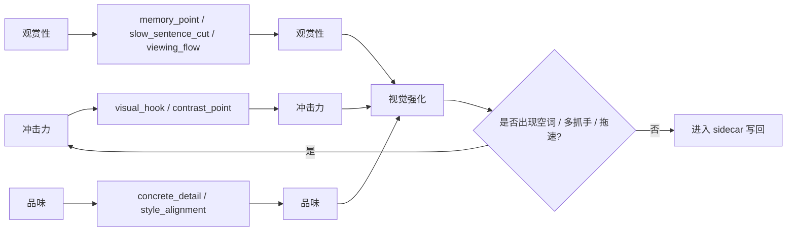
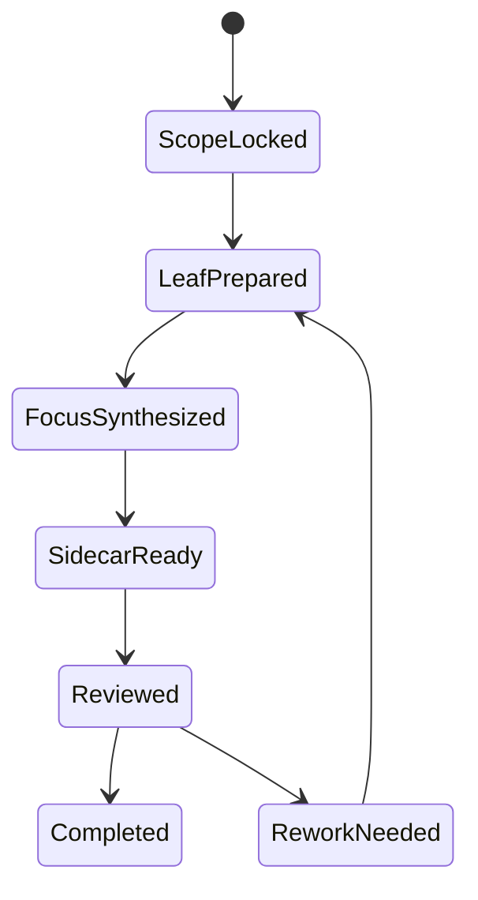

# 3-Detail / 1-水月 / 4-视觉强化

## Context Loading Contract

- 每次调用本技能时，必须同时加载同目录 `CONTEXT.md`。
- 必须回读父层 `1-水月/SKILL.md`、`3-Detail/SKILL.md` 与 `_shared/branch-output-contract.md`。
- 必须同时回读 `.agents/skills/aigc/3-Detail/_shared/node-pack-contract.md`。
- 必须同时回读同目录 `module-spec.yaml`、`module-guide.md`，以及叶子模块：
  - `冲击力/module-spec.yaml + module-guide.md`
  - `品味/module-spec.yaml + module-guide.md`
  - `观赏性/module-spec.yaml + module-guide.md`
- 冲突优先级：用户显式请求 > 根 `AGENTS.md` / 父层技能 > 本 `SKILL.md` > 本 `CONTEXT.md` > `module-spec.yaml` / `module-guide.md`。

## Positioning

- 只负责 `final_output.main_content.分镜组列表[].分镜明细[].视觉强化`
- 输出 `projects/aigc/<项目名>/3-Detail/水月/视觉强化/第N集.branch-patch.json`
- 允许消费当前 root 中已写回的 `角色表现 / 运动表现 / 氛围表现` 作为视觉上下文，但不得改写它们
- 不得把本 branch 结果直接冒充最终 `分镜表现`，也不得扩写成独立美术设定

## Canonical Sources

- `../SKILL.md`
- `../../SKILL.md`
- `../../_shared/branch-output-contract.md`
- `../../_shared/node-pack-contract.md`
- `module-spec.yaml`
- `module-guide.md`
- `冲击力/module-spec.yaml`
- `品味/module-spec.yaml`
- `观赏性/module-spec.yaml`

## Business Requirement Analysis Contract

| analysis_slot | 当前结论 |
| --- | --- |
| `business_goal` | 把当前组已经成立的戏剧收益压成更可见、更克制、可被镜头与下游模型直接消费的 `视觉强化`。 |
| `business_object` | `projects/aigc/<项目名>/3-Detail/第N集.json` 中命中 scope 的 `分镜明细[].视觉强化`，以及对应 `视觉强化/第N集.branch-patch.json`。 |
| `constraint_profile` | 只能写 `视觉强化`；必须先读取当前 root；抓手必须服务主冲突；不得用“电影感/高级感”空词充当结果。 |
| `success_criteria` | `冲击力` 唯一且清楚，`观赏性` 说明删留逻辑，`品味` 可直接服务后续镜头消费。 |
| `non_goals` | 不重写 `角色表现 / 运动表现 / 氛围表现`；不另起炉灶补大场面；不输出独立视觉设定长文。 |
| `complexity_source` | 难点不在“写得更华丽”，而在“把抽象审美感受收束成唯一抓手、具像细节与顺流阅读”。 |
| `topology_fit` | 固定为“输入锁定 -> 叶子模块串行裁决 -> 三槽位汇流 -> sidecar 写回 -> review gate”。 |
| `step_strategy` | 先锁 scope 和当前 root，再按 `冲击力 -> 品味 -> 观赏性` 取叶子结论，最后只汇成一个 `视觉强化` patch。 |

## Total Input Contract

### 必需输入

- `projects/aigc/<项目名>/3-Detail/第N集.json`

### 可选输入

- `projects/aigc/<项目名>/1-Planning/3-分组/第N集.md`
- 已存在的 `projects/aigc/<项目名>/3-Detail/水月/视觉强化/第N集.branch-patch.json`

### 硬规则

1. 本 branch 开始前，必须读取当前 root，而不是复用旧快照。
2. 若 `角色表现 / 运动表现 / 氛围表现` 已存在，只能把它们作为一致性上下文，不得越权修订。
3. 若当前组已经有明确视觉强化，本 branch 应做收束与净化，不应再发明第二主抓手。
4. 叶子模块固定按 `冲击力 -> 品味 -> 观赏性` 串行裁决；未显式声明并发。

## Output Contract

### branch process sidecar

- `projects/aigc/<项目名>/3-Detail/水月/视觉强化/第N集.branch-patch.json`

### target json path

- `final_output.main_content.分镜组列表[].分镜明细[].视觉强化`

## Required Patch Shape

`视觉强化` 至少包含：

- `冲击力`
- `观赏性`
- `品味`

字段分工硬门：

1. `冲击力` 只回答“镜头第一眼必须看见的唯一对象/动作/关系”，不得退化成整句导演意图。
2. `观赏性` 只回答“该停、该压、该删、该顺着看哪里”，不得和 `冲击力` 或 `品味` 同句复写。
3. `品味` 只保留能直接服务下游镜头消费的可执行提示，不得直接复制组级 `导演意图` 原句。

branch process sidecar 最低要求：

- `thinking_process`
- `patch_payload`
- `review_trace`
- `target_json_paths`

## Topology Contract

## Thinking-Action Network

| node_id | step_id | field_id | objective | inputs | actions | evidence | route_out | gate |
| --- | --- | --- | --- | --- | --- | --- | --- | --- |
| `N1-SCOPE-LOCK` | `S1` | `FIELD-WV-01` | 锁定唯一 episode/group/frame scope 与 visual-only ownership | 当前 root、用户 scope、父层约束 | 读取命中组与 `分镜明细[]`，确认只写 `视觉强化` | `scope_lock_note` | -> `N2` | target path 唯一，且不碰他字段 |
| `N2-VISUAL-SEED-READ` | `S2` | `FIELD-WV-02` | 从当前 root 提取已有戏剧收益与视觉候选 | `剧本正文`、`角色表现`、`运动表现`、`氛围表现` | 抽取主动作、主视线、关键物象、已有反差与禁止事项 | `seed_note` | -> `N3` | 当前 root 已回读，不是旧快照 |
| `N3-LEAF-ROUTE` | `S3` | `FIELD-WV-03/04/05` | 按叶子模块顺序产出可汇流的局部结论 | `module-spec.yaml`、三叶子 specs/guides、当前组 seed | 依次执行 `冲击力 -> 品味 -> 观赏性`，记录保留项、替换项、删减项 | `leaf_outputs` | -> `N4` | 三叶子都有局部 evidence，且未越权发明独立美术设定 |
| `N4-FOCUS-SYNTHESIS` | `S4` | `FIELD-WV-06` | 把叶子结论映射为 canonical 三槽 patch | `visual_hook`、`contrast_point`、`concrete_detail`、`style_alignment`、`memory_point`、`slow_sentence_cut`、`viewing_flow` | 汇成 `冲击力 / 观赏性 / 品味`，清理空词与多抓手 | `focus_merge_note` | -> `N5` | 三槽位齐全，且 `品味` 可直接服务镜头消费 |
| `N5-SIDECAR-WRITE` | `S5` | `FIELD-WV-07` | 写 branch process sidecar | 合格的 `视觉强化` patch、target path、思维过程 | 生成 `thinking_process / patch_payload / review_trace / target_json_paths` | `sidecar_write_note` | -> `N6` | sidecar 结构完整 |
| `N6-REVIEW-GATE` | `S6` | `FIELD-WV-08` | 在写回前完成本 branch 自检 | `视觉强化`、sidecar、父层 ownership 规则 | 检查唯一抓手、顺流、可消费性、非口号化；若失败回退到 `N3` 或 `N4` | `review_verdict` | pass -> done / fail -> `N3` or `N4` | 通过后才允许返回父层 progressive commit |

## Lite Field Map

| step_id | node_id | field_id | output_slot | core_question | actions | pass_standard | fail_code | rework_entry |
| --- | --- | --- | --- | --- | --- | --- | --- | --- |
| `S1` | `N1-SCOPE-LOCK` | `FIELD-WV-01` | scope lock | 本轮到底写哪一集、哪几个分镜、哪个字段 | 锁定 episode/group/frame 与 target path | scope 唯一且 ownership 无漂移 | `FAIL-WV-01` | `S1` |
| `S2` | `N2-VISUAL-SEED-READ` | `FIELD-WV-02` | seed note | 当前组真正值得看见的戏剧接口是什么 | 从 root 提取动作、视线、物象与上游上下文 | seed 来自当前 root 而非旧稿 | `FAIL-WV-02` | `S2` |
| `S3` | `N3-LEAF-ROUTE` | `FIELD-WV-03` | `visual_hook / contrast_point` | 第一眼抓手该由谁承担 | 运行 `冲击力` 叶子并做删选 | 抓手唯一，且服务主冲突 | `FAIL-WV-03` | `S3` |
| `S3` | `N3-LEAF-ROUTE` | `FIELD-WV-04` | `concrete_detail / style_alignment` | 哪些空词必须被具像细节替换 | 运行 `品味` 叶子并回写替换 | 至少有一个可见细节完成替换 | `FAIL-WV-04` | `S3` |
| `S3` | `N3-LEAF-ROUTE` | `FIELD-WV-05` | `memory_point / slow_sentence_cut / viewing_flow` | 哪句该删、观看如何更顺 | 运行 `观赏性` 叶子并确定拖速点 | 能指出至少一个删减或重排点 | `FAIL-WV-05` | `S3` |
| `S4` | `N4-FOCUS-SYNTHESIS` | `FIELD-WV-06` | `视觉强化` | 如何把叶子结论压成 canonical 三槽位 | 做三槽位映射与净化 | `冲击力 / 观赏性 / 品味` 全齐 | `FAIL-WV-06` | `S4` |
| `S5` | `N5-SIDECAR-WRITE` | `FIELD-WV-07` | branch sidecar | 证据包是否足够支撑 review 与写回 | 写 sidecar 四大槽位 | `thinking_process / patch_payload / review_trace / target_json_paths` 完整 | `FAIL-WV-07` | `S5` |
| `S6` | `N6-REVIEW-GATE` | `FIELD-WV-08` | review verdict | 结果是否仍有空词、多抓手或拖速 | 做 self-review 并给回退点 | 仅通过后才允许父层 commit | `FAIL-WV-08` | `S3` / `S4` |

## Root-Cause Execution Contract

出现以下任一问题时，必须先修本 skill 或其节点真源，再决定是否重写本地内容：

1. `冲击力` 同时出现两个以上候选。
2. `品味` 仍是“电影感/高级感/绝美”类口号。
3. sidecar 无法说明三叶子如何汇成最终三槽位。
4. branch 结果开始扩写成独立美术设定或反向改写他字段。
5. 叶子输出与 canonical 三槽位映射失配。
6. `冲击力 / 观赏性 / 品味` 大面积同句或直接复制组级导演意图。

固定上溯链：

`症状 -> 当前节点动作/字段映射 -> module-spec.yaml / SKILL.md -> 父层 branch-output-contract -> skill-知行合一 元合同`

## Completion Gate

1. branch process sidecar 已写回。
2. `thinking_process / patch_payload / review_trace / target_json_paths` 完整。
3. target path 只命中 `视觉强化`。
4. `冲击力` 唯一。
5. `品味` 必须服务镜头消费，不得写成审美口号或直接照抄组级导演意图。
