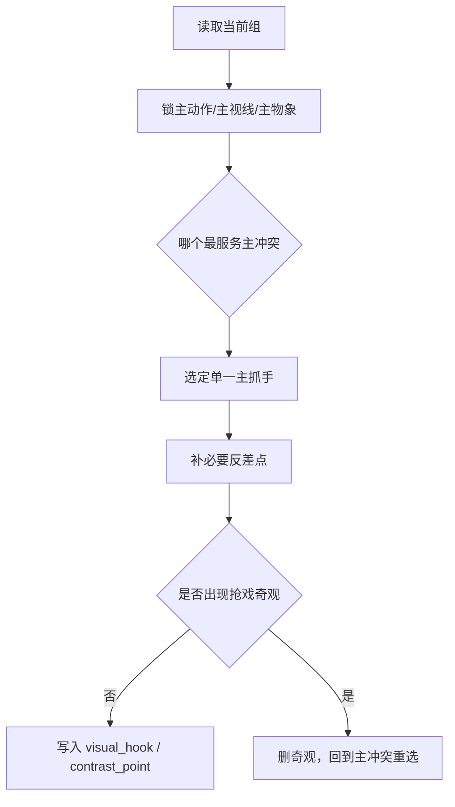

# 冲击力 模块说明

## 定位

- 本叶子负责找到这一组最值得被第一眼记住的动作、视线、反差或物象。
- 它不负责制造抢戏奇观，抓手必须和叙事目标同向。
- 它解决的是“观众第一眼先被什么钉住”，不是“这段可以堆多少华丽词”。

## 具体创作方法

1. 先找主冲突的可视接口。
   优先看谁在动、谁在看、谁被逼到边缘、什么物象最能替代冲突。
2. 再找最短的第一眼抓手。
   抓手最好能在一个短句内成立，例如一个动作、一处反差、一次对视、一个突然显眼的物件。
3. 最后做减法。
   若有两个以上抓手竞争，只保留更贴近主冲突、更容易被模型捕到的那个。

## 思维·执行

- 抓手判断的优先级通常是：主动作 > 主视线 > 空间反差 > 独特物象。
- 只有当动作和视线都不够强时，才让物象承担第一眼记忆点。
- 冲击力不是大，而是准；第一眼越清楚，后续视觉增强越省字。

## 节点

| 节点 | 要回答的问题 | 执行动作 | 产出倾向 | 常见误差 |
| --- | --- | --- | --- | --- |
| `I1 焦点候选` | 这一组有哪些潜在焦点 | 提取动作、视线、物象、反差 | 焦点候选清单 | 只盯辞藻，不看场内行为 |
| `I2 焦点裁决` | 哪个最服务主冲突 | 选一个主抓手，删除陪跑焦点 | `visual_hook` | 抓手和叙事无关 |
| `I3 反差补点` | 是否需要一个辅助反差点 | 用明暗、高低、动静、近远做轻量补强 | `contrast_point` | 补点反客为主 |
| `I4 抢戏排查` | 是否已经越过叙事重心 | 删掉奇观化、海报化、过度大词 | 精简后的抓手句 | 冲击力变成奇观表演 |

## 延展

- 群戏组：优先抓“谁压住场面”或“谁被压到边缘”，不要平均分配抓手。
- 对峙组：优先抓眼神、距离、姿态对抗，不要急着写环境特效。
- 追逐/打斗组：优先抓方向变化、接触瞬间、失衡瞬间，让动作成为记忆点。
- 静态组：若整体动作很小，就让一个细小但尖锐的物象或姿态承担抓手。

## 失真与修正

- 若抓手只是华丽形容词，说明没有真正找到画面焦点。
- 若抓手和人物、冲突无关，说明它只是装饰。
- 若同时出现多个抓手，删到只剩最强的一个。
- 若写成“大场面、炸裂、震撼”这类总结词，回到动作、视线、物象重新取材。
