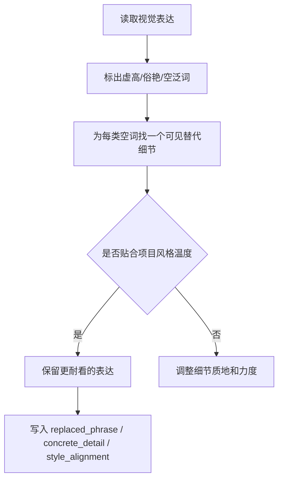

# 品味 模块说明

## 定位

- 本叶子负责压住俗艳和空泛夸饰，把“好看”改写成可见细节。
- 它是视觉分支的收口器，不负责单独制造画面高潮。
- 它关心的不是“词是否华丽”，而是“这句是否耐看、是否贴合项目风格温度、是否真能被模型消费”。

## 具体创作方法

1. 先找虚高表达。
   重点盯“电影感、高级感、绝美、唯美、震撼、氛围拉满”这一类无物理落点的词。
2. 再找可以替换它的真实细节。
   细节优先来自材质、光感、衣褶、肤感、距离、冷暖、动作节制、空间秩序。
3. 最后做风格对齐。
   把替换后的细节回看项目整体温度：是冷峻、粗粝、艳丽、古朴，还是克制、留白、写意。

## 思维·执行

- 品味的核心动作不是删，而是“删掉偷懒词，再补回真正有效的可见信息”。
- 若一个词删掉后句子立刻失色，说明原文其实没有细节，需要先补细节再谈收束。
- 若一个细节虽然具体，但明显不属于当前项目气质，也不能算高品味。

## 节点

| 节点 | 要回答的问题 | 执行动作 | 产出倾向 | 常见误差 |
| --- | --- | --- | --- | --- |
| `T1 空词识别` | 哪些词只是审美姿态 | 标出虚高词、俗艳词、套话词 | `replaced_phrase` | 误删本来有信息量的词 |
| `T2 细节替换` | 哪个具体细节能替代它 | 用光、材质、姿态、构图感替换空词 | `concrete_detail` | 只删不补，句子发空 |
| `T3 风格校准` | 替换后是否仍属于本项目 | 对照全局风格温度调细节力度 | `style_alignment` | 细节虽好但风格跑偏 |
| `T4 句面收口` | 是否仍然太满太花 | 压缩形容层，保留一个最值钱的细节 | 收口后的短句 | 节制过头，失去画面收益 |

## 延展

- 古风/写意项目：多用材质、留白、温差、轻重，不要用现代广告感形容词。
- 粗粝现实项目：多用磨损、湿冷、颗粒、脏亮对比，避免精致滤镜式表达。
- 奇观/幻想项目：允许细节更亮，但仍应通过物象与结构显现，而不是靠“大、华丽、史诗”总结。
- 人物特写组：优先收束五官、手部、衣料、呼吸感，不要把全部品味押在背景装饰上。

## 失真与修正

- 若全在删词却没有留下更好的细节，说明修正还没完成。
- 若替换后的细节不符合项目气质，回看 `Init / Global` 的风格温度。
- 若句子失去节奏，只保留对观看最有收益的那一个细节。
- 若“品味”最后变成更昂贵的套话，说明只是换了一批空词，没有真正落地。
