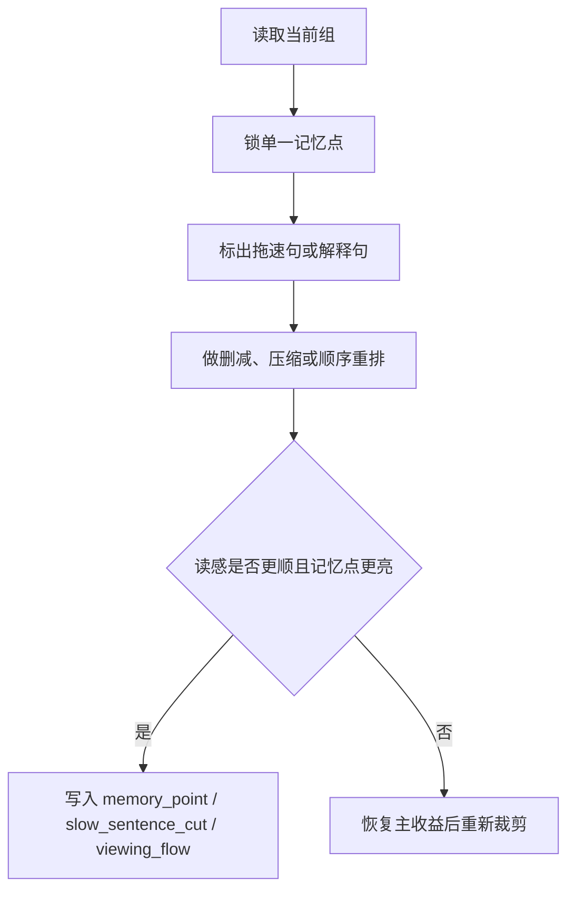

# 观赏性 模块说明

## 定位

- 本叶子负责让文字既有画面收益，又不因为细节过量而发闷。
- 它不负责增加新的视觉设定，主要负责阅读和观看流的优化。
- 它判断的不是“这句美不美”，而是“这句是否让读者更顺、更快、更准地看见重点”。

## 具体创作方法

1. 先确认记忆点。
   读完这一组，观众最该记住的是哪一个动作、姿态、物象或场面感。
2. 再找拖速点。
   找出哪一句在解释、复述、堆设定、堆比喻，却没有增加新的观看收益。
3. 最后做删减或重排。
   通过删句、缩句、换顺序，让记忆点更早出现、拖速句更少停留。

## 思维·执行

- 观赏性的第一原则是“保住主收益，再谈顺流”；顺流不是把信息削平，而是让有效信息更早抵达。
- 若一段 prose 需要解释才能显得有层次，通常是信息顺序错了，不一定是信息不够。
- 好的观赏性经常来自减法和排序，而不是继续加新辞藻。

## 节点

| 节点 | 要回答的问题 | 执行动作 | 产出倾向 | 常见误差 |
| --- | --- | --- | --- | --- |
| `W1 记忆点锁定` | 读完最该记住什么 | 选一个主记忆点 | `memory_point` | 记忆点模糊或过多 |
| `W2 拖速识别` | 哪句最妨碍读感 | 标记解释句、复述句、重形容句 | `slow_sentence_cut` | 把必要信息误判成拖速 |
| `W3 顺流重排` | 怎样让读者更快进入重点 | 调整先后顺序，前置主抓手 | `viewing_flow` | 顺序更顺了，但重点被削弱 |
| `W4 收束复核` | 是否仍兼顾画面收益 | 读一遍确认抓手、节奏、清晰度同时成立 | 精简后的 prose 倾向 | 为了顺流删掉主视觉收益 |

## 延展

- 信息密集组：优先删解释，不优先删结果；让结果先到，解释后撤。
- 情绪组：可以保留一点呼吸感，但不要让停顿句连续叠加。
- 动作组：主动作必须尽量早出现，别把最关键一击压在句尾长解释后面。
- 场景展示组：先给空间记忆点，再给补充层次，避免一上来全景平铺。

## 失真与修正

- 若文字很美但读起来发闷，说明拖速句没有被清掉。
- 若为了顺流删掉了主视觉收益，说明收得过头了。
- 若记忆点和主冲突脱节，换回更靠近动作或视线的记忆点。
- 若顺流完全依赖断句技巧而非信息取舍，说明真正该删的内容还没删掉。
