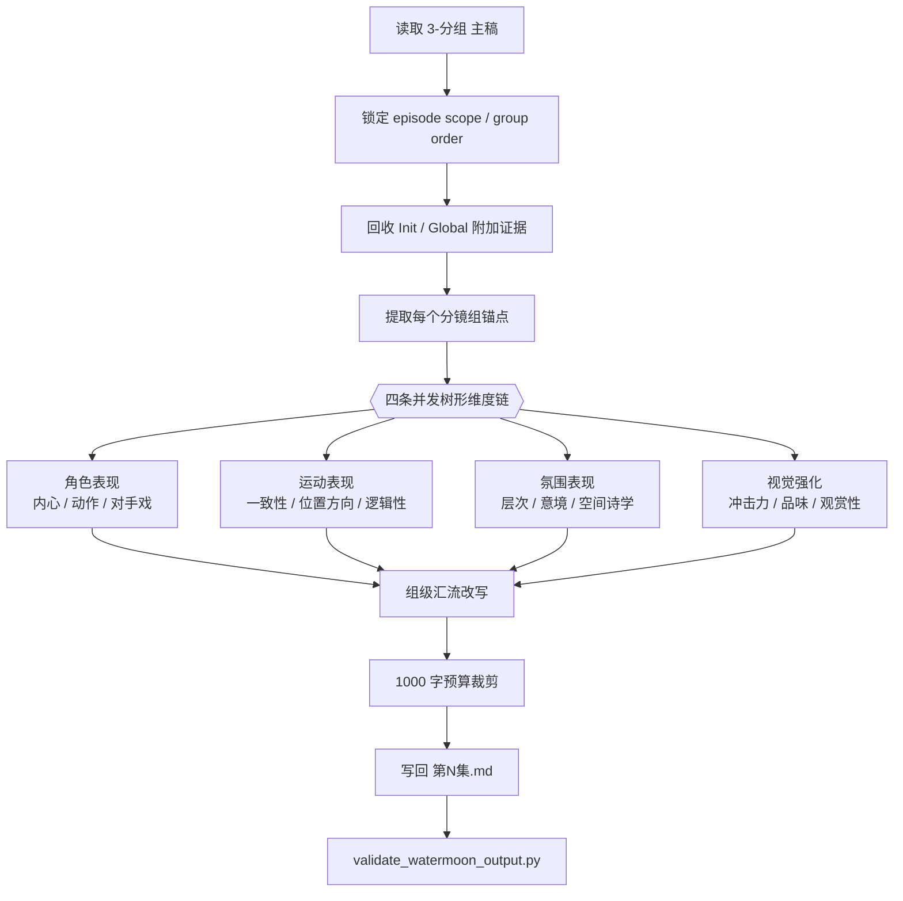
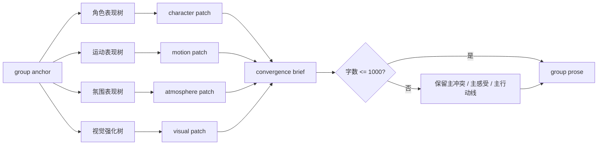
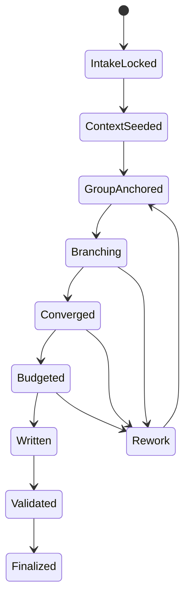

# 3-Detail / 1-水月

## 概述

`1-水月` 是 `3-Detail` 下的 stage-local child skill。

它不拥有 `projects/aigc/<项目名>/3-Detail/第N集.json` 的 canonical writeback 权，而是负责把上游 `1-Planning/3-分组/第N集.md` 已经成型的分镜组脚本，扩写成一份更可拍、更可演、更可感知的中文细化改编稿：

- 主输入：`projects/aigc/<项目名>/1-Planning/3-分组/第N集.md`
- 附加上下文：`0-Init` 初始化输出、`2-Global` 的类型元素 / 全局风格 / 设计元素
- canonical 输出：`projects/aigc/<项目名>/3-Detail/1-水月/第N集.md`

本技能的核心不是“多写一版长文”，而是把上游分镜组在不改组界、不改组序的前提下，通过四条并发树形维度链完成一次性深描扩写：

1. `角色表现`
2. `运动表现`
3. `氛围表现`
4. `视觉强化`

四条维度链各自再按 `references/` 中列出的 12 个子模块下钻思考，最终只汇成每个分镜组一段收束后的扩写正文。每个分镜组总字数上限固定为 `1000` 字。

## Child-Skill Positioning

### `1-水月` 拥有

- 对 `3-分组` 成果做组内中文扩写、细化和优化式剧本改编
- 把 `0-Init + 2-Global` 的项目级风格约束压入组级 prose
- 以并发树形维度链做内部思考，再一次性汇成单段组级正文
- 写回 `projects/aigc/<项目名>/3-Detail/1-水月/第N集.md`
- 用模板和 validator 保证每组字数、结构和落盘格式稳定

### `1-水月` 不拥有

- 改写 `1-Planning/3-分组` 的组界、组序、组 ID
- 直接改写 `projects/aigc/<项目名>/3-Detail/第N集.json`
- 直接生成 `4-Design / 5-Image / 6-Video` 请求
- 为 12 个子模块各自写一份平行主稿

## When to Use

- 上游已经存在 `projects/aigc/<项目名>/1-Planning/3-分组/第N集.md`
- 需要先得到一份比 grouped script 更具画面感、表演感和空间感的组级细化剧本
- 需要把 `0-Init` 的项目基线与 `2-Global` 的类型 / 风格 / 设计元素压进组级 prose，但又不想直接进入 `第N集.json`
- 需要一个可供后续 detail/design 阶段引用的中文扩写 sidecar

## When Not to Use

- 还没有稳定的 `1-Planning/3-分组/第N集.md`
- 当前目标是 shot-level JSON 补全，而不是 grouped script prose 扩写
- 用户只要局部一句润色，而不是整集分镜组级改编稿

## Canonical Source Contract (Mandatory)

- 第一输入真源固定为：`projects/aigc/<项目名>/1-Planning/3-分组/第N集.md`
- `0-Init` 只提供项目目标、题材、人物关系、语气、禁写项与 north star 约束
- `2-Global` 只提供风格、类型、设计元素和必要的分组级导演辅助证据
- `references/` 下的 12 个子模块只定义内部思考维度，不得各自长出第二份输出模板
- 节点包分层合同统一回链：`.agents/skills/aigc/3-Detail/references/node-pack-contract.md`
- 最终真源只允许落在：`projects/aigc/<项目名>/3-Detail/1-水月/第N集.md`

硬规则：

1. 不得改组 ID、组序、组边界。
2. 不得把思考过程直接写进最终输出。
3. 不得把 12 个子模块逐条罗列进最终正文，必须先汇流后写。
4. 每个分镜组最终正文总字数不得超过 `1000` 字。
5. 若附加上下文不足，可保守扩写；不得臆造跨组新情节。

## Context Preload (Mandatory)

固定加载顺序：

1. 根 `AGENTS.md`
2. `.agents/skills/aigc/SKILL.md + CONTEXT.md`
3. `.agents/skills/aigc/3-Detail/SKILL.md + CONTEXT.md`
4. 本 `SKILL.md + CONTEXT.md`
5. `projects/aigc/<项目名>/0-Init/north_star.yaml`
6. `projects/aigc/<项目名>/0-Init/init_handoff.yaml`
7. `projects/aigc/<项目名>/0-Init/story-source-manifest.yaml`（若存在）
8. `projects/aigc/<项目名>/1-Planning/3-分组/第N集.md`
9. `projects/aigc/<项目名>/1-Planning/3-分组/第N集.grouping.json`（若存在）
10. `projects/aigc/<项目名>/2-Global/全局风格/全局风格设计.md`（若存在）
11. `projects/aigc/<项目名>/2-Global/类型元素/全集设计.md`（若存在）
12. `projects/aigc/<项目名>/2-Global/类型元素/分组设计.md`（若存在）
13. `projects/aigc/<项目名>/2-Global/设计元素/设计元素.md`（若存在）
14. `references/module-index.md`
15. 先读 `.agents/skills/aigc/3-Detail/references/node-pack-contract.md`
16. 再读 `.agents/skills/aigc/3-Detail/references/creative-guidance-contract.md`
17. `references/route-profile.yaml`
18. 按需读取各分类 `module-spec.yaml` 与命中叶子 `module-spec.yaml`
19. 若需要解释、反例或审美尺度，再读同目录 `module-guide.md`
20. `references/examples.md`
21. `references/creative-review-rubric.md`
22. `templates/episode-watermoon.template.md`

## Visual Maps

## Thinking-Action Network (Mandatory)

| node_id | 对应 Step | 聚焦字段 | objective | actions | evidence | route_out | gate |
| --- | --- | --- | --- | --- | --- | --- | --- |
| `N1-INPUT-LOCK` | `S1` | `FIELD-WM-01` | 锁定唯一 grouped script 真源与 episode scope | 读取 `第N集.md`，识别组序、组 ID、标题和原始组内文本 | `input_lock_note` | 成功 -> `N2`；失败 -> 回 `S1` | 组序唯一后才可继续 |
| `N2-CONTEXT-SEED` | `S2` | `FIELD-WM-02` | 回收 `Init / Global` 中与当前集相关的附加约束 | 提炼题材语气、角色气质、世界观、风格与设计元素 | `seed_context_note` | 成功 -> `N3`；证据不足 -> 保守继续 | 支撑证据成形后再拆组 |
| `N3-GROUP-ANCHOR` | `S3` | `FIELD-WM-03` | 为每个分镜组抽取锚点 | 提炼 `场景 / 冲突 / 角色 / 视觉任务 / 情绪温度` | `group_anchor_table` | 成功 -> `N4A~N4D` | 每组锚点必须可引用 |
| `N4A-CHARACTER-BRANCH` | `S4` | `FIELD-WM-04` | 让角色行为和关系成立 | 并行调用 `内心戏 / 动作戏 / 对手戏` 叶子规则，再收束人物表达 | `character_patch` | -> `N5` | 只产出组级 patch |
| `N4B-MOTION-BRANCH` | `S4` | `FIELD-WM-05` | 让动作、路径和镜头内逻辑成立 | 并行调用 `一致性 / 位置和方向 / 逻辑性` 叶子规则 | `motion_patch` | -> `N5` | 不得重写组界 |
| `N4C-ATMOSPHERE-BRANCH` | `S4` | `FIELD-WM-06` | 让空间气候和情绪场感成立 | 并行调用 `层次 / 意境 / 空间诗学` 叶子规则 | `atmosphere_patch` | -> `N5` | 只补感知条件 |
| `N4D-VISUAL-BRANCH` | `S4` | `FIELD-WM-07` | 让画面质感与观看抓力成立 | 并行调用 `冲击力 / 品味 / 观赏性` 叶子规则 | `visual_patch` | -> `N5` | 不得变成空洞辞藻 |
| `N5-CONVERGE` | `S5` | `FIELD-WM-08` | 把四条支路汇成一段组级 prose | 只保留主冲突、主行动、主氛围、主视觉收益 | `group_convergence_note` | 成功 -> `N6`；散乱 -> 回 `S4` | 汇流后只保留单段写法 |
| `N6-BUDGET` | `S6` | `FIELD-WM-09` | 把正文裁进 1000 字预算 | 删掉重复修辞，保留能拍能演能看懂的内容 | `budget_report` | 成功 -> `N7`；超限 -> 回 `S5` | 预算合格才可写回 |
| `N7-WRITEBACK` | `S7` | `FIELD-WM-10` | 按模板一次性写回整集 markdown | 落盘 `projects/aigc/<项目名>/3-Detail/1-水月/第N集.md` | `writeback_note` | -> `N8` | 只写一个 canonical 文件 |
| `N8-VALIDATE` | `S8` | `FIELD-WM-10` | 验证结构与字数 | 执行 `scripts/validate_watermoon_output.py` | `validation_verdict` | pass -> `done`；fail -> 回 `S5/S6/S7` | 通过前不得结案 |

## Canonical Module References

| 模块 | 作用 | 真源文件 |
| --- | --- | --- |
| 模块总索引 | 规定四条主链与 12 个子模块的协调方式 | `references/module-index.md` |
| 节点包共享合同 | 规定 `yaml / guide / CONTEXT / validator` 的分层职责 | `.agents/skills/aigc/3-Detail/references/node-pack-contract.md` |
| 创作引导共享合同 | 规定 `route-profile / examples / rubric` 的分层职责 | `.agents/skills/aigc/3-Detail/references/creative-guidance-contract.md` |
| 创作路由 | 规定不同组型该重打哪些分支 | `references/route-profile.yaml` |
| 角色表现总则 | 规定人物表达链汇流方式 | `references/角色表现/module-spec.yaml` |
| 运动表现总则 | 规定动作、方位与逻辑链汇流方式 | `references/运动表现/module-spec.yaml` |
| 氛围表现总则 | 规定空间气候、意境和场感链汇流方式 | `references/氛围表现/module-spec.yaml` |
| 视觉强化总则 | 规定画面抓力和审美约束链汇流方式 | `references/视觉强化/module-spec.yaml` |
| 节点包结构校验 | 校验 `module-spec.yaml` / `module-guide.md` / child link | `.agents/skills/aigc/3-Detail/scripts/validate_node_packs.py` |
| 创作引导校验 | 校验 `route-profile / examples / rubric` | `.agents/skills/aigc/3-Detail/scripts/validate_creative_guidance.py` |
| 正反例 | 校准什么叫写对、写虚、写满 | `references/examples.md` |
| 创作评审 | 评审是否真正可拍、可演、可感受 | `references/creative-review-rubric.md` |
| 输出模板 | 规定 episode markdown 落盘骨架 | `templates/episode-watermoon.template.md` |
| 输出校验 | 校验分镜组结构和字数预算 | `scripts/validate_watermoon_output.py` |

## Output Contract (Mandatory)

### 输出路径

- `projects/aigc/<项目名>/3-Detail/1-水月/第N集.md`

### 输出格式

- 按上游分镜组顺序逐组展开
- 保留上游分镜组标题与组内格式化标题字段
- 最终落盘形态仍然是剧本，只允许在原分组正文基础上扩写
- 不得新增 `锚点：`、`扩写：`、模块名、判断过程或打分字段

### 输出质量门槛

1. 组序与上游一致。
2. 每组都仍然读起来像完整剧本，而不是分析表单。
3. 每组正文不超过 `1000` 字。
4. 全文语言为中文。
5. `Init / Global` 的附加上下文必须以实际 prose 效果进入正文，而不是只写成标签。

## Field Master

| field_id | 输出位置/字段 | 内容要求 | 默认责任 Step | 质量维度 | 失败码 |
| --- | --- | --- | --- | --- | --- |
| `FIELD-WM-01` | 输入锁定 | 上游 grouped script 与 episode scope 唯一 | `S1` | 真源稳定性 | `FAIL-WM-01` |
| `FIELD-WM-02` | 附加上下文种子 | `Init / Global` 的项目约束被提炼成可用写作约束 | `S2` | 上下文利用率 | `FAIL-WM-02` |
| `FIELD-WM-03` | 组锚点 | 每组有清楚的冲突、角色、空间与视觉任务 | `S3` | 锚点清晰度 | `FAIL-WM-03` |
| `FIELD-WM-04` | 角色表现 patch | 人物心理、动作与关系可见 | `S4` | 人物成立度 | `FAIL-WM-04` |
| `FIELD-WM-05` | 运动表现 patch | 动作路径、朝向与连续性清楚 | `S4` | 动作可视化 | `FAIL-WM-05` |
| `FIELD-WM-06` | 氛围表现 patch | 空间层次、意境和场感成立 | `S4` | 场感密度 | `FAIL-WM-06` |
| `FIELD-WM-07` | 视觉强化 patch | 有抓力但不浮夸 | `S4` | 画面吸引力 | `FAIL-WM-07` |
| `FIELD-WM-08` | 组级汇流 prose | 四链被收束成一段单体正文 | `S5` | 收束能力 | `FAIL-WM-08` |
| `FIELD-WM-09` | 字数预算 | 每组 <= 1000 字 | `S6` | 预算控制 | `FAIL-WM-09` |
| `FIELD-WM-10` | 最终文件 | 文件格式、组序、结构和 validator 全通过 | `S7/S8` | 落盘可消费性 | `FAIL-WM-10` |

## Thought Pass Map

| step_id | 聚焦字段 | 核心问题 | 生成动作 | 未达标信号 |
| --- | --- | --- | --- | --- |
| `S1` | `FIELD-WM-01` | 这轮到底扩哪一集、哪一份 grouped script | 锁 episode 与上游文件 | 用错输入、组序飘移 |
| `S2` | `FIELD-WM-02` | 哪些 `Init / Global` 约束必须进入当前集 | 提炼写作约束种子 | 附加上下文只被罗列，不被消费 |
| `S3` | `FIELD-WM-03` | 每个分镜组真正要写的主冲突和主感受是什么 | 提炼组锚点表 | 组内扩写散乱、无主轴 |
| `S4` | `FIELD-WM-04~07` | 四条维度链各自要补什么，不该越权补什么 | 生成四类 patch | 四链都在重写同一件事 |
| `S5` | `FIELD-WM-08` | 如何把四类 patch 合成一段自然 prose | 汇成组级扩写 | 输出像拼贴，不像成稿 |
| `S6` | `FIELD-WM-09` | 如何在 1000 字内保住主收益 | 裁剪、去重、保主线 | 超字数或裁得只剩空骨架 |
| `S7` | `FIELD-WM-10` | 如何按模板一次性写回 | 落盘 episode markdown | 结构不稳、缺组 |
| `S8` | `FIELD-WM-10` | 文件是否真能交付 | 跑 validator | 预算或结构未过仍宣布完成 |

## Pass Table

| field_id | Pass Standard | Fail Code | Rework Entry |
| --- | --- | --- | --- |
| `FIELD-WM-01` | 只命中一个 grouped script 且组序稳定 | `FAIL-WM-01` | `S1` |
| `FIELD-WM-02` | `Init / Global` 被压成写作约束，而非标签堆积 | `FAIL-WM-02` | `S2` |
| `FIELD-WM-03` | 每组锚点足以支撑单段扩写 | `FAIL-WM-03` | `S3` |
| `FIELD-WM-04` | 人物表达具体且能拍能演 | `FAIL-WM-04` | `S4` |
| `FIELD-WM-05` | 动作路径和方位不打架 | `FAIL-WM-05` | `S4` |
| `FIELD-WM-06` | 场感既具体又不空泛 | `FAIL-WM-06` | `S4` |
| `FIELD-WM-07` | 画面强化有效但不油腻 | `FAIL-WM-07` | `S4` |
| `FIELD-WM-08` | 四链被汇成单段 prose | `FAIL-WM-08` | `S5` |
| `FIELD-WM-09` | 每组字数不超过 1000 | `FAIL-WM-09` | `S6` |
| `FIELD-WM-10` | 模板结构与 validator 同时通过 | `FAIL-WM-10` | `S7/S8` |

## Root-Cause Execution Contract (Mandatory)

当出现以下症状时，必须先修本 child skill 的源层合同，而不是直接手工改正文：

- 输出仍像 grouped script 摘抄，而不是细化改编
- 四条维度链都写了，但成稿像拼贴
- `Init / Global` 没真正进入最终 prose
- 单个分镜组反复超出 `1000` 字
- 最终文档把模块名、判断过程直接写进正文
- 把内部锚点或汇流中间态直接外露成最终字段

强制上溯链：

`Symptom -> Direct Technical Cause -> Rule Source -> Meta Rule Source -> Fix Landing Points`

优先检查：

- `Rule Source`
  - `.agents/skills/aigc/3-Detail/1-水月/SKILL.md`
  - `.agents/skills/aigc/3-Detail/1-水月/CONTEXT.md`
  - `references/module-index.md`
  - `templates/episode-watermoon.template.md`
  - `scripts/validate_watermoon_output.py`
- `Meta Rule Source`
  - `.agents/skills/aigc/3-Detail/SKILL.md`
  - `.agents/skills/aigc/SKILL.md`
  - 根 `AGENTS.md`

面向用户的闭环格式固定为：

1. 根因位置
2. 立即修复
3. 系统预防修复

## Completion Gate

只有同时满足以下条件，`1-水月` 才允许宣布完成：

1. `第N集.md` 已写入 `projects/aigc/<项目名>/3-Detail/1-水月/`
2. 上游每个命中分镜组都被展开
3. 每组保持上游分组结构，不外露 `锚点/扩写` 字段
4. 每组字数都不超过 `1000`
5. `validate_watermoon_output.py` 返回通过
