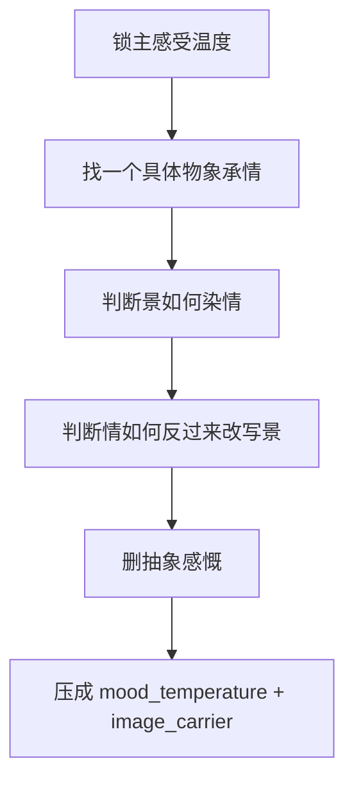

# 意境 模块说明

## 定位

- 本叶子负责在氛围渲染中处理情景交融，让情绪通过景物、光色、空气和距离感显现。
- 它不负责写空泛抒情，也不负责替代空间结构和层次支架。

## 判型入口

- 当前段落已有空间，但情绪只停在解释句和判断句上时，命中本叶子。
- 场景本身能承情，但景与人物情绪各说各话时，命中本叶子。
- 用户想要“更有味道”，但现稿一加味道就容易变空时，命中本叶子。

## 思维·执行主线

## 节点

| 节点 | 要想清楚什么 | 执行动作 | 结果要求 |
| --- | --- | --- | --- |
| `Y1 温度判型` | 当前主感受偏冷、闷、悬还是柔 | 只锁一个主温度，避免多头并行 | 情绪不混浊 |
| `Y2 物象承载` | 哪个景物最能替这股温度说话 | 选择一个光、气、声、色或距离感物象 | 必须落到可见/可感 |
| `Y3 情景互染` | 景与情如何互相沾染 | 让景不是背景，情不是旁白 | 形成 `scene_emotion_binding` |
| `Y4 修辞收口` | 哪句最漂亮却最空 | 删掉抽象赞叹，换成具体细节 | 意境来自显影，不来自口号 |

## 具体创作方法

- 先只选一个主感受，不要同时写“冷、悲、空、悬、美”。
- 再选一个最稳的承载物象，例如风、雾、水汽、灯色、布帘、回声、尘埃、远近距离。
- 把情绪判断句改写成景物状态句，例如不写“她很孤单”，改写成“廊下的灯光隔着雾，只够照亮她脚边半步”。
- 让景与情双向发生作用：不是景物单向说明情绪，而是人物当下的情绪也改变了景物被感知的方式。
- 最后检查这句意境能否删掉而不影响戏。若能删，说明它还只是装饰。

## 延展

- 冷感场：优先用风、雾、湿气、稀薄光色、空响。
- 闷压场：优先用停滞空气、贴身热度、低矮光源、积压声响。
- 悬疑场：优先用半见不见、断续声、反常静止、距离失真。
- 柔缓场：优先用慢光、软影、余温、轻微流动，但仍要避免写成纯抒情散文。

## 失真与修正

- 若出现纯抽象感慨，说明脱离了物象承载。
- 若景很美但和人物情绪无关，说明还没有形成情景交融。
- 若意境和项目风格冲突，回看 `Init / Global` 的温度约束。
- 若意境句抢走主冲突，删掉最漂亮但最无用的那一句。
- 若已经有很多好词却没有记忆点，说明缺少 `image_carrier`，回到一个物象重写整句。
