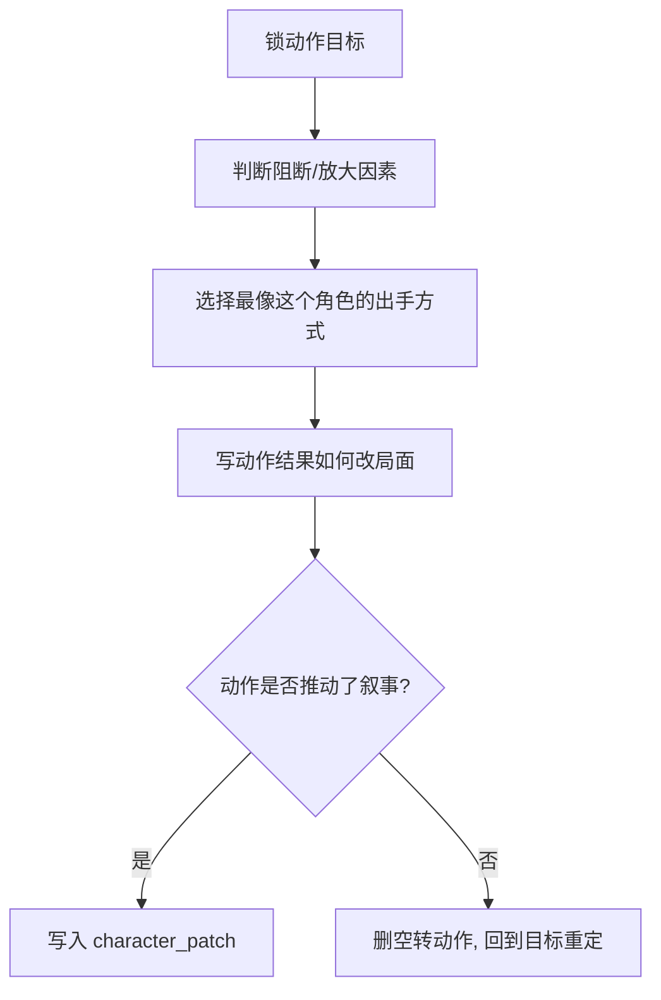

# 动作戏 模块说明

## 定位

- 本叶子负责参照共享 [角色表现总则](../module-spec.yaml)，把人物行为写成角色化的叙事动作链。
- 它不负责镜头运动，也不负责单独解释人物情绪；重点是“这个角色会怎么做”，不是“一般人会怎么做”。
- 它服务的是 `character_patch` 中的 `action_intent / resistance_point / outcome_shift / characterized_action_style`，要让行为既改局面，也带角色味道。

## 创作目标

- 把动作写成有目的、有阻断、有结果的叙事节点。
- 把“角色个性”压进动作方式，而不是靠旁白补充性格描述。
- 让动作天然带出情绪和关系变化，但不越权承担空间调度说明。

## 思维·执行链

## 节点拆解

| 节点 | 思考问题 | 执行动作 | 结果要求 |
| --- | --- | --- | --- |
| `A1-目标锁定` | 这一步到底想达成什么 | 明确抢、拦、递、逃、护、逼、夺中的主目标 | 动作有目的，不空转 |
| `A2-阻断识别` | 是什么让这一步变难或更猛 | 写清人、物、环境或关系上的阻断点 | 动作有压力来源 |
| `A3-角色化出手` | 为什么是这个人会这样动 | 用词和节奏体现莽、克制、利落、迟疑、狠、稳等角色痕迹 | 任何人不可直接套用 |
| `A4-结果改局` | 这一做怎样改变局面 | 交代成功、失手、打断、逼退、拖慢、激化等后果 | 下一拍有明确承接 |

## 具体创作方法

### 1. 动作句必须有“前因-出手-后果”

- 没有前因的动作像随机表演。
- 没有后果的动作像热闹填充。
- 最稳结构通常是：因为受阻/着急/决意，所以人物以某种角色化方式出手，局面因此改变。

### 2. 角色化不靠形容词，靠动作方式

- 同样是“递过去”，可以是“硬塞”“试探着递”“几乎砸过去”“稳稳按到对方面前”。
- 个性最好压在动词选择、动作节奏和动作态度里，而不是额外解释“他一向很强势”。

### 3. 动作要改局，不要只添热闹

- 每个动作节点都要回答：它改变了什么。
- 改变可以很小，但必须真实，比如打断节奏、逼近一步、抢回主导、暴露心虚、拉开距离。

### 4. 角色动作和空间动作要分权

- “他猛地跨过去，一把攥住对方手腕”属于本叶子可写。
- “镜头跟着推近”“画面切到侧面”不属于本叶子。
- 路径和站位若需要细化，交给 `运动表现`。

## 常见判型

| 判型 | 典型场景 | 写法抓手 | 应保留的后果 |
| --- | --- | --- | --- |
| `试探出手型` | 不确定对方反应，动作先轻后深 | 动作幅度小，但目的明确 | 关系温度变化 |
| `强攻破局型` | 冲突需要被迅速推前 | 动词直接、有压迫感 | 局面被强行改写 |
| `迟疑转行动型` | 角色先犹豫后下决心 | 把决断前后节奏差写出来 | 人物态度被看见 |
| `失手反噬型` | 想掌控却出了偏差 | 保留动作偏差和反作用 | 下一拍压力更大 |

## 写作抓手

- 目标词：抢、护、拦、逼、推开、递、攥住、扯回、压住、躲开。
- 阻断词：卡住、打断、挡住、迟疑、失手、被逼、被看穿、被拖慢。
- 结果词：逼退、僵住、错开、松动、失衡、收紧、激化、转手。

## 延展变体

- 若当前组偏 `action-push`，可把动作戏写成“三节点”：蓄势、出手、改局。
- 若当前组兼有强情绪，可在动作前后各留一个短促的内心信号，让行为更有由来。
- 若当前组的主要收益其实是关系交换，就让动作只保留最关键的一个行为节点，把张力交给 `对手戏` 去放大。

## 失真与修正

- 若动作很多但局面没变，说明动作链没有真正推动叙事。
- 若动作句开始混入推拉摇移等术语，说明越权到了运镜层。
- 若动作对谁都适用，说明还没参照共享 `角色表现` 总则落成角色化动作。
- 若全是连续动作却没有目的，删掉空转动作，只保留关键行为节点。
