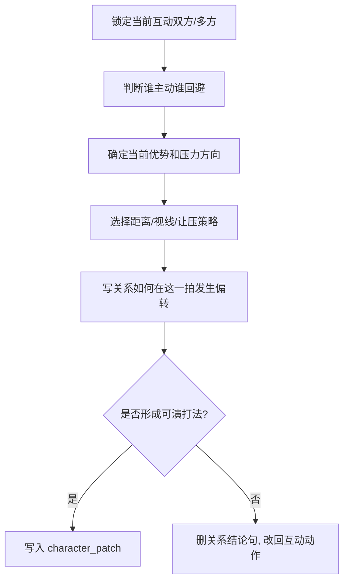

# 对手戏 模块说明

## 定位

- 本叶子负责参照共享 [角色表现总则](../module-spec.yaml)，把双人或多人互动压成攻守、距离、视线、让压、回避和位置交换等可执行策略。
- 它不负责说明“关系复杂”，只负责把关系变成演员能执行的互动打法。
- 它服务的是 `character_patch` 中的 `pressure_vector / distance_shift / relation_turn / interaction_strategy`，重点是把关系张力落到互动动作上。

## 创作目标

- 让读者看见谁在逼、谁在躲、谁在试探、谁在让。
- 让关系变化通过距离、视线、节奏和位置交换成立，而不是靠总结句。
- 让互动本身带出张力收益，方便后续 prose 直接吃进人物关系温差。

## 思维·执行链

## 节点拆解

| 节点 | 思考问题 | 执行动作 | 结果要求 |
| --- | --- | --- | --- |
| `D1-攻守判定` | 这一拍谁在推进，谁在后撤 | 根据话语权、身体朝向、动作先后判断攻守 | 压力方向明确 |
| `D2-优势识别` | 当前优势落在谁手里 | 判断是谁掌握信息、空间、情绪或节奏优势 | 张力有重心 |
| `D3-策略落地` | 双方通过什么互动方式较量 | 选择逼近、停住、绕开、让步、错位、对视、失手等策略 | 关系被写成动作 |
| `D4-关系转折` | 这一互动怎样改变关系温差 | 写明谁占上风、谁露怯、谁被逼退、谁夺回一拍 | 有明确 `relation_turn` |

## 具体创作方法

### 1. 先判断攻守，再写感受

- 攻守不清时，所有“关系复杂”“气氛紧绷”都只是空话。
- 最稳的入口永远是：谁往前，谁往后，谁逼人表态，谁在躲开冲突。

### 2. 关系变化要靠互动，而不是说明

- “他逼近半步，她视线先避开”比“他们关系很微妙”更有效。
- “对方不接话，只把手从他掌心慢慢抽走”比“她开始疏远他”更像戏。

### 3. 张力最好落在一个主策略上

- 可选主策略通常只有一个：逼近、回避、试探、让步、反压、失手、换位。
- 若把所有策略一起上，会削弱焦点。

### 4. 当前空间只作为打法约束

- 这里可以写“隔着桌沿逼问”“贴近又突然退开”“借门口位置拦住去路”。
- 但不负责完整解释机位、景别或镜头调度。
- 一旦需要更细的路径逻辑，应回交 `运动表现/位置和方向`。

## 常见判型

| 判型 | 典型信号 | 写法抓手 | 最佳关系转折 |
| --- | --- | --- | --- |
| `逼问型` | 一方持续推进、要求回应 | 距离收紧、视线钉住、节奏压迫 | 对方被逼退或露馅 |
| `回避型` | 一方不断躲闪、不正面接招 | 眼神错开、身体侧开、动作抽离 | 主导权偏向进攻者 |
| `试探型` | 双方都不愿先亮底牌 | 轻微逼近、留白停顿、半步让压 | 权力摇摆但未坐实 |
| `反压型` | 原本弱势一方突然夺回主动 | 视线回钉、距离反推、话语抢回 | 关系温差突然翻面 |

## 写作抓手

- 距离：逼近半步、贴近、隔开、退开、错身、拦住去路。
- 视线：钉住、躲开、追过去、悬住、迟到、被迫对上。
- 让压：停住不让、先松后收、假退实逼、接了又推回去。
- 换位：从被挡到反拦、从躲闪到逼视、从解释到沉默施压。

## 延展变体

- 若当前组偏 `duel-tension`，可以把对手戏写成“三步攻守”：试探、逼近、转手。
- 若当前组兼有强烈内在压力，让 `内心戏` 提供一个露馅点，再让对手戏决定“谁捕捉到了它”。
- 若当前组存在关键行为节点，保留对手戏的一个主策略即可，其余张力交给 `动作戏` 去完成局面推进。

## 失真与修正

- 若成稿像人物关系说明书，说明没有把关系落成动作。
- 若开始讨论机位、景别或切接，说明越权到镜花层。
- 若不结合当前空间和站位就谈攻守，说明还没真正命中当前组的互动打法。
- 若互动没有压力方向，先把“谁压谁、谁躲谁”补清楚再汇流。
