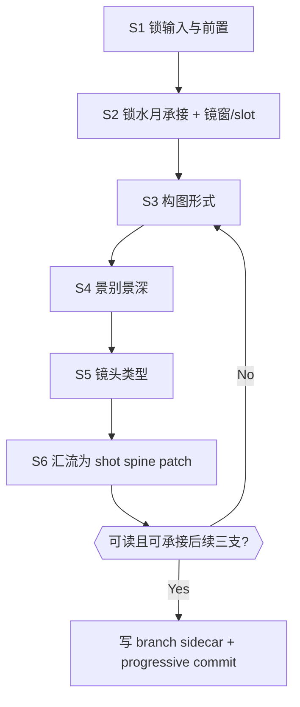
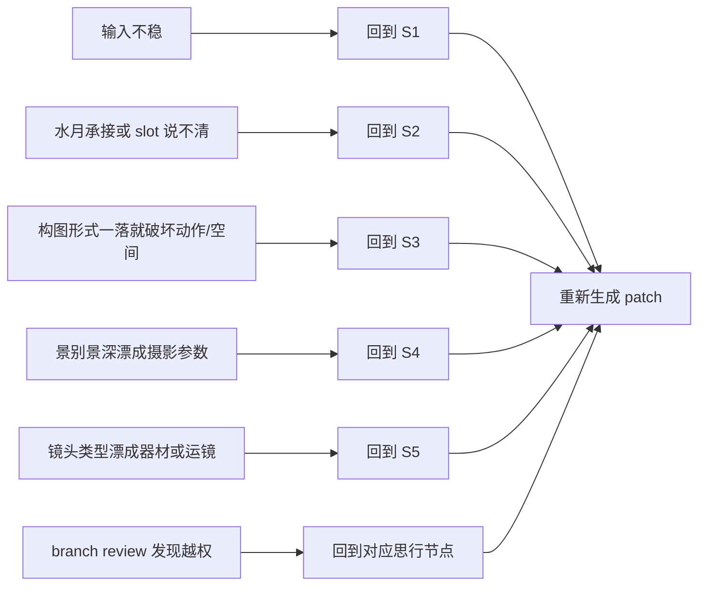
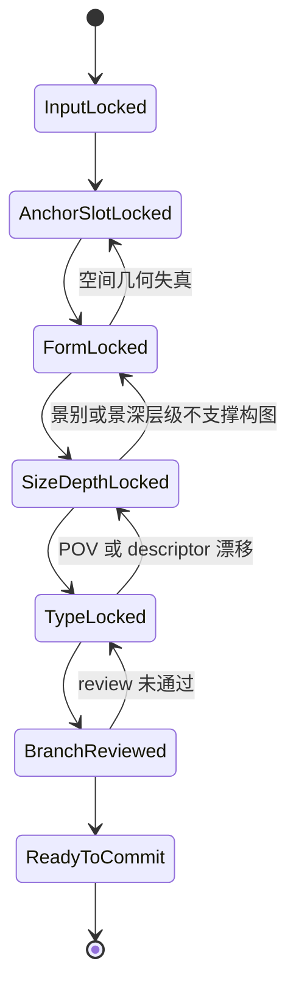

# 3-Detail / 2-镜花 / 1-分镜构图

## Context Loading Contract

- 每次调用本技能时，必须同时加载同目录 `CONTEXT.md`。
- 必须回读父层 `2-镜花/SKILL.md`、`3-Detail/SKILL.md`、`3-Detail/_shared/branch-output-contract.md`、`3-Detail/_shared/node-pack-contract.md`。
- 必须同时回读同目录 `module-spec.yaml`、`module-guide.md`。
- 必须同时回读三个叶子模块：
  - `构图形式/module-spec.yaml + module-guide.md`
  - `景别景深/module-spec.yaml + module-guide.md`
  - `镜头类型/module-spec.yaml + module-guide.md`
- `module-spec.yaml` 是 branch 执行配置真源，`module-guide.md` 只负责解释创作细则与反模式，不得成为第二主链真源。

## Positioning

- 本技能是 `镜花` 的第一串行 branch，先锁 `分镜明细[].分镜构图`，再为 `摄影美学 -> 运镜手法 -> 转场特效` 提供可承接的 shot spine。
- 只拥有 `分镜构图` 的 branch-owned 判断权，不拥有摄影、运镜、转场细节，也不得反向改镜头数量、剧本正文或 `水月` 事实层。
- 当前 branch 内部固定采用：
  - prelude：`watermoon_inheritance + shot_count_plan + shot_slot_map`
  - leaf serial：`构图形式 -> 景别景深 -> 镜头类型`
- `镜头类型` 叶子负责锁 POV、观看姿态与 descriptor 组合；字段名虽然叫 `镜头类型`，但其节点职责同时覆盖 `镜头框架 / 镜头视角` 等镜头描述子。
- `景别景深` 在本技能内指观看距离、景深层级与心理距离，不指精确光圈参数。
- canonical 输出有两个：
  - `projects/aigc/<项目名>/3-Detail/镜花/分镜构图/第N集.branch-patch.json`
- `projects/aigc/<项目名>/3-Detail/第N集.json` 中的 `分镜明细[].分镜构图`

## Canonical Sources

- `../SKILL.md`
- `../../SKILL.md`
- `../../_shared/branch-output-contract.md`
- `../../_shared/node-pack-contract.md`
- `module-spec.yaml`
- `module-guide.md`
- `构图形式/module-spec.yaml`
- `构图形式/module-guide.md`
- `景别景深/module-spec.yaml`
- `景别景深/module-guide.md`
- `镜头类型/module-spec.yaml`
- `镜头类型/module-guide.md`

## Business Requirement Analysis Contract

在进入任何构图 patch 前，先锁定本 branch 的业务分析结果：

- `business_goal`
  - 把 shared root 已固定的 `分镜切换 + 剧本正文` 与 `水月` evidence 落成稳定的组级 shot spine。
- `business_object`
  - `分镜明细[].分镜构图` 与对应的 branch process sidecar。
- `constraint_profile`
  - 不改固定镜数。
  - 不改 `剧本正文`。
  - 不越权写 `摄影美学 / 运镜手法 / 转场特效`。
  - 每个构图判断都必须能回指到 `剧本正文` 或 `水月`。
- `success_criteria`
  - 每一镜都能回答“谁在看谁、谁压谁、镜头怎么站住”。
  - `构图形式 / 景别景深 / 镜头类型` 三个叶子沿同一 `shot_slot_map` 串行吸收，不各自另开主线。
  - 后三支读取当前 root 后，不需要反向重判骨架。
  - branch sidecar 中的 `thinking_process` 与 `patch_payload` 一一对应。
- `topology_fit`
  - 本 branch 是“前置锁定 + 叶子串行 + 汇流校验”的单技能思行网络：先锁输入与镜窗，再锁画面站姿，再锁观看距离与景深层级，最后锁镜头类型与 descriptor。

## Visual Maps

## Total Input Contract

### 必需输入

- `projects/aigc/<项目名>/3-Detail/第N集.json`
- `projects/aigc/<项目名>/3-Detail/水月/第N集.field-patch.json`

### 前置门

1. shared root 中已存在固定 `剧本正文` 与 `分镜切换`。
2. `水月` branch-owned 字段已可读取，至少能支撑动作、情绪、空间、关系四类承接。
3. 当前 episode root 允许写入 `分镜明细[].分镜构图`。

## Output Contract

### branch process sidecar

路径固定为：

- `projects/aigc/<项目名>/3-Detail/镜花/分镜构图/第N集.branch-patch.json`

sidecar 最低要求：

- `thinking_process`
- `target_json_paths[]`
- `patch_payload`
- `review_trace`

### patch payload

组级 `shot_spine_patch` 至少包含：

- `watermoon_inheritance`
- `shot_count_plan`
- `shot_slot_map`
- `composition_skeleton`
- `shot_size_rhythm_preview`
- `pov_strategy_preview`
- `shot_descriptor_lock`
- `focus_spatial_logic`

其中叶子输出职责固定为：

- `构图形式`：`composition_skeleton`
- `景别景深`：`shot_size_rhythm_preview`
- `镜头类型`：`pov_strategy_preview + shot_descriptor_lock + focus_spatial_logic`

写回 `分镜明细[].分镜构图` 的最小字段至少包含：

- `景别景深`
- `镜头类型`
- `构图形式`

## Thinking-Action Node Contract

| node_id | objective | inputs | actions | evidence | route_out | gate |
| --- | --- | --- | --- | --- | --- | --- |
| `SHOT-N1-INPUT-LOCK` | 锁定当前 root、`水月` bundle 与固定镜数前置 | `第N集.json`、`水月.field-patch.json`、父层顺序门 | 读取并确认 `剧本正文`、`分镜切换`、`水月` 是否齐备；锁当前 root 快照 | `input_lock_note` | pass -> `SHOT-N2-ANCHOR-SLOT` | 任一前置缺失则不得继续 |
| `SHOT-N2-ANCHOR-SLOT` | 形成 `watermoon_inheritance + shot_count_plan + shot_slot_map` | root 当前组窗口、`水月` 的动作/情绪/空间/关系 evidence | 提炼组级主动作、主情绪、主空间关系、主视线/冲突；继承固定镜数并落镜窗/slot | `anchor_slot_note` | pass -> `SHOT-N3-FORM` | 若不能一句话说清承接内容，或 slot 一落就破坏动作连续，必须返工 |
| `SHOT-N3-FORM` | 用 `构图形式` 叶子锁画面站姿 | `shot_slot_map`、`watermoon_inheritance`、`构图形式` 叶子合同 | 为每镜锁 `主体/陪体/背景`、空间锚点、轴线、几何关系与 frame task，生成 `composition_skeleton` | `form_lock_note` | pass -> `SHOT-N4-SIZE-DEPTH` / fail -> `SHOT-N2-ANCHOR-SLOT` | 若形式一落就发明新空间或新关系，必须回退 |
| `SHOT-N4-SIZE-DEPTH` | 用 `景别景深` 叶子锁观看距离与深度层级 | `composition_skeleton`、组级 mission/情绪引导、`景别景深` 叶子合同 | 生成 `shot_size_rhythm_preview`，回答景别曲线、景深层级与心理距离 | `size_depth_note` | pass -> `SHOT-N5-TYPE` / fail -> `SHOT-N3-FORM` | 若景别景深漂成摄影参数，或不再支撑画面任务，不得继续 |
| `SHOT-N5-TYPE` | 用 `镜头类型` 叶子锁 POV、descriptor 与观看姿态 | `shot_size_rhythm_preview`、`composition_skeleton`、`镜头类型` 叶子合同 | 生成 `pov_strategy_preview`、`shot_descriptor_lock`、`focus_spatial_logic`，并锁定 `镜头类型 / 镜头框架 / 镜头视角` 等槽位 | `type_lock_note` | pass -> `SHOT-N6-CONVERGE` / fail -> `SHOT-N4-SIZE-DEPTH` | 若把镜头类型写成器材型号、运镜路线或光影话术，不得汇流 |
| `SHOT-N6-CONVERGE` | 汇流为单一 `shot_spine_patch` 并准备 review/commit | 前五节点输出、branch review contract | 组装 `patch_payload`，校验 target path 只命中 `分镜构图`，写 sidecar 并准备 progressive commit | `branch_review_trace` | pass -> complete | 若 thinking 与 patch 不一致、或 target path 越权，必须返工 |

## Lite Field Mapping

| step_id | field_id | node_id | intent | output | failure_signal | rework_entry |
| --- | --- | --- | --- | --- | --- | --- |
| `S1` | `FIELD-COMP-01` | `SHOT-N1-INPUT-LOCK` | 锁输入、顺序门与 factual 前置 | `input_lock_note` | 缺 `剧本正文 / 分镜切换 / 水月` 任一前置 | `S1` |
| `S2` | `FIELD-COMP-02` | `SHOT-N2-ANCHOR-SLOT` | 锁 `watermoon_inheritance + shot_count_plan + shot_slot_map` | `anchor_slot_note` | 说不清主动作、主情绪、主空间关系或 slot 破坏动作连续 | `S2` |
| `S3` | `FIELD-COMP-03` | `SHOT-N3-FORM` | 锁 `构图形式` | `composition_skeleton` | 主陪背景关系失真、空间轴线断裂、frame task 不成立 | `S3` |
| `S4` | `FIELD-COMP-04` | `SHOT-N4-SIZE-DEPTH` | 锁 `景别景深` | `shot_size_rhythm_preview` | 把景别景深写成摄影参数、心理距离不可复核 | `S4` |
| `S5` | `FIELD-COMP-05` | `SHOT-N5-TYPE` | 锁 `镜头类型` 的 POV、descriptor 与观看姿态 | `pov_strategy_preview` / `shot_descriptor_lock` / `focus_spatial_logic` | descriptor 留给下游临场决定，或属性漂成器材/运镜 | `S5` |
| `S6` | `FIELD-COMP-06` | `SHOT-N6-CONVERGE` | 生成单一 `shot_spine_patch` 并完成 branch review 输入 | `patch_payload` / `review_trace` / `target_json_paths[]` | `thinking_process` 不支撑 patch、target path 越权、未写 sidecar | `S6` |

## Root-Cause Execution Contract

出现以下任一症状，必须先修本技能源层，而不是只修单次 patch：

- `SKILL.md` 只剩 scope/字段说明，真正的节点逻辑漂到 `module-guide.md`
- 还没锁 `watermoon_inheritance + shot_slot_map` 就开始写摄影、运镜、转场语汇
- `构图形式 / 景别景深 / 镜头类型` 三个叶子各写一套目标，无法汇流回同一 shot spine
- 把 `景别景深` 写成光圈、焦段、器材参数，把 `镜头类型` 写成摄影机型号或器材目录
- `thinking_process` 只写审美口号，无法解释 `patch_payload`

固定上溯链：

`Symptom -> Direct Cause -> Rule Source -> Meta Rule Source -> Fix Landing Points`

本技能默认排查顺序：

1. `SKILL.md` 的思行节点、门禁和回退是否缺位。
2. `module-spec.yaml` 的 `child_modules / must_answer / patch_contract / quality_gates` 是否仍被当前骨架承接。
3. 三个叶子模块的边界是否清楚，是否出现 descriptor、景深、POV 的边界漂移。
4. 父层 `2-镜花/SKILL.md` 的顺序门与 branch ownership 是否被违反。
5. `skill-知行合一` 对“单一真源 + 思行节点 + Mermaid 骨架”的元合同是否被破坏。

## Completion Gate

只有同时满足以下条件，`1-分镜构图` 才允许宣布完成：

1. branch process sidecar 已写回 `projects/aigc/<项目名>/3-Detail/镜花/分镜构图/第N集.branch-patch.json`。
2. `patch_payload` 只命中 `分镜明细[].分镜构图`。
3. 写回对象至少包含 `景别景深 / 镜头类型 / 构图形式` 三槽。
4. `shot_spine_patch` 已锁住 `watermoon_inheritance + shot_count_plan + shot_slot_map + composition_skeleton + shot_size_rhythm_preview + pov_strategy_preview + shot_descriptor_lock + focus_spatial_logic`。
5. 三个叶子模块 `构图形式 / 景别景深 / 镜头类型` 已按固定顺序完成吸收，不再把 descriptor 或观看姿态留给下游临场重判。
6. 后续三个 branch 可以在不重判镜头数量和 `分镜构图` 的前提下继续串行。
