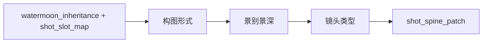
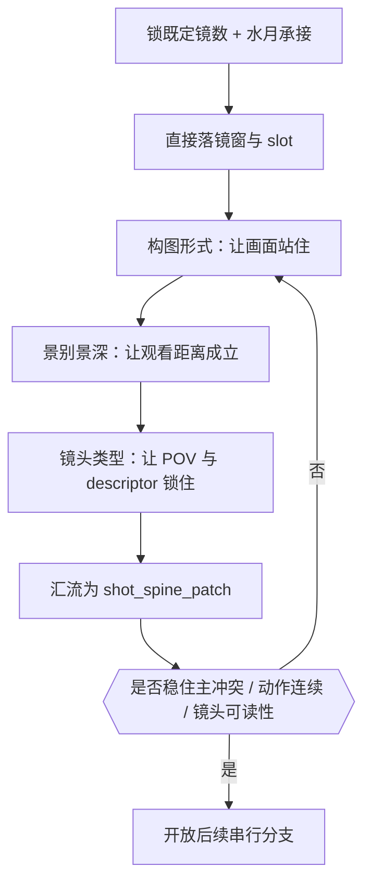

# 分镜构图 模块说明

## 定位

- 本模块负责先形成稳定的 `shot_spine_patch`，直接承接 shared root 已给出的固定 `分镜切换`，一体锁真实切镜、slot 映射和构图骨架。
- 它是 `镜花` 的第一阶段，拥有分镜骨架判断权，不拥有摄影、运镜和转场主导权。
- former `1-切换` 不再作为当前目录的独立叶子；fixed-shot-count 的接受逻辑已内化到 `2-Global`，本模块只负责把上游真值落成可执行 shot spine。
- 它的最小真相不是单镜头灵感，而是组级 shot spine。只有先把组内镜头脊柱锁住，后续模块的光色、运动和转场才不会漂。

## 叶子拆分

`分镜构图` 现在拆成一个 prelude 和三个连续叶子：

1. `构图形式`
   先回答画面怎么站住。它负责主体/陪体/背景、空间锚点、几何关系、轴线与 frame task。
2. `景别景深`
   再回答观众离多远、前中后景怎样分层、心理距离怎么变化。这里的 `景深` 指观看深度层级，不指精确光圈参数。
3. `镜头类型`
   最后回答观众怎么被带着看。这里的 `镜头类型` 是上位叶子，内部统领 `镜头类型 / 镜头框架 / 镜头视角` 等 shot descriptor、POV 与观看姿态概念，不指摄影器材型号。

固定顺序不得颠倒：

## 思维·执行主链

这条主链的关键不是“把叶子都跑一遍”，而是每一步都要为下一步留下稳定抓手：

- 先把 inherited `分镜切换` 直接落成固定镜窗和 slot，不让后续判断失去依托。
- 再用 `构图形式` 让画面本体站住。
- 然后用 `景别景深` 组织观众和画面的心理距离。
- 最后再用 `镜头类型` 锁 POV 与 descriptor，避免后续模块重猜观看姿态。

## 具体创作方法

### 1. 先锁一条可执行的 `水月承接`

在碰叶子之前，先从 shared root 与 `水月` 回收四件事：

- 这组的主动作是什么
- 这组的主情绪波动在哪里
- 这组的主空间关系怎样变化
- 这组的主视线或主冲突由谁承担

若这四件事说不清，就还不能切镜。`分镜构图` 不是把正文打碎，而是把事实层压成“观众应该先看到什么、再看到什么、最后停在哪里”的观看顺序。

### 2. 直接落实 inherited 镜头预算

切镜的第一原则不是“从零开始猜镜数”，而是“承接 `2-Global` 已给出的固定分镜数，用这些镜头把这组最关键的动作、情绪和视线变化显出来”。

此时要先锁：

- `shot_count_plan`
- `shot_slot_map`
- 每镜对应的 `prose_window / anchor_type / anchor_summary`

### 3. 用 `构图形式` 让画面先站住

`构图形式` 要先回答：

- 主体、陪体、背景三层怎么分工
- 画面是正面压迫、偏轴窥视、封闭阻隔、开放悬置，还是其他几何组织
- 视线从哪里进、在哪里停、空间锚点怎么立
- 这一镜的 frame task 是揭示、对压、旁观、隔断还是悬置

若这些问题还没锁住，就不该提前讨论 close-up、wide shot 或镜头类型。

### 4. 再用 `景别景深` 组织观看距离

`景别景深` 负责回答：

- 这组更适合哪种景别曲线
- 哪些镜头需要逼近，哪些镜头需要保持距离
- 前中后景的层级怎样服务主冲突和主视线
- 心理距离如何随着情绪升降改变

这里的 `景深` 是前中后景、焦点层级与观看深度，不是去决定具体镜头焦段或光圈值。

### 5. 最后用 `镜头类型` 锁 POV 与 descriptor

`镜头类型` 在本模块里回答的是：

- 观众是旁观、贴身、主观、压视还是窥视
- POV 站在哪一边，是否允许偏置
- `镜头类型 / 镜头框架 / 镜头视角` 这些专门镜头概念怎样被 `镜头类型` 叶子统领并锁住
- `景别 / 镜头类型 / 镜头框架 / 镜头类型 / 镜头视角` 这些 descriptor 槽位怎样锁住
- 这组镜头的 focus/spatial logic 怎样让后续摄影、运镜直接接上

它不是去选摄影机型号，也不是去替代运镜路线。

### 6. 收束成一个组级 `shot_spine_patch`

汇流时不要把叶子原话机械拼接，而要检查四件事：

- 镜头数是否仍服务主冲突节拍
- shot slot 映射是否稳定可 merge
- 每镜构图是否真能支撑后续摄影与运镜
- 全组是否保住了固定 `剧本正文` 与 `水月` 的动作连续、情绪连续和空间连续

## 思行节点

| node_id | objective | 要回答的问题 | actions | 输出给下游的抓手 | gate |
| --- | --- | --- | --- | --- | --- |
| `SHOT-N1-ANCHOR-SLOT` | 锁定 `水月承接 + shot_slot_map` | 这组究竟承接了哪条动作、情绪、空间、关系信息；既定镜数怎样落成真实镜窗 | 回看 `剧本正文` 与 `水月`，提炼一句组级锚点，并把固定镜数落成真实镜窗与 slot | `watermoon_inheritance + shot_count_plan + shot_slot_map` | 若不能用一句话概括本组承接内容，或 slot 一落就破坏动作连续，不得继续 |
| `SHOT-N2-FORM` | 锁 `构图形式` | 每镜画面靠什么站住，谁压谁，空间如何成立 | 为每镜补主体/陪体/背景、几何关系、轴线、空间锚点与 frame task | `composition_skeleton` | 若一落就发明新空间或新关系，回退 |
| `SHOT-N3-SIZE-DEPTH` | 锁 `景别景深` | 这组更适合怎样的景别曲线与观看深度 | 汇总 `shot_size_rhythm_preview`，明确景别曲线、景深层级和心理距离 | `shot_size_rhythm_preview` | 若把景深写成摄影参数，或无法解释情感距离，不得继续 |
| `SHOT-N4-TYPE` | 锁 `镜头类型` | 观众站在哪边看，这组 descriptor 怎样锁稳 | 汇总 `pov_strategy_preview + shot_descriptor_lock + focus_spatial_logic` | `focus_spatial_logic` | 若镜头类型漂成器材或运镜路线，不得汇流 |
| `SHOT-N5-CONVERGE` | 收束组级 shot spine | 当前组是否已形成统一脊柱 | 检查主冲突、动作连续、镜头可读性、心理距离与 descriptor 一致性，并压成单一 patch | `shot_spine_patch` | 未形成统一脊柱前不得开放后续串行分支 |

## 汇流检查

- 读完整组后，能否一眼看出镜头顺序，而不需要额外列表解释。
- 每个 shot slot 是否都承担独立的观看任务，而不是机械切句。
- `构图形式` 是否先让画面站住，再由 `景别景深` 和 `镜头类型` 继续加细。
- 命中镜头窗口的景别曲线、景深层级、POV 立场和 descriptor 槽位是否已经锁住，而不是留给后续模块临场重判。
- `镜头类型` 是否仍停留在观看姿态与 descriptor，而没有漂成器材或运镜说明。
- 是否仍能明确回指 `水月` 的原始动作、情绪、空间与关系信息。

## 失真与修正

- 若还没形成 `watermoon_inheritance` 就开始写摄影词，说明越序了。
- 若 `构图形式` 已经不稳，却直接去改景别或镜头类型，说明顺序乱了。
- 若把 `景别景深` 写成焦段、光圈、器材参数，说明已经越过构图层边界。
- 若把 `镜头类型` 写成摄影机型号或镜头运动方案，说明 descriptor 边界失真。
- 若 shot spine 一形成就几乎写满摄影、运镜和转场术语，说明 branch guide 越权了；`分镜构图` 只负责让后续模块“有骨可附”。
