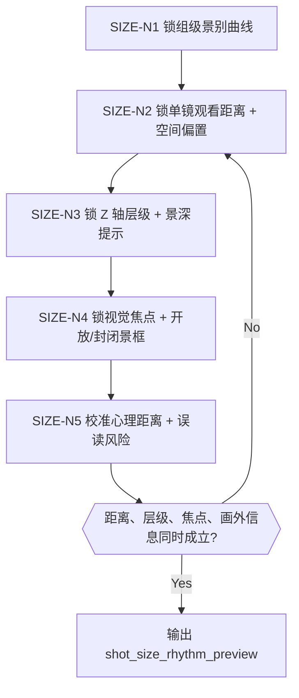
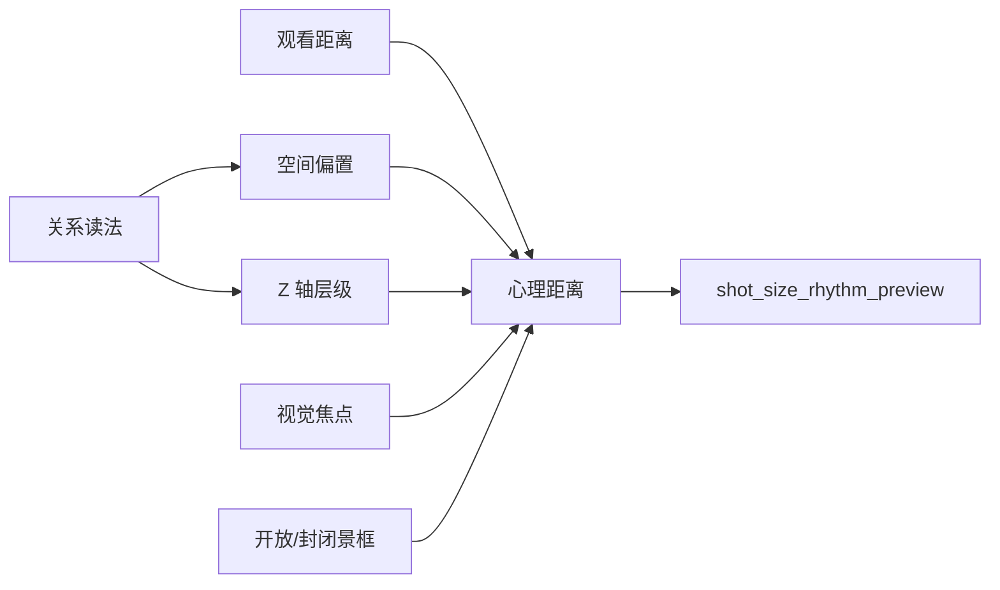
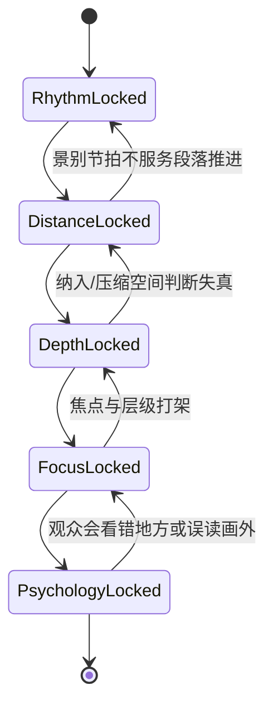

# 景别景深 模块说明

## 定位

- 本叶子负责回答“观众离多远”和“前中后景怎样被读”。
- 它处理景别曲线、空间纳入/排除倾向、景深层级、视觉焦点、开放/封闭景框和心理距离。
- 这里的 `景深` 是观看深度层级，不是具体光圈、焦段或器材参数。
- 这里的“广/标/长”只允许被理解为观看空间偏置：是要纳入更多环境、保持观察中性，还是压缩关系与背景；不落具体焦段值。

## 知识库吸收重点

本叶子已吸收 `knowledge-base/电影学院派/分镜脚本/电影镜头技术.md` 中与景别景深直接相关的规则，并把它们收束为当前技能树可执行判断：

1. 景别不是远近名词表，而是叙事重要性与心理距离的节拍器。
2. 景深不是摄影参数知识，而是“前中后景谁可读、谁退后、谁承担冲突信息”的层级组织。
3. 广视野 / 窄视野首先回答的是“纳入多少环境、压缩多少关系”，不是技术炫耀。
4. 开放景框 / 封闭景框属于本叶子的阅读控制：观众是在画内读全信息，还是被引向某侧画外未知。
5. 前景遮挡、主体重叠、相对尺寸差异，只有在承担偷窥、压迫、引导或深度提示时才成立。
6. 多人或群像镜头要先锁关系读法，再决定拉长 Z 轴还是压缩 Z 轴。
7. 视觉焦点必须唯一或至少有明确主次；浅景深可以弱化环境，但失焦区不能误导叙事。

## 思维·执行主链

## 具体创作方法

1. 先看 `构图形式` 是否已经站住。
   若画面几何没站住，就不该先谈远近。
2. 再锁组级景别曲线。
   判断这一组是压近、守中、拉远，还是先远后近、先近后远。
3. 再锁单镜的观看距离与空间偏置。
   明确这一镜是要纳入更多环境、保持中性观察，还是压缩人物与背景的关系；这里回答的是“看多少、压多近”，不是去写焦段值。
4. 再锁 Z 轴层级与景深提示。
   明确前景、中景、后景谁承担信息压力，是否需要前景遮挡、主体重叠、相对尺寸差异来提示深度；这些手段必须服务偷窥、压迫、引导或深度提示。
5. 再锁视觉焦点与开放/封闭景框。
   明确观众先看哪里；若使用开放景框，必须明确画外方向和未知对象；若使用封闭景框，必须说明画内信息为什么已足够。
6. 最后校准心理距离与误读风险。
   close 不一定更亲，wide 也不一定更冷；关键是它怎样服务情绪和关系，并避免观众看错焦点、误把失焦区当线索。

## 具体判断规则

### 1. 先锁组级景别节拍，不先凭镜头名词跳写

- `压近`：适合情绪逼近、秘密暴露、关系收束。
- `守中`：适合观察、对话、稳定承接。
- `拉远`：适合环境吞没、关系疏离、局面展开。
- `先远后近 / 先近后远`：只在段落存在明确情绪梯度或信息揭示梯度时使用。

### 2. 用空间偏置回答“纳入多少环境”

- 当环境本身是压力来源时，优先更广的纳入倾向。
- 当关系本身比环境更重要时，优先更窄的压缩倾向。
- 当多人镜头要强化分层或对峙阵列时，优先拉长 Z 轴。
- 当多人镜头要让人物看似更近、让前后细节发生关联时，优先压缩 Z 轴。

### 3. 用景深层级决定“谁可读、谁退后”

- 深景深：适合同时读取前景与背景，并让前中后景各有叙事分工。
- 浅景深：适合锁定单一角色/细节，但失焦区域不得误导叙事。
- 若需要“宽视野 + 浅景深”，先靠主体锐度、亮度、对比度和构图占比建立层级，而不是堆摄影参数。

### 4. 用焦点与景框控制误读

- 开放景框只在“未知在画外”时成立，并且必须明确引导观众关注哪一侧画外。
- 封闭景框适合单镜内完成核心信息交代。
- 视觉焦点至少要通过亮度、清晰度、对比度、占比、位置、运动中的一项或多项被抬到主位。
- 前景遮挡若既不压迫、也不偷窥、也不引导，就应该删除。

## 思维·执行节点

| node_id | objective | inputs | execution_action | evidence | gate |
| --- | --- | --- | --- | --- | --- |
| `SIZE-N1-RHYTHM` | 锁组级景别曲线 | `composition_skeleton`、组级 mission/情绪引导 | 写这一组更适合的景别节奏模板，并说明它服务哪条情绪或信息梯度 | `rhythm_template` | 景别曲线必须能解释组内节拍，不能只是“有变化” |
| `SIZE-N2-DISTANCE-LENS` | 锁单镜观看距离与空间偏置 | 上一步结果、每镜 frame task、关系读法 | 为每镜指明 close / medium / wide 等观看距离，并写清是纳入环境、保持中性还是压缩关系 | `per_shot_size_curve + lens_space_bias` | 不得与 frame task 冲突，也不得写成具体焦段参数 |
| `SIZE-N3-Z-DEPTH` | 锁 Z 轴层级与景深提示 | 前两步结果、空间信息压力 | 指明前中后景层级、深浅阅读策略，以及是否使用前景遮挡、主体重叠、相对尺寸差异 | `depth_emphasis + z_axis_layering_note` | 不得写成器材参数；前景手段必须有叙事职责 |
| `SIZE-N4-FOCUS-ENCLOSURE` | 锁视觉焦点与开放/封闭景框 | 前三步结果、冲突与画外信息需求 | 指明主焦点、次焦点、开放/封闭景框策略，以及画外引导方向 | `focus_attention_rule + frame_enclosure_policy` | 焦点必须唯一或有主次；开放景框必须能说明画外未知 |
| `SIZE-N5-PSYCHOLOGY-CHECK` | 锁心理距离并排除误读 | 前四步结果、情绪与关系变化 | 写明观看距离如何影响观众感受，并检查失焦区、画外区、群像层次是否会误导观众 | `psychological_distance_note` | 心理距离必须可复核，且不能留下高误读风险 |

## 延展问法

- 这一镜为什么必须逼近，或者为什么必须留远？
- 当前镜是该纳入环境，还是该压缩关系？
- 前景是否需要承担遮挡、窥视、压迫、引导还是深度提示？
- 这一组是越看越近，还是越看越远，还是一直守中观察？
- 如果当前镜是开放景框，观众究竟该盯哪一侧画外？
- 如果是多人镜头，本镜更应拉开阵列还是压近关系？
- 若把当前 close 改成 medium，会损失哪条情绪或关系信息？

## 失真与修正

- 若 close / medium / wide 只是凭感觉选，说明景别曲线没有锁稳。
- 若“广 / 窄”直接被写成焦段、光圈或器材参数，说明越权到摄影层。
- 若景深开始写成光圈、镜头焦段或器材参数，说明越权到摄影层。
- 若开放景框只写“留白”“悬念”，却不说明观众看向哪侧画外，说明画外阅读没有锁住。
- 若前景遮挡只是在堆层次，没有偷窥、压迫、引导或深度提示功能，删掉它。
- 若群像镜头一味用宽景却说不清人物关系，回到“关系读法 -> Z 轴取向”重判。
- 若焦点需要观众自己猜，说明 `focus_attention_rule` 没有锁稳。
- 若景别变化不服务主冲突，只是在制造花样，删掉它。
- 若心理距离说不清，回到组级情绪引导和 `composition_skeleton` 重判。
