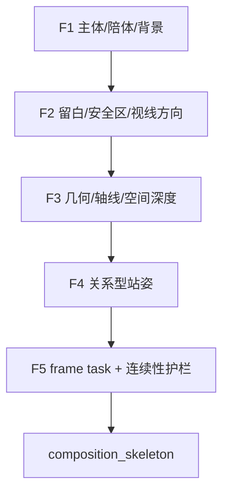
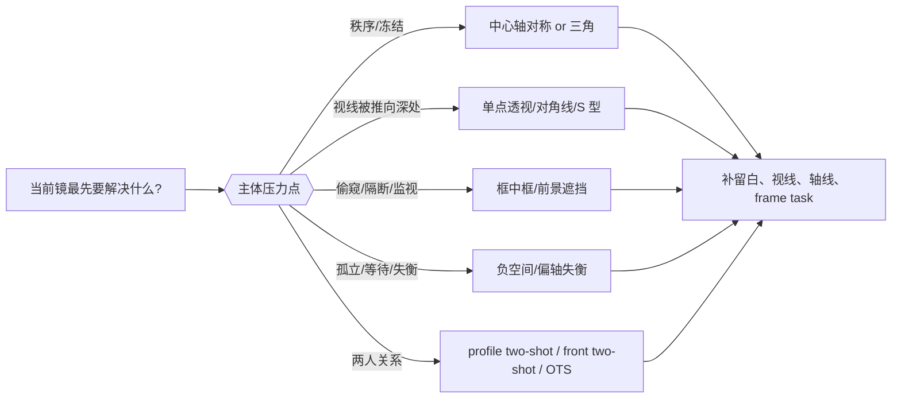
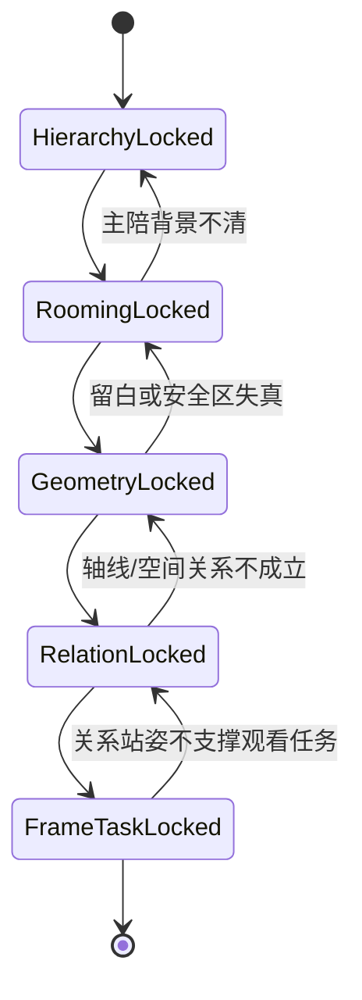

# 构图形式 模块说明

## 定位

- 本叶子负责先让画面站住。
- 它处理的是 `主体/陪体/背景`、空间锚点、画面几何、视线路径、关系型站姿与 frame task。
- 本叶子吸收知识库里的构图语法时，优先承接五类问题：
  - `留白/安全区`：头顶留白、视线留白、关键动作与关键信息是否落在安全区内。
  - `关系型站姿`：单人、双人、过肩、框中框、遮挡窥视等关系如何立住。
  - `二维造三维`：地平线、消失点、斜线、前中后景、遮挡和空间扁平化如何服务戏。
  - `稳定/失衡修辞`：中心、三分、偏轴、负空间、荷兰角、过度切脸等是否有明确动机。
  - `连续性护栏`：轴线、视线方向、银幕左右关系、正反打预判是否自洽。
- `构图形式` 首先回答的是画面组织范式本身，例如对称、单点透视、三角、对角线、S 型、黄金分割、框中框、前景遮挡、偏轴失衡、负空间悬置等，而不是把角色站位走位再叙述一遍。
- 它不负责 close-up 还是 wide shot，也不负责器材、光影、景深参数或运镜。

## 吸收后的构图语法压缩

### 1. 先判画幅承压点，再判风格名

- 先看关键动作、关键表情、关键道具和关键文字是否都能留在安全区。
- 单人镜头先判头顶留白、眼睛落点和视线留白，再决定中心、三分还是偏轴。
- 若需要故意切掉视线留白、压缩头顶空间、切半张脸或让边缘逼迫主体，必须写出明确戏剧动机，不能把失衡当默认高级感。

### 2. 关系型构图优先回答“谁压谁”

- 单人镜头要先回答主体是在被观看、被压迫、被悬置还是主动挤占画幅。
- 双人关系镜头要先判断是 `侧面双人 / 正面双人 / 过肩` 哪一型，再解释为什么。
- 当两张脸被迫贴近或共处一画面时，要意识到它天然会带出亲密、侵略或关系捆绑的潜台词。
- `OTS` 不是简单塞一个肩膀进来，而是把“导演替观众决定先看谁”写进构图逻辑。

### 3. 用几何和层次制造空间，而不是靠术语堆砌

- 若要稳定方向感，地平线要稳，空间锚点要清。
- 若要压迫纵深，可用消失点、斜线、走廊、长桌、列队、门框和遮挡来把视线推入深处。
- 若要刻意扁平化空间，应说明为何减少斜线、为何让角色贴墙、为何压掉纵深线索。
- 前景元素只有在能强化窥视、隔断、压迫、层次或延迟揭示时才保留；随机前景不能抢戏。

### 4. 失衡修辞只能在“有因失衡”时使用

- 荷兰角只在危险、醉态、精神不稳、环境异常、爆发前张力等场景局部使用。
- 过度切脸、偏轴失衡、负空间悬置都必须回答“观众为什么此刻要不舒服”。
- 若没有明确戏剧收益，优先保持地平线稳定、视线可读、主陪背景清楚。

### 5. 构图层也要预先照顾连续性

- 轴线、银幕左右关系与视线方向要能服务后续单人镜头、正反打和视线匹配。
- 若当前镜一落就让后续越轴、看向混乱、正反打难以匹配，说明构图骨架本身有问题。
- 构图层要先把“从哪一侧看、谁看向哪边、谁压住哪边画幅”锁清，再交给 `镜头类型` 细化观看姿态。

## 构图形式库

| 构图形式 | 适合回答的问题 | 常见戏剧效果 | 使用提醒 |
| --- | --- | --- | --- |
| `中心轴对称构图` | 当前是否需要秩序、仪式、冻结感 | 仪式感、制度压迫、关系凝固 | 容易太稳，若戏不要求冻结感就别滥用 |
| `三分/黄金分割构图` | 当前是否需要稳中有偏的古典张力 | 稳定中带牵引、视线均衡 | 先确认眼睛或主体落点，不要机械套网格 |
| `偏轴失衡构图` | 当前是否需要把重心推歪 | 脆弱、悬疑、危险、关系失衡 | 必须写明失衡动机 |
| `单点透视纵深构图` | 当前是否要把视线压向深处 | 压迫、命运通道、空间吸力 | 消失点要服务主冲突，不是纯美术炫技 |
| `对角线构图` | 当前是否需要侵入、推进、斜切力量 | 动势、侵略、失衡、推进 | 若没有方向性动作，容易只剩造型 |
| `S 型引导构图` | 当前是否要让视线缓慢游移 | 暧昧、流动、引导、迷离 | 适合路径与关系滑移，不适合强硬对撞 |
| `三角构图` | 当前是否存在稳定重心或一主两辅 | 权力结构、支配、包围 | 若三角重心说不清，就别强行命名 |
| `框中框构图` | 当前是否需要空间套层或隔断 | 监视、窥视、拘束、门槛感 | 框必须服务隔断或观看关系，不是装饰 |
| `前景遮挡构图` | 当前是否需要偷看、延迟揭示或压迫 | 窥视、秘密、层次、受阻 | 前景不能随机乱挡关键信息 |
| `负空间悬置构图` | 当前是否要让主体被空白吞没 | 孤立、等待、失语、不祥 | 空白必须带压力，不是图面省事 |
| `关系型双人构图` | 两人该如何同框被理解 | 对峙、亲密、并肩、压制 | 要说明是 profile、front two-shot 还是 OTS |

## Visual Maps

## 具体创作方法

1. 先锁主陪背景。
   明确这一镜谁是主体、谁是陪体、背景承担什么信息压力。
2. 再锁留白和安全区。
   头顶留白、视线留白、眼睛落点、关键动作是否压在安全区里，要先过一遍。
3. 再锁空间锚点和几何关系。
   画面是正面对压、偏轴窥视、开放悬置、框中隔断还是纵深压迫，要先说清。
4. 若是关系型镜头，再锁站姿类型。
   回答是单人压幅、双人并置、profile two-shot、front two-shot、OTS、框中窥视还是前景遮挡。
5. 先给出构图范式，再补这一镜的几何任务。
   更稳的写法是“哪一类构图 + 为什么此刻用它”，例如“单点透视纵深构图，用消失点把走廊压成逼仄通道”或“偏轴失衡构图，让强势一方挤占主画面”。
6. 最后锁视线组织、frame task 与连续性护栏。
   观众先看哪里、再看哪里，这一镜是揭示、对压、旁观、隔断还是悬置；同时确认后续正反打、视线匹配和轴线不会被这一镜破坏。
7. 最后检查是否偷发明了新空间或新关系。
   若画面结构不再回指 `水月` 与 `shot_slot_map`，说明已经越权。

## 思维·执行节点

| node_id | objective | inputs | execution_action | evidence | gate |
| --- | --- | --- | --- | --- | --- |
| `FORM-N1-HIERARCHY` | 锁主陪背景 | `shot_slot_map`、`watermoon_inheritance` | 指明主体、陪体、背景的职责分工，并确认背景承担的信息压力 | `subject_support_background` | 三层关系必须可解释 |
| `FORM-N2-ROOMING` | 锁留白、安全区与视线方向 | 上一步结果、角色朝向、关键动作/信息 | 指明头顶留白、视线留白、眼睛落点、安全区与是否允许边缘压迫 | `frame_balance_rule` | 若重要信息出安全区，或留白没有戏剧理由，不得继续 |
| `FORM-N3-GEOMETRY` | 锁空间几何与深度线索 | 前两步结果、空间关系提示 | 指明轴线、空间锚点、地平线/消失点、前中后景与开放/封闭结构 | `axis_and_geometry + spatial_anchor + depth_geometry_note` | 不得发明新空间，不得偷写镜头焦段/器材 |
| `FORM-N4-RELATION-STAGING` | 锁关系型站姿 | 前三步结果、动作与关系冲突 | 指明当前镜属于单人压幅、双人并置、profile two-shot、front two-shot、OTS、框中窥视或遮挡窥视哪一型 | `relation_staging` | 若关系镜头说不清谁压谁、谁看谁，不得继续 |
| `FORM-N5-FRAME-TASK` | 锁 frame task、视线组织与连续性护栏 | 前四步结果、动作与冲突信息 | 写明观看任务、视线路径、银幕方向、轴线/正反打/视线匹配护栏 | `frame_task + eyeline_organization + continuity_guard` | 任务必须单一且可执行，且不能破坏后续连续性 |

## 延展问法

- 这一镜是让观众先认人、先认关系，还是先认空间压力？
- 若只保留一个几何判断，它应该是前压、侧压、隔断、纵深吸入还是开放悬置？
- 这一镜最该检查的是头顶留白、视线留白还是安全区？
- 若是双人关系镜头，为什么是 `profile two-shot`、`front two-shot` 或 `OTS`，而不是别的？
- 视线是被引到主体、背景信息，还是两者之间的冲突缝隙？
- 这一镜若改成另一种画面站姿，会损失什么？

## 失真与修正

- 若主陪背景分不清，说明画面还没站住。
- 若头顶留白、视线留白和安全区没有被检查，说明画面还不能进入下游。
- 若空间锚点说不清，说明这镜不该先谈景别或类型。
- 若成稿主要在说谁站前谁站后、谁走到哪，却没有出现任何构图范式名或几何任务，说明把 blocking 错写成了 `构图形式`。
- 若双人镜头只写“对话镜头”却说不清 profile、front two-shot 还是 OTS，说明关系站姿还没锁住。
- 若荷兰角、偏轴失衡、过度切脸没有明确动机，说明把异常修辞误当默认风格。
- 若 frame task 同时承担太多目标，说明镜头职责还没切开。
- 若一落结构就发明了新空间或新关系，回退到 `shot_slot_map` 与 `水月` evidence。
