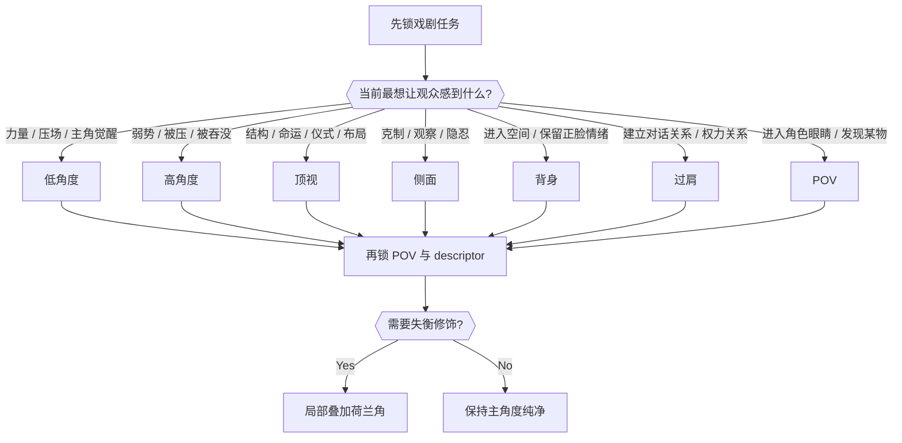
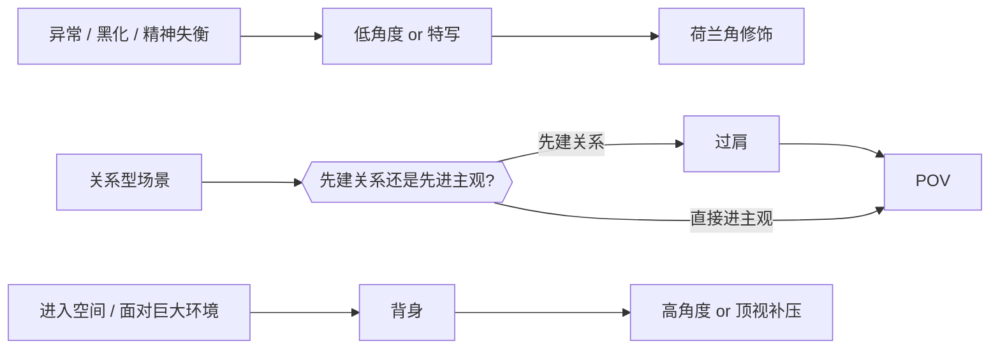
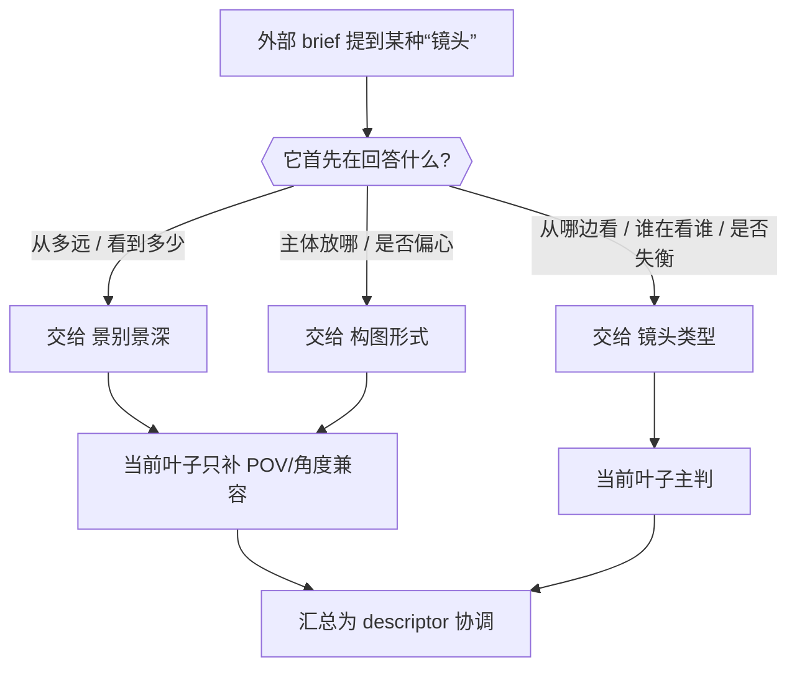
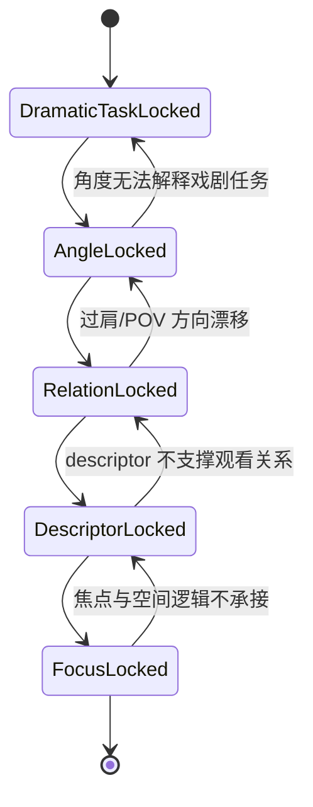

# 镜头类型 模块说明

## 定位

- 本叶子负责锁 POV、观看姿态、镜头角度家族和 descriptor。
- 字段名叫 `镜头类型`，但这个叶子同时负责锁定 `镜头框架 / 镜头视角 / 观看姿态 / 镜头角度` 等镜头描述子。
- 它不负责选摄影机型号，不负责给出器材规格，也不负责替代运镜路线。
- 在这里，镜头角度不是“附加修饰”，而是观众眼睛的位置。它直接决定角色是被抬高、被压弱、被旁观、被带入、还是被置于失衡之中。

## 核心原则

1. 先问戏，再问角度。
   先说清这组镜头要让观众感到什么，再决定低、高、侧、背、顶、过肩、POV 或荷兰角。
2. 镜头角度是叙事站位，不是美术滤镜。
   同一人物“拍得好看”很容易，但真正让角色立起来的是观众被安排站在哪。
3. 荷兰角不是常规主轴，而是失衡修饰。
   它最适合异常、黑化、失控、精神不稳、爆发前张力，不适合日常泛用。
4. `过肩` 和 `POV` 经常是链式关系，不是两种孤立标签。
   常见顺序是先用 `过肩` 建立两人关系，再让 `POV` 把观众送进其中一方。

## “镜头”总称在本技能树里的拆分

外部教程常把“镜头”作为一个总类来讲，里面会同时出现距离、范围、构图偏置和角度。落到当前技能树时，必须拆开：

| 外部术语 | 当前主责任叶子 | `镜头类型` 叶子的职责 | 英文词桥 |
| --- | --- | --- | --- |
| `zoom out` | `景别景深` | 只负责确认拉远后观众仍站在哪看、是否需要保持旁观/背身/高角度等姿态 | `zoom out` |
| `close-up` | `景别景深` | 只负责确认特写是主观逼近、压视逼近，还是低角度/荷兰角的异常逼近 | `close up shot`, `zoom in` |
| `wide shot` | `景别景深` | 只负责确认广角空间是被旁观、被俯压、还是被背身引入 | `wide shot`, `extreme wide shot` |
| `off-center` | `构图形式` | 只负责确认偏心构图后的观看姿态与注意力偏置，不重写左右布置本身 | `off-center image` |
| `OTS / POV / dutch / low / high / overhead / side / behind` | `镜头类型` | 当前叶子的主判断区 | 对应角度术语 |

这意味着：外部文章里说“镜头不像电影”，不等于都要落在 `镜头类型`。当前叶子吸收的是这些总称背后的观看立场与 descriptor 协调规则。

## 角度语义库

| 角度家族 | 适合回答的问题 | 常见戏剧效果 | 常见误用 | 英文词桥 |
| --- | --- | --- | --- | --- |
| 低角度 / 仰拍 | 谁更强、谁在压场 | 力量、统治、主角感、压迫感 | 只是想“拍得帅”却没有权力任务 | `low angle shot`, `from below` |
| 高角度 / 俯拍 | 谁更弱、谁被环境吞没 | 弱势、无助、孤立、被压制 | 只为了变化角度，没有压弱对象 | `high angle shot`, `seen from above` |
| 顶视 / overhead | 人如何被结构或命运包裹 | 宿命感、系统感、仪式感、布局感 | 把顶视当普通俯拍，不服务空间结构 | `overhead shot`, `top-down` |
| 侧面 / side profile | 是否要保持克制观察 | 沉默、思考、隐忍、轮廓感 | 明明需要关系正反，却硬侧拍逃避表达 | `side profile shot` |
| 背身 / from behind | 是否跟人物一起进入空间 | 未知、进入、独处、保留情绪 | 只是不给正脸，没有空间推进任务 | `seen from behind`, `back view` |
| 过肩 / OTS | 谁在对谁施压、谁在听谁说 | 对话关系、视线关系、权力关系 | 只留肩膀轮廓，却没建立对话方向 | `over-the-shoulder shot` |
| POV | 观众究竟在谁的眼睛里 | 主观进入、发现、窥视、第一眼冲击 | 没有明确主体，变成漂浮镜头 | `POV shot`, `point of view` |
| 荷兰角 / dutch | 何时需要“不对劲”的视觉警报 | 危险、失衡、精神不稳、异常时刻 | 当作默认“电影感”倾斜镜头 | `dutch angle`, `tilted frame` |

## 选择流

## 特殊关系与组合

- `过肩 -> POV`：
  先建立两个人的空间与权力关系，再把观众送进其中一方的眼睛。这条链最适合对白、审问、谈判、告白。
- `低角度 + 荷兰角`：
  适合异常时刻、黑化、爆发前张力、危险胜利。不是常规英雄镜头，而是“力量开始失控”的镜头。
- `背身 -> 顶视 / 高角度`：
  先让角色进入空间，再从更高处看到他被环境、制度或命运吞没，适合无助、探索、进入未知后的落差。

## 跨叶术语映射流

## 具体创作方法

1. 先锁戏剧任务。
   先写清这组镜头是要抬高人物、压弱人物、建立关系、进入空间、进入主观，还是制造失衡。
2. 再锁观看姿态。
   观众是旁观、贴身、主观、压视还是窥视，要先选一条主观看姿态。
3. 再锁角度家族。
   用低、高、侧、背、顶、过肩、POV 这些基础家族回答“从哪看”；荷兰角只在需要时作为修饰叠加。
4. 再锁 POV 与关系方向。
   明确观众站在哪一边看，是否允许局部偏置，是否需要 `过肩 -> POV` 的连续链。
5. 再锁镜头类型槽位。
   至少把 `景别 / 镜头框架 / 镜头类型 / 镜头视角` 这些槽位锁住，并让它们服务同一观看姿态和角度家族；若上游给的是 `close-up / wide / off-center` 这类总称，则这里要先做 owner 映射，再写 descriptor 协调。
6. 最后收束 focus/spatial logic。
   让后续摄影、运镜知道焦点如何转移、空间怎样继续被强调，以及谁/什么被压在画面里。

## 思维·执行节点

| node_id | objective | inputs | execution_action | evidence | gate |
| --- | --- | --- | --- | --- | --- |
| `TYPE-N1-DRAMATIC-TASK` | 锁戏剧任务 | `composition_skeleton`、`shot_size_rhythm_preview`、组级情绪引导 | 先回答这组镜头主要要抬高谁、压弱谁、旁观谁、带谁进入空间、让谁看见什么 | `dramatic_task_note` | 若只会说“更有戏 / 更电影”，不得继续 |
| `TYPE-N2-STANCE-ANGLE` | 锁观看姿态与角度家族 | 上一步结果、组级关系/空间证据 | 选择主观看姿态，并在低/高/侧/背/顶/过肩/POV 中选主角度；必要时声明荷兰角是否作为修饰 | `viewing_stance_note` | 角度必须能回指角色状态、情绪或叙事站位 |
| `TYPE-N3-RELATION-POV` | 锁 POV 与关系方向 | 前两步结果、`shot_size_rhythm_preview` | 写 POV 站位、偏置条件、是否需要 `过肩 -> POV`，以及“谁在看谁” | `pov_strategy_preview` | POV 必须可复核，关系方向不得漂浮 |
| `TYPE-N4-DESCRIPTOR` | 锁镜头类型与 descriptor 组合 | 前三步结果、四类 descriptor 槽位 | 把镜头阅读类型写成明确槽位组合，并同步锁 `镜头类型 / 镜头框架 / 镜头视角`；必要时声明角度组合策略；若收到 `zoom out / close-up / wide / off-center` 等术语，先写 owner_ref 再做协调 | `shot_descriptor_lock` | 不得把镜头类型写成器材或运动，也不得抢 `景别景深 / 构图形式` 的主判断 |
| `TYPE-N5-FOCUS` | 锁 focus/spatial logic | 前四步结果、组级空间关系 | 写明焦点与空间强调逻辑、压迫轴线、揭示/遮蔽规则 | `focus_spatial_logic` | 后续分支必须能直接承接 |

## 状态回退图

## 延展问法

- 这一组首先要让观众感到什么，是力量、弱势、压迫、观察、进入，还是危险失衡？
- 为什么这里是俯拍不是仰拍，或者为什么必须从背后看而不是正脸看？
- POV 为什么要站在这一边，而不是另一边？是否需要先 `过肩` 再 `POV`？
- descriptor 若只保留两个，最不能丢的是哪两个？
- 焦点和空间强调是为了压人物、压关系，还是压环境？

## 失真与修正

- 若画面“挺好看但没戏”，通常不是光影问题，而是没有先锁戏剧任务与镜头角度的映射。
- 若把 `zoom out / close-up / wide / off-center` 全都塞进当前叶子，说明“镜头”总称没有拆分成三叶责任。
- 若镜头类型被写成摄影机型号，说明概念边界已经错层。
- 若只写“故事感 / 电影感 / 压迫感”，却说不出为什么要低角度或高角度，说明角度任务没有成立。
- 若荷兰角被当成默认风格，说明失衡语义被滥用。
- 若 `过肩` 没有建立对话方向，或 `POV` 说不清是谁在看，说明关系镜头没有站住。
- 若 descriptor 只剩“电影感、纪实感、高级感”，说明仍是空话，没有锁槽位。
- 若 POV 无法解释“谁在看谁”，说明观看姿态还没站住。
- 若焦点逻辑需要后续模块重新猜，说明本叶子没有完成收束。
