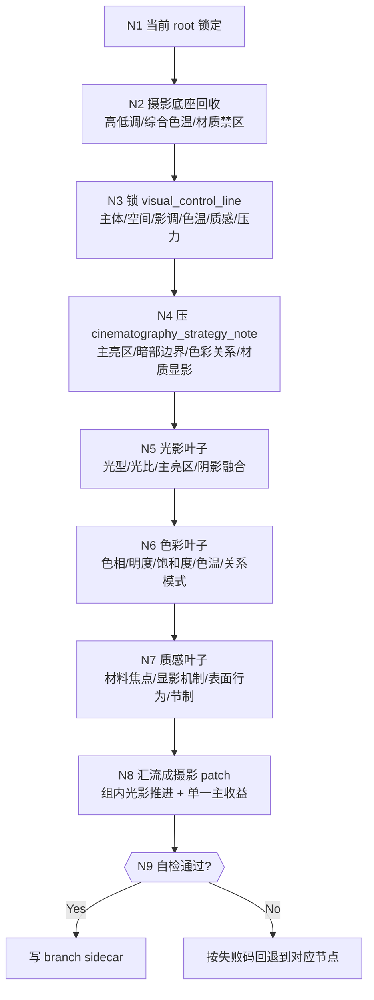
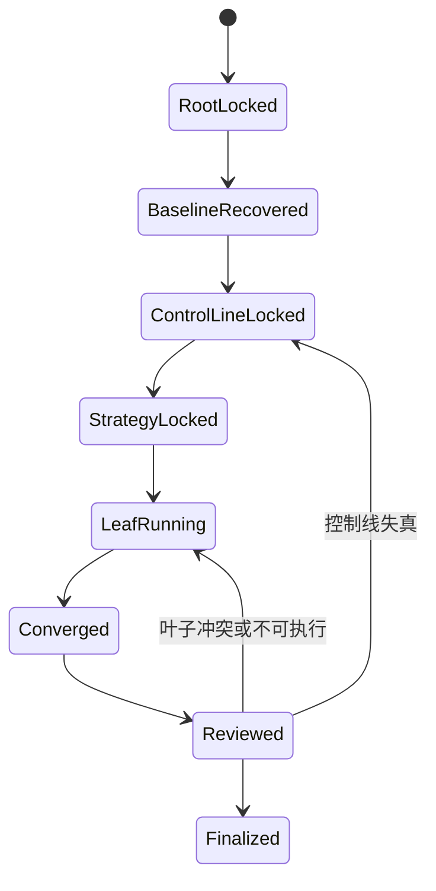
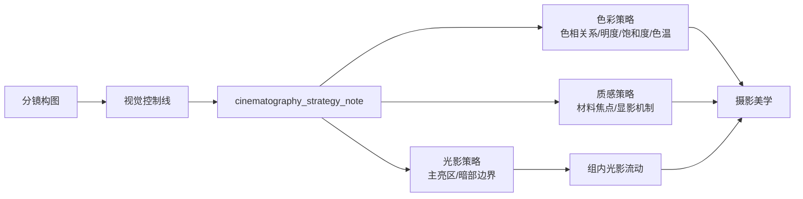
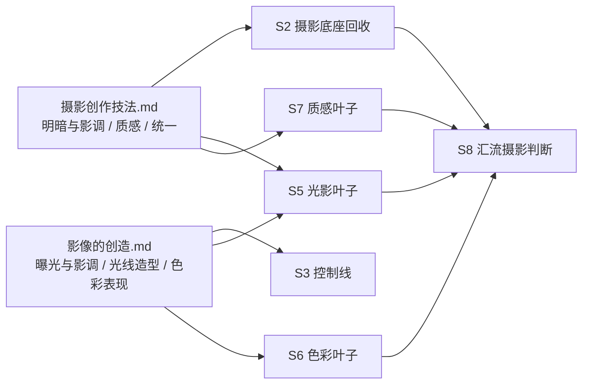

# 3-Detail / 2-镜花 / 2-摄影美学

## Context Loading Contract

- 每次调用本技能时，必须同时加载同目录 `CONTEXT.md`。
- 必须回读父层 `2-镜花/SKILL.md`、`3-Detail/SKILL.md`、`_shared/branch-output-contract.md` 与 `templates/branch-process.template.json`。
- 必须同时回读同目录 `module-spec.yaml`、`module-guide.md`，以及 `光影/色彩/质感` 三个叶子模块目录。
- 冲突优先级固定为：用户显式请求 > 根 `AGENTS.md` > `3-Detail/SKILL.md` > `2-镜花/SKILL.md` > 本 `SKILL.md` > 本地 `CONTEXT.md`。

## Scope

### 本技能拥有

- 只负责 `final_output.main_content.分镜组列表[].分镜明细[].摄影美学`
- 只负责 `projects/aigc/<项目名>/3-Detail/镜花/摄影美学/第N集.branch-patch.json`
- 把 `摄影底座 -> visual_control_line -> cinematography_strategy_note -> 光影/色彩/质感 -> 汇流摄影判断` 写成单一 branch 主链

### 本技能不拥有

- 反向改写 `分镜构图`
- 发明 `角色表现 / 运动表现 / 氛围表现 / 视觉强化`
- 代替 `运镜手法 / 转场特效` 提前写镜间关系
- 把 `光影 / 色彩 / 质感` 平铺成三个彼此独立、互不收束的小总稿

## Canonical Sources

- `.agents/skills/aigc/3-Detail/SKILL.md`
- `.agents/skills/aigc/3-Detail/_shared/branch-output-contract.md`
- `.agents/skills/aigc/3-Detail/2-镜花/SKILL.md`
- `.agents/skills/aigc/3-Detail/2-镜花/templates/branch-process.template.json`
- `module-spec.yaml`
- `module-guide.md`
- `光影/module-spec.yaml`
- `光影/module-guide.md`
- `色彩/module-spec.yaml`
- `色彩/module-guide.md`
- `质感/module-spec.yaml`
- `质感/module-guide.md`

真源分工：

- 本 `SKILL.md`
  - branch 总输入、顺序门、思行节点、汇流门、失败码与完成门
- `module-spec.yaml`
  - 本 branch 的 purpose、patch_contract、merge_policy 与质量门
- `module-guide.md`
  - 摄影分支主链的思维·执行说明与汇流写法
- 三个叶子模块
  - `光影 / 色彩 / 质感` 的局部思维·执行细则

## Business Requirement Analysis Contract

| analysis_slot | 当前结论 |
| --- | --- |
| `business_goal` | 在不改构图骨架的前提下，为命中镜头补齐可执行的 `摄影美学`，让下游能直接消费光影、色彩、质感与组内光影推进。 |
| `business_object` | `projects/aigc/<项目名>/3-Detail/第N集.json` 中命中 scope 的 `分镜明细[]`，以及 `projects/aigc/<项目名>/3-Detail/镜花/摄影美学/第N集.branch-patch.json`。 |
| `constraint_profile` | 当前 root 必须已经有 `分镜构图`；摄影只能强化观看压力和材料气候，不能反向改镜头骨架、动作事实或镜序；任何光影、色彩、质感判断都必须能落回主亮区、暗部层次、综合色温或材质显影机制，而不是停在形容词。 |
| `success_criteria` | 每个命中镜头都获得可消费的 `摄影美学`；branch sidecar 保留思考过程；输出包含 `visual_control_line + cinematography_strategy_note + lighting_strategy + group_lighting_note + color_strategy + texture_strategy`，且 `visual_control_line` 能明确 `主体控制 / 空间剥离 / 影调极性 / 综合色温 / 质感入口 / 观看压力`。 |
| `non_goals` | 不生成第二份 episode 主稿；不单独创造统一导演 prose；不把 `光影/色彩/质感` 各写成互相竞争的总稿。 |
| `complexity_source` | 复杂度来自“必须先锁影调与综合色温主轴，再让光影/色彩/质感沿同一控制线串行兑现，并在汇流时压成单一摄影主收益”，而不是来自字段数量。 |
| `topology_fit` | 固定为 `当前 root 锁定 -> 摄影底座回收（高低调/综合色温/材质禁区） -> 控制线（主体/空间/影调/色温/质感/压力） -> 策略锁定 -> 光影 -> 色彩 -> 质感 -> 汇流 patch -> 自检与 sidecar`。 |
| `step_strategy` | 先锁 branch 主张、影调极性和综合色温，再让叶子按固定顺序吸收，不允许叶子倒逼主线，也不允许把摄影理论拆成互不收束的知识清单。 |

## Context Preload

加载顺序固定为：

1. 根 `AGENTS.md`
2. `.agents/skills/aigc/SKILL.md + CONTEXT.md`
3. `.agents/skills/aigc/3-Detail/SKILL.md + CONTEXT.md`
4. `.agents/skills/aigc/3-Detail/2-镜花/SKILL.md + CONTEXT.md`
5. 本 `SKILL.md + CONTEXT.md`
6. `.agents/skills/aigc/3-Detail/_shared/branch-output-contract.md`
7. `.agents/skills/aigc/3-Detail/2-镜花/templates/branch-process.template.json`
8. `module-spec.yaml`
9. `module-guide.md`
10. `光影/module-spec.yaml + module-guide.md`
11. `色彩/module-spec.yaml + module-guide.md`
12. `质感/module-spec.yaml + module-guide.md`
13. `projects/aigc/<项目名>/3-Detail/第N集.json`

## Total Input Contract

### 必需输入

- `projects/aigc/<项目名>/3-Detail/第N集.json`

### 必需前置

- 命中 scope 的 `分镜明细[]` 已存在 `分镜构图`
- 当前 root 已包含 `剧本正文`、`分镜切换`、`组间设计` 等 `3-Detail` 父层前置

### 硬规则

1. 开始本 branch 前必须重新读取当前 `projects/aigc/<项目名>/3-Detail/第N集.json`，不能沿用更早快照。
2. 若 `分镜构图` 缺失、不稳或仍是占位，必须回退到 `1-分镜构图`，不得硬写摄影。
3. 叶子模块只消费当前 branch 已锁定的 `visual_control_line + cinematography_strategy_note`，不得各自新开审美总线。
4. `思考过程` 只能进入 branch sidecar，不得越权写成 shared root 的第二真相。

## One-Shot Output Contract

### Canonical landing path

- `projects/aigc/<项目名>/3-Detail/镜花/摄影美学/第N集.branch-patch.json`

### Branch patch 最低结构

`摄影美学` 至少包含：

- `光影`
- `色彩`
- `质感`

### Sidecar 最低结构

`group_branch_patches[].thinking_process` 至少回答：

- `context_anchor`
- `creative_thesis`
- `execution_steps`
- `self_check`

### 不允许输出

- 第二份 `摄影总稿`
- 脱离 branch sidecar 的独立思维日志
- 越权重写 `分镜构图`

## Topology Contract

## Thinking-Action Network

| node_id | 对应 Step | objective | inputs | actions | evidence | route_out | gate |
| --- | --- | --- | --- | --- | --- | --- | --- |
| `CG-S1-ROOT-LOCK` | `S1` | 锁定当前 root 与命中镜头上下文 | 当前 `第N集.json`、命中 group scope、已有 `分镜构图` | 回读当前 root，确认 scope、`分镜构图`、剧本与组间设计前置 | `root_lock_note` | 缺 `分镜构图` -> `FAIL-CG-01` / 通过 -> `CG-S2` | 只有当前 root 稳定才可继续 |
| `CG-S2-BASELINE` | `S2` | 回收摄影底座与风格走廊 | `分镜构图`、`组间设计`、项目风格承诺 | 提炼必须继承的高/低调走向、主亮区原则、综合色温、材料禁区和戏剧焦点 | `cinematography_brief` | 底座发虚 -> `FAIL-CG-02` / 通过 -> `CG-S3` | 能说清“必须继承什么、禁止什么，以及影调/综合色温基线” |
| `CG-S3-CONTROL-LINE` | `S3` | 锁定 `visual_control_line` | `cinematography_brief`、当前镜头阅读需求 | 明确主体控制、空间剥离、影调极性、综合色温、质感入口、观看压力 | `visual_control_line` | 控制线不完整 -> `FAIL-CG-03` / 通过 -> `CG-S4` | 六项必须同时成立 |
| `CG-S4-STRATEGY` | `S4` | 压一句稳定贯穿的摄影美学 | `visual_control_line`、`分镜构图` | 写 `cinematography_strategy_note`，锁主亮区/暗部边界、综合色彩关系、材质显影方式与放弃项 | `cinematography_strategy_note` | 仍是漂亮话 -> `FAIL-CG-04` / 通过 -> `CG-S5` | 句子必须能回答哪里最亮、哪里可黑、颜色怎么走、材质如何被看见 |
| `CG-S5-LIGHTING` | `S5` | 先落光影主线 | `visual_control_line`、`cinematography_strategy_note`、光影叶子合同 | 生成 `lighting_strategy`，明确光型、光比、主亮区、阴影融合边界与组内光影推进 | `lighting_strategy` | 光源无来源或压没信息 -> `FAIL-CG-05` / 通过 -> `CG-S6` | 光影必须回答光从哪来、哪里最亮、哪些暗部允许合并 |
| `CG-S6-COLOR` | `S6` | 在既有控制线下补色彩关系 | `visual_control_line`、`cinematography_strategy_note`、色彩叶子合同 | 生成 `color_strategy`，收束色相、明度、饱和度、色温、关系模式与综合色/固有色主导 | `color_strategy` | 只有感受词或不挂光线 -> `FAIL-CG-06` / 通过 -> `CG-S7` | 色彩至少要回答主导色域、明度/饱和度策略、冷暖关系与关系模式 |
| `CG-S7-TEXTURE` | `S7` | 在既有控制线下补质感收益 | `visual_control_line`、质感叶子合同 | 生成 `texture_strategy`，明确材料焦点、显影机制、表面行为与节制边界 | `texture_strategy` | 质感喧宾夺主 -> `FAIL-CG-07` / 通过 -> `CG-S8` | 质感必须回答靠什么被看见，且只能强化不得抢主线 |
| `CG-S8-CONVERGE` | `S8` | 汇流为单一摄影判断 | `lighting_strategy`、`color_strategy`、`texture_strategy` | 先写 `group_lighting_note`，再压成统一 `摄影美学` patch，说明组内如何沿亮度、冷暖和材料推进 | `group_lighting_note`、`cinematography_patch` | 汇流后仍像三段摘要 -> `FAIL-CG-08` / 通过 -> `CG-S9` | 必须保留单一主收益，并看得出组内推进 |
| `CG-S9-SIDECAR` | `S9` | 产出 branch sidecar 并自检 | `cinematography_patch`、`branch-process.template.json` | 回填 `thinking_process`、`patch_payload`、`self_check` | `branch_sidecar_note` | 越权或不可执行 -> 回到对应失败码 / 通过 -> done | 只命中 `摄影美学`，且 sidecar 可审 |

## Lite Field Map

| field_id | 输出位置/字段 | 内容要求 | evidence_source | default_step | quality_dimension | fail_code | rework_entry |
| --- | --- | --- | --- | --- | --- | --- | --- |
| `FIELD-CG-01` | 当前 root 锁定 | 当前 root 已回读，且命中镜头存在 `分镜构图` | `第N集.json` | `S1` | 前置完整性 | `FAIL-CG-01` | `CG-S1-ROOT-LOCK` |
| `FIELD-CG-02` | `cinematography_brief` | 能说清摄影底座、风格走廊、禁区、戏剧焦点以及高/低调与综合色温基线 | `组间设计`、项目风格承诺 | `S2` | 约束继承 | `FAIL-CG-02` | `CG-S2-BASELINE` |
| `FIELD-CG-03` | `视觉控制线` | 同时回答主体控制、空间剥离、影调极性、综合色温、质感入口、观看压力 | `cinematography_brief` | `S3` | 控制线完整性 | `FAIL-CG-03` | `CG-S3-CONTROL-LINE` |
| `FIELD-CG-04` | `cinematography_strategy_note` | 一句可驱动后三叶子的稳定判断，并交代主亮区、暗部边界、色彩关系与材质显影方式 | `visual_control_line` | `S4` | 策略可执行性 | `FAIL-CG-04` | `CG-S4-STRATEGY` |
| `FIELD-CG-05` | `光影策略` | 光影有来源、有戏剧用途，能说明主亮区/暗部保留，并形成组内流动基础 | 光影叶子产物 | `S5` | 光影可读性 | `FAIL-CG-05` | `CG-S5-LIGHTING` |
| `FIELD-CG-06` | `色彩策略` | 色相/明度/饱和度/色温与关系模式可执行，不只是感受词 | 色彩叶子产物 | `S6` | 色彩执行度 | `FAIL-CG-06` | `CG-S6-COLOR` |
| `FIELD-CG-07` | `质感策略` | 材料焦点、显影机制与表面行为可见，且不抢人物与动作主线 | 质感叶子产物 | `S7` | 质感节制 | `FAIL-CG-07` | `CG-S7-TEXTURE` |
| `FIELD-CG-08` | `组内光影流动 + 摄影美学` | 汇流后保留单一摄影主收益，不退回三段并列摘要，并能读出亮度/冷暖/材质推进 | 汇流结果 | `S8` | 收束稳定性 | `FAIL-CG-08` | `CG-S8-CONVERGE` |
| `FIELD-CG-09` | branch sidecar | `thinking_process`、`patch_payload`、`self_check` 可审且不越权 | template 回填结果 | `S9` | 可审计性 | `FAIL-CG-09` | `CG-S9-SIDECAR` |

## Convergence Contract

1. 汇流顺序固定为 `光影 -> 色彩 -> 质感`，不得改成并发平均拼接。
2. 叶子冲突时，优先级固定为：
   - `visual_control_line`
   - 主体与动作可读性
   - 主亮区与暗部层次
   - `Init / Global` 风格走廊
   - 局部美学强化
3. `group_lighting_note` 是汇流门前置；没有组内光影推进，不得宣布摄影美学完成。
4. 最终 `摄影美学` 必须能回答“最亮处落在哪、暗部保留到哪里、综合色温怎么走、材质靠什么被看见”；若仍像三段字段摘要，必须回退到 `CG-S4` 或 `CG-S8`，重新压策略和汇流。

## Root-Cause Execution Contract

出现以下任一问题时，必须先修本 branch 真源，再补局部文字：

- `摄影美学` 只剩审美词，没有控制线
- 叶子模块各写一套目标，无法汇流
- 未读取当前 root 就沿旧快照继续写
- 为了摄影气候反向改写 `分镜构图`
- branch sidecar 缺思考过程或 `self_check`

固定上溯链：

- `Symptom`: 摄影 branch 不可执行、不可汇流或越权
- `Direct Technical Cause`: 控制线缺失、叶子失控、sidecar 结构不全
- `Rule Source`: 本 `SKILL.md` / `module-spec.yaml` / `module-guide.md` / 叶子模块 guide
- `Meta Rule Source`: `2-镜花/SKILL.md` 与你指定的 `skill-知行合一`
- `Fix Landing Points`: 本 branch `SKILL.md`、`module-guide.md`、叶子节点合同、`CONTEXT.md`

对用户的闭环说明固定为：

- 根因位置
- 立即修复
- 系统预防修复

## Completion Contract

只有同时满足以下条件，`2-摄影美学` 才允许宣布完成：

1. branch process sidecar 已写回 `projects/aigc/<项目名>/3-Detail/镜花/摄影美学/第N集.branch-patch.json`
2. target path 只命中 `分镜明细[].摄影美学`
3. `摄影美学` 至少具备：
   - `视觉控制线（含影调极性 / 综合色温 / 质感入口）`
   - `光影策略（含主亮区 / 暗部保留 / 组内光影流动）`
   - `色彩策略（含主导色相 / 明度饱和度 / 色温关系）`
   - `质感策略（含材料焦点 / 显影机制 / 节制边界）`
4. `摄影美学` 明确依附当前 root 的 `分镜构图`
5. `thinking_process.self_check` 能回答“有没有越权发明事实”“有没有只剩漂亮形容词”
