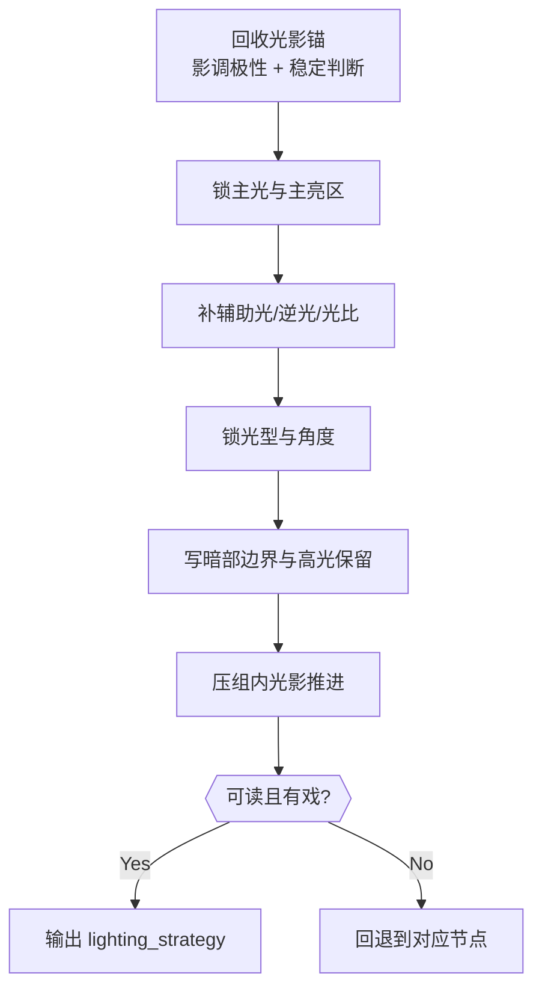

# 光影 模块说明

## 定位

- 本叶子负责确定主光位、辅助光、逆光、影调关系和组内光影推进逻辑。
- 它不负责凭空制造唯美光，只负责让冲突、空间和人物状态更可见。
- 它默认消费上游 `cinematography_brief + visual_control_line + cinematography_strategy_note`，而不是独立发明一套光线审美。

## 理论锚点吸收

- 侧光、前侧光更适合显体积和面部结构；侧逆光更适合把主体从背景里剥出来，同时带出表面纹理。
- 逆光不仅用于轮廓分离，也用于剪影：当需要强调形状而非细节时，应主动把背景作为曝光基准。
- 高调和低调都必须留锚点：高调要留少量深色支点，低调要留少量高光细节，否则容易发飘或死黑。
- 画面最亮处通常应优先分配给核心主体；阴影可以融合边界制造氛围，但不能压没动作与关系信息。
- 光线平淡时，可借遮挡、束光或局部背景光制造节奏；非常规角度光（顶光/底光）只在确有戏剧目的时使用。

## 具体创作方法

1. 先回收光影锚。
   从 `visual_control_line + cinematography_strategy_note` 里确认哪条光影判断必须稳定贯穿整组，例如“主体始终被侧逆光压住”或“空间前后层一直靠冷硬顶光拉开”，同时锁定这组更偏高调、低调还是混合影调。
2. 再锁主光来源。
   要回答这束光为什么合理存在、它为什么是当前冲突最有效的显化方式，以及画面最亮处为何必须落在这里。
3. 再补辅助光和逆光。
   它们不是为了“更有层次”，而是为了让主体剥离、轮廓显形、压迫感成立或空间深度可读，并控制主光过深阴影带来的信息损失。
4. 再定照明类型与影调。
   明确当前组更适合 `硬光 / 柔光 / 混合光`，以及 `顺光 / 侧光 / 逆光 / 顶光 / 底光` 中哪种角度关系最有效，并说明高光、暗部和阴影关系对应的戏剧功能。
5. 最后补组内光影流动。
   不是每镜都重新发明布光，而是回答组内镜头怎样沿着同一条光影语法推进，例如“亮区越来越收窄”“阴影越来越吞没背景”“局部束光越来越逼近主体”。

## 思维·执行网络

## 思维·执行节点

| node_id | objective | inputs | execution_action | evidence | route_out | gate |
| --- | --- | --- | --- | --- | --- | --- |
| `LGT-N1-INHERIT` | 回收光影锚 | `visual_control_line`、`cinematography_strategy_note` | 提炼本组不可漂移的光影约束、影调极性和稳定亮暗判断 | `lighting_anchor` | 锚点不稳 -> 回上游；通过 -> `LGT-N2` | 必须先锁“稳定光影判断”和高低调方向 |
| `LGT-N2-KEY` | 锁主光与主亮区 | `lighting_anchor`、当前冲突焦点 | 指明主光方向、位置、主要照亮对象和主亮区落点 | `key_light_logic + brightest_anchor` | 光源无来源或亮区失焦 -> 重做本节点；通过 -> `LGT-N3` | 主光要合理、有戏剧用途，且最亮处不能跑出主收益 |
| `LGT-N3-SUPPORT` | 补辅助光、逆光与光比 | `key_light_logic`、空间层次需求 | 补充辅助光、逆光或环境补光逻辑，并说明主辅光比与轮廓职责 | `support_light_logic + back_light_logic + light_ratio_note` | 轮廓和空间层未成立 -> 重做本节点；通过 -> `LGT-N4` | 不得只剩主光描述，且要知道何处需要补光 |
| `LGT-N4-TYPE` | 锁照明类型与角度关系 | 已有光位关系、戏剧压力 | 写明照明类型与角度关系及其戏剧用途 | `lighting_type + angle_bias` | 只剩“电影感” -> 重做本节点；通过 -> `LGT-N5` | 必须回答为何硬/柔/混合，以及为何顺/侧/逆/顶/底 |
| `LGT-N5-SHADOW` | 安排影调与暗部边界 | `lighting_type`、动作可读性需求 | 压清高光保留、暗部比例、阴影融合边界和其信息功能 | `shadow_use + highlight_retention` | 阴影压没动作信息 -> 回到 `LGT-N3`；通过 -> `LGT-N6` | 影调必须服务信息显化，低调也要留高光锚点 |
| `LGT-N6-PROGRESSION` | 形成组内推进 | 前述所有光影决策、组内镜序 | 总结镜序间的光影变化轨迹与亮暗递进方式 | `lighting_progression` | 每镜各拍各的 -> 回到 `LGT-N1` 或 `LGT-N2`；通过 -> done | 必须能支撑 `group_lighting_note` |

## 延展问法

- 这束主光是揭示人物，还是把人物困在空间里？
- 若只保留一条稳定光影判断，它应该是哪一条，为什么？
- 画面最亮的区域为什么必须在这里，而不是背景或道具上？
- 如果主光不变，辅助光和逆光要承担的是“轮廓显形”还是“观看压力”？
- 阴影应该让哪些信息暂时看不清，哪些必须保留层次，才能为后续镜头留出张力？
- 本组更需要光线稳定，还是允许局部突然变硬、变冷、变斜？
- 当动作变强时，光影是跟着加压，还是故意维持冷静对照？

## 写法落点

- 单镜层优先写“光从哪来，照到谁，遮住什么”。
- 组级层优先写“这套光影如何在镜序中推进”，并交代亮区和暗部怎么变化。
- 若需压缩，优先保留“主光源 + 主亮区 + 辅助光/逆光职责 + 照明类型 + 组内流动”。
- 若只有一个关键信息，优先保留主光与影调功能，不必强行写满辅助光细节。

## 失真与修正

- 若光线没有来源，说明已经漂成审美空话。
- 若没有先回答哪条光影判断必须稳定贯穿整组，说明还没真正继承 branch 策略。
- 若说不清最亮处在哪里，说明主光和主收益还没锁死。
- 若只写主光，不写辅助光或逆光，说明空间剥离和轮廓关系还没成立。
- 若照明类型只有“有层次、电影感”，说明没有真正回答戏剧功能。
- 若阴影关系压没了动作信息，说明光影过度抢戏；若低调没有任何高光锚点，则说明暗部已经死黑。
- 若组内每镜都像不同摄影师拍的，说明没有把局部布光继续收束成组级推进。
- 若光影判断和空间逻辑冲突，优先保住空间可读性。
