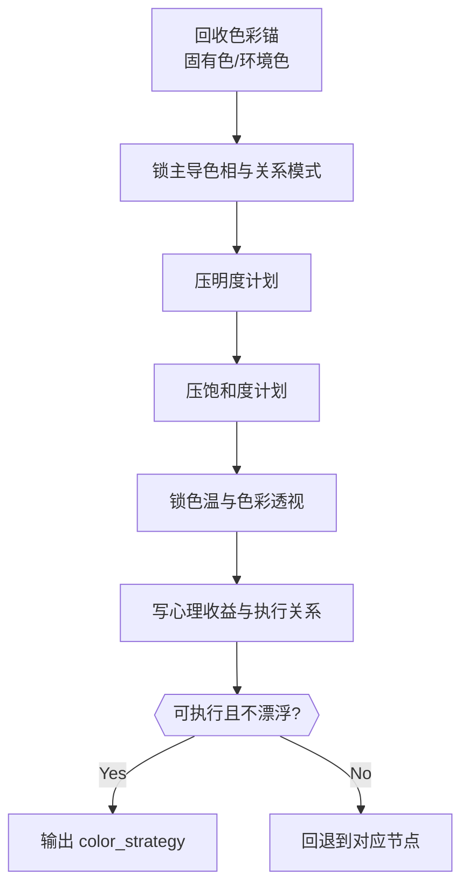

# 色彩 模块说明

## 定位

- 本叶子负责确定色温、色相、明度、饱和度和色彩关系，形成可执行的情绪色板。
- 它不负责替代布景、美术或剧情判断，只负责给镜头写出能被光线、服装、布景共同承接的色彩关系。
- 它不是只给一个“冷暖感受”，而是要把色相、明度、饱和度、色温和色彩心理一起收束成稳定主导关系。

## 理论锚点吸收

- 色彩必须先分清当前组更依赖 `固有色` 还是 `环境色`：前者更强调物体本身色性，后者更强调光对色的改变。
- 色彩收束顺序固定为 `主导色相/关系模式 -> 明度 -> 饱和度 -> 色温 -> 心理收益`；若顺序倒置，通常会只剩模糊感受词。
- 关系模式常见有 `相邻色 / 互补色 / 冷暖穿插 / 主观色彩 / 单色统领`，必须明确选哪一种，不可并列堆满。
- 高明度更偏轻快、低明度更偏压抑；高饱和可形成视觉尖点，低饱和更适合克制与高级灰。
- 若需要空间透视，可使用“近暖近饱和、远冷远灰”的色彩透视经验，但必须服从主体与空间可读性。

## 具体创作方法

1. 先回收色彩锚。
   从 `visual_control_line + cinematography_strategy_note` 确认这组色彩到底要服务主体显形、空间剥离，还是观看压力的延续，并先判断当前更依赖固有色还是环境色。
2. 再锁主导色相。
   要指出哪类颜色是真正的主色域，哪些只能做提示，不可喧宾夺主，并决定当前采用相邻、互补、主观还是冷暖穿插关系。
3. 再压明度。
   回答画面是整体压暗、局部提亮，还是靠明度反差让主体从空间里剥出来。
4. 再压饱和度。
   让色彩从“感受”落到“执行”，明确整体克制、局部尖点还是整体放开。
5. 再锁色温大势。
   明确当前组偏冷、偏暖，还是靠混合对照制造关系张力；必要时连同色彩透视一起说明近远层次怎么被拉开。
6. 最后写色彩心理收益。
   要说清这些色彩不是因为好看，而是因为它们最能服务当前情绪、关系或类型气候，并且能被光线、布景和服装共同承接。

## 思维·执行网络

## 思维·执行节点

| node_id | objective | inputs | execution_action | evidence | route_out | gate |
| --- | --- | --- | --- | --- | --- | --- |
| `CLR-N1-INHERIT` | 回收色彩锚 | `visual_control_line`、`cinematography_strategy_note` | 提炼色彩首先服务的对象与约束，并判断固有色/环境色何者主导 | `color_anchor` | 服务对象不清 -> 回上游；通过 -> `CLR-N2` | 先回答色彩服务谁，以及颜色来自哪里 |
| `CLR-N2-HUE` | 锁主导色相与关系模式 | `color_anchor`、空间/人物关系 | 写主色域、点状辅助色和关系模式 | `hue_bias + relation_mode` | 主色域漂移 -> 重做本节点；通过 -> `CLR-N3` | 主导色相和关系模式必须稳定 |
| `CLR-N3-LIGHTNESS` | 锁明度计划 | `hue_bias`、观看重心 | 写明整体与局部明度安排 | `lightness_plan` | 明度无法服务主体显形 -> 重做本节点；通过 -> `CLR-N4` | 必须回答压暗/提亮/反差 |
| `CLR-N4-SATURATION` | 锁饱和度计划 | `lightness_plan`、情绪强度 | 写明整体饱和度与局部例外 | `saturation_plan` | 仍停在感受词 -> 重做本节点；通过 -> `CLR-N5` | 饱和度必须可执行 |
| `CLR-N5-TEMP` | 锁色温方向与色彩透视 | 前述色彩关系、情绪张力 | 明确整体色温、局部冷暖对照和必要的近远层色彩透视 | `color_temperature + color_perspective_note` | 冷暖逻辑自相矛盾 -> 回到 `CLR-N2~N4`；通过 -> `CLR-N6` | 色温必须服务关系张力，透视不能破坏主体 |
| `CLR-N6-RELATION` | 定色彩关系与心理 | 完整色板信息、当前组主情绪 | 汇总成可执行色板说明，说明为何它能被下游承接 | `palette_relation + emotional_color_gain` | 只剩抽象感受 -> 回到前序节点；通过 -> done | 色彩必须能被下游执行 |

## 延展问法

- 哪个色相最能代表当前空间或人物心理，哪个色相只适合一闪而过？
- 这组更依赖固有色还是环境色？如果换一种光，颜色关系会不会改变？
- 明度是要整体压低来保压抑，还是局部提亮形成注视点？
- 饱和度是保持克制，还是允许一个局部色块承担情绪爆点？
- 这组真正需要的是整体失温、局部暖点，还是冷暖同时存在的关系裂纹？
- 当前更适合相邻色、互补色、主观色彩，还是冷暖穿插？
- 若需要空间剥离，近处和远处是否需要用色彩透视拉开？
- 若去掉所有形容词，只剩色温、色相、明度、饱和度四件事，这组还能不能被执行？

## 写法落点

- 优先把色彩写成“稳定主导关系”，不要写成多种感觉并列。
- 若需压缩，优先保留“主导色相 + 关系模式 + 明度计划 + 饱和度计划 + 色温倾向 + 一句色彩心理”。
- 当色彩收益主要来自整体氛围时，写整体色板；当收益主要来自局部关系时，写对照关系。
- 若色彩已经足够成立，不必硬补过多心理解释，一句收益判断即可。

## 失真与修正

- 若只说“高级、克制、梦幻”，说明没有真正给出色彩关系。
- 若说不清是固有色主导还是环境色主导，说明综合色来源还没锁住。
- 若色相、明度、饱和度、色温的顺序被打乱，说明色彩仍停在感受层，没有真正变成执行策略。
- 若只有冷暖判断，没有明度或饱和度安排，说明色板还不够可执行。
- 若没有关系模式，只剩一堆颜色名，说明画面还没统一成稳定配色结构。
- 若色彩和项目风格走向相反，回看 `Init / Global` 的风格基线。
- 若色彩压过了动作和人物主线，收掉次级色彩修辞。
- 若色彩心理说不清，回到当前组主情绪，重新确认哪种关系最有叙事收益。
