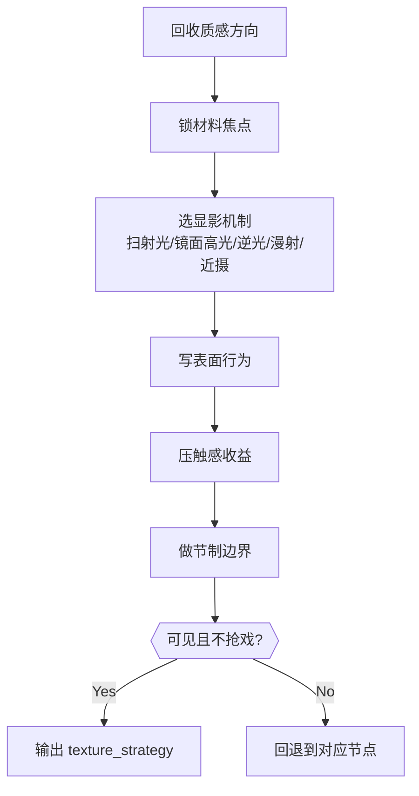

# 质感 模块说明

## 定位

- 本叶子负责把材料、湿度、颗粒、表面反射等触感线索压入画面，让观众“看得见摸得着”。
- 它不负责抽象赞美，只负责让材料感服务当前组的世界表面语言、空间气候和观看压力。
- 它默认服从当前组已锁定的 `visual_control_line`，而不是把所有可见材料平均铺满。

## 理论锚点吸收

- 扫射光和低角度侧光最能显粗糙、凹凸和纹理；当表面需要“被摸到”，优先考虑这种显影方式。
- 锐利、明确的镜面高光更适合显光滑、潮湿、冰冷或金属感；它本质上不是“亮点装饰”，而是材质证明。
- 逆光更适合显透明、半透明、折射、杂质和边缘发亮的材料；漫射光则更适合把表面柔化、压掉过强纹理。
- 质感可以利用“粗糙 vs 光滑”的并置制造触感对比，但必须先锁主材料焦点，不能把整场变成材料展览。

## 具体创作方法

1. 先回收 `texture_direction`。
   从 `visual_control_line` 里确认本组质感到底是往潮、冷、糙、旧、反光还是颗粒方向收，先锁方向，再落材料。
2. 再锁“最先被感到的材料”。
   不要平均写墙、地、衣物、金属、雾气，而要先回答观众第一眼最容易摸到什么。
3. 再锁显影机制。
   指明这份质感靠扫射光、镜面高光、逆光透明、漫射柔化还是近摄微纹理被看见，再决定是否需要触感对比。
4. 再写表面行为。
   指明它是潮、干、糙、冷、滑、旧、反光强，还是有颗粒和粉尘感，并说明这些行为怎样帮助场感成立。
5. 再回看世界观和设计元素。
   质感必须能回到项目时代、空间身份或设计元素，而不是临时追求“更高级”。
6. 最后做节制。
   只保留对人物、动作、空间最有帮助的材料焦点，其余收掉，避免视觉表面过满。

## 思维·执行网络

## 思维·执行节点

| node_id | objective | inputs | execution_action | evidence | route_out | gate |
| --- | --- | --- | --- | --- | --- | --- |
| `TXT-N1-DIRECTION` | 回收质感方向 | `visual_control_line`、项目世界观/设计线索 | 提炼当前组的 `texture_direction` 与禁区 | `texture_direction` | 方向漂移 -> 回上游；通过 -> `TXT-N2` | 先锁方向，不得先堆材料 |
| `TXT-N2-FOCUS` | 锁材料焦点 | `texture_direction`、当前观看重心 | 指定 1 到 2 个主材料焦点 | `material_focus` | 材料过多或失焦 -> 重做本节点；通过 -> `TXT-N3` | 必须回答“最先被感到什么” |
| `TXT-N3-REVEAL` | 锁显影机制 | `material_focus`、镜头感知方式 | 指定材质靠扫射光、镜面高光、逆光、漫射还是近摄微纹理被看见 | `reveal_mechanism` | 仍说不清材质如何出现 -> 重做本节点；通过 -> `TXT-N4` | 必须回答“靠什么被看见” |
| `TXT-N4-BEHAVIOR` | 锁表面行为 | `material_focus`、`reveal_mechanism` | 写表面反光、潮湿、粗糙、颗粒等行为 | `surface_behavior` | 行为不可见 -> 重做本节点；通过 -> `TXT-N5` | 必须可被镜头看见 |
| `TXT-N5-GAIN` | 锁触感收益 | 前述材料与行为、空间/情绪目标 | 说明触感收益与世界表面语言 | `tactile_gain` | 只剩“高级质感” -> 重做本节点；通过 -> `TXT-N6` | 必须回到空间/人物/情绪收益 |
| `TXT-N6-RESTRAINT` | 锁节制边界 | 全部质感信息、人物动作主线 | 标出应删减的次级材质或装饰性描写 | `texture_restraint` | 质感抢戏 -> 回到 `TXT-N2~N5`；通过 -> done | 节制必须先于堆料 |

## 延展问法

- 观众第一眼最容易摸到的是潮气、粉尘、金属冷光，还是旧木头的粗糙？
- 若 branch 已锁“质感方向”，当前材料有没有偏离那条方向？
- 当前材质靠什么被看见，是扫射光、镜面高光、逆光透明、漫射柔化还是近摄微纹理？
- 这种表面行为是在帮助空间说话，还是只是在堆“高级质感”？
- 如果只能留一种材料焦点，它留谁最能代表这个场的世界温度？
- 当前材料线索和项目设计元素是否一致，还是已经跑到了别的世界观里？
- 哪些表面信息一旦写多，就会把人物、动作和观看重心抢走？

## 写法落点

- 优先把质感写成“可见的表面行为”，不要停在抽象手感词。
- 若需压缩，优先保留“质感方向 + 一个主材料焦点 + 一个显影机制 + 一个表面行为”。
- 当质感只是辅助项时，用一个强材料焦点带过即可，不必面面俱到。
- 质感最有效的写法通常不是多，而是准。

## 失真与修正

- 若质感只剩“高级、细腻、厚重”，说明没有真正可见。
- 若材料方向和 `visual_control_line` 脱节，说明质感叶子在越权自立目标。
- 若说不清材质靠什么被看见，说明还停在材料名词层，没有真正完成显影。
- 若表面信息抢走了人物和动作主线，说明质感写得过满。
- 若材料线索和项目世界观不一致，优先回到设计元素约束。
- 若什么都想摸到，说明没有先锁“最先被感到的材料”。
