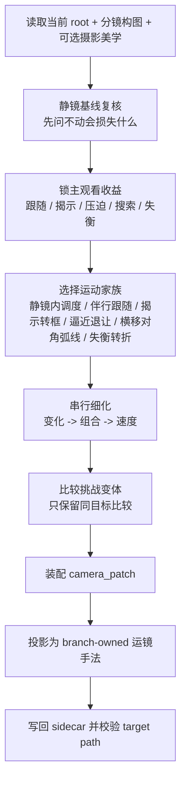
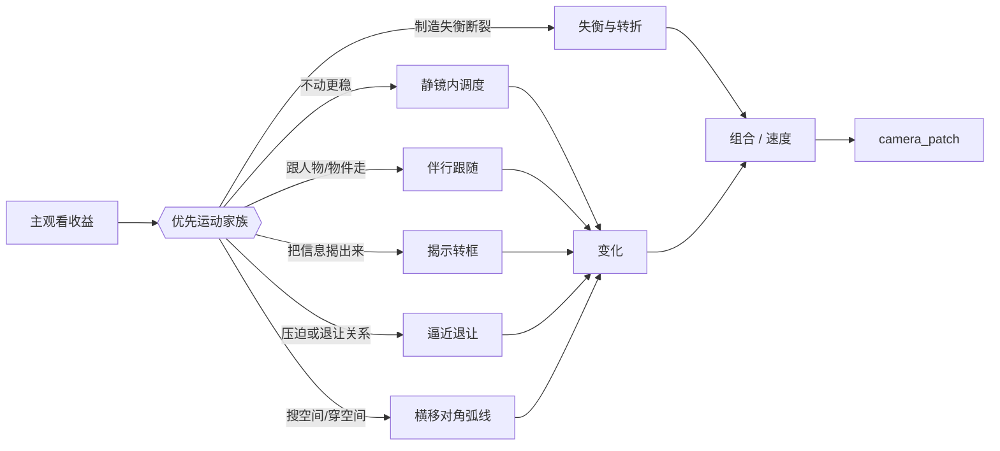
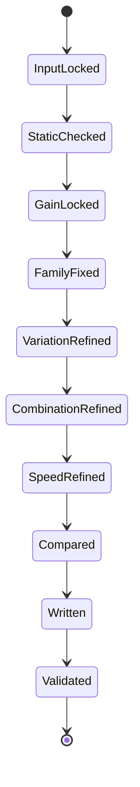

# 3-Detail / 2-镜花 / 3-运镜手法

## Context Loading Contract

- 每次调用本技能时，必须同时加载同目录 `CONTEXT.md`。
- 必须回读父层 `2-镜花/SKILL.md`、`3-Detail/SKILL.md` 与 `_shared/branch-output-contract.md`。
- 必须回读 `references/电影镜头调度-运镜判型.md`，把运镜知识点统一从该共享真源吸收。
- 必须同时回读同目录 `module-spec.yaml`、`module-guide.md` 与本地叶子模块目录：
  - `变化/module-spec.yaml + module-guide.md`
  - `组合/module-spec.yaml + module-guide.md`
  - `速度/module-spec.yaml + module-guide.md`

## Scope

- 只负责 `分镜明细[].运镜手法`。
- 输出 `projects/aigc/<项目名>/3-Detail/镜花/运镜手法/第N集.branch-patch.json`。
- `camera_patch` 只允许作为本 branch sidecar 内的本地装配槽位；项目根业务真相始终是 `运镜手法`。
- 必须依附当前 root 中已存在的 `分镜构图`；若 `摄影美学` 已存在，只能做兼容性对齐，不得反向改写其基调。
- 不得借运镜重写构图、景别、空间轴线、表演任务或新增 `水月` 未给出的动作节点。

## Canonical Sources

- `3-Detail/SKILL.md`
- `2-镜花/SKILL.md`
- `_shared/branch-output-contract.md`
- `references/电影镜头调度-运镜判型.md`
- `module-spec.yaml`
- `module-guide.md`
- `变化/module-spec.yaml`
- `组合/module-spec.yaml`
- `速度/module-spec.yaml`

## Business Fit

本技能的复杂度不在“运动词汇够不够多”，而在以下四个判断连续成立：

1. 先证明静止是否已经足够。
2. 若必须运动，先锁默认叙事路线，而不是先想花样。
3. 默认路线必须先落到某个“运动家族”，例如静镜内调度、伴行跟随、揭示转框、逼近退让、横移对角弧线或失衡转折。
4. `变化 -> 组合 -> 速度` 必须围绕同一观看收益和同一运动家族串行细化，而不是各自发明目标。
5. 长焦 / 中焦 / 广角、前景遮挡、反射、纵深和轴线只作为兼容性 side input，不能反向夺走 `分镜构图 / 摄影美学` 的 owner 权。
6. 挑战变体只能作为比较结论，不能盖过默认路线。

## Visual Maps

## Output Contract

### Canonical Writeback

- branch-owned 最终字段：`分镜明细[].运镜手法`
- branch process sidecar：`projects/aigc/<项目名>/3-Detail/镜花/运镜手法/第N集.branch-patch.json`
- 本地汇总适配层：`camera_patch`

硬规则：

1. `camera_patch` 只能作为 branch sidecar 内的局部装配结果存在。
2. 写回 episode root 或 owner bundle 时，必须投影为 `运镜手法`，不得把 `camera_patch` 当第二真源暴露。
3. `academy_hit_note` 与既有 `摄影美学` 只能作为 side input，不得升级为第二设计入口。

### Required Patch Shape

`运镜手法` 至少包含：

- `变化`
- `速度`
- `组合`

建议表达层至少能读出：

- `变化`
  - 默认路线
  - 所属运动家族
  - 起止控制 / 触发点
- `组合`
  - 主观看流
  - 连续关系 / reveal or reaction chain
  - 轴线或空间稳定说明
- `速度`
  - 默认速度档
  - 关键停顿 / 爆发点
  - 节奏理由

若存在挑战比较，可额外保留：

- `challenge_boundary`

## Thinking-Action Network

| node_id | objective | inputs | actions | evidence | route_out | gate |
| --- | --- | --- | --- | --- | --- | --- |
| `CAM-N1-INPUT-LOCK` | 锁定当前 root、前序构图、可用 side inputs 与共享判型真源 | `第N集.json`、`分镜构图`、可选 `摄影美学`、`references/电影镜头调度-运镜判型.md`、本地模块合同 | 读取当前 root；确认 `分镜构图` 已存在；标出焦段/轴线/前景遮挡/反射等兼容线索，以及可吸收与必须放弃的上游运动提示 | `input_lock_note` | pass -> `CAM-N2` | 缺 `分镜构图` 不得继续 |
| `CAM-N2-STATIC-BASELINE` | 先判断静止是否已足够，并锁定主观看收益 | `水月` 字段、当前 shot、`分镜构图` | 以静镜为基线复核动作、情绪、揭示、主视线和空间负载；回答“不动会损失什么”；锁 `跟随 / 揭示 / 压迫 / 搜索 / 失衡` 中的单一主收益 | `static_baseline_note` | pass -> `CAM-N3` | 运动动机必须清楚；否则显式静止 |
| `CAM-N3-MOTION-FAMILY` | 把默认路线锁成单一叙事主线与单一运动家族 | `static_baseline_note`、兼容线索、共享判型 | 在静止 / 最小必要运动 / 明确移动方式间择一；把路线归入静镜内调度、伴行跟随、揭示转框、逼近退让、横移对角弧线或失衡转折之一；写明启动点、收束点与焦段/空间适配理由 | `motion_family_note` | pass -> `CAM-N4` | 不得同时并列多条默认路线或多个家族 |
| `CAM-N4-VARIATION` | 固化默认路线的“怎么动” | `变化` 模块合同、`motion_family_note` | 生成 `movement_variation`；明确哪一镜需要变化、为何动、何处启动、何处收束；必要时保留静镜内调度 | `movement_variation` | pass -> `CAM-N5` | 不得越权改构图、空间或表演任务 |
| `CAM-N5-COMBINATION` | 把运动路线组织成稳定观看流 | `组合` 模块合同、`movement_variation`、当前组前后镜关系 | 生成 `shot_combination`；锁主观看主语、连续关系、reveal/reaction/power/group split 等链路，过滤破坏轴线与阅读顺序的炫技组合 | `shot_combination` | pass -> `CAM-N6` | 不得发明新镜头或偷换主语 |
| `CAM-N6-SPEED` | 给既定路线补节奏包络 | `速度` 模块合同、`movement_variation`、`shot_combination` | 生成 `speed_profile`；先锁默认速度档，再只保留一次关键停顿 / 爆发 / 反流 / 对比变速 | `speed_profile` | pass -> `CAM-N7` | 速度不得反推运动路径 |
| `CAM-N7-CHALLENGE-BOUNDARY` | 比较是否存在同目标更强变体，但不篡位默认路线 | `camera_patch` 草稿、挑战想法 | 只在表现目标不变时记录挑战收益；若收益说不清或必须偷换主语/轴线/焦段逻辑才成立，则放弃挑战案 | `challenge_compare_note` | pass -> `CAM-N8` | 挑战案不得覆盖默认 patch |
| `CAM-N8-ASSEMBLE-WRITE` | 装配本地 `camera_patch` 并投影为 canonical `运镜手法` | `movement_variation`、`shot_combination`、`speed_profile` | 汇总 branch patch；把局部汇总结果写成 `运镜手法`；写回 branch sidecar | `branch_patch_write_note` | pass -> `CAM-N9` | target path 只命中 `运镜手法` |
| `CAM-N9-VALIDATE` | 校验 ownership、字段完整度与单一真源 | sidecar、父层合同、共享判型 | 检查字段完整、无第二真源、无越权、无空炫技、无“词库化运镜” | `validation_verdict` | pass -> done | 未过审回到对应节点 |

## Lite Field Map

| field_id | node_id | output slot | intent | pass standard | fail code | rework entry |
| --- | --- | --- | --- | --- | --- | --- |
| `FIELD-CAM-01` | `CAM-N1` | `input_lock_note` | 锁定前置和可用 side input | `分镜构图` 已存在，side input 已分流为“可吸收 / 放弃” | `FAIL-CAM-01` | `CAM-N1` |
| `FIELD-CAM-02` | `CAM-N2~N3` | `运动动机 + 默认路线 + motion_family_note` | 先建立静镜基线，再锁默认路线与运动家族 | 能回答“不动会损失什么”；默认路线唯一；已归入单一运动家族且说明焦段/空间适配 | `FAIL-CAM-02` | `CAM-N2` |
| `FIELD-CAM-03` | `CAM-N4` | `movement_variation` | 锁“怎么动/为什么动” | 变化只服务同一主收益，并明确起止控制，不越权改构图或空间 | `FAIL-CAM-03` | `CAM-N4` |
| `FIELD-CAM-04` | `CAM-N5` | `shot_combination` | 组织镜间观看流 | 组合关系服务阅读顺序与主语传递，不发明新镜头或改主语 | `FAIL-CAM-04` | `CAM-N5` |
| `FIELD-CAM-05` | `CAM-N6` | `speed_profile` | 组织节奏和变速 | 速度回答“动多快 / 如何变速”，先有默认档，再有关键呼吸点，不回写运动路径 | `FAIL-CAM-05` | `CAM-N6` |
| `FIELD-CAM-06` | `CAM-N7` | `challenge_boundary` | 约束挑战案不篡位 | 挑战案只做比较结论，默认路线仍是 canonical | `FAIL-CAM-06` | `CAM-N7` |
| `FIELD-CAM-07` | `CAM-N8~N9` | `运镜手法 + branch sidecar` | 单一真源写回与最终交付 | sidecar 已写回；`camera_patch` 未外溢为第二真源；target path 仅命中 `运镜手法`；不存在词库式空运镜 | `FAIL-CAM-07` | `CAM-N8` |

## Root-Cause Execution Contract

出现以下任一情况，必须先修源层合同，而不是只补局部文案：

- 默认路线还没锁定，就直接堆运动花样。
- 默认路线没有落到单一运动家族，导致 `变化 / 组合 / 速度` 各自另起目标。
- `academy_hit_note` 或既有 `摄影美学` 变成第二设计真源。
- 焦段 / 空间 / 前景遮挡本应只是兼容线索，却反向改写了构图或摄影 owner。
- `camera_patch` 没有被投影回 `运镜手法`，导致 branch sidecar 和 root 出现双重真源。
- `速度` 开始反向决定运动路径，`组合` 开始发明新镜头，或 `变化` 开始重写构图和空间。

对用户的闭环说明固定为：

1. 根因位置
2. 立即修复
3. 系统预防修复

## Completion Contract

只有同时满足以下条件，本 branch 才允许宣布完成：

1. branch process sidecar 已写回。
2. target path 只命中 `运镜手法`。
3. `运镜手法` 已包含 `运动动机`、`默认路线`、单一 `运动家族`、`movement_variation`、`shot_combination`、`speed_profile`。
4. 若存在挑战比较，`challenge_boundary` 只能是 side note，不得覆盖默认路线。
5. 若 `运动动机` 不成立，必须显式选择静止或最小必要运动，而不是空写运动词。
6. 焦段 / 空间 / 前景遮挡等知识点若被吸收，只能以兼容性说明出现，不能越权改写构图与摄影基调。
