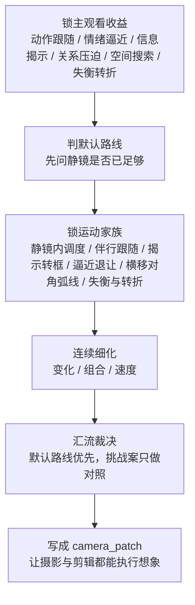

# 运镜手法 模块说明

## 定位

- 本分支负责在 `分镜构图` 已稳定后，把 `运镜手法 / 镜头速度` 压成可执行的 `camera_patch`。
- `camera_patch` 只是本 branch sidecar 内的局部装配槽位；最终项目级业务真相始终写回 `分镜明细[].运镜手法`。
- 它默认在 `摄影美学` 之后、`转场特效` 之前按当前序号执行；若已有 `cinematography_patch`，只把它当兼容性 side input。
- 它默认走“叙事派”路线：先锁默认运镜，再判断是否值得给出同目标挑战对照。
- 它拥有观看路径、运动语法和节奏组织的判断权，但不拥有创造新动作节点、重做构图骨架或改写摄影基调的权力。

## 共享真源

- 运镜知识的共享入口固定为 [references/电影镜头调度-运镜判型.md](references/电影镜头调度-运镜判型.md)。
- 该参考已经把 `knowledge-base/电影学院派/分镜脚本/电影镜头调度.md` 中与运镜直接相关的知识点压成 `主观看收益 -> 运动家族 -> 叶子分工` 的可执行框架。
- 本文件只保留 branch 级骨架、节点与回写规则；更细的判型不在这里平行复制成第二真源。

## 使用方法

- 先锁默认叙事路线：明确当前镜头更稳的是静止、轻推、跟移、摇移、手持还是最小必要运动，并回答“不动会不会更好”。
- 再把路线归到单一运动家族：静镜内调度、伴行跟随、揭示转框、逼近退让、横移对角弧线、失衡与转折，只允许选一条默认主线。
- 再确认运动动机只服务 `水月` 已给出的动作、情绪推进、视线跟随或信息揭示，不得借运镜重写构图、空间轴线或表演任务。
- `变化 / 组合 / 速度` 只是默认路线成立后的连续判断拆分，不承载真实并发调度语义；三者都只能在默认路线成立后，吸收 `academy_hit_note` 中已经转译好的运动相关提示，例如跟随、揭示、逼近、退让、弧线、过轴、停走配合、前后景穿行；不适用就放弃。
- 焦段、反射、前景遮挡、纵深、门窗框和空间轴线在这里都只是兼容性 side input：它们可以帮助选择路线，但不能反向篡改 `分镜构图 / 摄影美学` 的 owner 结论。
- 汇流时固定先保默认路线，再按需记录“同目标更强变体”的比较结论；挑战案只能作为对照，不自动覆盖默认 patch。
- 汇流写回时必须把本地 `camera_patch` 投影为 canonical `运镜手法`，不得让局部装配槽位变成第二真源。
- 若没有明确叙事、情绪或观看收益，默认静镜或最小必要运动优先。

## 具体创作方法

### 主观看收益 -> 运动家族

| 主观看收益 | 默认更稳的家族 | 代表性知识点 | 先下钻到 |
| --- | --- | --- | --- |
| 跟住人物行动或视线 | 伴行跟随 | `运动的摄影机`、`演员驱动摄影机`、`与摄影机一同运动`、`跟拍长镜头` | `变化` |
| 让信息从画外被看见 | 揭示转框 | `揭示式的运动`、`移动用作取景`、`移动用作揭示`、`俯仰用作揭示` | `变化 -> 组合` |
| 压迫、逼近、拉开关系 | 逼近退让 | `向前运动`、`反向推进`、`推轨引入演员`、`双重推进`、`推至特写` | `变化 -> 速度` |
| 带观众穿空间搜索或躲避 | 横移对角弧线 | `侧向运动`、`斜式运动`、`曲线运动`、`穿过人群`、`环绕运动` | `变化 -> 组合` |
| 镜头本可不动，只需演员/景深承接 | 静镜内调度 | `固定长焦镜头`、`固定广角镜头`、`演员的移动`、`横过画面`、`场景调度` | `变化` |
| 制造迷失、断裂、危险闯入 | 失衡与转折 | `越轴`、`重复角度推近`、`误导运动`、`对向滑动`、`迷失的布局` | `组合 -> 速度` |

### 焦段 / 空间兼容

| 线索 | 对运镜的帮助 | 风险 |
| --- | --- | --- |
| 长焦 | 更适合压缩、徒劳、微推、远距窥视、慢逼近 | 大幅横移容易丢空间可读性 |
| 中焦 | 适合中性伴行、对话、平实关系推进 | 压迫或失衡时可能力度不足 |
| 广角 | 适合突进、追逐、弧线转角、空间穿行 | 贴身过度会显得夸张和浮躁 |
| 前景遮挡 / 门窗 / 反射 | 适合揭示、窥视、被困、框式收束 | 若只是装饰，会把主语遮没 |

1. 先锁“主观看收益”，不要先想运动花样。
   当前组真正要放大的，通常只有一项主收益：动作跟随、情绪逼近、信息揭示、关系压迫、空间穿行或失衡转折。若主收益不清，宁可先回到静镜。
2. 再从“静镜基线”反推默认路线，并把它落到单一运动家族。
   先问“不动会损失什么”；只有静镜无法完成主收益时，才进入轻推、横移、跟随、摇移、手持或复合运动。路线必须能说清自己更像哪类调度家族。
3. 然后把运镜拆成三个连续判断问题，但三者都不得改主目标。
   `变化` 解决“怎么动”，`组合` 解决“与前后镜怎么接”，`速度` 解决“以什么节奏动”。如果三者建议冲突，优先保主观看收益、阅读顺序和运动家族一致性。
4. 最后把形式判断压回执行语句。
   运镜结论不应停在抽象名词，而应能落成“哪一镜、为何动、属于哪类调度、与谁衔接、动到什么节拍收住”。这样 `camera_patch` 才能被摄影和剪辑共同消费。

## 思维·执行节点

| 节点 | 思维焦点 | 执行动作 | 产物 |
| --- | --- | --- | --- |
| `CAM-01 输入与主收益锁定` | 当前镜头到底要让观众更跟谁、看见什么、感到什么 | 从 `水月 + shot_spine + 分镜构图` 提取主动作、主情绪、主视线、揭示点和空间负载；若已有 `cinematography_patch` 再补焦段/遮挡/纵深兼容性校对 | `movement_intent_note + input_lock_note` |
| `CAM-02 默认路线与运动家族裁决` | 静止是否已经足够；若不足，这更像哪类镜头调度 | 在静止、最小必要运动、明确移动方式之间择一；把路线归入单一运动家族，并写明不这样会损失什么 | `default_route_note + motion_family_note` |
| `CAM-03 叶子串行细化` | `变化 / 组合 / 速度` 各自怎样承接同一条默认路线 | 先做 `变化` 锁路径，再做 `组合` 锁主语传递与连续关系，最后做 `速度` 锁节奏包络，只吸收兼容的上游运动提示 | `movement_variation + shot_combination + speed_profile` |
| `CAM-04 汇流与挑战边界` | 是否存在同目标更强但不越权的变体 | 比较默认路线与挑战案，只保留默认 patch，把挑战结论压成 side note，并投影为 canonical `运镜手法` | `camera_patch` |

## 延展与变体

- 适合升级为更强运动的情况：
  - 人物视线、动作轨迹或情绪压迫需要被观众连续跟住。
  - 信息揭示依赖“靠近 / 绕出 / 让出 / 穿过”这样的观看过程，而不是单帧就能看明白。
  - 组内镜头关系需要靠运动组织出更明确的主观看流。
- 应收回为静镜或最小必要运动的情况：
  - 演员表演本身已经足够强，运动只会稀释表演。
  - 构图、光影或前后景关系已经完成主要叙事。
  - 运动一旦加入就会打乱观看主语、空间轴线或节奏呼吸。
- 可作为挑战案保留但不覆盖默认路线的情况：
  - 默认方案稳，但可以尝试更贴身的逼近、更晚的启动点、更克制的停顿或更明确的组间跟随。
  - 挑战案仍服务同一表现目标，只是在力度、时机或观看压迫上更强。

## 失真与修正

- 若镜头动了但理由说不清，说明运镜只是空炫技；回到默认叙事路线，先回答为什么要动或不动。
- 若默认路线说得清，但说不清它属于哪个运动家族，说明还停留在词汇层，没有真正吃进镜头调度判型。
- 若把 `academy_hit_note` 当成第二次镜头重设计，说明越过了运动语法边界；只允许抽取“怎么动”，不允许回改“拍什么、从哪看、空间怎么立”。
- 若长焦 / 广角 / 反射 / 遮挡开始主导路线，说明 side input 越权；这些知识点只能帮助选择路线，不是新的设计真源。
- 若运镜开始改写摄影基调、剧情事实或表演重点，说明越权；立即回退到已锁定的 shot spine 与摄影 patch。
- 若组合关系让信息优先级变乱，或速度变化压过动作阅读，先保住阅读顺序和主情绪节点，再谈形式升级。
- 若所谓“更酷变体”偷换了表现目标、空间关系或主冲突，取消挑战案，只保留默认路线。
