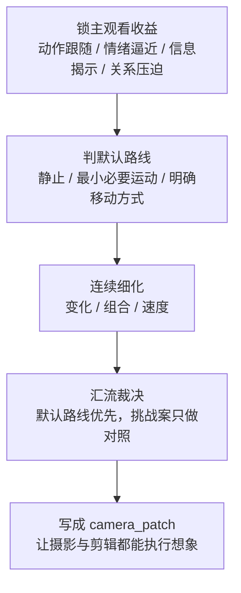

# 运镜手法 模块说明

## 定位

- 本分支负责在 `分镜构图` 已稳定后，把 `运镜手法 / 镜头速度` 压成可执行的 `camera_patch`。
- `camera_patch` 只是本 branch sidecar 内的局部装配槽位；最终项目级业务真相始终写回 `分镜明细[].运镜手法`。
- 它默认在 `摄影美学` 之后、`转场特效` 之前按当前序号执行；若已有 `cinematography_patch`，只把它当兼容性 side input。
- 它默认走“叙事派”路线：先锁默认运镜，再判断是否值得给出同目标挑战对照。
- 它拥有观看路径、运动语法和节奏组织的判断权，但不拥有创造新动作节点、重做构图骨架或改写摄影基调的权力。

## 使用方法

- 先锁默认叙事路线：明确当前镜头更稳的是静止、轻推、跟移、摇移、手持还是最小必要运动，并回答“不动会不会更好”。
- 再确认运动动机只服务 `水月` 已给出的动作、情绪推进、视线跟随或信息揭示，不得借运镜重写构图、空间轴线或表演任务。
- `变化 / 组合 / 速度` 只是默认路线成立后的连续判断拆分，不承载真实并发调度语义；三者都只能在默认路线成立后，吸收 `academy_hit_note` 中已经转译好的运动相关提示，例如跟随、揭示、逼近、退让、弧线、过轴、停走配合、前后景穿行；不适用就放弃。
- 汇流时固定先保默认路线，再按需记录“同目标更强变体”的比较结论；挑战案只能作为对照，不自动覆盖默认 patch。
- 汇流写回时必须把本地 `camera_patch` 投影为 canonical `运镜手法`，不得让局部装配槽位变成第二真源。
- 若没有明确叙事、情绪或观看收益，默认静镜或最小必要运动优先。

## 具体创作方法

1. 先锁“主观看收益”，不要先想运动花样。
   当前组真正要放大的，通常只有一项主收益：动作跟随、情绪逼近、信息揭示、关系压迫或空间穿行。若主收益不清，宁可先回到静镜。
2. 再从“静镜基线”反推默认路线。
   先问“不动会损失什么”；只有静镜无法完成主收益时，才进入轻推、横移、跟随、摇移、手持或复合运动。
3. 然后把运镜拆成三个连续判断问题，但三者都不得改主目标。
   `变化` 解决“怎么动”，`组合` 解决“与前后镜怎么接”，`速度` 解决“以什么节奏动”。如果三者建议冲突，优先保主观看收益和阅读顺序。
4. 最后把形式判断压回执行语句。
   运镜结论不应停在抽象名词，而应能落成“哪一镜、为何动、如何动、与谁衔接、动到什么节拍收住”。这样 `camera_patch` 才能被摄影和剪辑共同消费。

## 思维·执行节点

| 节点 | 思维焦点 | 执行动作 | 产物 |
| --- | --- | --- | --- |
| `CAM-01 主收益锁定` | 这段运镜最该放大什么观看变化 | 从 `水月 + shot_spine` 提取主动作、主情绪、主视线和揭示点；若已有 `cinematography_patch` 再补兼容性校对 | `movement_intent_note` |
| `CAM-02 默认路线裁决` | 静止是否已经足够；若不足，最小有效运动是什么 | 在静止、最小必要运动、明确移动方式之间择一，并写明不这样会损失什么 | `default_route_note` |
| `CAM-03 叶子连续细化` | 变化、组合、速度各自怎样服务同一目标 | 连续下钻 `变化 / 组合 / 速度`，吸收兼容的上游运动提示 | `movement_variation + shot_combination + speed_profile` |
| `CAM-04 汇流与挑战边界` | 是否存在同目标更强但不越权的变体 | 比较默认路线与挑战案，只保留默认 patch，把挑战结论压成 side note | `camera_patch` |

## 延展与变体

- 适合升级为更强运动的情况：
  - 人物视线、动作轨迹或情绪压迫需要被观众连续跟住。
  - 信息揭示依赖“靠近 / 绕出 / 让出 / 穿过”这样的观看过程，而不是单帧就能看明白。
  - 组内镜头关系需要靠运动组织出更明确的主观看流。
- 应收回为静镜或最小必要运动的情况：
  - 演员表演本身已经足够强，运动只会稀释表演。
  - 构图、光影或前后景关系已经完成主要叙事。
  - 运动一旦加入就会打乱观看主语、空间轴线或节奏呼吸。
- 可作为挑战案保留但不覆盖默认路线的情况：
  - 默认方案稳，但可以尝试更贴身的逼近、更晚的启动点、更克制的停顿或更明确的组间跟随。
  - 挑战案仍服务同一表现目标，只是在力度、时机或观看压迫上更强。

## 失真与修正

- 若镜头动了但理由说不清，说明运镜只是空炫技；回到默认叙事路线，先回答为什么要动或不动。
- 若把 `academy_hit_note` 当成第二次镜头重设计，说明越过了运动语法边界；只允许抽取“怎么动”，不允许回改“拍什么、从哪看、空间怎么立”。
- 若运镜开始改写摄影基调、剧情事实或表演重点，说明越权；立即回退到已锁定的 shot spine 与摄影 patch。
- 若组合关系让信息优先级变乱，或速度变化压过动作阅读，先保住阅读顺序和主情绪节点，再谈形式升级。
- 若所谓“更酷变体”偷换了表现目标、空间关系或主冲突，取消挑战案，只保留默认路线。
