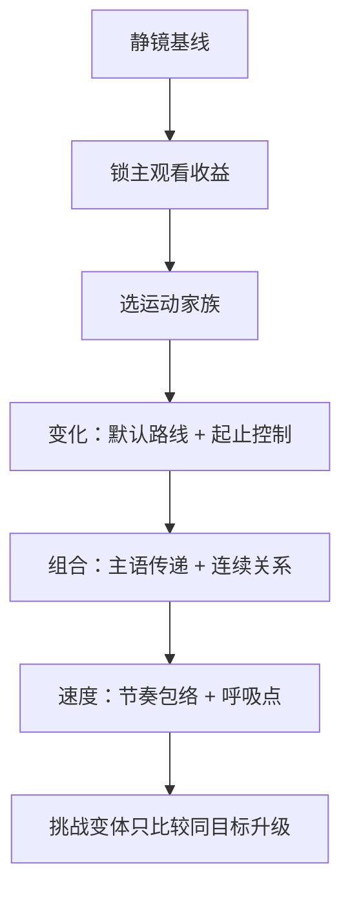
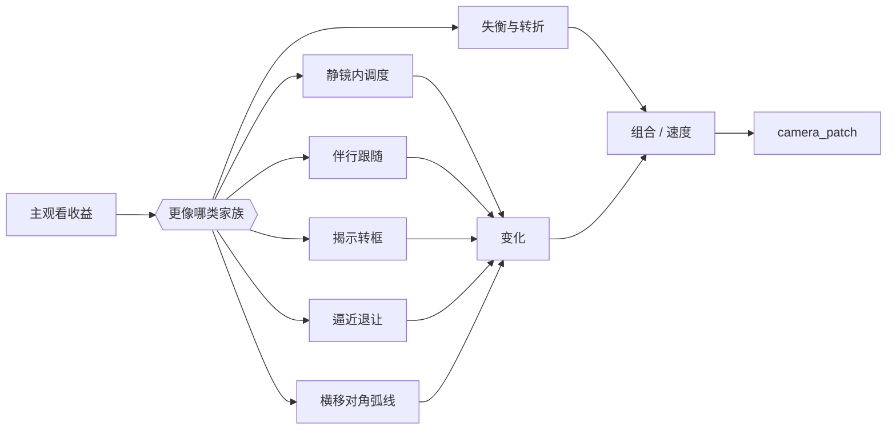

# 电影镜头调度 - 运镜判型参考

## 定位

- 本文件是 `3-运镜手法` 技能包内部的共享知识真源，负责把 `knowledge-base/电影学院派/分镜脚本/电影镜头调度.md` 中与运镜直接相关的知识点压成可执行判型。
- 它服务 `3-运镜手法/SKILL.md`、`module-guide.md` 与 `变化 / 组合 / 速度` 三个叶子模块，不单独替代这些合同。
- 吸收重点是：主观看收益、演员-摄影机关系、揭示/逼近/搜索/失衡类运动、镜间连续关系、速度包络、焦段与空间兼容。

## 权责边界

- 这里可以决定“镜头为什么动、怎么动、与谁衔接、动到什么节拍收住”。
- 这里不负责重写 `分镜构图` 的取景骨架、景别、空间轴线和画面重心。
- 这里不负责重写 `摄影美学` 的光影、色彩、质感基调。
- 焦段、前景遮挡、纵深和反射等知识在这里属于兼容性 side input，只能帮助选择当前路线，不能升级为第二设计入口。

## 主观看收益 -> 运动家族

| 主观看收益 | 优先运动家族 | 代表性调度范式（来自知识库） | 主责任叶子 |
| --- | --- | --- | --- |
| 跟住人物行动或视线 | 伴行跟随 | `运动的摄影机`、`演员驱动摄影机`、`与摄影机一同运动`、`跟拍长镜头` | `变化` |
| 把信息或人物从画外揭出来 | 揭示转框 | `揭示式的运动`、`移动用作取景`、`移动用作揭示`、`俯仰用作揭示`、`反定场镜头`、`亲自揭示` | `变化 -> 组合` |
| 逼近、压迫、拉开关系 | 逼近退让 | `向前运动`、`反向推进`、`推轨引入演员`、`双重推进`、`孤立推进`、`推至特写` | `变化 -> 速度` |
| 展开空间、搜索、穿行 | 横移对角弧线 | `侧向运动`、`斜式运动`、`转向运动与曲线运动`、`穿过人群`、`环绕运动`、`Into the Scene` | `变化 -> 组合` |
| 静镜也能成立，只需演员或景深承接 | 静镜内调度 | `固定长焦镜头`、`固定广角镜头`、`演员的移动`、`横过画面`、`打破多人场景`、`场景调度` | `变化` |
| 需要失衡、迷失、突变或断裂感 | 失衡与转折 | `越轴`、`重复角度推近`、`误导运动`、`对向滑动`、`迷失的布局` | `组合 -> 速度` |

## 运动家族库

### 1. 静镜内调度

- 不是“不设计”，而是把力量交给演员走位、景深、纵深调度和前后景穿行。
- 适合：徒劳、犹豫、群像分化、关系疏离、观众需要自己扫读画面。
- 典型动作：固定长焦看人物“走了像没走”，固定广角让人物把空间走满，静镜里用横穿/走散制造焦躁与裂解。

### 2. 伴行跟随

- 让摄影机跟着人物的行动线、视线线或物件线走，而不是自己另起动作。
- 适合：追逐、送行、并行对话、探索空间、让观众持续贴着主角。
- 关键约束：演员停，镜头通常也应停；若镜头不停，必须能解释是为了继续揭示或持续压迫。

### 3. 揭示转框

- 用推近、后拉、摇开、下摇、门窗框停驻、前景遮挡让信息逐层露出来。
- 适合：角色登场、空间转开、伏笔揭示、视线落点转换、同镜内从情绪切到危机。
- 关键约束：揭示前要先有隐藏；否则只是“镜头动了”，不是“信息被看见了”。

### 4. 逼近退让

- 用前压、后撤、反向推进、双向推进、停后逼近制造关系压差和情绪逼近。
- 适合：宣判、对峙、吸引、控制权转移、人物忽然变得重要。
- 关键约束：这类运动最怕全程都在压近；必须写清启动点、停住点和谁被压。

### 5. 横移 / 对角 / 弧线空间导览

- 用横移、斜移、弧线、环绕、穿群演、过柱子，把空间、障碍和人物关系一起带出来。
- 适合：搜索、躲避、追逐、复杂环境介绍、同镜内从 A 带到 B。
- 关键约束：一旦空间关系不稳，就先收回到最短的可读路径；空间导览不应压过主观看主语。

### 6. 失衡与转折

- 用越轴、反流、错向滑动、误导转身、重复倾斜推进制造断裂和不安。
- 适合：转折、危险闯入、迷失、精神不稳、力量开始失控。
- 关键约束：必须先有正常秩序可被打破；如果一开始就乱，观众只会失向而不是感到转折。

## 焦段 / 空间兼容表

| 兼容线索 | 适合强化什么 | 对运镜的启发 | 风险 |
| --- | --- | --- | --- |
| 长焦 + 固定 / 轻推 | 压缩、徒劳、隔离、焦点揭示 | 更适合微推、静镜内调度、慢速逼近 | 容易把空间压扁，若再加大幅横移会难读 |
| 长焦 + 跟随 / 摇摄 | 速度、压迫、远距窥视 | 适合贴着主体走或用焦点变化揭示第二主语 | 很容易只剩“快”，丢失空间方向 |
| 中焦 + 小幅推拉摇移 | 中性观察、人眼伴行 | 适合平实对话、关系建立、轻度跟随 | 若目标本应极端压迫或失衡，力度会不足 |
| 广角 + 贴身 / 快移 | 速度、侵入、空间扭曲 | 适合追逐、突进、弧线转弯、空间穿行 | 若情绪本该克制，会显得过度夸张 |
| 广角 + 固定 / 低角 | 群像、空间占据、多人调度 | 适合让演员自己把空间走活 | 若演员调度不足，画面会空而散 |

## 叶子归属表

| 叶子 | 负责回答 | 常用范式 |
| --- | --- | --- |
| `变化` | 该不该动、属于哪种运动家族、从哪里开始动、因何收住 | 静镜内调度、伴行跟随、揭示转框、逼近退让、横移对角弧线 |
| `组合` | 主观看主语如何从一镜交给下一镜、哪条连续关系最稳、何时允许断裂 | reveal chain、reaction chain、power exchange、group split、return to subject、axis break |
| `速度` | 默认节奏档是什么、在哪停、如何变速、如何做速度对比 | pause push、evolving move、conveying speed、short move、push against flow、hold then burst |

## 使用顺序

## 反失真规则

- 若一句运镜说明无法指出主观看收益，就先退回静镜基线。
- 若一句运镜说明靠“推、拉、摇、移、跟”堆满动作词却没有起止点，说明还停留在词汇层。
- 若镜头调度范式开始改写构图重心、空间轴线、光色基调或剧情事实，说明已经越权。
- 若速度变化先于运动路线成立，说明 `速度` 抢走了 `变化` 的职责。
- 若连续关系成立的前提是偷换主语或硬越轴，说明 `组合` 失真，应先恢复阅读稳定。
