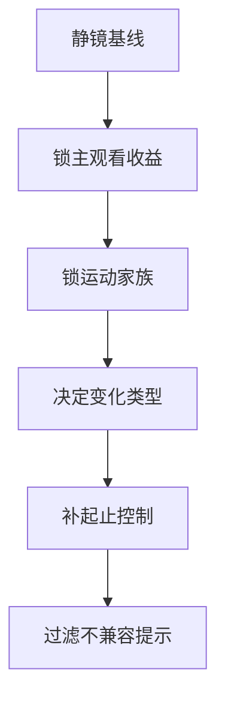

# 变化 模块说明

## 定位

- 本叶子负责锁定默认叙事运镜：判断当前镜头该静止、轻推、拉开、摇移、平移、跟随、手持还是只做最小必要运动。
- 它对应“为什么要动 / 为什么不动”的首层判断，负责把运动变化绑定到信息揭示、情绪推进、视角跟随或关系压迫。
- 它不负责为了“动起来”而动，也不负责借运动去重写构图、空间轴线或新增动作节点。

## 共享参考

- 细的镜头调度判型统一来自 [../references/电影镜头调度-运镜判型.md](../references/电影镜头调度-运镜判型.md)。
- 当前叶子只负责把这些判型压成“默认路线 + 运动家族 + 起止控制”，不重复维护整套范式词典。

## 使用方法

- 先判断默认路线：当前镜头是静止更稳，还是必须通过推、拉、摇、移、跟、手持来放大某个动作或情绪变化。
- 再把路线落到单一运动家族：静镜内调度、伴行跟随、揭示转框、逼近退让、横移对角弧线、失衡与转折。
- 再写明变化类型和变化理由，每个变化都应回答：不变化会损失什么，或为什么此处宁可不动。
- 若 `academy_hit_note` 已有运动提示，只能吸收其中与当前路线一致的部分，例如跟随、揭示、逼近、退让、弧线、过轴、停走配合；不适配就明确放弃。
- 焦段、遮挡、反射和纵深只可作为兼容性说明：例如“长焦更适合微推压近”“广角更适合空间突进”，但它们不应反向成为新的设计主轴。
- 输出时只保留真正有收益的变化，不要把普通镜头都写成运动镜头；动机不足时直接回退为静镜或最小必要运动。

## 具体创作方法

### 常用变化家族

| 家族 | 更像在做什么 | 对应知识点 | 典型失真 |
| --- | --- | --- | --- |
| 静镜内调度 | 镜头不动，靠演员或景深完成变化 | `固定长焦镜头`、`固定广角镜头`、`演员的移动` | 本该不动却硬加运动词 |
| 伴行跟随 | 镜头陪着主体走 | `运动的摄影机`、`演员驱动摄影机`、`与摄影机一同运动` | 主体停了镜头还在乱走 |
| 揭示转框 | 把画外信息逐层亮出来 | `揭示式的运动`、`移动用作取景`、`移动用作揭示` | 没有隐藏就硬做揭示 |
| 逼近退让 | 用推近/后撤压关系或拉距离 | `向前运动`、`反向推进`、`推至特写` | 全程都在压近，没有收放 |
| 横移对角弧线 | 带观众穿空间或搜空间 | `侧向运动`、`斜式运动`、`曲线运动`、`穿过人群` | 空间比主语还抢戏 |
| 失衡与转折 | 用断裂或错向制造突变 | `误导运动`、`重复角度推近`、`对向滑动` | 一开始就乱，观众只剩迷失 |

1. 先从“静止默认值”出发，而不是从运动词库出发。
   把当前镜头当作静镜看一遍，确认它是否已经能完成表演、信息和情绪传递；只有静镜明显不够，才继续设计变化。
2. 再给变化绑定单一主任务。
   最稳的主任务通常只有一个：跟动作、逼情绪、揭信息、压关系、穿空间或制造失衡。若一个变化同时想做三件事，通常已经过量。
3. 决定它属于哪类运动家族，再决定具体动作。
   先说清“这是揭示转框”还是“这是伴行跟随”，再写轻推 / 跟随 / 横移 / 摇移 / 手持。这样输出不会只剩动作词。
4. 决定启动点和终止点。
   不只写“轻推 / 跟随 / 横移”，还要明确它从哪里开始动、为了什么动、动到哪里收住。这样才不会只剩“镜头在动”的空描述。
5. 最后检查是否偷换了上游职责。
   若变化开始解释构图、重排空间、发明新动作或替角色表演，就说明已经越过叶子边界。

## 思维·执行节点

| 节点 | 思维焦点 | 执行动作 | 产物 |
| --- | --- | --- | --- |
| `VAR-01 静镜基线` | 不动是否已经足够 | 用静镜假设复核当前镜头的动作、情绪、信息承载 | `static_baseline_note` |
| `VAR-02 主收益与家族归类` | 若要动，主收益究竟是什么，它更像哪类镜头调度 | 在跟随、揭示、逼近、空间搜索、失衡等收益中择一，并落到单一运动家族 | `movement_reason_note + motion_family_note` |
| `VAR-03 起止控制` | 变化何时开始、何时停、谁来触发 | 把运动绑定到动作拐点、视线转换、情绪升压或信息显露 | `target_shots + movement_type` |
| `VAR-04 焦段/空间兼容` | 当前变化与焦段、遮挡、反射、纵深是否相容 | 保留能强化路线的兼容线索，删掉会让空间变乱的设计 | `lens_space_fit_note` |
| `VAR-05 兼容性过滤` | 上游提示与当前路线是否一致 | 吸收兼容提示，丢弃会改写构图、空间或行为逻辑的提示，写成最终 `movement_variation` | `movement_variation` |

## 延展与变体

- 常见适配场景：
  - 跟随：人物移动、追视、反应追踪、物件传递。
  - 轻推：情绪逼近、关系压迫、意识聚焦。
  - 拉开：距离感、退让、揭示更大空间关系。
  - 横移 / 摇移：视线搜索、并列信息揭示、空间关系渐显。
  - 手持：不稳定、贴身、压迫，但前提是上游情绪允许。
- 升级边界：
  - 若同一镜内需要同时“跟随 + 揭示 + 压迫”，优先保一条主收益，其余交给组合或速度，不要都堆在变化里。
  - 若变化要靠明显绕行、过轴或长距离穿行才成立，应先问这是不是已经该交给 `组合` 处理连续关系。

## 失真与修正

- 若“哪一镜要动”或“为什么不动”说不清，说明默认路线没有锁稳；先回到静镜基线重新判断。
- 若能说清要推/拉/摇/移，却说不清属于哪类镜头调度，说明知识点还没被吸收成判型；先回到运动家族归类。
- 若变化和主冲突、主视线或主情绪无关，删掉它，不要拿运动填充画面。
- 若长焦 / 广角 / 反射 / 遮挡决定了路线，而不是帮助路线，说明 side input 越权；把它们降回兼容性说明。
- 若变化开始承担构图、表演或空间说明，说明越权；把这些判断退回 shot spine。
- 若变化过多影响阅读稳定性，先保留最能放大情绪或揭示信息的一处，其余回收。
- 若所谓更强变体只是更花哨，却改变了表现目标，取消该变体，只保留默认路线。
