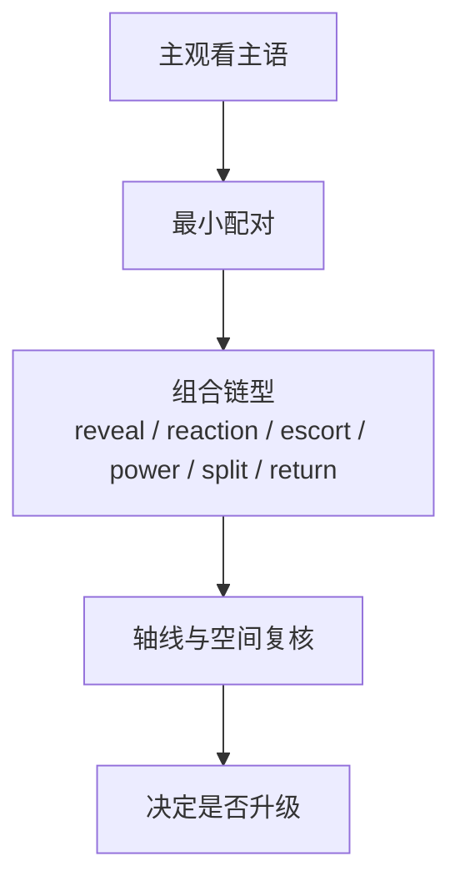

# 组合 模块说明

## 定位

- 本叶子负责决定相邻镜头如何成对、成组、递进、呼应、跟随或揭示，让观看路径在已有 shot spine 上成立。
- 它负责把运动变化组织成可读的镜间关系，但不负责发明新镜头，也不负责借组合关系改写信息优先级。
- 它也是“同目标更强变体”最容易失真的叶子，因此必须先保阅读顺序，再谈形式升级。

## 共享参考

- 组合判型的统一入口是 [../references/电影镜头调度-运镜判型.md](../references/电影镜头调度-运镜判型.md)。
- 当前叶子只把其中与镜间连续关系相关的范式压成 `pairing_logic / continuity_link / escalation_pattern`。

## 使用方法

- 优先判断哪些镜头需要对位、反应、追随、揭示、递进或停走配合，明确主观看主语是如何被连续引导的。
- 若 `academy_hit_note` 已提供弧线、过轴、前后景穿行或揭示式横移等运动语法，只能在不改写既有构图和空间的前提下吸收到组合关系里。
- 组合关系最好先归到一条连续链：reveal chain、reaction chain、escort chain、power exchange、group split / regroup、return to subject；先有链型，再谈花样。
- 组合关系要服务观众理解动作、空间和情绪，不要喧宾夺主；必要时明确哪些镜头不该强行成组。
- 输出时保留最稳的配对逻辑、连续关系和升级模式；若要比较更强变体，必须固定同一表现目标后再比较。

## 具体创作方法

### 常用组合链型

| 链型 | 更像在做什么 | 对应知识点 | 主要风险 |
| --- | --- | --- | --- |
| Reveal Chain | 先藏后露，让信息一层层被看见 | `揭示式的运动`、`移动用作揭示`、`俯仰用作揭示`、`反定场镜头` | 没有先藏，揭示失效 |
| Reaction Chain | 主体动作 -> 反应主语 -> 结果确认 | `回到主体`、`动作转换`、`从主镜头切出` | 反应镜头抢成新主语 |
| Escort Chain | 观众一路跟着某人 / 某物走 | `与摄影机一同运动`、`跟拍长镜头`、`Into the Scene` | 空间穿行压过主事件 |
| Power Exchange | 控制权在镜间转手 | `权力交换`、`旋转出画`、`孤立推进` | 只剩姿态变化，没有权力变化 |
| Group Split / Regroup | 群像分裂、走散、回收 | `打破多人场景`、`多人运动`、`场景调度` | 镜间信息太散，谁是主语不清 |
| Return to Subject | 先离开主体，再准确回收 | `回到主体`、`推轨取景`、`Track to Frame` | 回不来，主线丢失 |

1. 先找“主观看流”，再决定哪些镜头该成组。
   组合不是镜头排列游戏，而是在回答“观众先跟谁，再看到谁，再理解什么”。主观看流不清时，不要急着设计呼应或递进。
2. 以最小关系单元起步。
   先判断最关键的一对镜头是否需要建立追随、反应、对位或揭示关系，再决定是否扩成三镜以上的递进，不要一上来就整组编排。
3. 先给这条关系命名，再决定要不要升级。
   先说清它是 reveal chain 还是 power exchange，再谈要不要加弧线、前景穿行、越轴或回到主体；这样不会一上来就为了形式复杂而复杂。
4. 组合必须兼容既有构图与空间。
   任何过轴、弧线、前后景穿行、揭示式横移，都应先问是否破坏了构图重心、空间轴线和摄影基调；若会破坏，就只保留阅读稳定的普通连接。
5. 最后再决定要不要升级成更强变体。
   更强变体通常体现为更明确的前后呼应、更完整的递进路径、更克制或更贴身的连续运动，但前提是表现目标完全不变。

## 思维·执行节点

| 节点 | 思维焦点 | 执行动作 | 产物 |
| --- | --- | --- | --- |
| `COM-01 主语路径` | 观众先看谁，再被带去哪里 | 识别主镜头、反应镜头、揭示镜头和承接镜头 | `viewing_flow_note` |
| `COM-02 最小配对` | 哪两个镜头必须建立关系，它更像哪条链 | 先做对位、追随、反应或揭示式配对，并标明 reveal / reaction / escort / power / split / return 链型 | `pairing_logic` |
| `COM-03 轴线与空间护栏` | 这条连续关系会不会破坏空间可读性 | 对过轴、弧线、前景穿行、错向滑动、回到主体做收益判断与风险裁剪 | `continuity_link` |
| `COM-04 连续升级` | 是否值得扩成一组递进 | 在不改目标的前提下补连续关系、停走配合或递进模式，并写挑战边界 | `escalation_pattern + shot_combination` |

## 延展与变体

- 常见组合路径：
  - 动作主语 -> 反应主语 -> 结果揭示。
  - 主视线 -> 被看对象 -> 空间或关系补充。
  - 并列对位 -> 轻递进 -> 情绪收束。
  - 前景穿行 -> 主体显露 -> 焦点确认。
- 升级边界：
  - 若组合已能让观众稳稳理解动作与关系，就不要再加第二套呼应逻辑。
  - 若必须依赖明显过轴或复杂绕行才成立，先怀疑是不是“组合欲望”超过了叙事需要。

## 失真与修正

- 若组合只是为了形式好看，说明脱离了信息优先级；先回到谁是主语、信息先看什么。
- 若组合关系存在，但说不清是哪条连续链，说明镜头调度知识点还没被压成判型；先回到 reveal / reaction / escort / power / split / return 的链型命名。
- 若组合关系与构图、空间轴线或光色相互打架，先保住可读性，再讨论组合花样。
- 若成组太多导致阅读拥堵，收回到最关键的一组关系。
- 若通过过轴、绕行或连续跟随偷换了表现目标，说明挑战变体越界；回退默认组合。
- 若组合已经能成立主观看流，就不要继续叠加无收益的呼应和递进。
