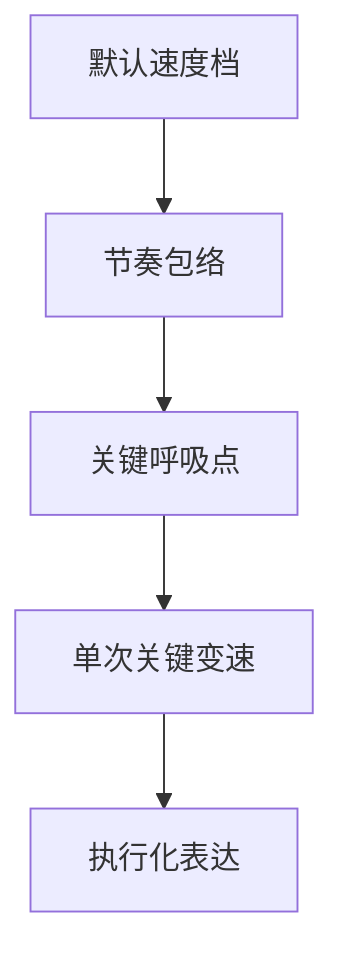

# 速度 模块说明

## 定位

- 本叶子负责把默认运镜路线压成可执行的速度档、变速方式和停顿强度，回答“动多快、在哪停、如何变”。
- 它负责 `镜头速度`，但不替代 `运镜手法` 的运动路径判断；速度只是在既定运动上组织节奏和情绪呼吸。
- 它不负责给整组上统一速度标签，而是负责让节奏服务动作、情绪、揭示时刻和观看压力。

## 共享参考

- 速度判型统一回看 [../references/电影镜头调度-运镜判型.md](../references/电影镜头调度-运镜判型.md)。
- 当前叶子吸收的是其中与节奏包络、停顿、爆发、速度对比、反流相关的知识，而不是重写运动路线本身。

## 使用方法

- 先判断当前镜头或镜间连接更需要快、缓、停、骤变还是渐进，并明确默认速度档。
- 再把速度选择和动作、情绪、留白位置绑定起来，说明为什么这里要加速、减速、停顿或突然爆发。
- 若上游运动提示包含停走配合、揭示瞬间或逼近节奏，只能在默认运镜路线已成立后吸收成速度信号，不得反向改运动路径。
- 速度最好先落成一个“节奏包络”：slow creep、escort pace、pause push、hold then burst、speed contrast、counter-flow。先有包络，再决定是否需要单次关键变速。
- 输出时优先保留能被摄影和剪辑共同想象的节奏信号，并把“默认速度”与“可选挑战变速”分开。

## 具体创作方法

### 常用速度包络

| 包络 | 更像在做什么 | 对应知识点 | 常见误用 |
| --- | --- | --- | --- |
| Slow Creep | 慢逼近、慢压近、慢观察 | `向前运动`、`暂停推进`、`推至特写` | 只写“慢”，不写停住点 |
| Escort Pace | 跟着人或物持续走 | `运动的摄影机`、`演员驱动摄影机`、`短距离运动` | 一路同速，没有呼吸 |
| Hold Then Burst | 先停、再爆、再收 | `发展中的运动`、`误导运动` | 爆发太多，失去对比 |
| Speed Contrast | 用两种运动速度做对比 | `摇摄运动`、`回到主体`、`传达速度` | 对比很多，却没有一个主节拍 |
| Counter-Flow | 人群逆流、方向相反 | `推进对抗流`、`对向滑动` | 只剩形式冲突，没有威胁增量 |
| Pause Push | 动作暂停时镜头继续轻压 | `暂停推进` | 本该静止却硬做“高级感”停推 |

1. 先找“呼吸点”，再谈快慢。
   速度设计最怕抽象。应先找动作顿挫、情绪停留、视线锁定、信息揭晓这几个天然呼吸点，再决定哪里快、哪里慢、哪里停。
2. 先锁“节奏包络”，再锁“单次关键变速”。
   大多数镜头不需要频繁变速。先说清它属于 slow creep、escort pace 还是 hold then burst 等包络，再只保留一次最有收益的加速、减速、停顿或反流。
3. 让速度描述可被执行想象。
   比起“节奏紧张、镜头凌厉”这类空词，更稳的是“前半跟行动作偏紧，揭示瞬间略停，后段再轻推压近”。
4. 速度若开始决定路线，立即回退。
   一旦写成“因为要快，所以改成横移”之类的反推，说明字段越权；这里应只组织节拍，不重做运动路径。

## 思维·执行节点

| 节点 | 思维焦点 | 执行动作 | 产物 |
| --- | --- | --- | --- |
| `SPD-01 节奏基线` | 当前段落更接近逼近、凝视、迟疑还是爆发 | 结合动作强度与情绪压力，先锁默认速度档 | `pace_baseline_note` |
| `SPD-02 包络归类` | 这段更像哪种速度组织 | 在 slow creep、escort pace、pause push、hold then burst、speed contrast、counter-flow 中择一 | `pace_envelope_note` |
| `SPD-03 呼吸点定位` | 哪个瞬间需要停、缓、骤变 | 标出动作落点、视线停驻、揭示点、情绪折返处 | `hold_or_burst_point` |
| `SPD-04 变速裁剪` | 是否真的需要第二层变速 | 只保留最有收益的一次变速，删掉装饰性起伏 | `pace_choice` |
| `SPD-05 执行化表达` | 摄影与剪辑是否能据此想象节奏 | 把速度说明压成能拍、能剪、能感知的简洁语句 | `speed_profile` |

## 延展与变体

- 常见速度组织：
  - 缓进 + 轻停：凝视、压抑、意识逼近。
  - 平稳跟随 + 末端加压：人物行动中的情绪累积。
  - 前紧后停：揭示、确认、反应。
  - 前停后爆：迟疑后的突然决定或冲突爆发。
- 使用边界：
  - 速度升级应主要改“感受强度”，不改“观看主语”。
  - 若速度变化已经让观众注意到技巧本身而非事件本身，就该减法。

## 失真与修正

- 若全程同速，说明节奏没有真正组织起来；回到主动作和揭示点，重新设定呼吸与加速位置。
- 若知道“这里要快/慢/停”，却说不清属于哪种节奏包络，说明速度知识还停留在形容词层；先回到包络归类。
- 若骤变很多却没有情绪理由，说明速度设计过度炫技；删掉次级变速，只保留最能服务主情绪的一次。
- 若停顿破坏主动作线，删掉次级留白，保主呼吸点。
- 若速度开始替代运镜路线本身，说明字段越权；把“怎么动”退回 `变化`，这里只保留“动多快 / 如何变速”。
- 若挑战变速比默认路线更强但清晰度下降，默认保留默认速度，只记录比较结论。
