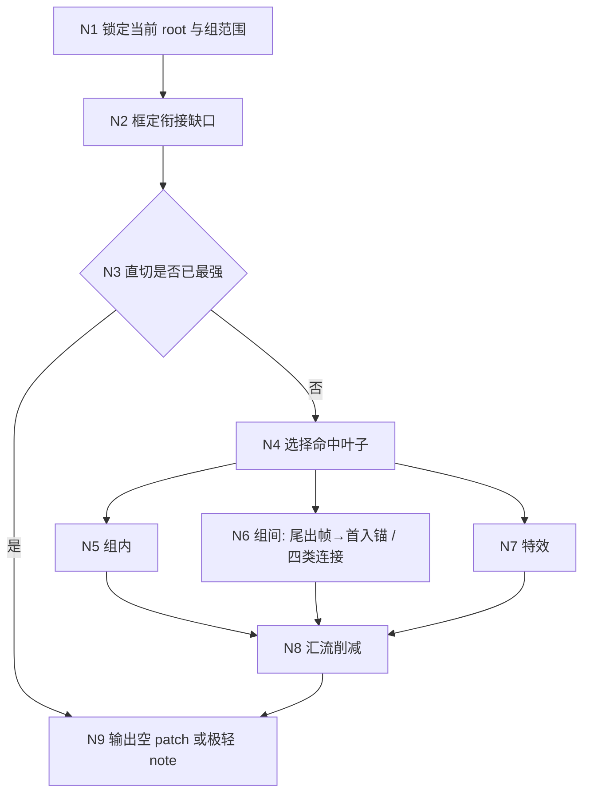
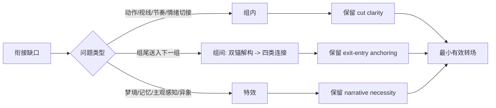
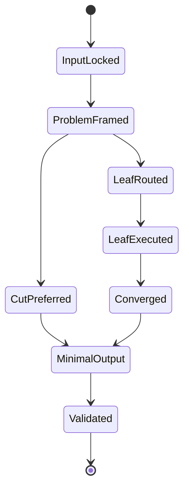

# 3-Detail / 2-镜花 / 4-转场特效

## Context Loading Contract

- 每次调用本技能时，必须同时加载同目录 `CONTEXT.md`。
- 必须回读父层 `2-镜花/SKILL.md`、`3-Detail/SKILL.md` 与 `3-Detail/_shared/branch-output-contract.md`。
- 必须同时回读同目录 `module-spec.yaml`、`module-guide.md`，以及 `组内/组间/特效` 三个叶子模块目录。

## Scope

- 只负责 `分镜明细[].转场特效`。
- 输出 `projects/aigc/<项目名>/3-Detail/镜花/转场特效/第N集.branch-patch.json`。
- 默认优先直切或极轻 handoff，不得为了“进入转场分支”而强行发明效果。

## Parent Positioning

- 本分支位于 `1-分镜构图 -> 2-摄影美学 -> 3-运镜手法 -> 4-转场特效` 的最后一序号。
- 输入必须建立在当前 root 已有的 `分镜构图 / 摄影美学 / 运镜手法` 之上，只做镜间衔接与必要特效判断。
- 本分支拥有“是否需要补”的裁决权，不拥有改写镜数、事实链、角色主戏、动作主轴或摄影骨架的权限。

## Canonical Sources

- `.agents/skills/aigc/3-Detail/2-镜花/SKILL.md`
- `.agents/skills/aigc/3-Detail/SKILL.md`
- `.agents/skills/aigc/3-Detail/_shared/branch-output-contract.md`
- `.agents/skills/aigc/3-Detail/2-镜花/4-转场特效/module-spec.yaml`
- `.agents/skills/aigc/3-Detail/2-镜花/4-转场特效/module-guide.md`
- `.agents/skills/aigc/3-Detail/2-镜花/4-转场特效/组内/module-spec.yaml`
- `.agents/skills/aigc/3-Detail/2-镜花/4-转场特效/组间/module-spec.yaml`
- `.agents/skills/aigc/3-Detail/2-镜花/4-转场特效/特效/module-spec.yaml`
- `.agents/skills/aigc/3-Detail/scripts/validate_branch_process_sidecar.py`

## Skeleton-First Reference Contract

- 本 `SKILL.md` 只负责 branch 入口门、思维·执行骨架、失败回路与交付门禁。
- `module-spec.yaml + module-guide.md` 是细则真源，负责“先判衔接问题 -> 再比直切 -> 再分派叶子 -> 最后削减”的详细创作法。
- `组内 / 组间 / 特效` 叶子模块只定义各自命中条件、必答问题与局部 patch 槽位，不得越权反写父层骨架。
- 若主文档与细则层发生冲突，优先级固定为：用户显式请求 > 根 `AGENTS.md` > 父级 `SKILL.md` > 本 `SKILL.md` > `module-spec.yaml` > `module-guide.md` > `CONTEXT.md`。

## Business Requirement Analysis Contract

本分支的复杂度不来自“效果名库存”，而来自以下四个判断门：

1. 当前组真正的衔接缺口是什么：时间、空间、情绪，还是感知层切换。
2. 保持直切、普通收尾或极轻 handoff 是否已经最强。
3. 问题应落在 `组内 / 组间 / 特效` 哪一层，而不是三个叶子同时开火。
4. 最终输出是否仍然是“最小有效转场”，而不是喧宾夺主的风格表演。

必须先回答：

- 当前组哪里不顺，具体硌住观众的切点是什么。
- 若完全不用显式转场，这里是否反而更干净、更狠或更清楚。
- 当前需要解决的是组内连续性、组界送入，还是普通画面手段无法承接的感知异常。
- 如果删掉特效或显式转场，观众到底会损失什么。
- 若命中 `组间`，当前组 `尾出帧 -> 首入锚` 的主导 delta 是什么，以及为什么要用依赖型 / 流动型 / 变形型 / 复合型中的这一类。
- 若命中 `组间`，是否存在需要显式说明的透视适应；若没有，是否能明确证明“保持一致”。

## Input Contract

### 必需输入

- 当前回读的 `projects/aigc/<项目名>/3-Detail/第N集.json`
- 已写回当前 root 的 `分镜构图 / 摄影美学 / 运镜手法`
- 当前 group scope 内的 `剧本正文`、`分镜切换` 与既有 factual 前置
- 本分支已有 side input，仅作为参考，不得覆盖 shared root

### 硬规则

1. 每次进入当前 group 前，必须重新读取当前 root，而不是沿用上一 branch 的旧快照。
2. 必须先做“衔接问题框定 + 直切优先”两道门，之后才允许命中叶子模块。
3. `组内 -> 组间 -> 特效` 是唯一允许的叶子汇流顺序；未命中的叶子不参与 patch 聚合。
4. `特效` 默认不进入，只有普通画面与保守转场都不够时才允许进入。

## Output Contract

### branch process sidecar

- 路径：`projects/aigc/<项目名>/3-Detail/镜花/转场特效/第N集.branch-patch.json`
- `target_json_paths[]` 只允许：
  - `final_output.main_content.分镜组列表[].分镜明细[].转场特效`

### `thinking_process` 最低要求

- `context_anchor`
- `creative_thesis`
- `execution_steps`
- `self_check`

### `patch_payload` 最低要求

- 面向 shared root 的 canonical 字段仍是 `分镜明细[].转场特效`。
- 分支内部工作槽位遵循 `module-spec.yaml`：
  - `transition_problem_frame`
  - `cut_priority_decision`
  - `transition_fx_patch.intra_group_transition`
  - `transition_fx_patch.inter_group_hook`
  - `transition_fx_patch.fx_decision`
- 当直切已最强时，允许输出空 patch 或极轻 `直切最佳` note；但必须在 `thinking_process` 或 `cut_priority_decision` 中留下可复核理由。

## Thinking-Action Skeleton

## Thinking-Action Nodes

| node_id | objective | inputs | actions | evidence | route_out | gate |
| --- | --- | --- | --- | --- | --- | --- |
| `N1-INPUT-LOCK` | 锁定当前 root、当前组边界与上游已写回字段 | 当前 `第N集.json`、`分镜构图 / 摄影美学 / 运镜手法`、group scope | 回读当前 root，确认本轮只处理 `转场特效` | `context_anchor` | -> `N2` | 输入存在且未越权 |
| `N2-PROBLEM-FRAME` | 用一句话框定真正的衔接缺口 | N1 锁定上下文 | 判定问题属于时间/空间/情绪/感知哪类 | `transition_problem_frame` | -> `N3` | 不能直接先想效果名 |
| `N3-CUT-FIRST-GATE` | 比较直切、普通收尾与显式转场收益 | `transition_problem_frame` | 写 `cut_priority_decision`，先测试“不补是否更强” | `cut_priority_decision` | 直切最强 -> `N9`；否则 -> `N4` | 没有直切比较不得继续 |
| `N4-LEAF-ROUTER` | 只选择必要叶子 | `cut_priority_decision`、叶子模块触发条件 | 在 `组内 / 组间 / 特效` 中做最小命中集路由 | `execution_steps` 路由说明 | -> `N5/N6/N7` | 不得三个叶子无差别全开 |
| `N5-INTRA-GROUP` | 解决组内相邻分镜切接 | `组内/module-spec.yaml` | 生成 `intra_group_transition` | 局部 patch | -> `N8` | 只解决组内连续性 |
| `N6-INTER-GROUP` | 解决当前组结尾到下一组的送入问题 | `组间/module-spec.yaml`、当前组尾出状态、下一组首入锚 | 锁定 `尾出帧 -> 首入锚` 的主导 delta，在 `依赖型 / 流动型 / 变形型 / 复合型` 中选最轻语法，并补齐必要的透视适应说明，生成 `inter_group_hook` | 局部 patch、`execution_steps` | -> `N8` | 不得发明下一组事实，也不得把四类连接膨胀成完整视频 prompt，且不得越界回填 `connection_optimization` |
| `N7-FX-GATE` | 只在非特效方案不足时补必要特效 | `特效/module-spec.yaml` | 先写“不需要”，只有不足时才进入特效 | `fx_decision` | -> `N8` | 默认答案优先是不需要 |
| `N8-CONVERGE-TRIM` | 汇流并删除过度设计 | 已命中叶子 patch | 只保留最小有效转场，删冗余特效与重复解释 | `self_check` | -> `N9` | 转场不得抢走主戏 |
| `N9-MINIMAL-OUTPUT` | 输出 branch sidecar 与 canonical patch | `thinking_process`、`transition_fx_patch` | 写 sidecar、检查 target path、准备 review trace | `patch_payload`、`review_trace` | done | 可为空 patch，但理由必须可复核 |

## Lite Field Map

| step_id | field_id | node_scope | intent | fail_code | rework_entry |
| --- | --- | --- | --- | --- | --- |
| `S1` | `FIELD-JHT-01` | `N1` | 锁定当前 root 与 branch ownership | `FAIL-JHT-01` | `S1` |
| `S2` | `FIELD-JHT-02` | `N2` | 把衔接问题写成可判断的 `transition_problem_frame` | `FAIL-JHT-02` | `S2` |
| `S3` | `FIELD-JHT-03` | `N3` | 完成 `cut_priority_decision`，先比较直切与显式转场 | `FAIL-JHT-03` | `S3` |
| `S4` | `FIELD-JHT-04` | `N4~N7` | 只命中必要叶子并生成局部 patch | `FAIL-JHT-04` | `S4` |
| `S5` | `FIELD-JHT-05` | `N8` | 汇流削减为最小有效 `transition_fx_patch` | `FAIL-JHT-05` | `S5` |
| `S6` | `FIELD-JHT-06` | `N9` | sidecar 可交付、target path 合法、`thinking_process` 齐备 | `FAIL-JHT-06` | `S6` |

## Root-Cause Execution Contract

出现以下任一情况，必须先修源层，而不是只改局部文案：

- 一上来就写效果名，没有先框定衔接缺口。
- 跳过“直切是否最强”比较，默认一定要补转场。
- `组内 / 组间 / 特效` 三个叶子无差别全开。
- `特效` 被拿来制造风格感，而不是解决真实桥接问题。
- 主 `SKILL.md` 的门禁比 `module-guide.md` 更弱，导致执行入口无法约束细则。

固定上溯链：

`症状 -> 直接技术原因 -> 本 branch SKILL / module-spec / module-guide -> 父层 2-镜花/SKILL.md -> 根 AGENTS.md`

## Completion Gate

1. branch process sidecar 已写回到 `转场特效/第N集.branch-patch.json`。
2. `target_json_paths[]` 只命中 `分镜明细[].转场特效`。
3. `thinking_process.context_anchor / creative_thesis / execution_steps / self_check` 全部存在。
4. 若结论是“直切最佳”或空 patch，理由已明确写入 `cut_priority_decision` 或 `self_check`。
5. 输出未改写 `分镜构图 / 摄影美学 / 运镜手法`，也未发明新的角色、动作或下一组事实。
