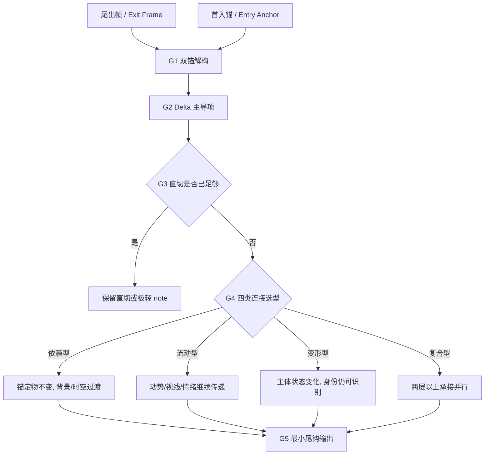
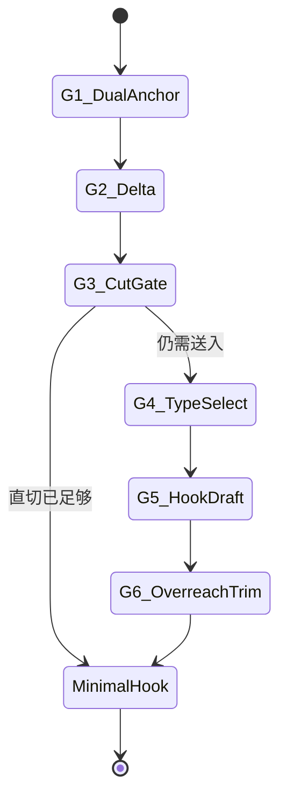

# 组间 模块说明

## 定位

- 本叶子负责为当前组结尾与下一组起势之间预埋组间衔接钩子。
- 它不负责提前写下一组内容，只负责给出尾钩级提示。
- 它处理的是组界的“送入感”，不是下一组事实的预写。
- 它吸收 `7.1.2-跨组过渡视频设计` 的核心理念，但在当前 detail 阶段只保留“尾出帧 -> 首入锚”的设计内核，不产出完整视频提示词。
- `6.2.3-跨组连接优化` 仍是 batch 分析与 `connection_optimization` 双向回填真源；当前叶子只继承其连接类型、尾出帧/首入帧定义与透视适应原则。

## 使用方法

- 先锁定当前组 `尾出帧` 与下一组 `首入锚`，再判断边界要解决的是时间、空间、情绪还是视觉母题承接问题。
- 先做双锚 delta 判断：哪些东西必须连续，哪些东西允许变化。
- 再比较普通收尾或干净直切是否已经足够；若足够，可以不留任何显式尾钩。
- 只有在组界确实需要送入时，再用依赖型 / 流动型 / 变形型 / 复合型其中之一组织尾钩，而不是直接预写下一组。
- 输出时只保留最小但有效的 `outgoing_hook`。

## 双锚四型工作法

- `尾出帧`：当前组最后一个有效出口状态，通常对应本组最后一镜的收束姿态、情绪或视觉母题。
- `首入锚`：下一组最先需要被观众接住的入口锚点。这里不是要求完整写下一组，而是只锁“必须接住什么”。
- 当前叶子吸收 `7.1.2` 的四类连接，但做了 detail 阶段降阶：
  - 不产出全量旅程链文件或 Veo prompt。
  - 不描述完整中间视频，而是提炼为可写入 `inter_group_hook` 的最小送入语法。
  - 不把下一组当成可自由发明的画面空间，只允许锁入口锚点。
- 当前叶子同时回收 `6.2.3` 的三条硬约束：
  - 连接类型必须有明确叙事/视觉依据。
  - 透视适应不能缺席，哪怕结论只是“保持一致”。
  - detail 叶子不负责双向更新前序/后序连接字段。

## 具体创作方法

### 1. 把“结束本组”和“送入下组”分开想

- 先确认本组结尾本身是否已经完整。
- 只有当“本组虽然完整，但切去下一组时会失重”时，才需要尾钩。
- 如果本组尚未站稳，就不要急着为下一组做服务。

### 2. 先锁“尾出什么”与“首入什么”

- 先看当前组最后一镜留下的是什么：
  - 一个稳定物件或视觉母题
  - 一个未尽动作或视线
  - 一个仍在回荡的情绪
  - 一个正在变化中的人物或状态
- 再看下一组最先需要观众接住的是什么：
  - 同一个锚定物
  - 被延续的动势或能量
  - 被认出的同一主体
  - 同时包含两层以上变化
- 这一步只锁入口锚，不替下一组扩写事实。

### 3. 组间真正可处理的只有四类边界问题

#### 时间翻页

- 适用：昼夜切换、时间略过、阶段转换。
- 写法重点：让观众感到“这一页翻过去了”，而不是详细交代下一页发生什么。

#### 空间换挡

- 适用：室内到室外、近身场域到开阔场域、现实场域到主观场域。
- 写法重点：交代离开当前空间的尾音，不抢写下一空间的细节。

#### 情绪残响

- 适用：一句话后的余震、动作后的悬停、冲突后的空白。
- 写法重点：让情绪尾音自然带到下一组，而不是多写下一组情绪。

#### 视觉母题承接

- 适用：光源、雨水、红色、门框、影子、物件等能横跨组界的视觉线索。
- 写法重点：只保留一个母题钩子，不要借母题发明新内容。

### 4. 用四类连接语法组织尾钩

#### 6.2.3 决策顺序对齐

- 若首先命中的是场景切换或时空翻页，先看是否存在跨场景稳定锚点，优先考虑依赖型。
- 若首先命中的是人物/主体状态变化，且环境应保持稳定衬托，优先考虑变形型。
- 若首先命中的是动作、视线、能量或情绪的继续传递，优先考虑流动型。
- 若两条以上条件同时成立，再考虑复合型，但仍应保留主次，不做全量堆叠。

#### 依赖型

- 适用：锚定物保持不变，变化主要发生在背景、时间、空间或氛围。
- 当前模块里的典型写法：
  - 让一个稳定物件、光源、颜色、门框或剪影带着观众离开本组。
  - 只交代锚定物如何维持连续，不交代下一组背景细节。
- 常见风险：把背景变化写成下一组具体画面，越权。

#### 流动型

- 适用：真正需要延续的是动作余势、视线方向、呼吸、声响、情绪压力或能量流。
- 当前模块里的典型写法：
  - 以未尽动作、未落完的视线、未散掉的声音或压强送入下一组。
  - 重点写“继续传递”，不是写“下一组发生了什么”。
- 常见风险：把能量流写成完整动作结果，越权。

#### 变形型

- 适用：主体身份连续，但状态、装束、光感、心理或姿态明显变化。
- 当前模块里的典型写法：
  - 写“变化已经启动”，不写“变化完全完成后的下一组事实”。
  - 保住可识别身份，让观众知道是谁或是什么在变。
- 常见风险：把整个变形过程写满，导致尾钩吞掉主叙事。

#### 复合型

- 适用：既有稳定锚点，又有动势/情绪/状态变化同时存在。
- 当前模块里的典型写法：
  - 只保留一主一辅两层，不要把所有维度都写上。
  - 主层负责送入，辅层负责增压。
- 常见风险：层次过多，写成效果表演。

### 5. 透视适应不是可选项

- `6.2.3` 的关键补充不是“再加一个效果词”，而是要求所有连接都要考虑透视自适应。
- 当前叶子里的透视适应，至少检查四件事：
  - 景别是否变化
  - 锚定物/载体在画面中的占比是否变化
  - 位置是否从边缘/前景/远处迁移
  - 朝向或角度是否需要顺着视角变化微调
- 写法要求：
  - 若变化明显：写清“由小到大 / 由右下到中央 / 由侧向到正向”等趋势。
  - 若基本不变：明确写“透视保持一致”。
- 透视适应服务于“看起来接得上”，不是服务于“写得更花”。

### 6. 尾钩应像“门没关死”，而不是“下一场先写一半”

- 稳妥的尾钩通常只做一件事：
  - 留一个未散尽的动作。
  - 留一个未落完的视线。
  - 留一层未退尽的情绪。
  - 留一个还在回响的视觉母题。
- 它的长度应明显短于当前组主叙述。

## 思维·执行节点

### G1 双锚解构

- 锁当前组 `尾出帧` 与下一组 `首入锚`。
- 只记录可消费的状态差，不记录下一组完整事实。

### G2 Delta 主导项

- 在 `时间 / 空间 / 情绪 / 视觉母题 / 动势 / 状态变化` 中找主导差异。
- 只锁一条主导 delta，必要时再加一条辅因子。
- 同步检查是否存在景别、占比、位置或朝向的透视适应需求。

### G3 直切优先门

- 问：如果直接收掉当前组，这里会不会更干净、更狠或更明确？
- 若是，允许不写 `outgoing_hook`。

### G4 四类连接选型

- 依赖型：锚定物稳定，背景变化。
- 流动型：动势/情绪/视线继续流。
- 变形型：主体状态在边界上开始变化。
- 复合型：两层以内复合承接。

### G5 写最小送入句

- 句子只回答：
  - 观众带着什么离开这一组。
  - 这个东西如何自然把人送向下一组。
  - 连接类型是什么，为什么不是直切。
  - 透视适应是否需要说明，若需要，变化趋势是什么。

### G6 越权回删

- 删掉所有提前揭露下一组事实的成分。
- 保留“送入感”，删除“预写感”。
- 若像完整视频提示词，说明写重了；回收为 detail 阶段尾钩。

## 节点延展

### 可复用的尾钩方向

- 以动作未尽收尾。
- 以情绪余波收尾。
- 以环境声势或空间尾音收尾。
- 以视觉母题残留收尾。

### 适合不写尾钩的情况

- 当前组结尾本来就应干净落地。
- 下一组开场自带强起势，不需要提前托举。
- 任何尾钩都会削弱当前组结尾的力量。
- 尾钩必须靠捏造下一组事实才能成立。

## 失真与修正

- 若没有先锁 `尾出帧 -> 首入锚`，就直接写“如何过渡”，说明双锚解构缺失。
- 若没有补透视适应，或变化明显却写成“默认一致”，说明没有真正对齐 `6.2.3`。
- 若开始写 `前序连接 / 后序连接 / status completed` 一类字段，说明越界到了 `6.2.3` 的 batch 回填职责。
- 若四类连接被直接抄成完整视频提示词，而不是 detail 阶段尾钩，说明方法迁移过度。
- 若还没说明为什么不是普通收尾，就开始提前写下一组起势，说明组间模块写重了。
- 若尾钩吞掉了当前组主线，说明写重了。
- 若为了衔接发明下一组动作或信息，说明越权。
- 若没有真实的组间收益，可以留空，不要硬写。
