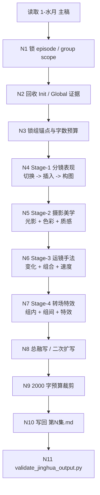
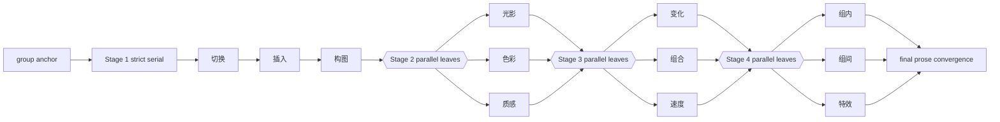
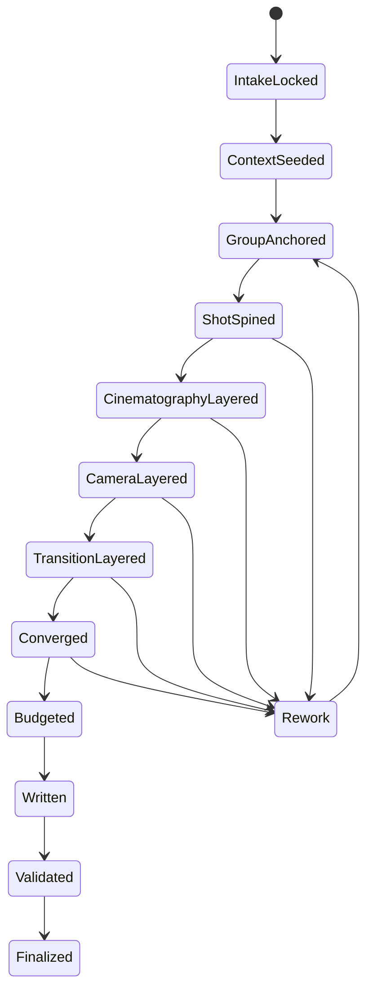
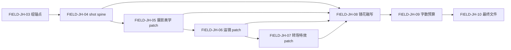

# 3-Detail / 2-镜花

## 概述

`2-镜花` 是 `3-Detail` 下承接 `1-水月` 的 stage-local child skill。

它的任务不是再次做文学扩写，而是把：

- `projects/<项目名>/3-Detail/1-水月/第N集.md` 中已经完成剧本维度优化的 grouped screenplay
- `0-Init` 的项目基线、题材约束、north star 与 preset
- `2-Global` 的 `类型元素 / 全局风格 / 设计元素` 项目级或分组级证据

进一步压成一份以导演调度、摄影执行、运镜组织和转场节奏为主的组级融写稿：

- canonical 输出：`projects/<项目名>/3-Detail/2-镜花/第N集.md`

本技能采用“编号主链串行、链内子维度并发、最终一次性融写”的知行合一网络：

1. `1-分镜表现`
2. `2-摄影美学`
3. `3-运镜手法`
4. `4-转场特效`

硬规则：

- 带序号的顶层模块必须按编号顺序执行，不得跳序。
- `1-分镜表现` 下的 `1-切换 -> 2-插入 -> 3-构图` 也必须严格串行。
- `2-摄影美学 / 3-运镜手法 / 4-转场特效` 的叶子维度可在各自分类内并发思考，但分类汇流仍受顶层顺序约束。
- 所有模块只产出局部导演/摄影 patch，不得长出第二份主稿。
- 所有镜头语言组织都必须建立在 `1-水月` 已写出的动作、情绪、空间、关系和视觉线索之上，不得脱离上游另起一套镜头叙事。
- 每个分镜组最终 `镜花` 正文总字数不得超过 `2000` 字。

## Child-Skill Positioning

### `2-镜花` 拥有

- 在 `1-水月` 基础上完成导演或摄影维度的二次融写
- 先拆出组内分镜头切换、插入点与构图骨架
- 再补光影、色彩、质感、运镜、速度、组合与转场收益
- 把附加上下文真正压入镜头组织、画面策略和文字表达
- 写回 `projects/<项目名>/3-Detail/2-镜花/第N集.md`

### `2-镜花` 不拥有

- 改写 `1-Planning/3-分组` 的组界、组序、组 ID
- 改写 `1-水月` 的主职责边界，把它重新退回纯文学扩写
- 直接维护 `projects/<项目名>/3-Detail/第N集.json`
- 直接生成 `4-Design / 5-Image / 6-Video` 请求
- 为任何叶子子模块输出独立平行成稿

## When to Use

- `projects/<项目名>/3-Detail/1-水月/第N集.md` 已稳定存在
- 需要把 grouped screenplay 进一步整理成带 shot spine 的导演/摄影融写稿
- 需要显式吸收 `0-Init + 2-Global` 的风格与类型证据，但不希望直接落到 shot-level JSON
- 需要给后续 `3-Detail`、`4-Design`、`5-Image`、`6-Video` 提供更强的视觉执行 sidecar

## When Not to Use

- `1-水月/第N集.md` 尚未存在或仍不稳定
- 当前任务要补的是 `3-Detail/第N集.json` 的结构化字段，而不是 grouped prose 融写
- 用户只要求修一句文案，不要求整集导演/摄影维度补全

## Canonical Source Contract (Mandatory)

- 第一输入真源固定为：`projects/<项目名>/3-Detail/1-水月/第N集.md`
- `0-Init` 只提供题材、人物、世界、禁区、north star 与 preset 边界
- `2-Global` 只提供 `类型元素 / 全局风格 / 设计元素` 的项目级或组级附加证据
- `references/` 下所有模块都只负责局部 patch 或 merge 规则
- 节点包分层合同统一回链：`.agents/skills/aigc/3-Detail/references/node-pack-contract.md`
- 最终真源只允许落在：`projects/<项目名>/3-Detail/2-镜花/第N集.md`

硬规则：

1. 不得改组 ID、组序、组边界。
2. 不得把模块名称、判断过程、评分过程直接写进最终正文。
3. 必须先形成 shot spine，再做摄影、运镜、转场补全。
4. 镜头语言只能组织、显化、重排和细化 `1-水月` 已经提供的信息，不得发明上游未给出的关键动作、人物关系转折、空间事实或剧情结果。
5. 组内若无充分依据，只能保守补导演/摄影信息，不得幻想新情节。
5. 每个分镜组最终 `镜花` 正文可包含多个 `[分镜N ...]` 段，但总字数固定 `<= 2000`。

## Business Requirement Analysis Contract (Mandatory)

| analysis_slot | 当前结论 |
| --- | --- |
| `business_goal` | 在 `1-水月` 成稿基础上，为每个分镜组补齐导演调度、摄影执行、运镜和转场设计，使 grouped prose 进入“可拍、可看、可拆镜”的状态 |
| `business_object` | `1-水月/第N集.md`、`north_star.yaml`、`init_handoff.yaml`、`story-source-manifest.yaml`、`2-Global/类型元素/*`、`2-Global/全局风格/全局风格设计.md`、`2-Global/设计元素/设计元素.md` |
| `constraint_profile` | `1-水月` 是主输入；`0-Init + 2-Global` 是附加上下文；顶层编号模块必须串行；叶子模块只产 patch；镜头语言必须有 `1-水月` 证据依托；每组成稿不超过 `2000` 字 |
| `success_criteria` | 每组都有稳定的 shot spine、明确的导演/摄影收益、可感知的风格落点、克制的转场/特效，且所有镜头组织都能回指到 `1-水月` 已给出的信息，并能一次性写入 `2-镜花/第N集.md` |
| `non_goals` | 不写 episode JSON；不把每个叶子模块写成单独主稿；不把文学扩写与导演执行再拆成两轮平行真源 |
| `complexity_source` | 顶层存在严格串行依赖；链内又有可并发叶子；`1-水月` prose 需要二次插入与融写；附加上下文必须被真实消费而不是挂标签 |
| `topology_fit` | 采用“输入锁定 -> 编号主链串行推进 -> 链内并发 patch -> 总融写 -> 预算裁剪 -> 校验写回”的混合思行网络 |
| `step_strategy` | `SKILL.md` 保留骨架、Mermaid、门禁和字段表；具体模块细则下沉到 `references/*.yaml`；模板与 validator 负责落盘稳定性 |

## Context Preload (Mandatory)

固定加载顺序：

1. 根 `AGENTS.md`
2. `.agents/skills/aigc/SKILL.md + CONTEXT.md`
3. `.agents/skills/aigc/3-Detail/SKILL.md + CONTEXT.md`
4. 本 `SKILL.md + CONTEXT.md`
5. `projects/<项目名>/0-Init/north_star.yaml`
6. `projects/<项目名>/0-Init/init_handoff.yaml`
7. `projects/<项目名>/0-Init/story-source-manifest.yaml`（若存在）
8. `projects/<项目名>/3-Detail/1-水月/第N集.md`
9. `projects/<项目名>/1-Planning/3-分组/第N集.md`（仅用于组界复核，若存在）
10. `projects/<项目名>/2-Global/类型元素/全集设计.md`（若存在）
11. `projects/<项目名>/2-Global/类型元素/分组设计.md`（若存在）
12. `projects/<项目名>/2-Global/全局风格/全局风格设计.md`（若存在）
13. `projects/<项目名>/2-Global/设计元素/设计元素.md`（若存在）
14. `references/module-index.md`
15. 先读 `.agents/skills/aigc/3-Detail/references/node-pack-contract.md`
16. 再读 `.agents/skills/aigc/3-Detail/references/creative-guidance-contract.md`
17. `references/route-profile.yaml`
18. 按需读取各分类 `module-spec.yaml` 与命中叶子 `module-spec.yaml`
19. 若需要解释、反例或审美尺度，再读同目录 `module-guide.md`
20. `references/examples.md`
21. `references/creative-review-rubric.md`
22. `templates/episode-jinghua.template.md`

## Watermoon Inheritance Contract (Mandatory)

`2-镜花` 的所有镜头语言组织都必须以 `1-水月` 为第一证据层。

最低要求：

1. 每个分镜组在开始切镜前，先从 `1-水月` 锁定：
   - 主动作
   - 主情绪
   - 主空间关系
   - 主视线或主冲突
2. `0-Init + 2-Global` 只能改变镜头语言的表达方式：
   - 光色倾向
   - 构图偏好
   - 运动节奏
   - 材料与风格温度
3. `0-Init + 2-Global` 不能替代 `1-水月` 发明新的剧情事实。
4. 每组 `锚点` 必须显式写出一条 `水月承接`，概括本组镜头语言究竟承接了 `1-水月` 的哪条信息。

禁止项：

- 仅因风格好看而改动人物行为逻辑
- 仅因运镜炫技而新增上游不存在的动作节点
- 仅因转场需要而创造不存在的时间或空间跳跃
- 仅因摄影气质需要而改写 `1-水月` 已锁定的关系张力

## Visual Maps

## Thinking-Action Network (Mandatory)

| node_id | 对应 Step | 聚焦字段 | objective | actions | evidence | route_out | gate |
| --- | --- | --- | --- | --- | --- | --- | --- |
| `N1-INPUT-LOCK` | `S1` | `FIELD-JH-01` | 锁定唯一 `1-水月` episode 输入与组序 | 读取 `1-水月/第N集.md`，识别组 ID、组标题、组内 prose 与组序 | `input_lock_note` | 成功 -> `N2`；失败 -> 回 `S1` | 无 `1-水月` 主稿不得继续 |
| `N2-CONTEXT-SEED` | `S2` | `FIELD-JH-02` | 提炼 `Init / Global` 中可进入导演/摄影写作的约束 | 抽取题材、风格、设计元素、类型打法、禁区 | `context_seed_note` | 成功 -> `N3`；证据不足 -> 保守继续 | 附加上下文必须可转译为镜头语言 |
| `N3-GROUP-ANCHOR` | `S3` | `FIELD-JH-03` | 为每组提炼导演/摄影锚点与预算 | 锁 `场景 / 冲突 / 情绪 / 视觉任务 / 默认时长 / 水月承接` | `group_anchor_table` | 成功 -> `N4` | 每组都要有主冲突、主视线和明确的 `水月承接` |
| `N4-SHOT-STAGE` | `S4` | `FIELD-JH-04` | 完成 `1-分镜表现` 的严格串行阶段 | 依次执行 `切换 -> 插入 -> 构图`，形成 shot spine | `shot_spine_patch` | 成功 -> `N5`；散乱 -> 回 `S3/S4` | 未形成分镜骨架不得进入后续阶段 |
| `N5-CINEMATOGRAPHY-STAGE` | `S5` | `FIELD-JH-05` | 完成 `2-摄影美学` 的并发分类补全 | 并发思考 `光影 / 色彩 / 质感`，汇成摄影 patch | `cinematography_patch` | 成功 -> `N6` | 摄影信息必须依附 shot spine |
| `N6-CAMERA-STAGE` | `S6` | `FIELD-JH-06` | 完成 `3-运镜手法` 的并发分类补全 | 并发思考 `变化 / 组合 / 速度`，汇成运镜 patch | `camera_patch` | 成功 -> `N7` | 运镜必须有动机，不得空炫技 |
| `N7-TRANSITION-STAGE` | `S7` | `FIELD-JH-07` | 完成 `4-转场特效` 的克制式补全 | 并发思考 `组内 / 组间 / 特效`，只保留有叙事收益项 | `transition_fx_patch` | 成功 -> `N8` | 无收益项允许为空 patch |
| `N8-CONVERGE` | `S8` | `FIELD-JH-08` | 把各阶段 patch 融成组级 `镜花` prose | 只保留最可拍、最可看的导演/摄影收益 | `convergence_note` | 成功 -> `N9`；像拼贴 -> 回 `S4~S7` | 不得保留模块化条目感 |
| `N9-BUDGET` | `S9` | `FIELD-JH-09` | 把每组 `镜花` 正文裁进 `2000` 字预算 | 先删重复修辞，再删次级说明，保留主执行收益 | `budget_report` | 成功 -> `N10`；超限 -> 回 `S8` | 每组 visible chars 必须 <= 2000 |
| `N10-WRITEBACK` | `S10` | `FIELD-JH-10` | 按模板一次性写回整集 markdown | 落盘 `projects/<项目名>/3-Detail/2-镜花/第N集.md` | `writeback_note` | -> `N11` | 只写一个 canonical 文件 |
| `N11-VALIDATE` | `S11` | `FIELD-JH-10` | 校验结构、分镜标记和字数预算 | 执行 `scripts/validate_jinghua_output.py` | `validation_verdict` | pass -> `done`；fail -> 回 `S8/S9/S10` | 通过前不得结案 |

## Canonical Module References

| 模块 | 作用 | 真源文件 |
| --- | --- | --- |
| 模块总索引 | 规定顶层顺序、链内并发规则与 merge ownership | `references/module-index.md` |
| 节点包共享合同 | 规定 `yaml / guide / CONTEXT / validator` 的分层职责 | `.agents/skills/aigc/3-Detail/references/node-pack-contract.md` |
| 创作引导共享合同 | 规定 `route-profile / examples / rubric` 的分层职责 | `.agents/skills/aigc/3-Detail/references/creative-guidance-contract.md` |
| 创作路由 | 规定不同镜花组型该重打哪些阶段和叶子 | `references/route-profile.yaml` |
| 分镜表现总则 | 锁定 shot spine 的串行三步法 | `references/1-分镜表现/module-spec.yaml` |
| 摄影美学总则 | 汇总光影/色彩/质感 | `references/2-摄影美学/module-spec.yaml` |
| 运镜手法总则 | 汇总变化/组合/速度 | `references/3-运镜手法/module-spec.yaml` |
| 转场特效总则 | 汇总组内/组间/特效 | `references/4-转场特效/module-spec.yaml` |
| 节点包结构校验 | 校验 `module-spec.yaml` / `module-guide.md` / child link | `.agents/skills/aigc/3-Detail/scripts/validate_node_packs.py` |
| 创作引导校验 | 校验 `route-profile / examples / rubric` | `.agents/skills/aigc/3-Detail/scripts/validate_creative_guidance.py` |
| 正反例 | 校准什么叫有镜头组织、什么叫空泛炫技 | `references/examples.md` |
| 创作评审 | 评审是否真有导演/摄影收益 | `references/creative-review-rubric.md` |
| 输出模板 | 规定 episode markdown 落盘骨架 | `templates/episode-jinghua.template.md` |
| 输出校验 | 校验组结构、分镜标记和字数预算 | `scripts/validate_jinghua_output.py` |

## Output Contract (Mandatory)

### 输出路径

- `projects/<项目名>/3-Detail/2-镜花/第N集.md`

### 输出格式

- 按 `1-水月` 的分镜组顺序逐组展开
- 每个分镜组保留一个组标题
- 每组至少包含：
  - `锚点`
  - `镜花`
- `锚点` 中必须显式包含 `水月承接`
- `镜花` 必须是中文导演/摄影融写正文
- `镜花` 中必须出现组内分镜标记，例如：`[分镜1 0秒-4秒]`

### 输出质量门槛

1. 组序与 `1-水月` 上游一致。
2. 每组 `锚点` 都明确写出 `水月承接`，说明镜头语言的上游依托。
3. `0-Init + 2-Global` 的上下文以导演/摄影写法真正进入 prose，而不是标签堆积。
4. 每组 `镜花` 正文不超过 `2000` 字。
5. 全文为中文。
6. 成稿读起来像“已插 shot spine 的导演/摄影融写稿”，而不是模块条目拼贴。
7. 任一关键镜头组织都不能脱离 `1-水月` 已给出的动作、情绪或空间事实。

## Field Master

| field_id | 输出位置/字段 | 内容要求 | 默认责任 Step | 质量维度 | 失败码 |
| --- | --- | --- | --- | --- | --- |
| `FIELD-JH-01` | 输入锁定 | `1-水月` 输入、episode scope 与组序唯一 | `S1` | 真源稳定性 | `FAIL-JH-01` |
| `FIELD-JH-02` | 附加上下文种子 | `Init / Global` 被压成导演/摄影约束 | `S2` | 上下文利用率 | `FAIL-JH-02` |
| `FIELD-JH-03` | 组锚点 | 每组都有冲突、情绪、画面任务、默认时长与 `水月承接` | `S3` | 锚点清晰度 | `FAIL-JH-03` |
| `FIELD-JH-04` | shot spine patch | 分镜数、插入点和构图骨架稳定 | `S4` | 分镜组织力 | `FAIL-JH-04` |
| `FIELD-JH-05` | 摄影美学 patch | 光影、色彩、质感服务故事与风格 | `S5` | 摄影可执行性 | `FAIL-JH-05` |
| `FIELD-JH-06` | 运镜 patch | 变化、组合、速度服务情绪与节奏 | `S6` | 运镜动机清晰度 | `FAIL-JH-06` |
| `FIELD-JH-07` | 转场特效 patch | 组内/组间/特效克制且有收益 | `S7` | 转场收益率 | `FAIL-JH-07` |
| `FIELD-JH-08` | 组级镜花 prose | 所有 patch 被融成单一组级正文 | `S8` | 收束能力 | `FAIL-JH-08` |
| `FIELD-JH-09` | 字数预算 | 每组 `镜花` 正文 <= 2000 字 | `S9` | 预算控制 | `FAIL-JH-09` |
| `FIELD-JH-10` | 最终文件 | 文件结构、分镜标记、预算与 validator 全通过 | `S10/S11` | 落盘可消费性 | `FAIL-JH-10` |

## Thought Pass Map

| step_id | 聚焦字段 | 核心问题 | 生成动作 | 未达标信号 |
| --- | --- | --- | --- | --- |
| `S1` | `FIELD-JH-01` | 这轮到底命中哪一集、哪一份 `1-水月` 主稿 | 锁 episode 与组序 | 输入漂移、组序不稳 |
| `S2` | `FIELD-JH-02` | 哪些 `Init / Global` 约束必须进入当前导演/摄影写法 | 提炼镜头语言种子 | 只贴风格标签，没有实际消费 |
| `S3` | `FIELD-JH-03` | 每组最该被导演/摄影放大的主冲突、主视线，以及它到底承接了 `1-水月` 的哪条信息 | 生成组锚点表 | 后续成稿没有主视点，或看不出承接来源 |
| `S4` | `FIELD-JH-04` | 这组要切几镜、何处插入、每镜如何构图 | 形成 shot spine | 仍像整段 prose，无法拆镜 |
| `S5` | `FIELD-JH-05` | 光影/色彩/质感怎样服务组级视觉任务 | 生成摄影 patch | 摄影词漂亮但不可执行 |
| `S6` | `FIELD-JH-06` | 镜头为什么动、怎么组合、以什么速度推进 | 生成运镜 patch | 运镜无动机或节奏失衡 |
| `S7` | `FIELD-JH-07` | 哪些转场/特效真有必要，哪些该压掉 | 生成克制式 patch | 为了花哨而花哨 |
| `S8` | `FIELD-JH-08` | 如何把四阶段收益合成自然的 `镜花` 正文 | 汇成组级融写 | 输出像拼贴，不像成稿 |
| `S9` | `FIELD-JH-09` | 如何在 `2000` 字内保住导演/摄影收益 | 裁剪与去重 | 超字数或只剩空骨架 |
| `S10` | `FIELD-JH-10` | 如何按模板一次性写回 | 落盘 episode markdown | 结构缺组或缺镜花段 |
| `S11` | `FIELD-JH-10` | 文件是否真能交付 | 跑 validator | 未过校验仍宣布完成 |

## Pass Table

| field_id | Pass Standard | Fail Code | Rework Entry |
| --- | --- | --- | --- |
| `FIELD-JH-01` | 只命中一个 `1-水月` 文件且组序稳定 | `FAIL-JH-01` | `S1` |
| `FIELD-JH-02` | `Init / Global` 被转成导演/摄影约束，而不是标签 | `FAIL-JH-02` | `S2` |
| `FIELD-JH-03` | 每组锚点足以支撑 shot spine，且明确写出 `水月承接` | `FAIL-JH-03` | `S3` |
| `FIELD-JH-04` | 每组都有可追踪的分镜标记与构图意图 | `FAIL-JH-04` | `S4` |
| `FIELD-JH-05` | 摄影设计具体、克制、能被执行 | `FAIL-JH-05` | `S5` |
| `FIELD-JH-06` | 运镜设计有动机、有节奏、不乱炫技 | `FAIL-JH-06` | `S6` |
| `FIELD-JH-07` | 转场和特效只有在有收益时才出现 | `FAIL-JH-07` | `S7` |
| `FIELD-JH-08` | 所有 patch 被收束成一段组级导演/摄影 prose | `FAIL-JH-08` | `S8` |
| `FIELD-JH-09` | 每组 `镜花` 正文不超过 `2000` 字 | `FAIL-JH-09` | `S9` |
| `FIELD-JH-10` | 模板结构与 validator 同时通过 | `FAIL-JH-10` | `S10/S11` |

## Root-Cause Execution Contract (Mandatory)

当出现以下症状时，必须先修本 child skill 的源层合同，而不是直接手工改正文：

- 成稿仍像 `1-水月` 的近义重写，没有导演/摄影收益
- 镜头语言脱离了 `1-水月` 的事实基础，开始自说自话
- 分镜标记插入了，但镜头组织仍混乱
- 摄影、运镜、转场都写了，但最终正文像模块拼贴
- `Init / Global` 证据只写成标签，没有进入镜头语法
- `0-Init / 2-Global` 压过了 `1-水月`，反客为主改写了上游事实
- 单个分镜组反复超出 `2000` 字
- 转场或特效开始喧宾夺主

强制上溯链：

`Symptom -> Direct Technical Cause -> Rule Source -> Meta Rule Source -> Fix Landing Points`

推荐排查落点：

- `Rule Source`
  - 本 `SKILL.md`
  - `references/module-index.md`
  - 各分类与叶子 `module-spec.yaml`
  - `templates/episode-jinghua.template.md`
  - `scripts/validate_jinghua_output.py`
- `Meta Rule Source`
  - 根 `AGENTS.md`
  - `.agents/skills/aigc/3-Detail/SKILL.md`
  - `/Users/vincentlee/.codex/skills/meta/构建/技能/skill-知行合一/SKILL.md`
