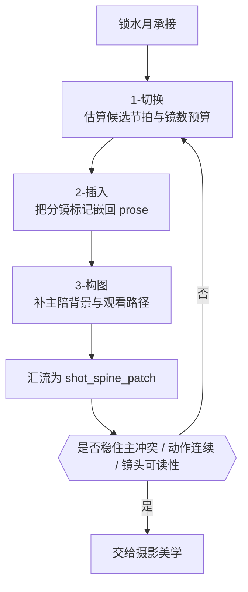

# 1-分镜表现 模块说明

## 定位

- 本分支负责先形成稳定的 `shot_spine_patch`，锁定切镜数、插入点和构图骨架。
- 它是 `2-镜花` 的第一阶段，拥有分镜骨架判断权，不拥有摄影、运镜和转场主导权。
- 它要回答的不是“这一组写得美不美”，而是“这一组先怎样切、怎样落、怎样看，后面三阶段才接得稳”。
- 它的最小真相不是单镜头灵感，而是组级 shot spine。只有先把组内镜头脊柱锁住，后续模块的光色、运动和转场才不会漂。

## 思维·执行主链

这条主链的关键不是“按顺序把三个叶子跑完”，而是每一步都要为下一步留下稳定抓手：

- `切换` 先给出镜数预算和秒位窗口，让插入不至于乱埋标记。
- `插入` 先把镜头落回 prose 的节奏节点，让构图不是悬空写画面。
- `构图` 再把每镜真正变成可看、可读、可继续叠加摄影与运镜的画面骨架。

## 分镜表现维度总则

这一级现在不再只回答“切几镜、插哪儿、怎么构图”，还必须同时回答三类组级问题：

- 结构化密度预算
  先形成 `candidate beat -> pace_tier -> recommended baseline -> headroom -> preferred/budget range`，而不是凭感觉估一个镜数。
- 景别与视点节奏
  先预判这组更适合哪种 `景别节奏模板`、哪种 `POV 策略`，以及它们如何服务 `叙事内核 / Current Mission / 情绪引导`。
- 镜头描述子槽锁定
  至少锁 `景别 / 镜头属性 / 镜头框架 / 镜头类型 / 镜头视角` 五个槽位，避免后续模块重新猜镜头任务。

换句话说，`1-分镜表现` 的完成标准不再只是“有 shot 数和分镜标记”，而是：

- 预算区间可解释
- 命中窗口的景别曲线可解释
- POV 立场可解释
- 每镜 descriptor 可解释
- 这些解释都仍然回指 `1-水月`

## 具体创作方法

### 1. 先锁一条可执行的 `水月承接`

在碰镜头数量之前，先从 `1-水月` 回收四件事：

- 这组的主动作是什么
- 这组的主情绪波动在哪里
- 这组的主空间关系怎样变化
- 这组的主视线或主冲突由谁承担

若这四件事说不清，就还不能切镜。`1-分镜表现` 不是把 prose 打碎，而是把 `1-水月` 的事实层压成“观众应该先看到什么、再看到什么、最后停在哪里”的观看顺序。

推荐写法：

- 用一句话先写 `水月承接`，格式类似：`承接人物A逼近人物B的动作压迫，并显化人物B从回避到对视的情绪转折。`
- 这句话必须能同时约束镜头数、插入点和构图取向，而不是只写审美气质。

### 2. 用 `切换` 先定镜头预算，不急着定唯一镜数

切镜的第一原则不是“切得越细越高级”，而是“用最少的镜头把这组最关键的动作、情绪和视线变化显出来”。

具体判断顺序：

1. 先列 `候选节拍`
   把当前组拆成若干可能需要镜头切换的节拍，优先看：
   - 动作阶段点
   - 台词气口点
   - 焦点切换点
   - 结构转折点
2. 再给 `镜数预算区间`
   先写 `preferred_shot_count`，再写 `floor / ceiling`，明确：
   - 为什么不是更少
   - 为什么不是更多
3. 最后给 `秒位窗口`
   只给大致窗口，不把每秒写死，让后续 prose 插入还有自然呼吸。

经验尺度：

- 若主收益是动作推进，镜数通常服务“起势 -> 命中 -> 反应”。
- 若主收益是关系博弈，镜数通常服务“压迫方 -> 被压迫方 -> 关系反转或悬停”。
- 若主收益是空间揭示，镜数通常服务“空间建立 -> 主体进入 -> 关键局部显化”。

### 3. 用 `插入` 把镜头标记埋回 prose，而不是把 prose 拆成清单

`2-插入` 的职责不是生成镜头列表，而是让 `[分镜N 第X秒-第Y秒]` 成为正文节奏的一部分。

最稳的插入点通常有三类：

- 动作拐点：角色发力、停顿、转身、接触、松手
- 视线切点：谁看谁、谁被看、谁意识到什么
- 节奏停顿：句子落点、呼吸停顿、心理卡顿

插入原则：

- 标记应挂在“镜头真正开始承担叙事任务”的位置，而不是平均分句。
- 必要时可以轻改 prose 句法，但不能改事实含义。
- 若一个标记插进去后整句失去动作连续性，说明不是 prose 需要改，而是上游 `切换` 预算有问题。

### 4. 用 `构图` 把每镜补成真正可看的画面骨架

`3-构图` 的目标不是给每镜贴美学形容词，而是回答这镜为什么值得存在、观众会先看哪里、再看哪里。

每镜至少要补齐：

- `主 / 陪 / 背景`
- `画面重心与负空间`
- `构图方式`
- `焦点与观看路径`
- `镜头描述子槽`
- `空间锚点`

推荐顺序：

1. 先锁主体和陪体
2. 再决定背景承担信息还是压力
3. 再选构图方式
4. 再写观众视线如何进入、停留和转移
5. 最后校验与景别、视角、镜头框架是否一致

若只写“压迫感强”“电影感好”，说明还没进入构图层，只停在审美口号层。

### 5. 最后把三叶子收束成一个组级 `shot_spine_patch`

汇流时不要把三个叶子的原话机械拼接，而要检查四件事：

- 镜头数是否仍服务主冲突节拍
- prose 中的分镜标记是否读得顺
- 每镜构图是否真能支撑后续摄影与运镜
- 全组是否保住了 `1-水月` 的动作连续、情绪连续和空间连续

若其中一项失稳，优先回退顺序固定为：

1. 先回 `切换`
2. 再回 `插入`
3. 最后才重写 `构图`

不要倒着修。大多数“构图写着写着散掉”的问题，其实根子在镜数预算或插入点判断。

## 思行节点

| node_id | objective | 要回答的问题 | actions | 输出给下游的抓手 | gate |
| --- | --- | --- | --- | --- | --- |
| `SHOT-N1-ANCHOR` | 锁定 `水月承接` | 这组究竟承接了哪条动作、情绪、空间、关系信息 | 回看 `1-水月`，提炼一句组级锚点，标出主动作和主视线 | `watermoon_inheritance` | 若不能用一句话概括本组承接内容，不得继续 |
| `SHOT-N2-SWITCH` | 形成镜数预算 | 为什么是这些镜，而不是更多或更少 | 列候选节拍，写 `preferred / floor / ceiling` 与秒位窗口 | `shot_count_plan` | 若说不清 `why_not_fewer / why_not_more`，需回退 |
| `SHOT-N3-INSERT` | 形成 prose 标记骨架 | 每镜在 prose 哪个位置进入最自然 | 把 `[分镜N ...]` 埋入动作、视线、停顿节点，必要时轻改句法 | `shot_marker_spine` | 若标记一插就生硬，回退 `SHOT-N2` |
| `SHOT-N4-COMPOSE` | 形成画面组织骨架 | 观众先看什么，再看什么，最后停在哪 | 为每镜补主陪背景、构图方式、观看路径、descriptor 和空间锚点 | `composition_skeleton` | 若构图开始发明新空间或新关系，立刻回退 |
| `SHOT-N5-RHYTHM-POV` | 锁定组级节奏与视点 | 这组镜头窗口更适合哪种景别曲线与 POV 立场 | 汇总 `shot_size_rhythm_preview + pov_strategy_preview + shot_descriptor_lock` | `focus_spatial_logic` | 若景别曲线、POV 或 descriptor 仍说不清，不得汇流 |
| `SHOT-N6-CONVERGE` | 收束组级 shot spine | 三叶子是否已形成统一脊柱 | 检查主冲突、动作连续、镜头可读性、心理距离与 descriptor 一致性，并压成单一 patch | `shot_spine_patch` | 未形成统一脊柱前不得进入摄影美学 |

## 延展判型

不同组型，`1-分镜表现` 的重心不同，但顺序不变，仍然是 `切换 -> 插入 -> 构图`。

| 组型 | 切换倾向 | 插入策略 | 构图重点 |
| --- | --- | --- | --- |
| 动作推进组 | 优先围绕动作阶段点切镜，避免被连续动作切碎 | 标记优先插在发力、命中、反应、停手等节点 | 强调方向、冲击线、遮挡与空间深度，保证动势连贯 |
| 对话博弈组 | 优先围绕话语主导权和视线转移切镜 | 标记优先落在抢话、停顿、被刺中或反击处 | 强调主陪互换、视线牵引、前后景压迫和心理距离 |
| 情绪停滞组 | 镜数宁少不宁多，让停顿有重量 | 标记优先插在呼吸、迟疑、细部动作和意识转折点 | 强调负空间、静止张力、局部细节与观看滞留 |
| 空间揭示组 | 先给建立镜，再决定是否切入局部 | 标记优先落在空间关系真正改变的地方 | 强调空间锚点、入口出口、层次关系和人物在场方式 |
| 信息揭示组 | 镜数服务“先藏后露”，避免一开始就看全 | 标记优先插在注意力被重定向的瞬间 | 强调第一焦点与第二焦点的先后顺序，避免泄露过早 |

## 汇流检查

- 读完整组后，能否一眼看出镜头顺序，而不需要额外列表解释。
- 每个 `[分镜N ...]` 是否都承担独立的观看任务，而不是机械切句。
- 构图骨架是否能自然承接后续 `光影 / 色彩 / 质感 / 运镜 / 转场`，而不是需要后续模块反向救场。
- 这组的 `preferred_shot_count + budget range` 是否真能由候选节拍、pace tier 和 headroom 解释。
- 命中镜头窗口的景别曲线、POV 立场和五个 descriptor 槽位是否已经锁住，而不是留给后续模块临场重判。
- 是否仍能明确回指 `1-水月` 的原始动作、情绪、空间与关系信息。
- 若删掉任何一镜，这组的主冲突、主情绪或主空间是否会变弱；如果不会，说明镜数偏多。

## 失真与修正

- 若还没形成 `watermoon_inheritance` 就开始写摄影词，说明越序了。
- 若把对白句数、动作个数直接折成镜数，说明把“候选节拍”误用成了机械计数器。
- 若插入点一多 prose 立刻变碎，先回退到 `切换` 重估镜数预算，而不是继续润句。
- 若构图开始发明新关系或新空间，说明脱离了 `1-水月` 的事实层。
- 若一镜承担两个以上互相打架的观看任务，说明镜头职责没有切开，应回到 `切换` 重分。
- 若全组每镜都合理，但串起来没有主节拍，说明缺的是组级汇流，而不是单镜细节。
- 若 shot spine 一形成就几乎写满摄影、运镜和转场术语，说明 branch guide 越权了；`1-分镜表现` 只负责让后续模块“有骨可附”。
