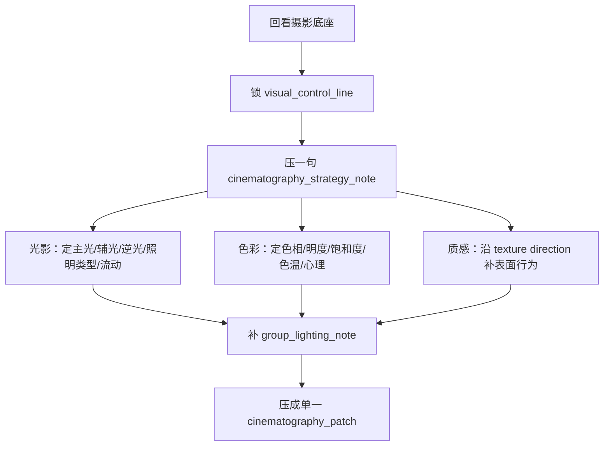

# 2-摄影美学 模块说明

## 定位

- 本分支负责在已稳定的 `shot_spine_patch` 上补光影、色彩和质感，形成组级 `cinematography_patch`。
- 它拥有画面执行气候的判断权，但不拥有反向改写分镜骨架、动作事实或组内叙事顺序的权利。
- 它不是把 `光影 / 色彩 / 质感` 三叶子平铺展开，而是先把上游摄影承诺压成当前组可执行的 `visual_control_line + cinematography_strategy_note`，再让叶子模块消费同一条控制线。

## 具体创作方法

1. 先回看上游摄影底座。
   要先确认这组必须继承的项目级摄影承诺、风格走廊、导演情绪目标和禁区，避免叶子模块各自发明审美。
2. 再锁 `visual_control_line`。
   先明确本组的主体控制、空间剥离、质感方向和观看压力，回答“观众此刻最该先看到什么、再感到什么、最后被什么表面行为留下”。
3. 再写一句 `cinematography_strategy_note`。
   用一句话压清这组摄影执行优先级，并明确哪些判断必须稳定贯穿后续光位与色彩分支，例如“先保压迫式侧逆光与窄景深主体压束，再用低饱和冷暖对照把关系变冷，质感只保留潮湿墙面和金属反光”。
4. 然后分发到 `光影 -> 色彩 -> 质感`。
   `光影` 负责把控制线落成主光源 / 辅助光 / 逆光 / 照明类型 / 组内光影流动，`色彩` 负责把控制线落成色相 / 明度 / 饱和度 / 色温 / 色彩心理，`质感` 只沿已锁定的质感方向补可见表面行为；三叶子都不能各自另起一套表现目标。
5. 叶子完成后，先补 `group_lighting_note`。
   要说明组内镜头怎样共享同一套光影推进语法，例如“由半遮蔽到完全暴露”“由平光到硬侧光”“由局部冷斑到整体失温”。
6. 最后由总协调压成单一 `cinematography_patch`。
   产物要像一份摄影执行判断，而不是 `lighting/color/texture` 三段并列摘要。

## 思维·执行网络

## 思维·执行节点

| node_id | objective | thinking_focus | execution_action | output |
| --- | --- | --- | --- | --- |
| `CG-N1-BASELINE` | 回收上游摄影底座 | 这组必须继承什么、禁止什么 | 回看 `Init / Global` 的风格与设计证据，圈出本组有效约束 | `cinematography_brief` |
| `CG-N2-CONTROL-LINE` | 锁视觉控制线 | 主体如何被看见，空间如何被剥离，质感要往哪个方向收 | 回答主体控制、空间前后层、观看压力和质感方向 | `visual_control_line` |
| `CG-N3-STRATEGY` | 收束摄影执行策略 | 哪些判断必须稳定贯穿后续光位与色彩分支 | 写一句 `cinematography_strategy_note`，同步记录必须稳定的判断与被放弃的备选方向 | `cinematography_strategy_note` |
| `CG-N4-LIGHTING` | 确定光影方案 | 冲突靠什么光关系显化，光位怎样继承控制线 | 进入 `光影` 叶子，产出主光源、辅助光、逆光、照明类型和光影流动 | `lighting_strategy` |
| `CG-N5-COLOR` | 确定色彩策略 | 情绪靠什么色相、明度、饱和度、色温和色彩心理成立 | 进入 `色彩` 叶子，产出可执行色板关系 | `color_strategy` |
| `CG-N6-TEXTURE` | 校准质感表现 | 哪种表面行为最该补，哪些材料必须收住 | 进入 `质感` 叶子，沿已锁定方向补材料焦点与表面行为 | `texture_strategy` |
| `CG-N7-CONVERGE` | 汇成组级摄影判断 | 三叶子怎样服务同一观看收益并保持单一下游入口 | 先补 `group_lighting_note`，再压成一段统一、可执行、可下游消费的摄影判断 | `cinematography_patch` |

## 延展问法

### 前奏层

- 这组画面最先要让观众感到的是压迫、亲密、疏离、暴露，还是危险？
- 如果只能保留一项摄影收益，它应该是光影控制、色彩情绪，还是材料触感？
- 哪些上游承诺是必须继承的，哪些只是可参考而不必硬写？
- 哪个判断一旦在前奏层没锁死，后续光位和色彩就会各自跑偏？

### 光影层

- 主光从哪里来才最不违和，同时最能显化当前冲突？
- 辅助光和逆光是在“帮主体显形”，还是在“增加观看压力”？
- 阴影应该遮住什么，显出什么，才不会压没动作信息？

### 色彩层

- 哪一类色相是主导，哪一类只能做点状提示？
- 明度和饱和度是要压低以保克制，还是抬高一点形成情绪尖点？
- 这组更适合用整体色温统一，还是用局部冷暖对照制造关系裂缝？
- 色彩心理究竟要让观众感到疏离、压迫、迟疑，还是短暂放松？

### 质感层

- 观众最先“摸到”的材料是什么，是潮、冷、糙、旧，还是反光过强？
- 这些表面行为是在帮空间说话，还是在抢人物注意力？
- 有哪些材料线索应该收掉，避免画面信息面过满？

### 汇流层

- 三叶子共同服务的那一条观看收益，能不能用一句摄影判断说清？
- 如果删掉其中一叶子，哪一叶最不能删，为什么？
- 当前组的摄影推进，在组内镜头顺序上有没有“由弱到强”或“由藏到露”的流动？

## 汇流写法

- 推荐把最终 `cinematography_patch` 压成 2 到 4 句：
  - 第 1 句写组级摄影气候、视觉控制线和主收益。
  - 第 2 句写光影如何组织主体与空间，并交代组内光影流动。
  - 第 3 句写色彩和质感怎样补情绪、压力与材料感。
  - 第 4 句可选，只在确有必要时交代组内推进逻辑。
- 若某叶子价值不高，可以在汇流时折叠为短语，不必三者平均分配篇幅。
- 最终语言要让摄影、美术、调色都能接得住，而不是只对“审美感受”负责。

## 失真与修正

- 若一上来就直奔叶子模块，说明跳过了摄影底座回看和视觉控制线收束。
- 若 `visual_control_line` 只写了情绪，没有主体控制、空间剥离、质感方向和观看压力，说明中层控制线仍不完整。
- 若只剩漂亮形容词，说明没有回到具体光位、色温、明度、表面行为或材料线索。
- 若每镜都有布光描述但组内没有统一推进，说明缺失 `group_lighting_note`。
- 若三叶子各自精彩，但汇流后没有单一摄影主收益，说明缺失 `cinematography_strategy_note`。
- 若为了摄影气质改动了分镜数、插入点或镜序，说明越权。
- 若风格很好看但故事收益不清，先保留镜头可读性和上游摄影承诺，再谈审美强化。
