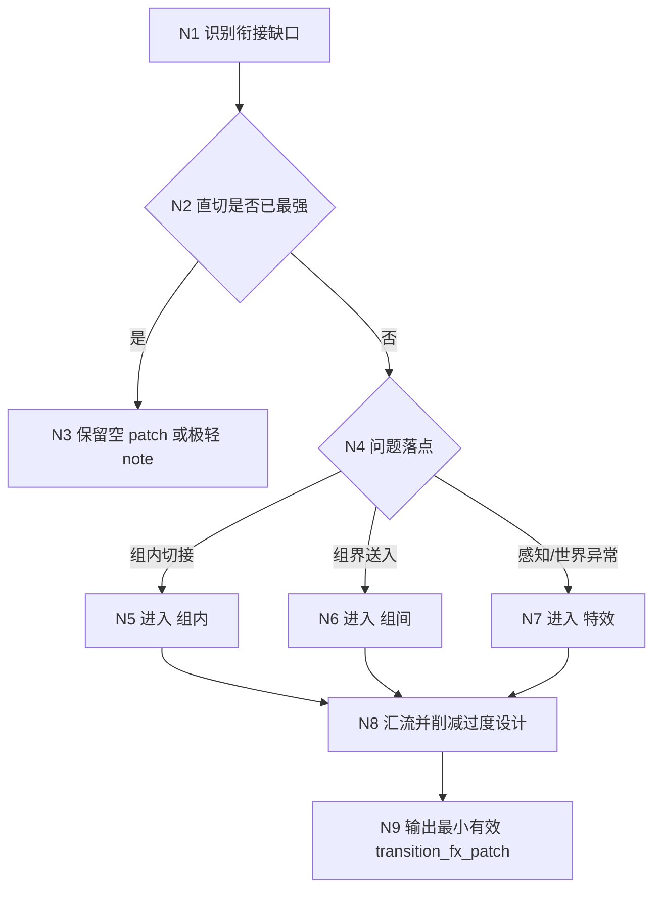

# 4-转场特效 模块说明

## 定位

- 本分支负责在人物、画面和运镜都已成立后，克制式补充组内、组间转场和必要特效。
- 它是最后阶段，拥有“要不要补”而不是“必须补”的判断权。
- 它的内部顺序不是直接想效果，而是先判衔接问题，再比直切是否更强，最后才决定是否命中 `组内 / 组间 / 特效`。

## 使用方法

- 先回答当前组真正要解决的是时间、空间、情绪还是感知层衔接问题。
- 再比较保持直切、保守收尾与显式转场的收益；若直切已经最强，可以只留空 patch 或极轻的 note。
- 只有在直切不足时，再决定命中哪些叶子：
  - `组内` 负责相邻分镜切接是否需要被显化。
  - `组间` 负责当前组结尾怎样把观众送入下一组。
  - `特效` 只处理普通画面手段和保守转场都不够的场景。
- 汇流时优先保留叙事收益和情绪连续性，默认克制。
- 无收益时允许空 patch，不必为完整性硬写特效。

## 具体创作方法

### 1. 先抓“衔接缺口”，不要先抓“效果名”

- 先用一句话说清当前组哪里不顺：
  - 是时间翻页太硬。
  - 是空间跳位太突兀。
  - 是情绪断档太猛。
  - 是主观感知切换太生硬。
- 这一步的目标不是发明术语，而是找到“观众在哪一刀会被硌住”。
- 若说不出具体缺口，通常说明这里不需要额外转场。

### 2. 用“直切优先”做第一轮淘汰

- 先假设完全不用转场，只保留干净切换或普通收尾。
- 再追问三件事：
  - 直切会不会更干脆、更狠、更有力。
  - 直切会不会让信息更清楚，而不是更乱。
  - 直切是否已经足够承接上一阶段建立的动作、情绪和摄影节奏。
- 只要这三问里大部分答案是“会”，就不要强加显式转场。

### 3. 再决定问题属于哪一层

- 若问题发生在同组相邻分镜之间，优先去 `组内`。
- 若问题发生在本组尾部与下一组起势之间，优先去 `组间`。
- 若问题本质上不是剪辑连接，而是梦境、记忆、异象、主观感知无法靠普通画面完成，才考虑 `特效`。
- 一个问题可以同时触发多个叶子，但顺序不变：先保剪辑逻辑，再谈感知强化。

### 4. 写“收益”而不是写“花样”

- 每个转场或特效都应回答：它到底帮观众更顺地理解了什么。
- 推荐落笔方式：
  - 先写承接对象：动作、视线、情绪、时间、空间、母题。
  - 再写连接结果：更顺、更稳、更自然、更有送入感。
  - 最后才写是否需要显化提示。
- 若一段描述只有“慢慢叠化、漂亮闪白、梦幻过渡”之类效果词，没有承接对象和收益，基本都该删。

### 5. 强度永远取最小必要值

- 同一个问题，优先选最轻的解决方式：
  - 直切
  - 轻微 handoff
  - 显式组内转场
  - 尾钩级组间送入
  - 必要特效
- 不要因为进入 `4-转场特效`，就默认必须落到最后两档。

## 思维·执行节点

### N1 识别衔接缺口

- 输入：当前组 prose、`shot_spine_patch`、上一阶段已有摄影与运镜判断。
- 动作：只找真正不顺的切点，不做花样脑暴。
- 产物：一句问题框定，例如“从压抑静止切到高速反应时情绪跳断”。

### N2 直切优先判断

- 输入：N1 的问题框定。
- 动作：先测试直切、普通收尾、无特效是否已经成立。
- 产物：`cut_priority_decision`，说明为什么直切够或不够。

### N3 空 patch / 轻 note 收束

- 适用：直切已经最好，或所有显式处理都会比问题本身更抢戏。
- 产物：空 patch，或只留一句克制提示。

### N4 问题落点分派

- 输入：仍需处理的衔接缺口。
- 动作：把问题明确分给 `组内 / 组间 / 特效`，避免所有叶子一起乱写。
- 产物：叶子命中决定。

### N5-N7 叶子执行

- `组内`：解决相邻镜头的动作、视线、节奏、情绪切接。
- `组间`：解决本组尾部如何把观众送到下一组边界。
- `特效`：只在普通画面手段不够时补主观感知或世界异常桥接。

### N8 汇流削减

- 检查是否出现三类过量：
  - 同一问题被重复在多个叶子里解释。
  - 转场描述比动作和人物还长。
  - 特效抢走叙事主轴。
- 若出现，优先删 `特效`，再删 `组间` 的冗余，最后保留最关键的 `组内` 切点。

### N9 最小有效输出

- 输出不是“效果大全”，而是一个最小但有效的 `transition_fx_patch`。
- 理想状态是：读者能感到衔接更顺，但不会被提醒“这里作者设计了一个效果”。

## 节点延展

### 可优先复用的判断问句

- 这里不顺，到底是不顺在“看懂”，还是不顺在“感到”？
- 如果完全不写转场，这里会不会反而更利落？
- 这个补丁是在承接上一个镜头，还是在提前讨好下一个镜头？
- 删掉它以后，观众会损失什么；如果答不出，就删。

### 可复用的轻量写法

- “以前一镜动作余势带入后一镜。”
- “在视线方向上顺接，不额外强调切换形式。”
- “以尾部情绪残响送入下一组，不提前展开下一组事实。”
- “仅在主观感知切换处做极轻强化，避免特效喧宾夺主。”

### 适合克制放弃的情况

- 这一刀本来就该硬切，硬切本身构成力量。
- 上游摄影和运镜已经把节奏桥接完成。
- 所谓“转场”只是让文字更花，不让叙事更稳。
- 特效只是为了制造风格感，而不是解决真实衔接问题。

## 失真与修正

- 若一上来就在想转场方式名，说明跳过了“问题类型 + 直切优先”的前置闸门。
- 若转场和特效开始抢走角色、动作或摄影主轴，说明本分支越权了。
- 若普通剪切被夸写成花活，说明克制原则失守。
- 若特效在普通画面手段已经足够时仍被保留，说明 `特效` 叶子越权。
- 若组间提示发明了下一组事实，立刻收回到尾钩级别。
