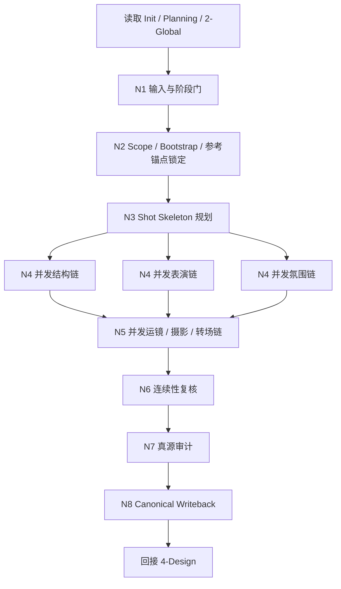
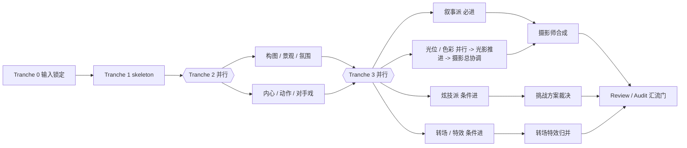
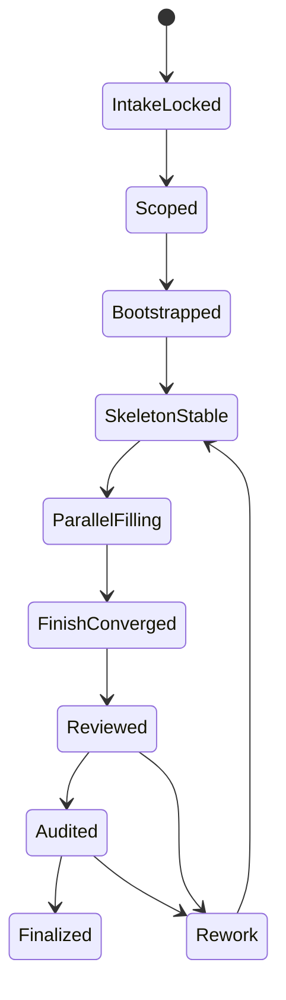
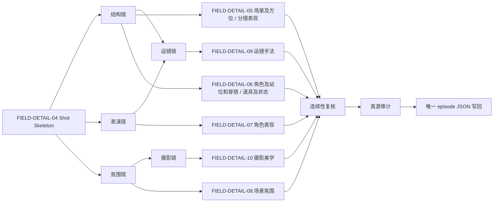

# aigc 3-Detail

## 概述

`3-Detail` 是 `aigc` 技能树位于 `2-Global` 与 `4-Design / 5-Image / 6-Video` 之间的制作明细阶段。

它负责把：

- `1-Planning/3-分组` 的组级导演输入
- `2-Global` 已 seed 的 shared episode root
- `0-Init` 的项目基线与 preset 保护约束

收束为唯一 canonical episode 根文件：

- `projects/<项目名>/3-Detail/第N集.json`

本轮重构遵循两个原则：

- 内容层：全量继承既有 `制作组` 已沉淀的分镜规划、构图、角色表现、运镜、氛围、摄影、转场、复核与审计能力
- 机制层：改写为单一 `SKILL.md` 统筹的知行合一网络，不再维护外置制作组 team、角色 agent、共享提示或共享质量手册作为执行真源

## Skill Execution Rule (Mandatory)

`3-Detail` 采用单技能内部融合模式：

- skill 自身负责输入读取、业务分析、scope 裁决、bootstrap、并发链推进、字段 patch 合成、review/audit、canonical 写回与下游回接
- 旧 `制作组` 的能力被吸收到当前 skill 的内部能力链中，作为内部 `plan / patch / note / report` 节点，而不是外置 subagents
- 中间只允许形成内部候选 patch、review note、audit report 与 convergence report
- 最终 canonical 写回只能由当前 `SKILL.md` 完成
- 不得再回指任何已删除的外置制作组文档作为执行真源

## When to Use

- 已经存在 `projects/<项目名>/1-Planning/3-分组/第N集.md`，且 `2-Global` 已 seed 或兼容可回退到 `projects/<项目名>/3-Detail/第N集.json`。
- 需要把组级导演构思下钻为 shot-level 的结构化字段。
- 需要初始化或增量维护 `projects/<项目名>/3-Detail/第N集.json`。
- 需要处理一个“串行锁前提 + 并发补字段 + 汇流审计”的典型复杂链路。

## When Not to Use

- 当前连 `projects/<项目名>/1-Planning/3-分组/第N集.md` 都不存在。
- `2-Global` 的 shared episode root 尚未 seed，且长文本上游也不足以兼容回退，应先回到 `2-Global`。
- 当前任务已经进入 `4-Design / 5-Image / 6-Video` 产物生成，而不是补 `3-Detail` 的 episode JSON。

## Business Requirement Analysis Contract (Mandatory)

| analysis_slot | 当前结论 |
| --- | --- |
| `business_goal` | 把组级导演意图稳定投影为 shot-level episode JSON，使下游设计、图像、视频阶段无需再次猜测镜头事实 |
| `business_object` | `第N集.md / 第N集.grouping.json / 2-Global 已 seed 的第N集.json / Init handoff / 兼容回退用 2-Global/*.md / shared schema / 可命中的学院派知识库` |
| `constraint_profile` | 只能维护 `projects/<项目名>/3-Detail/第N集.json` 这一份真源；必须优先继承上游已 seed 的 `组间设计`，并尊重 `source_profile`、preset 锁轴、上游组边界与 schema；参考大师/作品/知识库时必须转译成可执行表述，不能停留在抽象致敬 |
| `success_criteria` | 镜序稳定、字段 ownership 清楚、初始化预设显化清楚、参考锚点可追溯、并发链与汇流门明确、审计闭环存在、下游可直接消费 |
| `non_goals` | 不重写 `2-Global`；不直接生成设计/画面/视频请求；不为每个能力面输出平行主稿 |
| `complexity_source` | shot skeleton 先决依赖强；中段存在多字段并发补全；局部能力间 merge precedence 复杂；审计要求高于普通文本改写 |
| `topology_fit` | 采用“串行锁输入与 skeleton -> 并发结构/表演/氛围链 -> 并发运镜/摄影/转场链 -> 汇流复核/审计 -> 唯一写回”的混合思行网络 |
| `step_strategy` | `SKILL.md` 只保留骨架、Mermaid、门禁与节点网络；在 skeleton 前先锁“预设显化 + 参考锚点 + 具像化表达”，细步骤、路由判型、能力 playbook 与落盘细则下沉到 `references/` |

## Context Preload (Mandatory)

加载顺序固定为：

1. 根 `AGENTS.md`
2. `.agents/skills/aigc/SKILL.md + CONTEXT.md`
3. 本 `SKILL.md + CONTEXT.md`
4. `.agents/skills/aigc/_shared/project-runtime-layout.md`
5. `.agents/skills/aigc/_shared/director_episode_output.schema.json`
6. `.agents/skills/aigc/_shared/director_episode_bootstrap.template.json`
7. `.agents/skills/aigc/3-Detail/_shared/IO_CONTRACT.md`
8. `projects/<项目名>/0-Init/north_star.yaml`
9. `projects/<项目名>/0-Init/init_handoff.yaml`
10. `projects/<项目名>/0-Init/story-source-manifest.yaml`（若存在）
11. `projects/<项目名>/1-Planning/3-分组/第N集.md`
12. `projects/<项目名>/1-Planning/3-分组/第N集.grouping.json`（若存在）
13. `projects/<项目名>/3-Detail/第N集.json`
14. `projects/<项目名>/2-Global/全局风格.md`（兼容回退或审计时）
15. `projects/<项目名>/2-Global/类型元素.md`（兼容回退或审计时）
16. `projects/<项目名>/2-Global/导演意图.md`（兼容回退或审计时）
17. 按需读取 `references/*.md`

## Shared Canonical Sources (Mandatory)

- 强制读取：`.agents/skills/aigc/3-Detail/_shared/IO_CONTRACT.md`
- 强制读取：`.agents/skills/aigc/_shared/project-runtime-layout.md`
- 强制读取：`.agents/skills/aigc/_shared/director_episode_output.schema.json`
- 强制读取：`.agents/skills/aigc/_shared/director_episode_bootstrap.template.json`

硬规则：

1. 本阶段第一输入根固定为 `projects/<项目名>/1-Planning/3-分组/第N集.md` 与 `projects/<项目名>/3-Detail/第N集.json`；`2-Global/*.md` 默认只作兼容回退或审计。
2. 首次进入若 shared root 缺失，可走兼容回退路径 bootstrap 空壳，但标准路径应由 `2-Global` 先完成 `group_design` seed。
3. `metadata.source_profile` 只能继承或保守扩写 `Init / Planning` 的既有结论，不得在本阶段发明新 preset 模式。
4. 用户显式只要求某一组或某个 `分镜ID` 时，只更新命中切片，不补空其他组或镜，也不重写未命中组的 `组间设计`。
5. 本阶段不得创建第二份 episode/group/shot 根文件；canonical writeback 默认只维护 `metadata + final_output`，不再要求 `thinking_chain` 输出。
6. 任何内部能力链都不得越权改写 `2-Global/*.md` 或下游 `4-Design / 5-Image / 6-Video` 产物；无上游返工理由时也不得静默重写已 seed 的 `组间设计`。

## Total Input Contract (Mandatory)

### 必需输入

- `projects/<项目名>/1-Planning/3-分组/第N集.md`
- `projects/<项目名>/3-Detail/第N集.json`
- `projects/<项目名>/0-Init/north_star.yaml`
- `projects/<项目名>/0-Init/init_handoff.yaml`

### 可选输入

- `projects/<项目名>/1-Planning/3-分组/第N集.grouping.json`
- `projects/<项目名>/0-Init/story-source-manifest.yaml`
- `projects/<项目名>/2-Global/全局风格.md`
- `projects/<项目名>/2-Global/类型元素.md`
- `projects/<项目名>/2-Global/导演意图.md`
- 用户显式指定的 `组ID / 分镜ID / 字段族 / 精修偏好`

### 禁止输入

- 与当前项目无关的外部镜头文本
- 任何要求本阶段直接写设计、画面、视频请求的额外指令
- 已删除的外置制作组 contracts

### 输入处理原则

1. 先锁 `scope + preset + inherited group_design + shot skeleton`，再进入并发补字段。
2. 用户显式指定优先，但不得越过 `source_profile` 与已锁镜序。
3. 现有 `第N集.json` 先作为上游已 seed 的结构化上下文，再作为 patch-in-place 基底；不得绕开其中已存在的 `组间设计`。
4. `2-Global/*.md` 只作为兼容回退与审计证据，不再是默认第一结构化输入。
5. 若组级证据、锁轴或时间段依据不足，只能产出保守 patch 或 `report`，不得幻想补洞。

## Visual Maps

## Internal Capability Fusion Contract (Mandatory)

旧 `制作组` 的能力全部内收为当前 skill 的内部能力链：

| 内部能力链 | 吸收来源 | 作用 | 典型中间产物 | 触发规则 |
| --- | --- | --- | --- | --- |
| `scope_bootstrap_engine` | 父 skill 路由职责 | 锁定命中组/镜、bootstrap、preset 呈现元素、参考锚点与 patch 范围 | `detail_mission_brief`、`scope_plan`、`preset_manifest`、`reference_anchor_note`、`bootstrap_patch` | 每次进入必触发 |
| `shot_skeleton_engine` | `分镜规划` | 先产出 `分镜ID / 时间段 / coverage` 骨架 | `skeleton_plan`、`skeleton_patch`、`skeleton_report` | 缺根文件、缺骨架、重做镜序时强触发 |
| `structural_staging_engine` | `分镜构图 + 景观设计` | 锁空间锚点、构图关系、观看路径与道具底座 | `staging_patch`、`landscape_patch`、`structural_note` | 需要新建或重写 shot-level staging 时默认触发 |
| `performance_engine` | `内心戏指导 + 动作戏指导 + 对手戏指导` | 把情绪、动作、关系压成可见表演信息，并显化角色个性、习惯动作、下意识、叙事性行为与眉眼微表情承载点 | `performance_patch`、`performance_note`、`performance_report` | 按镜头问题类型选择一个或多个子模式 |
| `atmosphere_engine` | `氛围设计` | 把情绪气候写成可感知条件 | `atmosphere_patch`、`atmosphere_note` | 命中镜需要时间感、空气感、压迫/抒缓氛围时触发 |
| `camera_movement_engine` | `叙事派 + 炫技派` | 先给默认叙事路线与运动动机，再条件判断 `knowledge-base/电影学院派/分镜脚本` 是否存在高命中的运动语法母型，随后比较同目标下是否存在更强变体，最后按需给挑战方案 | `camera_academy_hit_note`、`narrative_camera_patch`、`camera_variant_note`、`showcase_camera_note` | `叙事派` 默认必进；高命中检测只在默认路线已锁后进入；同目标变体比较在默认路线后执行；`炫技派` 仅条件触发 |
| `cinematography_engine` | `摄影师 + 光影美学大师 + 色彩美学大师` | 先回看上游 `组间设计.全局风格 / 类型元素 / 导演意图`，再命中并转译 `knowledge-base/电影学院派/电影摄影` 的高命中规则，随后生成光位、组级光影推进与色彩子证据，最后由摄影总协调合成 `摄影美学` | `cinematography_brief`、`cinematography_academy_hit_note`、`lighting_patch`、`group_lighting_note`、`color_patch`、`cinematography_patch` | 需要形成 final look 时默认触发 |
| `transition_fx_engine` | `转场设计 + 特效设计` | 只在有明确叙事收益时补转场或特效 | `transition_note`、`fx_patch`、`transition_report` | 条件触发，默认克制 |
| `continuity_review_engine` | `连续性复核` | 检查字段齐全度、镜序可读性、空间连续性、动作因果与 patch 兼容性 | `continuity_note`、`continuity_report` | 首次创建、多字段合成、精修模式时强触发 |
| `source_audit_engine` | `真源审计` | 检查 single source、schema、lineage、overreach 与 writeback 边界 | `audit_report`、`writeback_patch_set` | 写回前必触发 |

硬规则：

1. 以上能力链都是当前 `SKILL.md` 的内部节点，不是外置角色。
2. 任何能力链都只能产出内部 `plan / patch / note / report`，不能直接写 canonical JSON。
3. 若未来继续细化 `3-Detail`，必须直接扩写本 skill 或其 `references/`，不得重新长出平行 `制作组` 真源。

## Canonical Module References

| 模块 | 作用 | 真源文件 |
| --- | --- | --- |
| 思维链主表 | 承载字段主表、thought pass 与 pass table | `references/chain-of-thought.md` |
| 执行流程 | 承载 tranche、依赖、命名与上下文裁剪 | `references/execution-flow.md` |
| 路由判型 | 承载 bootstrap、字段族、预设锁与回退策略 | `references/type-strategies.md` |
| 能力总手册 | 承载共享执行总则、跨维度协调与 review/audit 细则 | `references/capability-playbook.md` |
| 分镜表现细则 | 承载 `分镜构图 + 景观设计` 的思维执行节点 | `references/分镜表现.md` |
| 角色表现细则 | 承载 `内心 / 动作 / 对手戏` 的思维执行节点 | `references/角色表现.md` |
| 场景氛围细则 | 承载氛围链的思维执行节点 | `references/场景氛围.md` |
| 运镜手法细则 | 承载默认路由与挑战方案的思维执行节点 | `references/运镜手法.md` |
| 摄影美学细则 | 承载 `摄影前置回看 / 光位与照明推进 / 色彩心理 / 摄影总协调` 的思维执行节点 | `references/摄影美学.md` |
| 转场特效细则 | 承载转场与特效桥接的思维执行节点 | `references/转场特效.md` |
| 输出契约 | 承载 writeback、validation-report 与下游 handoff | `references/output-template.md` |
| shared I/O | 承载字段 ownership 与 merge precedence | `.agents/skills/aigc/3-Detail/_shared/IO_CONTRACT.md` |

## Topology Contract (Mandatory)

### Topology Fit

本技能采用 `串行前提锁定 + 两段并发补全 + 汇流复核/审计` 的混合网络：

1. 串行主干
   - 锁输入
   - 判 scope / preset / bootstrap
   - 生成 skeleton
2. 并发 tranche A
   - 结构链
   - 表演链
   - 氛围链
3. 并发 tranche B
   - 运镜链
   - 摄影链
   - 转场/特效链
4. 汇流门
   - 连续性复核
   - 真源审计
5. 唯一写回
   - patch-in-place 到 `第N集.json`

### Ordered / Unordered Rules

- `N1 -> N2 -> N3` 固定串行。
- `N4-结构链 / N4-表演链 / N4-氛围链` 默认并行。
- `N5` 只能在 `N3` 完成、且 `N4` 已产出足够上下文后进入。
- `叙事派` 默认必进；`炫技派` 只作为条件对照，不默认覆盖。
- 运镜链内部必须先完成 `默认路线 -> 运动动机 -> 分镜脚本高命中检测`，再形成默认 patch 与同目标变体比较。
- 摄影链内部先串行完成 `摄影底座回看 -> 视觉控制线 -> 摄影知识命中/转译`，再并行展开 `光位` 与 `色彩`，随后串行补 `组级光影推进`，最后才允许总协调落成 `摄影美学`。
- `N6 -> N7 -> N8` 固定串行。
- 用户显式只要求某一字段族时，只命中相关能力链，不补空其他路径。

## Thinking-Action Node Contract (Mandatory)

每个关键节点至少要定义以下字段：

| slot | 要求 |
| --- | --- |
| `node_id` | 稳定节点标识 |
| `objective` | 该节点要解决的判断/动作目标 |
| `inputs` | 进入该节点的输入与依赖 |
| `actions` | 该节点真正执行的动作 |
| `evidence` | 该节点留下的证据、产物或验证结果 |
| `route_out` | 成功、失败、分支时分别流向何处 |
| `gate` | 是否允许进入最终汇流 |

## Thinking-Action Node Network

| node_id | 对应 Step | 聚焦字段 | objective | actions | evidence | route_out | gate |
| --- | --- | --- | --- | --- | --- | --- | --- |
| `N1-INTAKE-GATE` | S1 | `FIELD-DETAIL-01` `FIELD-DETAIL-02` | 锁定当前确属 `3-Detail` 且输入齐备 | 读取 `Init / Planning / shared episode root` 真源并检查阶段边界；必要时再补读 `2-Global/*.md` 做兼容回退或审计 | `input_lock_note`、缺口列表 | pass -> `N2`；fail -> 结束并返回 `report` | 输入与阶段边界达标后才可继续 |
| `N2-SCOPE-BOOTSTRAP` | S2 | `FIELD-DETAIL-02` `FIELD-DETAIL-03` | 锁定命中组/镜、preset 约束、上游 `组间设计`、bootstrap、参考锚点与具像化表达范围 | 生成 `scope_plan`，先校验并继承上游已 seed 的 `组间设计`，再显化初始化预设要求呈现的元素，提炼可参考的大师手法 / 作品桥段 / 学院派知识命中，并转译成 `reference_anchor_note`；仅在兼容回退时 bootstrap 空壳 | `scope_plan`、`preset_manifest`、`reference_anchor_note`、`bootstrap_patch` | pass -> `N3`；冲突 -> 回 `S1/S2` | 作用域、上游 seed、参考锚点与真源落点明确后才可继续 |
| `N3-SKELETON` | S3 | `FIELD-DETAIL-04` | 生成稳定 `分镜ID / 时间段 / coverage` 骨架 | 运行 skeleton 细化步骤并 patch-in-place 到命中切片 | `skeleton_plan`、`skeleton_patch` | pass -> `N4/N5`；fail -> 回 `S3` | 无 skeleton 不得并发补字段 |
| `N4-PARALLEL-CORE` | S4-S7 | `FIELD-DETAIL-05` `FIELD-DETAIL-06` `FIELD-DETAIL-07` `FIELD-DETAIL-08` | 并发补结构、表演与氛围字段 | 运行结构链、表演链、氛围链并做第一轮 merge | `core_patch_set`、`core_merge_note` | pass -> `N5`；fail -> 回目标子链 | 结构链必须可被运镜/摄影消费 |
| `N5-PARALLEL-FINISH` | S8-S10 | `FIELD-DETAIL-09` `FIELD-DETAIL-10` `FIELD-DETAIL-11` | 在 core draft 上并发完成运镜、摄影、转场/特效 | 运镜链先锁默认路线与运动动机，再条件命中并转译 `knowledge-base/电影学院派/分镜脚本` 的高命中运动母型，随后比较同目标更强变体并按需升格挑战案；摄影链先回看上游 `组间设计.全局风格 / 类型元素 / 导演意图`，再命中并转译 `knowledge-base/电影学院派/电影摄影` 的高命中规则，随后运行光位、组级光影推进、色彩与摄影总协调；转场/特效链条件进入 | `finish_patch_set`、`camera_decision_note`、`camera_academy_hit_note`、`camera_variant_note`、`cinematography_academy_hit_note`、`group_lighting_note` | pass -> `N6`；fail -> 回目标子链 | finish draft 不能破坏叙事清晰度，也不得为“更酷”偷换表现目标 |
| `N6-CONTINUITY-REVIEW` | S11 | `FIELD-DETAIL-12` | 检查镜序、空间、动作、情绪与跨字段兼容性 | 生成 review note 与返工入口 | `continuity_note`、`continuity_report` | pass -> `N7`；fail -> 回 `N3/N4/N5` | 通过后才可审计写回 |
| `N7-SOURCE-AUDIT` | S11 | `FIELD-DETAIL-12` | 检查 single source、schema、lineage 与 overreach | 生成 audit report 与 writeback patch set | `audit_report`、`writeback_patch_set` | pass -> `N8`；fail -> 回目标节点 | 通过后才允许最终写回 |
| `N8-WRITEBACK-HANDOFF` | S12 | `FIELD-DETAIL-13` | 统一写回 `第N集.json` 与 `validation-report.md`，并回接下游 | patch-in-place 写回 `metadata + final_output`、输出 triad closure | canonical files、`handoff_note` | Final | 仅当前 skill 拥有写回权 |

## Execution Summary

- 首选输入固定为 `projects/<项目名>/1-Planning/3-分组/第N集.md`。
- 第一结构化输入固定为 `projects/<项目名>/3-Detail/第N集.json` 中已 seed 的 `组间设计`。
- 证据补充固定来自 `Init`、`story-source-manifest`、`第N集.grouping.json` 与 `2-Global/*.md` 的兼容回退/审计读取。
- 当前 canonical 主产物是 `projects/<项目名>/3-Detail/第N集.json`。
- 当前 canonical 验收产物是 `projects/<项目名>/3-Detail/validation-report.md`。
- 默认采用后台内部并发链；只有证据缺口、用户显式要求逐轮共创、或某个命中组/镜必须前台确认时才阻塞。

## Output Summary

- canonical 主产物：`projects/<项目名>/3-Detail/第N集.json`
- canonical 验收：`projects/<项目名>/3-Detail/validation-report.md`
- 当前不生成第二份 episode/group/shot 主稿
- 默认不输出 `thinking_chain`；若兼容旧 root 临时保留，也不得把它当作阶段写回必填槽

## Strategy Summary

- 判定顺序：`是否满足阶段进入 -> 是否需要 bootstrap -> skeleton 是否稳定 -> 并发 core patch 是否可合成 -> finish patch 是否保持叙事优先 -> review/audit 是否通过 -> 是否允许写回`
- 变量登记、情况判定、field_id 与 pass table 见 `references/chain-of-thought.md`
- 共享执行总则与跨维度协调见 `references/capability-playbook.md`
- 六个高复杂维度的逐节点细则见：
  - `references/分镜表现.md`
  - `references/角色表现.md`
  - `references/场景氛围.md`
  - `references/运镜手法.md`
  - `references/摄影美学.md`
  - `references/转场特效.md`

## Root-Cause Execution Contract (Mandatory)

当出现以下症状时，必须先修本 skill 真源，而不是只补局部 JSON：

- `3-Detail` 仍回指已删除的外置制作组 contracts
- 缺 `shot skeleton` 就直接并发补字段
- 字段 patch 互相打架，无法收束到同一份 `第N集.json`
- 炫技、氛围或摄影表达压过叙事任务
- review / audit 缺位，导致 single source 或 schema 漂移
- 下游又开始依赖平行 sidecar，而不是 `第N集.json`

必经链路：

`Symptom -> Direct Technical Cause -> Rule Source -> Meta Rule Source -> Fix Landing Points`

优先检查：

- `Rule Source`
  - `.agents/skills/aigc/3-Detail/SKILL.md`
  - `.agents/skills/aigc/3-Detail/CONTEXT.md`
  - `.agents/skills/aigc/3-Detail/_shared/IO_CONTRACT.md`
  - `.agents/skills/aigc/3-Detail/references/*.md`
  - `.agents/skills/aigc/_shared/director_episode_output.schema.json`
- `Meta Rule Source`
  - `.agents/skills/aigc/SKILL.md`
  - 根 `AGENTS.md`
  - `/Users/vincentlee/.codex/skills/meta/构建/技能/skill-知行合一/SKILL.md`

用户闭环输出固定三段：

1. 根因位置
2. 立即修复
3. 系统预防修复
