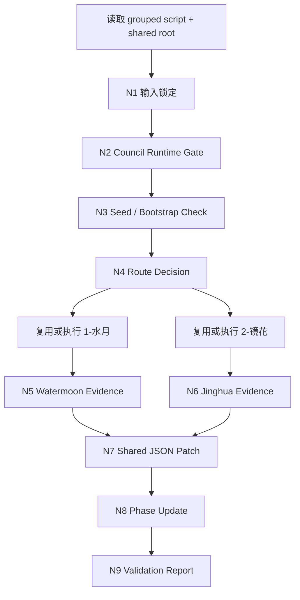
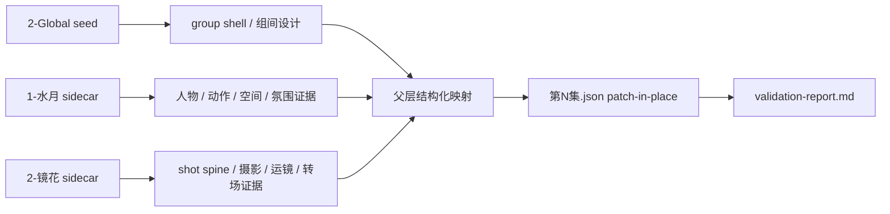
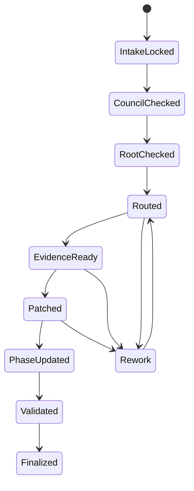

# aigc 3-Detail

## 概述

`3-Detail` 是 `aigc` 技能树承接 `2-Global`、连接 `4-Design / 5-Image / 6-Video` 的阶段父 skill。

它当前的稳定结构不是“一个大而平的单文件技能”，而是两层协作：

1. `1-水月`
   - 把 `1-Planning/3-分组/第N集.md` 扩写成更可拍、更可演、更可感知的 grouped prose sidecar
2. `2-镜花`
   - 在 `1-水月` 基础上补齐分镜、摄影、运镜与转场组织，形成导演/摄影融写 sidecar

父层 `3-Detail` 自身不再复制子技能细则；它负责：

- 锁定共享输入与阶段边界
- 判断 shared episode root 是否已由 `2-Global` 正确 seed
- 按需路由 `1-水月`、`2-镜花`，或复用它们已有输出
- 把 sidecar 证据与 shared seed 汇流到同一份 `projects/aigc/<项目名>/3-Detail/第N集.json`
- 维护 `metadata.document_phase`
- 写回 `projects/aigc/<项目名>/3-Detail/validation-report.md`

当前阶段的唯一结构化业务真源固定为：

- `projects/aigc/<项目名>/3-Detail/第N集.json`

子技能输出是阶段侧车真源，不是第二份 episode 主文件：

- `projects/aigc/<项目名>/3-Detail/1-水月/第N集.md`
- `projects/aigc/<项目名>/3-Detail/2-镜花/第N集.md`

## Parent Positioning

`3-Detail` 是 stage-local parent skill。

当前 active 子技能：

1. `1-水月`
2. `2-镜花`

父层拥有：

- `2-Global -> 3-Detail` shared root 继承与缺口诊断
- selective dispatch
- sidecar 到 shared JSON 的字段汇流
- `组间设计.出场角色及穿搭` 的阶段级回填
- `分镜明细[]` 的 patch-in-place
- `metadata.document_phase = detail_in_progress | ready` 的推进
- `projects/aigc/<项目名>/3-Detail/validation-report.md` 写回

父层不拥有：

- 重写 `1-Planning/3-分组` 的组界、组序、组 ID
- 在无明确返工理由时改写 `2-Global` 已写入的 `组间设计`
- 让 `1-水月` 或 `2-镜花` 各自越权写 shared JSON
- 直接生成 `4-Design / 5-Image / 6-Video` 请求
- 在共享 root 已存在时另起第二份 episode / group / shot 主文件

## Internal Capability Fusion Contract (Mandatory)

`3-Detail` 不通过外部制作组文档或平行 agent roster 持有阶段总线；阶段能力面统一分布在父 skill、两个 active 子技能与 shared contracts：

| 能力面 | 当前 owner | 说明 |
| --- | --- | --- |
| 阶段入口判定与 selective dispatch | `3-Detail/SKILL.md` | 决定本轮是否命中 `1-水月`、`2-镜花` 或直接做 patch-only |
| grouped prose 增密 | `1-水月/SKILL.md` | 提供人物、动作、空间、氛围和视觉强化的组级证据 |
| 导演/摄影融写增密 | `2-镜花/SKILL.md` | 提供 shot spine、摄影、运镜与转场的组级证据 |
| shared root 继承与结构化 patch | `3-Detail/SKILL.md` + shared schema/contracts | 把 sidecar 证据压回 `第N集.json`，并推进 `document_phase` |
| 阶段验收与 handoff | `3-Detail/SKILL.md` | 写 `projects/aigc/<项目名>/3-Detail/validation-report.md`，给出 ready/partial/blocked |

硬规则：

1. `3-Detail` 父层不得把 shared JSON 写回责任外包给 `1-水月` 或 `2-镜花`。
2. `1-水月` 与 `2-镜花` 都只拥有本地 sidecar canonical 输出，不拥有第二份 episode 主文件。
3. 若将来新增 detail 子链，必须先说明它补的是哪一层证据或字段 ownership，不得与现有父层/子技能并行争抢同一真源。

## Shared Canonical Sources (Mandatory)

- `.agents/skills/aigc/_shared/project-runtime-layout.md`
- `.agents/skills/aigc/_shared/group_design_seed_contract.md`
- `.agents/skills/aigc/_shared/director_episode_output.schema.json`
- `.agents/skills/aigc/_shared/director_episode_bootstrap.template.json`
- `.agents/skills/aigc/_shared/council-runtime/module-spec.md`
- `.agents/skills/aigc/1-Planning/3-分组/SKILL.md`
- `.agents/skills/aigc/2-Global/SKILL.md`
- `1-水月/SKILL.md`
- `2-镜花/SKILL.md`

真源分工：

- 本 `SKILL.md`
  - 父层路由、shared root 继承/修复、阶段聚合、phase 推进、validation
- `1-水月/SKILL.md`
  - grouped prose 扩写 sidecar 真源
- `2-镜花/SKILL.md`
  - 导演/摄影融写 sidecar 真源
- `group_design_seed_contract.md`
  - `2-Global -> 3-Detail` 的 `组间设计 + 分镜组壳` 交接真源
- `director_episode_output.schema.json`
  - `3-Detail/第N集.json` 的结构化字段真源

## When To Use

- 已存在或需要补齐 `projects/aigc/<项目名>/3-Detail/第N集.json`
- 需要围绕同一份 episode root 继续补 `分镜明细[]`
- 需要决定本轮是否运行 `1-水月`、`2-镜花`，还是复用已有 sidecar
- 需要把 `2-Global` 已 seed 的 `组间设计` 继续推进为可供下游消费的 detail 级事实
- 需要阶段级 `validation-report.md`，明确当前集是 `detail_in_progress` 还是 `ready`

## When Not To Use

- 当前任务只要求单独执行 `1-水月` 或 `2-镜花`，且不涉及阶段级 shared root / validation
- `1-Planning/3-分组/第N集.md` 还不存在
- 当前目标是 `2-Global` 的组间设计 seed，而不是 detail 级镜头补全
- 当前任务已经进入 `4-Design / 5-Image / 6-Video` 的下游资产生成

## Business Requirement Analysis Contract (Mandatory)

| analysis_slot | 当前结论 |
| --- | --- |
| `business_goal` | 在同一份 `projects/aigc/<项目名>/3-Detail/第N集.json` 上继承 `2-Global` 的分镜组壳与 `组间设计`，并把 `1-水月 + 2-镜花` 的 sidecar 证据收束成镜级 detail 字段，使其进入可供下游消费的阶段状态。 |
| `business_object` | `projects/aigc/<项目名>/3-Detail/第N集.json`、`projects/aigc/<项目名>/3-Detail/1-水月/第N集.md`、`projects/aigc/<项目名>/3-Detail/2-镜花/第N集.md`、`projects/aigc/<项目名>/3-Detail/validation-report.md`。 |
| `constraint_profile` | shared episode root 是唯一结构化真源；`1-水月/2-镜花` 是 sidecar；`组间设计` 默认继承不重写；`分镜明细[]` 只在 `3-Detail` 扩展；若 shared root 缺失，只能走显式兼容 bootstrap。 |
| `success_criteria` | 本轮 scope 内的分镜组都能在 shared root 中看到稳定的 `分镜明细[]` patch、必要的 `出场角色及穿搭` 回填、正确的 `document_phase` 推进，以及阶段级 `validation-report.md`。 |
| `non_goals` | 不把 `1-水月/2-镜花` 变成第二份 episode 主文件；不越权重写 `2-Global` 的项目级设计真源；不直接生成 design/image/video 请求。 |
| `complexity_source` | 当前阶段同时维护 shared JSON 与两个 Markdown sidecar；且上游 seed 可能缺失、子技能可能只需局部运行、阶段完成度又必须通过 `document_phase + validation-report` 共同表达。 |
| `topology_fit` | 固定为“输入锁定 -> council gate -> root seed 检查/兼容回退 -> selective dispatch -> sidecar 汇流 -> shared JSON patch -> phase 推进 -> stage validation”。 |
| `step_strategy` | 父 `SKILL.md` 只保留阶段门、字段边界、聚合规则与验收；子技能细则留在各自目录，不在父层重复展开。 |

## Context Preload (Mandatory)

加载顺序固定为：

1. 根 `AGENTS.md`
2. `.agents/skills/aigc/SKILL.md + CONTEXT.md`
3. 本 `SKILL.md + CONTEXT.md`
4. `.agents/skills/aigc/_shared/project-runtime-layout.md`
5. `.agents/skills/aigc/_shared/group_design_seed_contract.md`
6. `.agents/skills/aigc/_shared/director_episode_output.schema.json`
7. `.agents/skills/aigc/_shared/director_episode_bootstrap.template.json`
8. `.agents/skills/aigc/_shared/council-runtime/module-spec.md`
9. `.agents/skills/aigc/1-Planning/3-分组/SKILL.md`
10. `.agents/skills/aigc/2-Global/SKILL.md`
11. `1-水月/SKILL.md`
12. `2-镜花/SKILL.md`
13. `projects/aigc/<项目名>/team.yaml`（若存在）
14. `projects/aigc/<项目名>/1-Planning/3-分组/第N集.md`
15. `projects/aigc/<项目名>/3-Detail/第N集.json`（若存在）
16. `projects/aigc/<项目名>/3-Detail/1-水月/第N集.md`（若存在）
17. `projects/aigc/<项目名>/3-Detail/2-镜花/第N集.md`（若存在）
18. `projects/aigc/<项目名>/2-Global/全局风格/全局风格设计.md`（若存在）
19. `projects/aigc/<项目名>/2-Global/类型元素/全集设计.md`（若存在）
20. `projects/aigc/<项目名>/2-Global/类型元素/分组设计.md`（若存在）
21. `projects/aigc/<项目名>/2-Global/设计元素/设计元素.md`（若存在）

## Total Input Contract (Mandatory)

### 必需输入

- `projects/aigc/<项目名>/1-Planning/3-分组/第N集.md`
- `projects/aigc/<项目名>/3-Detail/第N集.json` 或可显式 bootstrap 的兼容条件

### 强烈建议输入

- `projects/aigc/<项目名>/3-Detail/1-水月/第N集.md`
- `projects/aigc/<项目名>/3-Detail/2-镜花/第N集.md`

### 可选输入

- `projects/aigc/<项目名>/team.yaml`
- `projects/aigc/<项目名>/0-Init/north_star.yaml`
- `projects/aigc/<项目名>/0-Init/init_handoff.yaml`
- `projects/aigc/<项目名>/0-Init/story-source-manifest.yaml`
- 现有 `projects/aigc/<项目名>/3-Detail/validation-report.md`
- 用户显式指定的 `selected_groups[] / selected_fields[] / selected_chains[]`

### 硬规则

1. shared root 存在时，`3-Detail` 必须优先继承它，而不是重新从 Markdown 长文抽结构。
2. `组间设计` 的 `全局风格 / 类型元素` 默认继承 `2-Global`，不得因 detail 补写而漂移。
3. `组间设计.出场角色及穿搭` 可由 `3-Detail` 在镜级事实稳定后回填。
4. `分镜明细[]` 只能在 `3-Detail` 阶段扩展。
5. 若 shared root 缺失或仍是 `bootstrapped` 空壳，必须先报告 seed 缺口，再决定是否进入兼容 bootstrap / backfill。
6. 若用户只要求局部组或局部字段，本轮只 patch 命中 scope，不默认全量重跑所有 group。

## Shared Root Inheritance And Compatibility (Mandatory)

### 正常路径

- 读取 `projects/aigc/<项目名>/3-Detail/第N集.json`
- 校验其是否符合 shared schema
- 优先继承：
  - `分镜组ID`
  - `总时长`
  - `剧本正文`
  - `组间设计`
- 在同一 root 上补：
  - `分镜明细[]`
  - `组间设计.出场角色及穿搭`
  - `metadata.document_phase`
  - `final_output.acceptance_notes`

### 兼容回退路径

仅当以下条件成立时，允许 `3-Detail` 创建或修复 shared root：

1. 用户明确要求继续 `3-Detail`
2. `1-Planning/3-分组/第N集.md` 存在
3. shared root 缺失或不可用
4. 已显式报告 `2-Global` seed 缺口

回退规则：

- 可基于 `.agents/skills/aigc/_shared/director_episode_bootstrap.template.json` 创建兼容 root
- 必须把缺口写入 `validation-report.md`
- `document_phase` 至少进入 `detail_in_progress`
- 兼容 root 仍不得伪造未经证实的 `组间设计` 细节

## Composite Output Governance (Mandatory)

`3-Detail` 采用“子技能 sidecar + 父 skill shared-root patch”的复合输出机制。

父层默认职责：

- route decision
- selective dispatch
- sidecar reuse / rerun 决策
- schema 对齐的 shared JSON patch
- stage-level validation

当前 canonical 输出：

- `projects/aigc/<项目名>/3-Detail/第N集.json`
- `projects/aigc/<项目名>/3-Detail/validation-report.md`

当前 sidecar 输出：

- `projects/aigc/<项目名>/3-Detail/1-水月/第N集.md`
- `projects/aigc/<项目名>/3-Detail/2-镜花/第N集.md`

聚合规则：

1. `1-水月` 主要提供人物、动作、空间、氛围、视觉强化的组级 prose 证据。
2. `2-镜花` 主要提供 shot spine、构图、摄影、运镜、转场的导演/摄影证据。
3. 父层把两类证据映射到 shared schema 的镜级字段，而不是把 sidecar 正文整段塞入 JSON。
4. 未命中子技能不得在 shared root 中补占位 reasoning 或空洞字段。
5. sidecar 若已稳定存在，可直接复用；不需要为了写 JSON 强制重跑子技能。

## Detail Writeback Contract (Mandatory)

父层对 shared root 的最低负责槽位如下：

### 组级槽位

- `final_output.main_content.分镜组列表[].组间设计.出场角色及穿搭`

### 镜级槽位

- `分镜ID`
- `时间段`
- `角色背景面`
- `角色站位走位`
- `道具及状态`
- `分镜表现`
- `景别`（可选）
- `镜头属性`（可选）
- `镜头框架`（可选）
- `镜头类型`（可选）
- `镜头视角`（可选）
- `运镜手法`
- `镜头速度`（可选）
- `摄影美学`
- `转场特效`（可选）

写回原则：

1. 先让 `1-水月` 提供“写什么、演什么、空间关系怎样成立”的证据。
2. 再让 `2-镜花` 提供“怎样切镜、怎样拍、怎样动、怎样转”的证据。
3. 最后由父层把两者压成结构化 shot patch。
4. 如果某镜没有充分依据，可保守留空可选槽位，但不得伪造关键动作或关系。

## Visual Maps

## Thinking-Action Node Network

| node_id | 对应 Step | 聚焦字段 | objective | actions | evidence | route_out | gate |
| --- | --- | --- | --- | --- | --- | --- | --- |
| `N1-INTAKE-LOCK` | `S1` | `FIELD-DETAIL-01` | 锁定 episode、group scope 与共享输入真源 | 读取 `3-分组`、既有 shared root、已有 sidecar | input inventory、scope note | pass -> `N2`；fail -> 结束并报缺口 | 没有 grouped script 不得继续 |
| `N2-COUNCIL-GATE` | `S2` | `FIELD-DETAIL-02` | 判断是否启用共享顾问团运行时 | 读取 `team.yaml`，按 `council-runtime` 判定 `监制 / 评审` gate | council decision note | pass -> `N3`；降级 -> `N3` | 主代理保留 canonical 写回权 |
| `N3-ROOT-CHECK` | `S3` | `FIELD-DETAIL-03` | 确认 shared root 是否可继承 | 检查 `第N集.json`、`document_phase`、schema 与 seed 完整度 | root readiness note、gap note | pass -> `N4`；compat -> `N4`；blocked -> 结束 | 缺 seed 时必须先显式说明 |
| `N4-ROUTE-DISPATCH` | `S4` | `FIELD-DETAIL-04` | 决定本轮命中哪些子技能或直接复用哪些 sidecar | 根据用户范围、已有输出、字段缺口选择 `水月 / 镜花 / patch-only` | route plan、selected scope | pass -> `N5/N6` | 未命中 scope 不得被补跑 |
| `N5-WATERMOON-EVIDENCE` | `S5` | `FIELD-DETAIL-05` | 收集组级表演/动作/空间证据 | 复用或执行 `1-水月`，提炼人物、动作、空间、氛围、视觉锚点 | watermoon evidence note | -> `N7` | 不能直接把 prose 整段写入 shot 字段 |
| `N6-JINGHUA-EVIDENCE` | `S6` | `FIELD-DETAIL-06` | 收集 shot spine 与导演/摄影证据 | 复用或执行 `2-镜花`，提炼分镜序列、摄影、运镜、转场收益 | jinghua evidence note | -> `N7` | `2-镜花` 证据必须回指 `1-水月` |
| `N7-SHARED-PATCH` | `S7` | `FIELD-DETAIL-07` `FIELD-DETAIL-08` | 把 sidecar 证据压成 shared JSON patch | 回填 `出场角色及穿搭`，补写 `分镜明细[]` 与可选描述子槽 | patch summary、schema note | pass -> `N8`；drift -> 回 `S4~S7` | 不得重写无返工理由的 `组间设计` |
| `N8-PHASE-UPDATE` | `S8` | `FIELD-DETAIL-09` | 推进 episode 生命周期状态 | 依据 shot 完整度更新 `document_phase` 与 `acceptance_notes` | phase note | pass -> `N9` | 未满足条件不得写 `ready` |
| `N9-STAGE-VALIDATION` | `S9` | `FIELD-DETAIL-10` | 写回阶段级验收结论 | 生成 `projects/aigc/<项目名>/3-Detail/validation-report.md`，说明 ready/partial/blocked | validation report | done | 无 validation report 不得结案 |

## Convergence Contract (Mandatory)

只有同时满足以下条件，`3-Detail` 才允许宣布阶段或 episode scope 完成：

1. shared root 已存在且符合 shared schema。
2. scope 内的 `分镜组列表[]` 都保留稳定的 `组间设计` 继承。
3. 需要补的 group 已写入 `分镜明细[]`。
4. `出场角色及穿搭` 若此前为空，已在有依据的 group 上完成回填或显式说明仍缺证据。
5. `metadata.document_phase` 与实际完成度一致：
   - `detail_in_progress`
   - `ready`
6. `projects/aigc/<项目名>/3-Detail/validation-report.md` 已写回。

## Field Master

| field_id | intent | canonical_landing | source_priority | owner_node |
| --- | --- | --- | --- | --- |
| `FIELD-DETAIL-01` | 锁定本轮唯一 episode 输入与 scope | `input inventory / scope note` | `3-分组 > shared root > sidecars` | `N1` |
| `FIELD-DETAIL-02` | 固定 council gate 结论 | `validation-report.md` 的 gate note | `team.yaml > council-runtime` | `N2` |
| `FIELD-DETAIL-03` | 判断 shared root 是否可继承或需兼容回退 | `root readiness note` | `第N集.json > bootstrap template` | `N3` |
| `FIELD-DETAIL-04` | 固定本轮命中子技能与字段范围 | `route plan / selected scope` | `用户显式范围 > gap-driven route` | `N4` |
| `FIELD-DETAIL-05` | 回收 `1-水月` 的组级证据 | `watermoon evidence note` | `1-水月/第N集.md` | `N5` |
| `FIELD-DETAIL-06` | 回收 `2-镜花` 的镜头组织证据 | `jinghua evidence note` | `2-镜花/第N集.md` | `N6` |
| `FIELD-DETAIL-07` | 回填组级穿搭与继承说明 | `第N集.json -> 分镜组列表[].组间设计.出场角色及穿搭` | `shared root + sidecar evidence` | `N7` |
| `FIELD-DETAIL-08` | 写入 shot-level detail 字段 | `第N集.json -> 分镜组列表[].分镜明细[]` | `1-水月 + 2-镜花 + schema` | `N7` |
| `FIELD-DETAIL-09` | 推进 episode phase 与 acceptance notes | `第N集.json -> metadata / final_output.acceptance_notes` | `patch completeness + schema phase rules` | `N8` |
| `FIELD-DETAIL-10` | 写阶段级验收结论 | `projects/aigc/<项目名>/3-Detail/validation-report.md` | `shared root + route result` | `N9` |

## Thought Pass Map

| step_id | field_id | intent | failure_signal | rework_entry |
| --- | --- | --- | --- | --- |
| `S1` | `FIELD-DETAIL-01` | 当前是否真的是 `3-Detail` 的 episode / group scope | 拿错集、拿错 group、拿错 root | `S1` |
| `S2` | `FIELD-DETAIL-02` | 当前是否需要先过共享顾问团 gate | `team.yaml` 启用却被绕过 | `S2` |
| `S3` | `FIELD-DETAIL-03` | shared root 是可继承、可修复，还是应先上抛 seed 缺口 | 根文件缺失或字段漂移被静默跳过 | `S3` |
| `S4` | `FIELD-DETAIL-04` | 本轮到底要跑哪些子技能、哪些 group、哪些字段 | 用户只要局部却全量跑 | `S4` |
| `S5` | `FIELD-DETAIL-05` | `1-水月` 证据是否足够支撑人物/动作/空间事实 | 只有漂亮 prose，没有可结构化信息 | `S5` |
| `S6` | `FIELD-DETAIL-06` | `2-镜花` 证据是否足够支撑 shot spine 与摄影组织 | 有镜头感但无结构化支点 | `S6` |
| `S7` | `FIELD-DETAIL-07` `FIELD-DETAIL-08` | 如何把两类 sidecar 证据稳定压成 schema 字段 | JSON 中只剩摘抄或出现臆造事实 | `S7` |
| `S8` | `FIELD-DETAIL-09` | 当前 episode 到底是 `detail_in_progress` 还是 `ready` | 没有 shots 却写 ready | `S8` |
| `S9` | `FIELD-DETAIL-10` | 如何给出阶段结论、风险与下步入口 | 没有 validation report 就宣称完成 | `S9` |

## Quality Gate Map

| field_id | quality_dimension | fail_code | fail_condition | rework_entry |
| --- | --- | --- | --- | --- |
| `FIELD-DETAIL-01` | 真源锁定 | `FAIL-DETAIL-01` | `episode / group / root` scope 不唯一 | `S1` |
| `FIELD-DETAIL-02` | 共享运行时合规 | `FAIL-DETAIL-02` | 需要 council gate 却未执行 | `S2` |
| `FIELD-DETAIL-03` | seed 继承稳定性 | `FAIL-DETAIL-03` | shared root 缺失或 seed 缺口被静默吞掉 | `S3` |
| `FIELD-DETAIL-04` | selective dispatch 准确性 | `FAIL-DETAIL-04` | 未命中 scope 被误跑或误写 | `S4` |
| `FIELD-DETAIL-05` | prose 证据可结构化性 | `FAIL-DETAIL-05` | `1-水月` 只剩情绪词，缺动作/空间锚点 | `S5` |
| `FIELD-DETAIL-06` | 镜头组织可落字段性 | `FAIL-DETAIL-06` | `2-镜花` 缺 shot spine 或无法回指 `1-水月` | `S6` |
| `FIELD-DETAIL-07` | 组级继承与穿搭回填 | `FAIL-DETAIL-07` | 越权改写 `组间设计` 或穿搭回填无依据 | `S7` |
| `FIELD-DETAIL-08` | shot patch 完整度 | `FAIL-DETAIL-08` | `分镜明细[]` 缺关键字段或事实漂移 | `S7` |
| `FIELD-DETAIL-09` | phase 推进正确性 | `FAIL-DETAIL-09` | `document_phase` 与实际完成度不符 | `S8` |
| `FIELD-DETAIL-10` | 阶段闭环 | `FAIL-DETAIL-10` | `validation-report.md` 缺失或未说明 ready/partial/blocked | `S9` |

## Root-Cause Execution Contract (Mandatory)

当 `3-Detail` 出现缺 root、字段漂移、阶段误路由、sidecar 与 JSON 不一致、或 ready 判定错误时，必须按以下顺序追因：

1. `Symptom / Failure`
   - 例如 shared root 缺失、`分镜明细[]` 为空、`组间设计` 被重写、`validation-report.md` 缺失
2. `Direct Technical Cause`
   - 例如 route 错误、seed 缺口未上抛、sidecar 未汇流、phase 判定错误
3. `Rule Source`
   - 本 `SKILL.md`
   - `1-水月/SKILL.md`
   - `2-镜花/SKILL.md`
   - `.agents/skills/aigc/_shared/group_design_seed_contract.md`
   - `.agents/skills/aigc/_shared/director_episode_output.schema.json`
4. `Meta Rule Source`
   - 根 `AGENTS.md`
   - `.agents/skills/aigc/SKILL.md`
   - `.agents/skills/aigc/_shared/project-runtime-layout.md`
5. `Fix Landing Points`
   - 父层路由/聚合合同
   - 子技能边界
   - shared schema 或 shared seed 合同
   - 阶段经验层 `CONTEXT.md`

面向用户结案时，必须返回：

- `root cause location`
- `immediate fix`
- `systemic prevention fix`
- `symptom -> rule source -> meta rule source`
