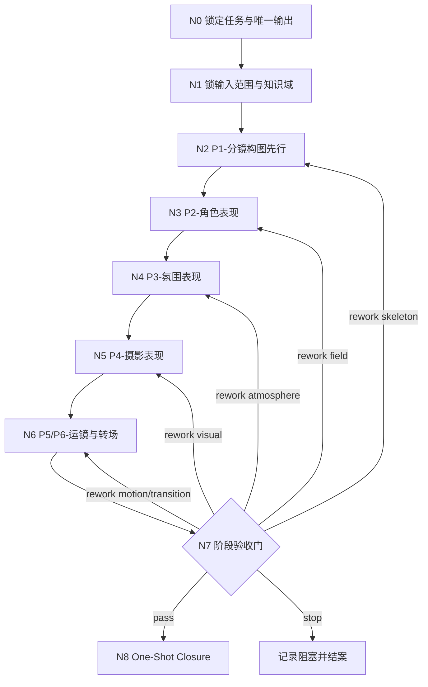
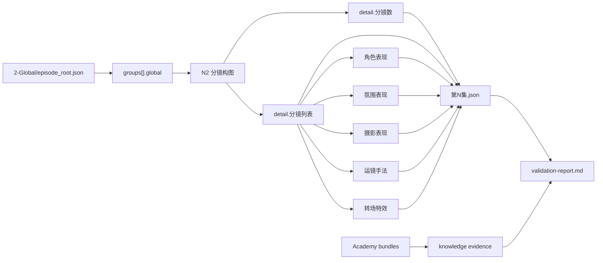
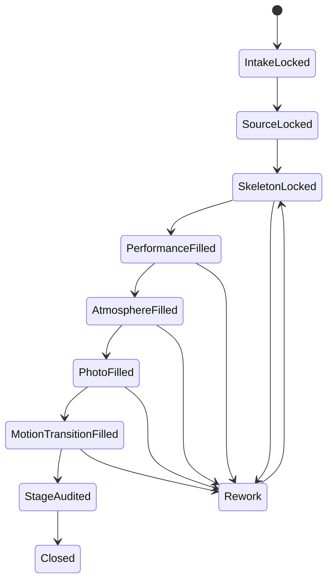
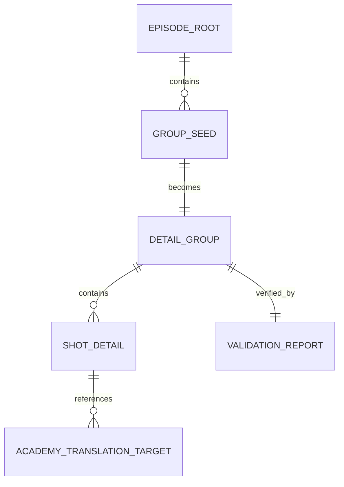

# aigc 3-Detail

## Context Loading Contract

- 每次调用本技能时，必须同时加载同目录 `CONTEXT.md` 作为预加载上下文。
- 本技能默认采用 `单技能知行合一 + references 细则下沉 + validator 护栏` 模式；根 `SKILL.md` 负责业务分析、拓扑、节点网、输入输出合同、汇流门与 completion gate，`references/` 负责字段细则、示例和模块配置，`scripts/` 负责结构校验与审计护栏。
- 冲突优先级固定为：用户显式请求 > 根 `AGENTS.md` > `.agents/skills/aigc/SKILL.md` > 本 `SKILL.md` > 本目录 `references/*` > 本目录 `scripts/*` > 本 `CONTEXT.md`。

## 编排声明

- 本技能按 [$skill-知行合一](/Users/vincentlee/.codex/skills/meta/构建/技能/skill-知行合一/SKILL.md) 的 `既有优化` 模式增量升级。
- 当前仍是单技能主链，不升格为多智能体 harness；复杂度通过 `业务分析 + Mermaid 拓扑 + 思行节点 + 汇流门 + one-shot closure` 承载。
- `复杂链路的骨架 / 细则分层`：`true`
- 这意味着：
  - `SKILL.md` 只保留主骨架、Mermaid 图、关键门禁、输入输出合同、汇流与返工入口。
  - `references/思行网络.md`、`模板字段填写指南.md`、`编剧手册.md`、`镜头语言.md`、`路由画像.yaml`、`创作评审标尺.md` 负责承接细则。
  - `scripts/validate_stage_output.py` 负责校验 canonical JSON 与 `validation-report.md` 是否真正落地了知行合一闭环。

## Mode Selection

- 当前模式：`既有优化`
- 选择原因：
  - `3-Detail` 已经拥有稳定业务目标、字段模板和阶段落盘路径。
  - 需要升级的是组织方式与治理密度，而不是重写业务对象本身。
  - 本轮需要把原来的“固定 pass 说明书”提升为“思维链即执行链”的单技能思行网络。
- 当前输出策略：
  - 保留 canonical 输出：`projects/aigc/<项目名>/3-Detail/第N集.json` + `projects/aigc/<项目名>/3-Detail/validation-report.md`
  - 保留固定先执行 `1-分镜构图`
  - 新增 `Topology Contract`、`Thinking-Action Node Contract`、`Convergence Contract` 与 `One-Shot Output Contract`

## Purpose & Scope

`3-Detail` 是 `aigc` 主链中承上启下的编导细化阶段。

它负责把 `2-Global` 已成立的组级 seed root 继续细化为镜级 detail root，并保证同一轮执行里同时成立四件事：

1. 结构先成立：先锁 `分镜数 + 分镜列表` 骨架，而不是先写漂亮话。
2. 字段边界不串位：表演、氛围、摄影、运镜、转场都不能反向改骨架。
3. 学院派知识真正被转译：知识包只增强判断，不替代字段写作。
4. 结果一次性收束：最终只向一个主 JSON 和一个阶段 `validation-report.md` 写回。

阶段边界固定如下：

- `2-Global/episode_root.json` 是围绕 `.agents/skills/aigc/2-Global/_shared/episode_root.json` 直接填好的组级 seed root。
- 上游当前不提供 shot-level 字段。
- `3-Detail` 必须自己决定镜头切分、镜级正文切分点与镜级字段。
- `4-Design / 5-Image / 6-Video` 只消费 detail root，不应倒逼本阶段回退到旧桥接结构。

## LLM-First Creative Authorship Contract (Mandatory)

- `3-Detail` 的镜级正文、分镜构图、角色表现、氛围表现、摄影表现、运镜手法、转场特效，均属于内容创作型输出，必须由 LLM 直接完成。
- `scripts/validate_stage_output.py`、`validate_node_packs.py`、`validate_creative_guidance.py` 只承担结构校验、知识证据校验与护栏职责，不得替代 LLM 做字段主创。
- 不得把脚本型拼接、模板灌字、启发式压缩扩写视为 canonical creative truth。
- 若存在 legacy/compat 工具，它们只能做迁移、投影、对照或校验，不能抢当前根技能的创作写回权。

## Single-Skill Positioning

### 本技能拥有

- detail root 的唯一写回权
- `1-分镜构图` 先行的硬顺序门
- `groups[].detail.分镜列表` 的镜级骨架裁决
- `角色表现 / 氛围表现 / 摄影表现 / 运镜手法 / 转场特效` 的内部 pass 顺序
- 学院派知识的按需判域、转译与证据写回
- 阶段级验证与 `validation-report.md` 写回

### 本技能不拥有

- 再拆出 `1-水月 / 2-镜花` 作为当前主链真源
- 把字段判断外包给 package-local 子技能再回收
- 在多个中间 bundle 之间往返压缩、转写、拼装
- 用已移除的旧桥接字段作为当前 canonical 字段
- 用抽象评语替代具体字段填写
- 为 `思考过程` 另起第二真源 sidecar 文件

## Business Requirement Analysis Contract (Mandatory)

| analysis_slot | 当前结论 |
| --- | --- |
| `business_goal` | 将 `2-Global/episode_root.json` 这颗由 `2-Global` 围绕模板直接填好的组级 seed root 继续细化为可被 `4-Design / 5-Image / 6-Video` 消费的 `projects/aigc/<项目名>/3-Detail/第N集.json`，并通过固定顺序把每个 group 的分镜数、镜级正文和镜级字段一次性收成单一 detail 真源。 |
| `business_object` | `projects/aigc/<项目名>/3-Detail/第N集.json` 与 `projects/aigc/<项目名>/3-Detail/validation-report.md`。 |
| `constraint_profile` | `2-Global` 以 `episode_root.json` 直接提供 `project_global + groups[].global.剧本正文 / 全局风格 / 类型元素 / 导演意图` 这一层组级 seed；`3-Detail` 必须自己决定镜头切分与镜级骨架；第一步固定先执行 `1-分镜构图`；输出结构固定为 `meta + groups[].global/detail`；运行时 detail root 必须继续保留继承来的 `groups[].global.剧本正文`，不能在 detail 阶段丢失；字段必须可见、可拍、可连续。 |
| `success_criteria` | 每个命中 group 都具备稳定的 `detail.分镜数`、完整的 `分镜列表`、以及每镜稳定的 `时间 / 剧本正文 / 主体锚定 / 分镜构图 / 运镜手法 / 角色表现 / 氛围表现 / 摄影表现 / 转场特效`，并通过验证写回 `validation-report.md`。 |
| `non_goals` | 不再维护 `1-水月 / 2-镜花` 作为当前主执行入口；不再把多条中间结果汇成 bundle 再回写；不重新改写 `2-Global` 的组级剧情事实。 |
| `complexity_source` | 复杂度主要来自镜头切分、字段边界、跨字段一致性、学院派知识转译，以及艺术性与逻辑性的同时成立。 |
| `topology_fit` | 最优拓扑固定为“串行主干 + 条件返工 + 单点汇流”：先锁输入和知识域，再由 `分镜构图` 先行锁骨架，随后按字段顺序补写，最后统一进入阶段验收与 one-shot closure。 |
| `step_strategy` | 不用假线性长 prose，而用 `N0-N8` 思行节点显式承载“锁任务、锁输入、锁骨架、补表演、补氛围、补摄影、补运镜/转场、做验收、做收束”。 |

## Shared Canonical Sources (Mandatory)

- `.agents/skills/aigc/SKILL.md`
- `.agents/skills/aigc/2-Global/SKILL.md`
- `.agents/skills/aigc/2-Global/_shared/episode_root.json`
- `.agents/skills/aigc/2-Global/_shared/IO_CONTRACT.md`
- `.agents/skills/aigc/_shared/project-runtime-layout.md`
- `.agents/skills/aigc/_shared/group_design_seed_contract.md`
- `.agents/skills/aigc/3-Detail/_shared/episode_detail.json`
- `.agents/skills/aigc/3-Detail/_shared/branch-output-contract.md`
- `.agents/skills/aigc/3-Detail/_shared/node-pack-contract.md`
- `.agents/skills/aigc/3-Detail/_shared/creative-guidance-contract.md`
- `.agents/skills/aigc/3-Detail/references/思行网络.md`
- `.agents/skills/aigc/3-Detail/references/能力通道图谱.yaml`
- `.agents/skills/aigc/3-Detail/references/模板字段填写指南.md`
- `.agents/skills/aigc/3-Detail/references/编剧手册.md`
- `.agents/skills/aigc/3-Detail/references/镜头语言.md`
- `.agents/skills/aigc/3-Detail/references/incremental-patch-playbook.md`
- `.agents/skills/aigc/3-Detail/references/路由画像.yaml`
- `.agents/skills/aigc/3-Detail/references/正反例.md`
- `.agents/skills/aigc/3-Detail/references/创作评审标尺.md`
- `.agents/skills/aigc/3-Detail/references/电影学院派知识接线.md`
- `.agents/skills/aigc/3-Detail/references/validation-report-closure-guide.md`
- `knowledge-base/电影学院派/README.md`
- `knowledge-base/电影学院派/导演手册/电影导演方法.md`
- `knowledge-base/电影学院派/导演手册/电影导演技术.md`
- `knowledge-base/电影学院派/导演手册/一流对话场景.md`
- `knowledge-base/电影学院派/分镜脚本/电影镜头设计.md`
- `knowledge-base/电影学院派/分镜脚本/电影镜头调度.md`
- `knowledge-base/电影学院派/分镜脚本/电影镜头语法.md`
- `knowledge-base/电影学院派/分镜脚本/电影镜头技术.md`
- `knowledge-base/电影学院派/电影摄影/影像的创造.md`
- `knowledge-base/电影学院派/电影摄影/摄影创作技法.md`

## Context Preload (Mandatory)

加载顺序固定为：

1. 根 `AGENTS.md`
2. `.agents/skills/aigc/SKILL.md + CONTEXT.md`
3. 本 `SKILL.md + CONTEXT.md`
4. `.agents/skills/aigc/_shared/project-runtime-layout.md`
5. `.agents/skills/aigc/_shared/group_design_seed_contract.md`
6. `.agents/skills/aigc/2-Global/_shared/episode_root.json`
7. `.agents/skills/aigc/2-Global/_shared/IO_CONTRACT.md`
8. `.agents/skills/aigc/3-Detail/_shared/episode_detail.json`
9. `.agents/skills/aigc/3-Detail/_shared/branch-output-contract.md`
10. `.agents/skills/aigc/3-Detail/_shared/node-pack-contract.md`
11. `.agents/skills/aigc/3-Detail/_shared/creative-guidance-contract.md`
12. `.agents/skills/aigc/3-Detail/references/思行网络.md`
13. `.agents/skills/aigc/3-Detail/references/能力通道图谱.yaml`
14. `.agents/skills/aigc/3-Detail/references/模板字段填写指南.md`
15. `.agents/skills/aigc/3-Detail/references/编剧手册.md`
16. `.agents/skills/aigc/3-Detail/references/镜头语言.md`
17. `.agents/skills/aigc/3-Detail/references/incremental-patch-playbook.md`
18. `.agents/skills/aigc/3-Detail/references/路由画像.yaml`
19. `.agents/skills/aigc/3-Detail/references/正反例.md`
20. `.agents/skills/aigc/3-Detail/references/创作评审标尺.md`
21. `.agents/skills/aigc/3-Detail/references/电影学院派知识接线.md`
22. `.agents/skills/aigc/3-Detail/references/validation-report-closure-guide.md`
23. `knowledge-base/电影学院派/README.md`
24. 按 `references/路由画像.yaml` 与当前 pass 选择性加载：
   - `knowledge-base/电影学院派/导演手册/*`
   - `knowledge-base/电影学院派/分镜脚本/*`
   - `knowledge-base/电影学院派/电影摄影/*`
25. `projects/aigc/<项目名>/MEMORY.md`（若项目已绑定）
26. `projects/aigc/<项目名>/CONTEXT/` 相关文件（若存在）
27. `projects/aigc/<项目名>/2-Global/episode_root.json`
28. `projects/aigc/<项目名>/3-Detail/第N集.json`（若存在）
29. `projects/aigc/<项目名>/team.yaml`（若存在）

## Total Input Contract (Mandatory)

### 必需输入

- `projects/aigc/<项目名>/2-Global/episode_root.json`

### 推荐输入

- `projects/aigc/<项目名>/3-Detail/第N集.json`
- `projects/aigc/<项目名>/1-Planning/3-分组/第N集.md`
- `projects/aigc/<项目名>/team.yaml`

### 硬规则

1. `2-Global/episode_root.json` 是 detail 阶段唯一上游 seed。
2. `2-Global/episode_root.json` 当前提供 `meta + project_global + groups[].global`；`3-Detail` 的直接消费重点仍是 `groups[].global.*`。
3. `3-Detail` 不得要求上游先给任何 shot-level 字段；这些字段必须由本阶段自己落出来。
4. 组级 seed 只负责 `global.*`，镜级正文和主体锚定都在 `3-Detail` 内部生成；但运行时输出必须继续保留继承来的 `global.剧本正文` 作为组级全文锚点。
5. 若只命中局部 group 或局部字段，只 patch 命中 scope，不默认全量重跑。

## Academy Knowledge Utilization Contract (Mandatory)

`3-Detail` 必须把 `knowledge-base/电影学院派/*` 视为“按需加载的学院派判断库”，而不是背景摆设。使用规则固定如下：

| pass_id | 首要问题 | 必读知识包 | 允许带来的增益 | 禁止误用 |
| --- | --- | --- | --- | --- |
| `P1-分镜构图` | 这组戏该切几镜、如何保证空间与戏剧节拍清晰 | `导演手册/电影导演方法.md`、`导演手册/电影导演技术.md`、`分镜脚本/电影镜头设计.md`、`分镜脚本/电影镜头语法.md` | 戏剧单元切分、轴线/视线/揭示关系、镜头语句、空间方向 | 把 180°/30° 规则写成生硬教材句，或直接写器材参数 |
| `P2-角色表现` | 人物为什么这样演、对白攻守如何外显 | `导演手册/电影导演方法.md`、`导演手册/一流对话场景.md` | 目标、障碍、气口、抢话/吞话、反应动作 | 用导演术语替代人物行为，或把对话戏写成台词复述 |
| `P3-氛围表现` | 空间如何施压、气息如何由可见条件生成 | `导演手册/电影导演方法.md`、`电影摄影/影像的创造.md`、`电影摄影/摄影创作技法.md` | 空间层级、负空间、框式构图、影调/质感/景物承情 | 只搬运“冷/空/美/压抑”之类抽象审美词 |
| `P4-摄影表现` | 光色质如何服务当前戏而不是泛泛“有电影感” | `电影摄影/影像的创造.md`、`电影摄影/摄影创作技法.md`、`分镜脚本/电影镜头技术.md` | 光位、影调、色彩关系、质感显影、透视和视觉重力 | 堆摄影器材、焦段数值、曝光参数，或抢写构图骨架 |
| `P5-运镜手法` | 镜头如何带着观众看，而不破坏前面锁定的结构 | `导演手册/电影导演技术.md`、`分镜脚本/电影镜头调度.md`、`分镜脚本/电影镜头语法.md` | 机位路径、揭示、伴行、重取景、空间导览 | 后序反改镜数、正文切分或主体锚定 |
| `P6-转场特效` | 哪里需要桥梁、重复、释放镜头或最小转场收益 | `导演手册/电影导演方法.md`、`分镜脚本/电影镜头语法.md` | 时间压缩、桥梁镜头、重复画面、组内组间顺滑挂接 | 为了炫技硬加特效，掩盖本来不稳的镜级结构 |
| `P7-验收` | 当前字段是否真正吃到了知识包，而不是只挂名 | `references/创作评审标尺.md`、`references/电影学院派知识接线.md` | 抽检字段是否具备学院派可解释性与下游可消费性 | 只检查结构，不检查知识是否有效转译 |

硬规则：

1. 学院派知识库默认按需读取，不是每次全量通读；必须先看当前组的戏剧问题，再决定读哪个包。
2. `knowledge-base/电影学院派/*` 只提供判断与术语来源，最终输出必须回写为当前字段对象语言，而不是教材摘要。
3. 若当前问题属于“镜头如何落”和“空间如何不乱”，优先读 `分镜脚本/`；若属于“为什么这样组织”，优先读 `导演手册/`；若属于“光色质如何支撑”，优先读 `电影摄影/`。
4. 内部 `references/*` 仍是本阶段的第一落地细则；电影学院派知识包负责给这些细则补“为什么这样写”的判断深度。
5. 若读完知识包仍不能改善当前字段，则回到本阶段字段边界，不允许为了“用了知识库”而硬塞术语。
6. `validation-report.md` 必须显式记录本轮学院派知识证据，至少包括：
   - `knowledge_mode: applied | unused_with_reason`
   - `knowledge_domain`
   - `selected_bundles`
   - `applied_passes`
   - `translation_targets`
7. `selected_bundles` 不能只列文件名；必须让 `translation_targets` 回链到本轮实际写入的字段或 shot/group scope。

## Internal Capability Fusion Contract (Mandatory)

`3-Detail` 当前内部能力按根技能内的固定 pass 治理：

| pass_id | 固定顺序 | 写入重点 | 作用 |
| --- | --- | --- | --- |
| `P1` | `1-分镜构图` | `detail.分镜数`、`分镜列表.<分镜ID>.时间 / 剧本正文 / 主体锚定 / 分镜构图` | 先锁镜数、正文切分点和镜级骨架 |
| `P2` | `2-角色表现` | `角色表现` | 把人物目的、表演动作和内里压力写成可演信号 |
| `P3` | `3-氛围表现` | `氛围表现` | 把环境压强、空间层次和诗性来源写实化 |
| `P4` | `4-摄影表现` | `摄影表现` | 把光影、色彩、质感控制线落到当前镜头 |
| `P5` | `5-运镜手法` | `运镜手法` | 让镜头运动服务已锁定的构图和剧情骨架 |
| `P6` | `6-转场特效` | `转场特效` | 只在确有必要时补组内/组间衔接与特效策略 |
| `P7` | `7-验收` | `validation-report.md` | 形成阶段闭环 |

硬规则：

1. `P1-分镜构图` 必须最先执行，不得跳过。
2. 若 `P1` 还没锁定 `分镜数 + 分镜列表` 骨架，后续所有 pass 都不得先写字段。
3. 后续任何 pass 都不得反向改写 `P1` 已锁定的分镜数、分镜 ID、时间或分镜正文，除非本轮显式回退到 `P1` 重建。
4. 根技能是唯一真源；`references/` 只提供细则、模块配置、示例和审读标尺。

## Topology Contract

### 主干与返工总览

- 串行主干：`N0 -> N1 -> N2 -> N3 -> N4 -> N5 -> N6 -> N7 -> N8`
- pass 对应关系：
  - `N2 = P1-分镜构图`
  - `N3 = P2-角色表现`
  - `N4 = P3-氛围表现`
  - `N5 = P4-摄影表现`
  - `N6 = P5/P6-运镜与转场`
  - `N7 = P7-验收`
- 条件分支：
  - `N1` 负责 `knowledge_mode: applied | unused_with_reason`
  - `N2` 若镜数、时间、正文切分点不稳，回 `N1` 或 `N2`
  - `N3-N6` 任何字段越权、抽象化或反改骨架，都回指定节点返工
  - `N7` 负责 `pass | rework | stop`
  - `N8` 负责唯一 closure 输出，不再写第二份思考 sidecar

### 结构性约束

- 本技能不做真实并行执行；所有复杂度都必须在同一思行网络中显式表达。
- 每个节点都必须同时回答“现在判断什么”“现在写什么”“继续往哪走”。
- 一切返工都必须明确落到某个节点，不允许只写“需要优化”而不指定返工入口。

## Mermaid Visual Contract

- 本技能把 Mermaid 视为治理真源，不是装饰图。
- 当前至少用 4 张图承载：
  - 主干与返工流
  - 字段/载体关系
  - 状态推进
  - 输入与输出结构关系
- 若后续复杂度继续增加，优先加图，不回退为只有 prose 没有拓扑。

## Visual Maps (Mermaid)

## Thinking-Action Node Contract

### Node Register

| node_id | 节点名 | 主责任 | 失败回退 |
| --- | --- | --- | --- |
| `N0` | 锁定任务与唯一输出 | 锁定本轮必须是 `2-Global -> 3-Detail` 的 detail 细化任务 | 停止并回父级路由 |
| `N1` | 锁输入范围与知识域 | 锁 episode/group scope、既有 detail patch scope 与 knowledge mode | 回 `N0` |
| `N2` | `P1-分镜构图` | 先锁镜数、时间、正文切分点、主体锚定与分镜构图骨架 | 回 `N1` 或 `N2` |
| `N3` | `P2-角色表现` | 为每镜补表演与人物压力 | 回 `N2` 或 `N3` |
| `N4` | `P3-氛围表现` | 为每镜补环境压强、空间层次与诗性来源 | 回 `N2` 或 `N4` |
| `N5` | `P4-摄影表现` | 为每镜补光色质与视觉重力 | 回 `N2` 或 `N5` |
| `N6` | `P5/P6-运镜与转场` | 锁运动路径和最小必要转场，不反改骨架 | 回 `N2`、`N5` 或 `N6` |
| `N7` | `P7-验收` | 运行 validator、写验证报告、判定 pass/rework/stop | 回指定节点返工 |
| `N8` | One-Shot Closure | 输出唯一 closure 口径并结束本轮 | 回 `N7` |

### N0 锁定任务与唯一输出

- `objective`
  - 确认当前任务是 detail root 细化，不是 `2-Global` 重写，也不是 `4-Design`、`5-Image`、`6-Video` 的下游任务。
- `inputs`
  - 用户任务
  - 根 `aigc` 路由
  - 当前技能输出合同
- `actions`
  1. 锁定 canonical 输出只允许为 `第N集.json + validation-report.md`
  2. 锁定不创建第二真源 sidecar
  3. 锁定本轮的默认创作 owner 是 LLM 而不是脚本
- `evidence`
  - 当前 mode=`既有优化`
  - output_mode=`detail_root + stage_report`
- `route_out`
  - 成功：进入 `N1`
  - 失败：停止并回父级路由
- `gate`
  - 未锁定唯一输出前，不得读取或改写运行时文件

### N1 锁输入范围与知识域

- `objective`
  - 在进入字段创作前，先锁清楚 scope、patch 范围和本轮是否真的需要学院派知识。
- `inputs`
  - `projects/aigc/<项目名>/2-Global/episode_root.json`
  - `projects/aigc/<项目名>/3-Detail/第N集.json`（若存在）
  - `references/路由画像.yaml`
- `actions`
  1. 锁定 episode/group scope
  2. 判断是全量落盘还是局部 patch
  3. 判断本轮知识域偏向 `导演手册 / 分镜脚本 / 电影摄影`
  4. 记录 `knowledge_mode`
- `evidence`
  - `scope`
  - `knowledge_mode`
  - `selected_bundles`
- `route_out`
  - 成功：进入 `N2`
  - 失败：回 `N0`
- `gate`
  - 未明确 scope 与 knowledge mode，不得进入镜级骨架写作

### N2 `P1-分镜构图`

- `objective`
  - 先锁每组切几镜、每镜正文落点、时间、主体锚定和构图骨架。
- `inputs`
  - `groups[].global`
  - `模板字段填写指南.md`
  - `镜头语言.md`
  - 所选学院派分镜/导演知识包
- `actions`
  1. 决定 `detail.分镜数`
  2. 拆出 `分镜列表.<分镜ID>.时间 / 剧本正文 / 主体锚定 / 分镜构图`
  3. 校准轴线、视线、揭示关系与空间方向
  4. 若结构不成立，立即原地返工，不把问题推给后序字段
- `evidence`
  - `detail.分镜数`
  - `分镜列表`
  - `translation_targets`
- `route_out`
  - 成功：进入 `N3`
  - 失败：回 `N1` 或 `N2`
- `gate`
  - 若镜数、时间、正文切分点或主体锚定不稳，后续节点全部禁止启动

### N3 `P2-角色表现`

- `objective`
  - 把人物目的、动作、攻守、反应和内里压力写成可演信号。
- `inputs`
  - `N2` 已锁骨架
  - `编剧手册.md`
  - 所选导演知识包
- `actions`
  1. 为每镜写 `角色表现.动作戏 / 对话戏 / 内心戏`
  2. 明确人物为什么这样演，而不是重复机位或构图
  3. 发现角色表现需要反改正文切分时，回 `N2`
- `evidence`
  - `角色表现`
  - `applied_passes=P2`
- `route_out`
  - 成功：进入 `N4`
  - 失败：回 `N2` 或 `N3`
- `gate`
  - `角色表现` 不得抢 `分镜构图` 的结构职责

### N4 `P3-氛围表现`

- `objective`
  - 把空间、空气、天气、光气和景物承情写成镜内可见压力。
- `inputs`
  - `N2` 已锁骨架
  - `N3` 人物表演
  - `编剧手册.md`
  - `电影摄影/*`
- `actions`
  1. 为每镜写 `氛围表现.层次 / 空间诗学 / 意境`
  2. 明确环境如何压人物，而不是空泛形容词
  3. 若氛围需要改骨架，回 `N2`
- `evidence`
  - `氛围表现`
  - `applied_passes=P3`
- `route_out`
  - 成功：进入 `N5`
  - 失败：回 `N2` 或 `N4`
- `gate`
  - 不能只写“冷、空、压抑、美”，必须给出空间承载和可见来源

### N5 `P4-摄影表现`

- `objective`
  - 把光影、色彩、质感、透视与视觉重力写成服务当前戏的摄影线。
- `inputs`
  - `N2-N4` 已成立字段
  - `镜头语言.md`
  - `电影摄影/*`
- `actions`
  1. 为每镜写 `摄影表现.光影 / 色彩 / 质感`
  2. 让摄影服务戏剧，而不是泛泛“有电影感”
  3. 发现摄影需要反改结构时，回 `N2`
- `evidence`
  - `摄影表现`
  - `applied_passes=P4`
- `route_out`
  - 成功：进入 `N6`
  - 失败：回 `N2` 或 `N5`
- `gate`
  - 不得堆器材、焦段、曝光参数替代镜内视觉判断

### N6 `P5/P6-运镜与转场`

- `objective`
  - 让观众被顺滑带着看，同时保证运动和转场不反向推翻前序骨架。
- `inputs`
  - `N2-N5` 已成立字段
  - `镜头语言.md`
  - `分镜脚本/*`
- `actions`
  1. 写 `运镜手法.变化 / 速度 / 组合`
  2. 写 `转场特效.特效 / 组内 / 组间`
  3. 只补最小必要转场收益，不为炫技硬加
- `evidence`
  - `运镜手法`
  - `转场特效`
  - `applied_passes=P5,P6`
- `route_out`
  - 成功：进入 `N7`
  - 失败：回 `N2`、`N5` 或 `N6`
- `gate`
  - 只要反向改了镜数、正文切分点或主体锚定，就视为越权失败

### N7 `P7-验收`

- `objective`
  - 在真正结案前统一核对结构、知识证据、字段质量与 validator 结果。
- `inputs`
  - `第N集.json`
  - `references/创作评审标尺.md`
  - `scripts/validate_stage_output.py`
- `actions`
  1. 跑 stage validator
  2. 写 `validation-report.md`
  3. 记录 `Layered Trace`
  4. 记录 `## Academy Knowledge Evidence`
  5. 判定 `pass | rework | stop`
- `evidence`
  - validator 结果
  - report 路径
  - fail code / rework entry
- `route_out`
  - `pass`：进入 `N8`
  - `rework`：回指定节点
  - `stop`：记录阻塞并结案
- `gate`
  - 没有 validator 结果或没有写 report，不得进入最终 closure

### N8 One-Shot Closure

- `objective`
  - 统一输出本轮唯一 closure 口径，不让 `validation-report.md` 只剩空泛自证。
- `inputs`
  - `N7` 的 report 与 validator 结果
- `actions`
  1. 在 `validation-report.md` 写出 `思考过程 / 关键证据 / 风险/例外 / 下一入口`
  2. 确认这四项只进入阶段 report，不另起 sidecar
  3. 统一收束本轮完成、返工或阻塞结论
- `evidence`
  - `## Thinking-Action Closure` 或兼容 `## Closure Triad`
  - closure 四段齐备
- `route_out`
  - 成功：完成本轮
  - 失败：回 `N7`
- `gate`
  - 若没有 closure 四段，不得宣告完成

## Convergence Contract (Mandatory)

`3-Detail` 的汇流点固定只有一个：`N7 -> N8`。

汇流时必须同时满足：

1. `第N集.json` 已形成唯一 canonical root。
2. `validation-report.md` 已记录结构验收、知识证据与返工入口。
3. `思考过程 / 关键证据 / 风险/例外 / 下一入口` 已收束到同一份 stage report。
4. 任何返工都能回指到具体节点，而不是停留在笼统评价。

判定分支：

- `pass`
  - JSON 合法
  - 报告齐全
  - validator 通过
- `rework`
  - JSON 或字段尚可修复
  - 报告能定位具体返工节点
- `stop`
  - 上游输入缺口或硬阻塞仍未解除
  - 必须在 `validation-report.md` 留下阻塞与上溯链

## One-Shot Output Contract (Mandatory)

### canonical 输出

- `projects/aigc/<项目名>/3-Detail/第N集.json`
- `projects/aigc/<项目名>/3-Detail/validation-report.md`

### `第N集.json` 最低要求

1. 顶层结构必须与 `.agents/skills/aigc/3-Detail/_shared/episode_detail.json` 同构。
2. 顶层必须具备：
   - `meta`
   - `groups`
3. `meta` 必须具备：
   - `剧名`
   - `集数`
   - `组数`
   - `总时长`
4. 每个 group 必须具备：
   - `分镜组ID`
   - `global.剧本正文`
   - `global.全局风格 / 类型元素 / 导演意图`
   - `detail.分镜数`
   - `detail.分镜列表`
5. 每镜至少具备：
   - `时间`
   - `剧本正文`
   - `主体锚定`
   - `分镜构图`
   - `运镜手法`
   - `角色表现`
   - `氛围表现`
   - `摄影表现`
   - `转场特效`

### `validation-report.md` 最低要求

必须包含以下章节或等价兼容章节：

- `## Layered Trace`
- `## Thinking-Action Closure` 或兼容 `## Closure Triad`
- `## 已执行校验`
- `## Academy Knowledge Evidence`

其中 closure 段必须显式写出：

- `思考过程`
- `关键证据`
- `风险/例外`
- `下一入口`

硬规则：

1. `思考过程` 只进入本轮 closure 说明，不与 `第N集.json` 争夺业务真源。
2. 不得为 `思考过程` 另起第二份 sidecar 文件。
3. `## Academy Knowledge Evidence` 仍必须写明：
   - `knowledge_mode`
   - `knowledge_domain`
   - `selected_bundles`
   - `applied_passes`
   - `translation_targets`
4. 若本轮未使用学院派知识，也必须显式写出 `unused_with_reason`。

## Template Fill Strategy

- 结构和顺序细则：读取 [references/思行网络.md](references/思行网络.md)
- 字段对象的读写边界：读取 [references/能力通道图谱.yaml](references/能力通道图谱.yaml)
- 模板每个字段怎么写：读取 [references/模板字段填写指南.md](references/模板字段填写指南.md)
- `角色表现 / 氛围表现` 的细粒度写法：读取 [references/编剧手册.md](references/编剧手册.md)
- `分镜构图 / 摄影表现 / 运镜手法 / 转场特效` 的细粒度写法：读取 [references/镜头语言.md](references/镜头语言.md)
- 组型路由与策略偏置：读取 [references/路由画像.yaml](references/路由画像.yaml)
- 增量 patch 与局部返工边界：读取 [references/incremental-patch-playbook.md](references/incremental-patch-playbook.md)
- 学院派知识如何接入当前 pass：读取 [references/电影学院派知识接线.md](references/电影学院派知识接线.md)
- 质量对照与反例：读取 [references/正反例.md](references/正反例.md)
- 验收口径：读取 [references/创作评审标尺.md](references/创作评审标尺.md)
- `validation-report.md` closure 写法：读取 [references/validation-report-closure-guide.md](references/validation-report-closure-guide.md)

## Field Master

| field_id | 输出位置/字段 | 内容要求 | 默认责任节点 | 质量维度 | 失败码 |
| --- | --- | --- | --- | --- | --- |
| `FIELD-DETAIL-01` | `meta` | 项目、集数、组数、总时长正确 | `N1` | 结构稳定性 | `FAIL-DETAIL-01` |
| `FIELD-DETAIL-02` | `groups[].global` | 组级 seed 与上游含义一致 | `N1` | 继承准确性 | `FAIL-DETAIL-02` |
| `FIELD-DETAIL-03` | `detail.分镜数` | 镜数与实际分镜列表一致 | `N2` | 镜级可追溯性 | `FAIL-DETAIL-03` |
| `FIELD-DETAIL-04` | `时间 / 剧本正文 / 主体锚定 / 分镜构图` | 每镜骨架完整且可拍 | `N2` | 构图骨架力 | `FAIL-DETAIL-04` |
| `FIELD-DETAIL-05` | `角色表现` | 人物能演、能看、能被镜头放大 | `N3` | 表演成立度 | `FAIL-DETAIL-05` |
| `FIELD-DETAIL-06` | `氛围表现` | 环境施压真实、有层次、有意境来源 | `N4` | 空间承载力 | `FAIL-DETAIL-06` |
| `FIELD-DETAIL-07` | `摄影表现` | 光影与质感服务既有骨架 | `N5` | 视听一致性 | `FAIL-DETAIL-07` |
| `FIELD-DETAIL-08` | `运镜手法 / 转场特效` | 运动和衔接有收益但不喧宾夺主 | `N6` | 衔接收益 | `FAIL-DETAIL-08` |
| `FIELD-DETAIL-09` | `validation-report.md` closure | 思考过程、关键证据、风险/例外、下一入口齐备 | `N8` | 结案可复核性 | `FAIL-DETAIL-09` |

## Thought Pass Map

| step_id | 对应节点 | 聚焦字段 | 核心问题 | 生成动作 | 未达标信号 |
| --- | --- | --- | --- | --- | --- |
| `S0` | `N0` | 输出合同 | 本轮是不是 detail root 细化任务 | 锁唯一输出 | 输出面漂移 |
| `S1` | `N1` | `FIELD-DETAIL-01~02` | 本轮补哪一集、哪几个 group、要不要启用知识包 | 锁输入与知识域 | 范围混用、知识包挂名 |
| `S2` | `N2` | `FIELD-DETAIL-03~04` | 这组该切成几镜，每镜对应哪段正文 | 先搭 detail skeleton | 先写别的字段、后猜镜数 |
| `S3` | `N3` | `FIELD-DETAIL-05` | 角色为什么这么演 | 填 `角色表现` | 表演写成机位说明 |
| `S4` | `N4` | `FIELD-DETAIL-06` | 压力和空气从哪里来 | 填 `氛围表现` | 只剩形容词 |
| `S5` | `N5` | `FIELD-DETAIL-07` | 光影和质感如何服务这组戏 | 填 `摄影表现` | 摄影写成器材堆砌 |
| `S6` | `N6` | `FIELD-DETAIL-08` | 观众怎么被带着看、如何顺滑转入下一拍 | 填 `运镜手法 / 转场特效` | 反向推翻骨架 |
| `S7` | `N7` | 验收字段 | 当前结果是否可被下游直接消费 | 跑 validator 并写 report | 无法复验 |
| `S8` | `N8` | `FIELD-DETAIL-09` | 现在是否真的允许结案 | 写 closure 四段 | 缺思考过程或无下一入口 |

## Pass Table

| field_id | Pass Standard | Fail Code | Rework Entry |
| --- | --- | --- | --- |
| `FIELD-DETAIL-01` | `meta` 完整、数值正确 | `FAIL-DETAIL-01` | `N1` |
| `FIELD-DETAIL-02` | `global` 与上游 seed 含义一致 | `FAIL-DETAIL-02` | `N1` |
| `FIELD-DETAIL-03` | `分镜数` 与 `分镜列表` 对齐 | `FAIL-DETAIL-03` | `N2` |
| `FIELD-DETAIL-04` | 镜级骨架完整且可拍 | `FAIL-DETAIL-04` | `N2` |
| `FIELD-DETAIL-05` | `角色表现` 可演且不越权 | `FAIL-DETAIL-05` | `N3` |
| `FIELD-DETAIL-06` | `氛围表现` 有环境承载与层次 | `FAIL-DETAIL-06` | `N4` |
| `FIELD-DETAIL-07` | `摄影表现` 服务既有骨架 | `FAIL-DETAIL-07` | `N5` |
| `FIELD-DETAIL-08` | `运镜手法 / 转场特效` 有收益且不过量 | `FAIL-DETAIL-08` | `N6` |
| `FIELD-DETAIL-09` | closure 包含思考过程、关键证据、风险/例外、下一入口 | `FAIL-DETAIL-09` | `N8` |

## Root-Cause Execution Contract (Mandatory)

出现以下任一症状，必须先修源层，而不是只补单次内容：

- 还没决定镜数就先写 `角色表现 / 摄影表现 / 运镜手法`
- 误把已移除的旧桥接字段当成当前 canonical 字段
- `分镜构图` 不是第一步，导致后续字段反向争夺镜数和正文切分点
- `episode_detail.json` 的字段口径与 validator / consumer 不一致
- 摄影字段又漂回旧命名
- 把 `剧本正文` 只留在组级，却没落到每镜
- 把 `主体锚定` 写成抽象评语，而不是场景/角色/道具锚点
- 只补了固定 pass 说明，却没有 `Topology Contract / Mermaid / Thinking-Action Node Contract`
- `validation-report.md` 只有知识证据，没有 `思考过程 / 关键证据 / 风险/例外 / 下一入口`

固定上溯链：

`Symptom -> Direct Cause -> Rule Source -> Meta Rule Source -> Fix Landing Points`

默认排查顺序：

1. `N0-N2` 是否真的先锁任务、scope 和骨架。
2. `_shared/episode_detail.json` 是否与当前 detail root 同构。
3. `references/能力通道图谱.yaml` 的字段边界是否被遵守。
4. `references/模板字段填写指南.md` 的写作要求是否被跳过。
5. `validation-report.md` 是否真实反映当前 root，而不是空泛自证。
6. `validation-report.md` 是否写出本轮学院派知识证据，而不是只说“已参考知识库”。
7. `validation-report.md` 是否具备知行合一 closure 四段，而不是只剩结果摘要。

## Completion Gate

只有同时满足以下条件，`3-Detail` 才允许宣布完成：

1. `projects/aigc/<项目名>/3-Detail/第N集.json` 已落盘。
2. `1-分镜构图` 已先行锁定：
   - `detail.分镜数`
   - `分镜列表.<分镜ID>.时间`
   - `分镜列表.<分镜ID>.剧本正文`
   - `分镜列表.<分镜ID>.主体锚定`
   - `分镜列表.<分镜ID>.分镜构图`
3. 每镜都具备当前 canonical 字段对象。
4. `projects/aigc/<项目名>/3-Detail/validation-report.md` 已写回。
5. `validation-report.md` 已包含 `## Academy Knowledge Evidence`，并写明：
   - `knowledge_mode`
   - `knowledge_domain`
   - `selected_bundles`
   - `applied_passes`
   - `translation_targets`
6. `validation-report.md` 已包含 `## Thinking-Action Closure` 或兼容 `## Closure Triad`，并写明：
   - `思考过程`
   - `关键证据`
   - `风险/例外`
   - `下一入口`
7. `python3 .agents/skills/aigc/3-Detail/scripts/validate_stage_output.py projects/aigc/<项目名>/3-Detail/第N集.json` 通过，或显式记录阻塞。
