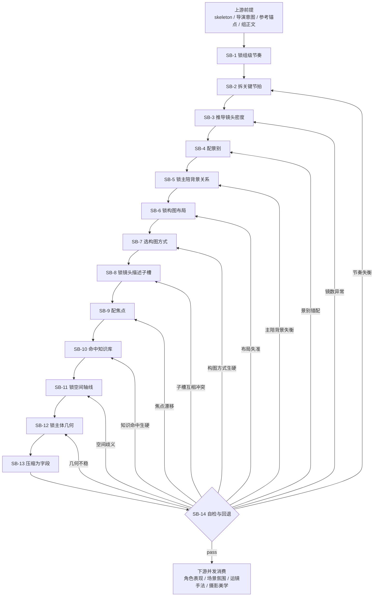

# 分镜表现维度细则

## 负责字段

- `场景及方位`
- `分镜表现`
- `景别`
- `镜头属性`
- `镜头框架`
- `镜头类型`
- `镜头视角`
- `角色及站位和穿搭` 的几何关系与显著穿搭
- `道具及状态` 的叙事底座

## 着手方面

1. 整个分镜组的节奏感是什么
2. 这个分镜组可以拆成哪些关键节拍
3. 节拍决定的镜头密度与镜数是多少
4. 每个节拍最合适的景别是什么
5. 每个分镜的主体、陪体、背景三层关系是否清楚
6. 构图布局是否把叙事重心、负空间与观看路径放在正确位置
7. 构图方式是否真的服务当前镜头任务，而不是只追求形式感
8. `景别 / 镜头属性 / 镜头框架 / 镜头类型 / 镜头视角` 这五个镜头描述子槽是否已经锁定
9. 每个分镜最该突出的焦点是什么
10. 空间锚点、镜头轴线、主体几何关系是否成立
11. `knowledge-base/电影学院派/分镜脚本` 是否有可命中的镜头设计/调度/语法元素

## 参考知识库

- `knowledge-base/电影学院派/分镜脚本/电影镜头设计.md`
- `knowledge-base/电影学院派/分镜脚本/电影镜头调度.md`
- `knowledge-base/电影学院派/分镜脚本/电影镜头语法.md`

使用原则：

- 只在当前镜头问题确实需要时命中，不机械套用。
- 命中后必须转译成当前项目的可执行表述，例如景别、视点、调度、焦点、镜头意图。
- 不得把知识库标题或作品名直接写进业务字段。

## 思维·执行节点

| node_id | objective | inputs | actions | evidence | route_out | gate |
| --- | --- | --- | --- | --- | --- | --- |
| `SB-1 锁组级节奏` | 判断整个分镜组的节奏气质 | skeleton、导演意图、命中组正文、`reference_anchor_note` | 提炼整组是压迫、迟滞、爆发、游移还是对峙推进 | `group_rhythm_note` | pass -> `SB-2` | 节奏必须可描述、可执行 |
| `SB-2 拆关键节拍` | 把分镜组拆成关键 beat | `group_rhythm_note`、组正文 | 列出节拍点、每拍叙事任务与转折 | `beat_map` | pass -> `SB-3` | 节拍必须覆盖组内核心转折 |
| `SB-3 推导镜头密度` | 由节拍决定镜头数与分镜密度 | `beat_map`、总时长、preset 保护 | 判断每拍需要 1 镜还是多镜，并回写镜数密度建议 | `density_note` | pass -> `SB-4` | 密度不能脱离节奏与时长 |
| `SB-4 配景别` | 为每个节拍匹配最优景别 | `beat_map`、`density_note`、参考锚点 | 为每拍/每镜分配远中近特关系与视角距离 | `scale_plan` | pass -> `SB-5` | 景别必须服务该拍任务 |
| `SB-5 锁主陪背景关系` | 为每镜建立主体、陪体、背景三层分工 | `scale_plan`、导演意图、角色关系、场景线索 | 锁每镜主信息承载者、陪体辅助者、背景叙事底座，以及遮挡/借景关系 | `figure_ground_map` | pass -> `SB-6` | 三层关系不得塌缩成一团 |
| `SB-6 锁构图布局` | 决定画面重心如何落位 | `figure_ground_map`、`beat_map`、`density_note` | 安排主体与陪体的左右/高低/前后位置、负空间、入口出口与观看路径起点 | `layout_note` | pass -> `SB-7` | 布局必须解释画面重心为何这样放 |
| `SB-7 选构图方式` | 选择最适合当前镜头任务的构图方法 | `layout_note`、参考锚点、导演意图 | 在居中、对角、框中框、三角、压迫遮挡、对称/失衡等方式中择一或组合，并写明采用理由 | `composition_method_note` | pass -> `SB-8` | 构图方式必须服务叙事，不得只为形式好看 |
| `SB-8 锁镜头描述子槽` | 收束可结构化的镜头描述字段 | `scale_plan`、`figure_ground_map`、`composition_method_note`、导演意图 | 为当前镜生成 `景别 / 镜头属性 / 镜头框架 / 镜头类型 / 镜头视角`，其中 `镜头框架` 必须吸收主陪背景层级与构图关系 | `shot_descriptor_patch` | pass -> `SB-9` | 五个子槽必须彼此协调，不得与 `分镜表现` 打架 |
| `SB-9 配焦点` | 为每镜决定最突出焦点 | `shot_descriptor_patch`、导演意图、角色关系 | 锁每镜第一焦点、第二焦点与完整观看路径 | `focus_map` | pass -> `SB-10` | 焦点不可漂移 |
| `SB-10 命中知识库` | 判断学院派分镜语法是否有可复用元素 | `beat_map`、`layout_note`、`composition_method_note`、`shot_descriptor_patch`、`focus_map`、知识库 | 命中镜头设计/调度/语法条目，并转译成当前镜头策略 | `academy_hit_note` | pass -> `SB-11` | 知识命中必须转译，不得照抄 |
| `SB-11 锁空间轴线` | 建立可定位的空间关系 | `focus_map`、`academy_hit_note`、场景线索 | 决定方位、前中后景、遮挡与入口/出口关系 | `space_anchor_note` | pass -> `SB-12` | 空间必须可想象 |
| `SB-12 锁主体几何` | 让角色和道具进入稳定几何关系 | `space_anchor_note`、表演线索 | 写站位、朝向、距离、层次、关键道具位置 | `geometry_patch` | pass -> `SB-13` | 几何关系须支撑后续动作 |
| `SB-13 压缩为字段` | 生成 merge-safe 字段内容 | `geometry_patch`、`shot_descriptor_patch`、全局风格、知识命中转译 | 写 `场景及方位 / 分镜表现 / 景别 / 镜头属性 / 镜头框架 / 镜头类型 / 镜头视角 / 角色及站位和穿搭 / 道具及状态` | `staging_patch` | pass -> `SB-14` | 字段不得越权到摄影/氛围 |
| `SB-14 自检与回退` | 检查是否仍服务叙事任务 | `staging_patch` | 检查主陪背景失衡、布局失准、构图方式生硬、子槽互相冲突、空间歧义、密度失衡、景别错配、焦点不清、装饰过载 | `staging_note` 或 `staging_report` | pass -> 父链；fail -> 回 `SB-2/3/4/5/6/7/8/9/10/11/12/13` | 通过后才可进入表演/摄影链 |

## Mermaid 拓扑




## 质量门禁

- 主体重心、观看路径、景别关系明确。
- 主体、陪体、背景三层关系清楚，没有信息层级打架。
- 构图布局能解释重心、负空间与入口出口安排。
- 构图方式与镜头任务匹配，不是空泛套招。
- `景别 / 镜头属性 / 镜头框架 / 镜头类型 / 镜头视角` 五个子槽彼此一致，且能补强 `分镜表现` 而非重复它。
- 节拍拆分合理，镜头密度与组节奏匹配。
- 每个节拍的景别与每个分镜的焦点都能解释“为什么是这样”。
- 空间与道具能支撑后续动作、表演和运镜。
- 不把分镜表现写成摄影参数或氛围口号。
- 知识库命中有转译，不是生硬套术语。
- `note` 需说明放弃了哪些构图布局与构图方式。

## 推荐子槽口径

- `景别`：用远景 / 全景 / 中景 / 近景 / 特写等直接表明镜距判断。
- `镜头属性`：说明这是定场、关系建立、情绪强调、反应、交代、转折等哪类叙事属性。
- `镜头框架`：压缩主体/陪体/背景关系与构图结果，例如“`双主体对峙，前后景分层`”。
- `镜头类型`：说明该镜在叙事链中的职责，例如“`叙事镜头` / `情绪镜头` / `信息镜头` / `反应镜头`”。
- `镜头视角`：说明观众所处观看位置，例如“`平视` / `俯视` / `仰视` / `主观视角` / `过肩视角`”。

推荐原则：

- 这五个子槽默认由 `SB-8` 统一收束，不能各写各的。
- `镜头框架` 是最适合承接“主体·陪体·背景关系 + 构图布局 + 构图方式”的压缩子槽。
- 当 schema 或下游暂时不消费这些子槽时，仍应先在内部锁定，再压缩回 `分镜表现` 字段。
- 若当前任务要求结构化输出，可直接写成如下形式：

```json
{
  "景别": "中景",
  "镜头属性": "定场镜头",
  "镜头框架": "双主体对峙，前后景分层",
  "镜头类型": "叙事镜头",
  "镜头视角": "平视"
}
```

## 回退策略

- 空间坐标不清时，回到 `SB-10`，不要凭感觉补景。
- 主体、陪体、背景层级不清时，回到 `SB-5` 重锁三层关系。
- 构图布局解释不通时，回到 `SB-6` 重排重心、负空间与入口出口。
- 构图方式只是装饰时，回到 `SB-7` 改选更能服务叙事的方式。
- 镜头描述子槽彼此打架时，回到 `SB-8` 重锁 `景别 / 镜头属性 / 镜头框架 / 镜头类型 / 镜头视角`。
- 主体不清或观看路径断裂时，回到 `SB-9` 重锁焦点与观看路径。
- 节奏失衡或镜头数明显过多/过少时，回到 `SB-2/3` 重拆节拍和密度。
- 景别选择解释不通时，回到 `SB-4` 重配景别。
- 道具只剩装饰意义时，删减到最小必要叙事底座。
