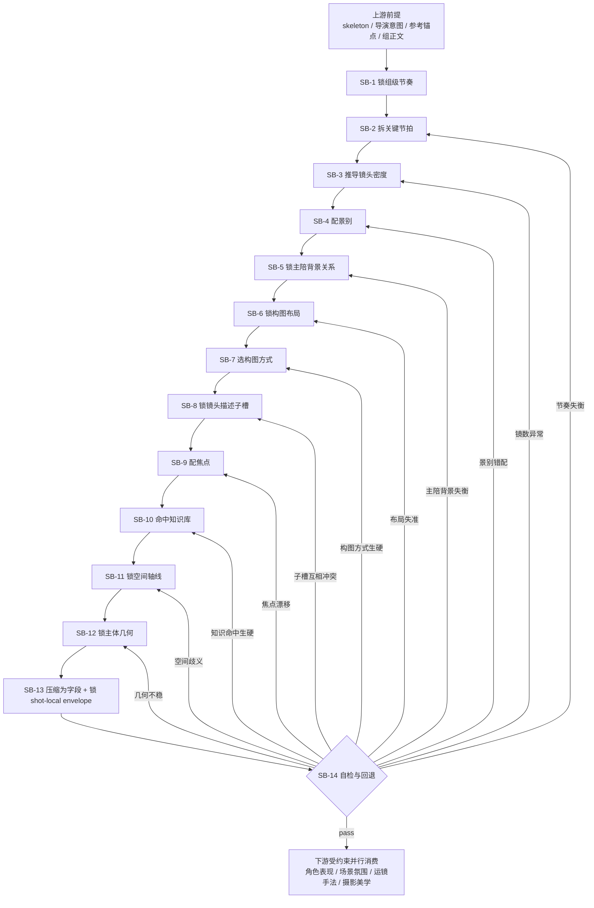
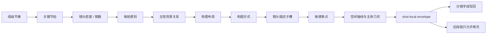

# 分镜表现维度细则

## 负责字段

- `角色背景面`
- `分镜表现`
- `景别`
- `镜头属性`
- `镜头框架`
- `镜头类型`
- `镜头视角`
- `角色站位走位` 的几何关系与位移路径；显著穿搭默认回指组级 `出场角色及穿搭`
- `道具及状态` 的叙事底座

## 着手方面

1. 整个分镜组的节奏感是什么
2. 这个分镜组可以拆成哪些关键节拍
3. 节拍决定的镜头密度与镜数是多少
4. 每个节拍最合适的景别是什么
5. 每个分镜的主体、陪体、背景三层关系是否清楚
6. 构图布局是否把叙事重心、负空间与观看路径放在正确位置
7. 构图方式是否真的服务当前镜头任务，而不是只追求形式感
8. `景别 / 镜头属性 / 镜头框架 / 镜头类型 / 镜头视角` 这五个镜头描述子槽是否已经锁定
9. 每个分镜最该突出的焦点是什么
10. 空间锚点、镜头轴线、主体几何关系是否成立
11. `knowledge-base/电影学院派/分镜脚本` 是否有可命中的镜头设计/调度/语法元素
12. 当前段落的 `叙事内核 / Previous End / Current Mission / Next Start / 情绪引导` 如何落成景别与视点节奏
13. 当前段落更适合哪种 `景别节奏模板` 与 `POV 策略`
14. 命中镜头窗口内，实际景别曲线、心理距离与情感目标是否一致

## 参考知识库

- `knowledge-base/电影学院派/分镜脚本/电影镜头设计.md`
- `knowledge-base/电影学院派/分镜脚本/电影镜头调度.md`
- `knowledge-base/电影学院派/分镜脚本/电影镜头语法.md`

使用原则：

- 只在当前镜头问题确实需要时命中，不机械套用。
- 命中后必须转译成当前项目的可执行表述，例如景别、视点、调度、焦点、镜头意图。
- 不得把知识库标题或作品名直接写进业务字段。

## 思维·执行节点

| node_id | objective | inputs | actions | evidence | route_out | gate |
| --- | --- | --- | --- | --- | --- | --- |
| `SB-1 锁组级节奏` | 判断整个分镜组的节奏气质 | skeleton、导演意图、命中组正文、`reference_anchor_note` | 提炼整组是压迫、迟滞、爆发、游移还是对峙推进，并同步锁定 `叙事内核 / Previous End / Current Mission / Next Start / 情绪引导` | `group_rhythm_note`、`story_memory_note`、`emotion_guide_note` | pass -> `SB-2` | 节奏必须可描述、可执行 |
| `SB-2 拆关键节拍` | 把分镜组拆成关键 beat | `group_rhythm_note`、组正文 | 列出节拍点、每拍叙事任务与转折 | `beat_map` | pass -> `SB-3` | 节拍必须覆盖组内核心转折 |
| `SB-3 推导镜头密度` | 由节拍决定镜头数与分镜密度 | `beat_map`、总时长、preset 保护 | 判断每拍需要 1 镜还是多镜，并回写镜数密度建议 | `density_note` | pass -> `SB-4` | 密度不能脱离节奏与时长 |
| `SB-4 配景别` | 为每个节拍匹配最优景别 | `beat_map`、`density_note`、参考锚点、`story_memory_note`、`emotion_guide_note` | 先选择最适合当前叙事的 `景别节奏模板`，写明选择理由，再为每拍/每镜分配远中近特关系与视角距离 | `scale_plan`、`shot_size_rhythm_preview` | pass -> `SB-5` | 景别必须服务该拍任务 |
| `SB-5 锁主陪背景关系` | 为每镜建立主体、陪体、背景三层分工 | `scale_plan`、导演意图、角色关系、场景线索 | 锁每镜主信息承载者、陪体辅助者、背景叙事底座，以及遮挡/借景关系 | `figure_ground_map` | pass -> `SB-6` | 三层关系不得塌缩成一团 |
| `SB-6 锁构图布局` | 决定画面重心如何落位 | `figure_ground_map`、`beat_map`、`density_note` | 安排主体与陪体的左右/高低/前后位置、负空间、入口出口与观看路径起点 | `layout_note` | pass -> `SB-7` | 布局必须解释画面重心为何这样放 |
| `SB-7 选构图方式` | 选择最适合当前镜头任务的构图方法 | `layout_note`、参考锚点、导演意图 | 在居中、对角、框中框、三角、压迫遮挡、对称/失衡等方式中择一或组合，并写明采用理由 | `composition_method_note` | pass -> `SB-8` | 构图方式必须服务叙事，不得只为形式好看 |
| `SB-8 锁镜头描述子槽` | 收束可结构化的镜头描述字段 | `scale_plan`、`shot_size_rhythm_preview`、`figure_ground_map`、`composition_method_note`、导演意图 | 为当前镜生成 `景别 / 镜头属性 / 镜头框架 / 镜头类型 / 镜头视角`，并同步写出 `POV 策略预判`，其中 `镜头框架` 必须吸收主陪背景层级与构图关系 | `shot_descriptor_patch`、`pov_strategy_note` | pass -> `SB-9` | 五个子槽必须彼此协调，不得与 `分镜表现` 打架 |
| `SB-9 配焦点` | 为每镜决定最突出焦点 | `shot_descriptor_patch`、导演意图、角色关系 | 锁每镜第一焦点、第二焦点与完整观看路径 | `focus_map` | pass -> `SB-10` | 焦点不可漂移 |
| `SB-10 命中知识库` | 判断学院派分镜语法是否有可复用元素 | `beat_map`、`layout_note`、`composition_method_note`、`shot_descriptor_patch`、`focus_map`、知识库 | 命中镜头设计/调度/语法条目，并转译成当前镜头策略 | `academy_hit_note` | pass -> `SB-11` | 知识命中必须转译，不得照抄 |
| `SB-11 锁空间轴线` | 建立可定位的空间关系 | `focus_map`、`academy_hit_note`、场景线索 | 决定方位、前中后景、遮挡与入口/出口关系 | `space_anchor_note` | pass -> `SB-12` | 空间必须可想象 |
| `SB-12 锁主体几何` | 让角色和道具进入稳定几何关系 | `space_anchor_note`、表演线索 | 写站位、朝向、距离、层次、关键道具位置 | `geometry_patch` | pass -> `SB-13` | 几何关系须支撑后续动作 |
| `SB-13 压缩为字段` | 生成 merge-safe 字段内容 | `geometry_patch`、`shot_descriptor_patch`、全局风格、知识命中转译 | 写 `角色背景面 / 分镜表现 / 景别 / 镜头属性 / 镜头框架 / 镜头类型 / 镜头视角 / 角色站位走位 / 道具及状态` | `staging_patch` | pass -> `SB-14` | 字段不得越权到摄影/氛围 |
| `SB-14 自检与回退` | 检查是否仍服务叙事任务 | `staging_patch`、`shot_size_rhythm_preview`、`pov_strategy_note` | 检查主陪背景失衡、布局失准、构图方式生硬、子槽互相冲突、空间歧义、密度失衡、景别错配、焦点不清、装饰过载，并完成 `节奏曲线验证 / 心理距离深度审视 / 反直觉检验` | `staging_note`、`rhythm_curve_check`、`psychological_distance_grid`、`counterintuition_note` 或 `staging_report` | pass -> 父链；fail -> 回 `SB-2/3/4/5/6/7/8/9/10/11/12/13` | 通过后才可进入表演/摄影链 |

## 结构化分镜密度预算机制

`SB-2 / SB-3` 不再允许只给出模糊“快一点 / 慢一点”的判断；但也不再追求把镜数锁成唯一精确值。当前要求是：先用脚本生成可解释的结构化预算，再由结构链与下游维度在预算内落镜。

预算真源：

- `scripts/detail_density_quantizer.py`
- `scripts/validate_detail_output.py`

### 核心概念

- `候选节拍`
  - 是 quantizer 根据 `动作阶段点 / 台词气口点 / 焦点切换点 / 结构转折点` 联合分段得出的候选拆镜单位，不等于最终分镜数。
- `推荐镜数基准`
  - 是候选节拍经过 `节奏系数` 投影后的第一基准值。
- `首选镜数`
  - 是在 `推荐镜数基准` 上结合扩展/压缩余量后得到的默认落点，字段名为 `preferred_shot_count`。
- `镜数预算区间`
  - 是当前组允许的合理镜数范围，字段名为 `shot_budget_floor / shot_budget_ceiling`；validator 只校验实际镜数是否落在该区间内。
- `hook_preview_count`
  - 只记录 `tail-hook` 或下一组借入首拍的预映强度，默认不并入当前组 canonical shot budget。
- `shot_count_decision`
  - 仅保留为兼容旧下游的 legacy alias，等价于 `preferred_shot_count`，不再代表“不可变唯一真值”。

### 候选节拍构成

`候选节拍` 不是把四类信号做机械累加，而是以四类信号作为“是否切成新 beat”的触发条件。

量化器的默认顺序：

1. 先把 grouped script 正文解析为 `动作 / 对白 / 说明性 support visual` 原子单元。
2. 再用四类信号判断相邻单元是否应切成新 beat。
3. 最终以分段后的 `candidate beat segments` 数量作为 `canonical_beat_count`。

口径固定如下：

- `动作阶段点`
  - 只在动作进入新阶段时计分，例如 `展示 -> 失控`、`靠近 -> 停住`、`寻找关闭入口 -> 误触升级`。
  - 不是“一个动词 = 一分”；同一镜内可连续完成的小动作链不得机械拆点。
- `台词气口点`
  - 只记有效断句或独立发言落点。
  - 语气词、接话词、可并入同一反应镜的极短补句不单独加点。
- `焦点切换点`
  - 只在观众第一关注对象明确切换时计分，例如 `老刘 -> 静姐`、`人物 -> 量子核桃`、`主角 -> 围观群体`。
  - 不是“画面里出现几个对象就加几分”。
- `结构转折点`
  - 只在叙事任务发生不可压并的功能切换时计分，例如 `建立 -> 推进`、`抬势 -> 爆点`、`揭示 -> 反应`、`爆点 -> 余波`、`求救 -> 露馅`。

硬规则：

- 四类信号是分段条件，不是“多出现一次就一定多一镜”的加法计分器。
- 若若干单元仍服务同一主任务、同一主焦点、同一动作链，即使文本里出现多句对白或多条动作，也允许合并为一个 `candidate beat`。
- `tail-hook` 默认只形成 `hook_preview_count`，除非 quantizer 判定其在当前组承担独立余波职责，否则不并入 `canonical_beat_count`。

### 节奏系数

- `超快节奏 = 1.4`
- `快节奏 = 1.2`
- `正常节奏 = 1.0`
- `慢节奏 = 0.8`
- `超慢节奏 = 0.6`

### 格式变量

- `3-Detail` 的镜数公式不再引入额外格式系数。
- 无论项目形态为何，密度计算层统一等价于乘 `1.0`。
- 若确实需要更密或更疏的镜数，应通过 `节拍拆分`、`pace_tier`、`expansion/compression headroom` 与 `preferred_reasons` 给出可解释证据，而不是额外叠加格式乘数。

### 推荐镜数基准公式

- `推荐镜数基准 = round(候选节拍 * 节奏系数)`
- `推荐镜数基准` 最低为 `1`

### 扩展余量与压缩余量

当前密度机制不再用“唯一精确镜数”锁死执行，而是先给出 `推荐镜数基准`，再计算：

- `expansion_headroom`
  - 表示当前组最多还可以上探多少镜，用来容纳独立爆点、群体接力反应或确有职责的尾钩余波。
- `compression_headroom`
  - 表示当前组最多还可以压回多少镜，用来容纳同主焦点、同动作链、同叙事任务的可合镜空间。
- `preferred_shot_count`
  - 是默认首选值，不是唯一合法值；它必须落在 `shot_budget_floor / shot_budget_ceiling` 之间。

扩展余量的常见触发：

- 命中下列任一项，可 `+1`：
  - 爆点必须单独落地
  - 反应必须单独着陆
  - 公共围观压力或多对象接力反应明确形成
  - 奇观揭示 / 尺度切换需要单独观看落点
  - `hook preview` 在当前组确实承担“余波 / 预感 / 将收未收”的独立职责
- 单组 `expansion_headroom` 默认上限 `+2`。

压缩余量的常见触发：

- 命中下列任一项，可 `-1`：
  - 同一空间轴线、同一叙事任务、同一主焦点在一镜内可连续完成
  - 极短接话或短促反应可稳定并入上一镜
  - 连续小动作只是同一行为链的延续修饰
- 单组 `compression_headroom` 默认上限 `+2`；预算下限不得低于 `1 镜`。

行业常规优先级：

- `10-15 秒` 的中节奏组，优先把预算压在 `2-4 镜`。
- `4-6 镜` 需要明确的反应链、调度变化或情绪层级证据。
- `7-9 镜` 只适用于强冲突、群像接力、笑点连打或明显 montage 化段落，不应在普通中节奏组里频繁出现。

### 预算裁决结果

当前阶段的 density 结果由 quantizer 直接给出，不再经过 `group_scene_mode` 推荐窗 / 硬窗的二次夹取。

固定输出：

- `canonical_beat_count`
- `hook_preview_count`
- `action_phase_points`
- `dialogue_breath_points`
- `focus_shift_points`
- `structural_turn_points`
- `pace_tier`
- `recommended_shot_baseline`
- `expansion_headroom`
- `compression_headroom`
- `preferred_shot_count`
- `shot_budget_floor`
- `shot_budget_ceiling`
- `shot_count_decision`（兼容旧下游）
- `why_not_fewer`
- `why_not_more`

解释顺序：

1. quantizer 先解出 `candidate beat segments`
2. 再计算 `recommended_shot_baseline`
3. 再给出 `expansion_headroom / compression_headroom`
4. 最后输出 `preferred_shot_count + shot_budget_floor / shot_budget_ceiling`

### 强制输出项

`SB-2 / SB-3` 至少要显式锁定：

- `canonical_beat_count`
- `hook_preview_count`
- `action_phase_points`
- `dialogue_breath_points`
- `focus_shift_points`
- `structural_turn_points`
- `pace_tier`
- `recommended_shot_baseline`
- `expansion_headroom`
- `compression_headroom`
- `preferred_shot_count`
- `shot_budget_floor`
- `shot_budget_ceiling`
- `why_not_fewer`
- `why_not_more`

## 景别节奏预判 (Shot Size Rhythm Preview)

命中镜头窗口使用“当前组本轮命中的连续镜头序列”；不预设固定镜数，按实际命中窗口执行。

### 宏观节奏模板选择

| 模板 | 节奏曲线 | 适用场景 |
| --- | --- | --- |
| 渐进式 | 远→全→中→近→特→极特 | 逐步揭示，悬疑探索 |
| 冲击式 | 特→远→中→特→全→特 | 情感爆发，高潮时刻 |
| 呼吸式 | 中→远→中→近→中→远 | 常规叙事，平稳推进 |
| 对峙式 | 中→特→中→特→中→全 | 对话交锋，张力对抗 |
| 包围式 | 远→中→近→近→中→远 | 情绪聚焦后释放 |
| 自定义 | `[___]` | 根据叙事需求设计 |

`SB-4` 至少要锁定：

- `选定模板`
- `选择理由`
- 该模板如何服务 `叙事内核 / Current Mission / 情绪引导`

## POV 策略预判 (POV Strategy Preview)

| 视点类型 | 观众位置 | 情感效果 |
| --- | --- | --- |
| 主角 POV | 与主角同在 | 代入感、共情、紧张 |
| 对手 POV | 站在对立面 | 威胁感、理解反派 |
| 旁观者 POV | 冷眼旁观 | 客观、疏离、审视 |
| 全知 POV | 上帝视角 | 宏观、命运感、讽刺 |
| 受害者 POV | 弱者立场 | 同情、恐惧、压迫感 |
| 混合 POV | 多视点切换 | 复杂、多层次、张力 |

`SB-8` 至少要锁定：

- `选定视点`
- `道德立场`
- `切换策略`

## 节奏曲线验证

`SB-14` 必须对照 `SB-4` 的模板，至少回答：

- `预判模板`
- `实际曲线`
- `偏离分析`

## 心理距离深度审视

`SB-14` 必须按命中镜头窗口逐镜复核：

| Panel | 物理景别 | 预期心理距离 | 实际心理效果 | 是否需要调整？ |
| --- | --- | --- | --- | --- |
| 1 | `[___]` | `[亲近/中立/疏离]` | `[___]` | `[是/否]` |
| 2 | `[___]` | `[亲近/中立/疏离]` | `[___]` | `[是/否]` |
| 3 | `[___]` | `[亲近/中立/疏离]` | `[___]` | `[是/否]` |
| 4 | `[___]` | `[亲近/中立/疏离]` | `[___]` | `[是/否]` |
| 5 | `[___]` | `[亲近/中立/疏离]` | `[___]` | `[是/否]` |
| 6 | `[___]` | `[亲近/中立/疏离]` | `[___]` | `[是/否]` |

## 反直觉检验

`SB-14` 必须至少复核以下问题：

- 特写是否反而造成疏离
- 远景是否反而造成亲近
- 中景是否沦为“安全但平庸”的选择
- 景别选择是否服务于情感目标，而非只服务信息传递

### 硬规则

1. 若组正文含 `tail-hook` 借入段或下一组预映首拍，默认只计入 `hook_preview_count`，不自动折算为当前组独立分镜。
2. `hook preview` 只有在当前组确实需要一个“预感 / 余波 / 将收未收”的独立落点时，才允许转成额外 shot；否则只作为本组结尾张力证据。
3. `1 镜` 只适用于单一主任务、单一主焦点、单一节拍即可成立的组；若该组还承担建立关系后再推进、或先信息后反应，则不得硬压成 `1 镜`。
4. `2 镜` 适用于清晰双拍结构，例如“建立 -> 推进”“动作 -> 反应”“抬势 -> 转折”；它是常见解，不是默认解。
5. `3 镜` 适用于至少三个不可压并的叙事拍点，例如“建立 -> 触发 -> 反应”“铺垫 -> 爆点 -> 余波”“对象揭示 -> 人物承受 -> 关系回弹”。
6. `4 镜及以上` 只在 `crowd / action / 连续误会升级 / 多对象接力反应 / 漫画页式离散拍点` 确有必要时进入；必须证明多出的镜头承担独立叙事任务，而不是把同一信息切碎。
7. `preferred_shot_count + shot_budget_floor / shot_budget_ceiling` 必须以 `detail_density_quantizer.py` 为预算真源；人工只能在预算内解释，不得脱离预算随意改镜。
8. 若 episode JSON 中的实际镜数超出 quantizer 预算区间，`validate_detail_output.py` 必须直接失败。
9. 若同一集超过一半分镜组被裁成同一镜数，且不存在 preset / 主故事源 / 明确形式实验作为统一约束，`SB-14` 必须触发 `密度同质化` 返工，回到 `SB-2/3` 逐组重判。

## Mermaid 拓扑





## 质量门禁

- 主体重心、观看路径、景别关系明确。
- 主体、陪体、背景三层关系清楚，没有信息层级打架。
- 构图布局能解释重心、负空间与入口出口安排。
- 构图方式与镜头任务匹配，不是空泛套招。
- `景别 / 镜头属性 / 镜头框架 / 镜头类型 / 镜头视角` 五个子槽彼此一致，且能补强 `分镜表现` 而非重复它。
- 节拍拆分合理，镜头密度与组节奏匹配。
- 实际镜数落在 `shot_budget_floor / shot_budget_ceiling` 内，且 `preferred_shot_count` 没有被无理由偏离。
- 每个节拍的景别与每个分镜的焦点都能解释“为什么是这样”。
- `景别节奏模板 / POV 策略 / 命中镜头窗口验证` 已经完成，且偏离都是有意而非失控。
- `心理距离` 与目标情感一致，不会出现“信息正确但体感错误”。
- 若本集大多数分镜组都落成相同镜数，必须能解释这是上游锁定还是组级独立裁决，而不是沿用隐性模板。
- 空间与道具能支撑后续动作、表演和运镜。
- 不把分镜表现写成摄影参数或氛围口号。
- 知识库命中有转译，不是生硬套术语。
- 已通过 `反直觉检验`，不会把“近=亲近、远=疏离”当成机械公式。
- `note` 需说明放弃了哪些构图布局与构图方式。

## 推荐子槽口径

- `景别`：用远景 / 全景 / 中景 / 近景 / 特写等直接表明镜距判断。
- `镜头属性`：说明这是定场、关系建立、情绪强调、反应、交代、转折等哪类叙事属性。
- `镜头框架`：压缩主体/陪体/背景关系与构图结果，例如“`双主体对峙，前后景分层`”。
- `镜头类型`：说明该镜在叙事链中的职责，例如“`叙事镜头` / `情绪镜头` / `信息镜头` / `反应镜头`”。
- `镜头视角`：说明观众所处观看位置，例如“`平视` / `俯视` / `仰视` / `主观视角` / `过肩视角`”。

推荐原则：

- 这五个子槽默认由 `SB-8` 统一收束，不能各写各的。
- `镜头框架` 是最适合承接“主体·陪体·背景关系 + 构图布局 + 构图方式”的压缩子槽。
- 当 schema 或下游暂时不消费这些子槽时，仍应先在内部锁定，再压缩回 `分镜表现` 字段。
- 若当前任务要求结构化输出，可直接写成如下形式：
  - 下方 JSON 只用于示意字段形状与表达粒度，不代表固定推荐值。
  - `中景 / 定场镜头 / 双主体对峙，前后景分层 / 叙事镜头 / 平视` 都只是示例，具体取值必须按当前组/镜的叙事任务、空间关系与焦点判断重填，不得直接代入。

```json
{
  "景别": "中景",
  "镜头属性": "定场镜头",
  "镜头框架": "双主体对峙，前后景分层",
  "镜头类型": "叙事镜头",
  "镜头视角": "平视"
}
```

## 回退策略

- 空间坐标不清时，回到 `SB-10`，不要凭感觉补景。
- 主体、陪体、背景层级不清时，回到 `SB-5` 重锁三层关系。
- 构图布局解释不通时，回到 `SB-6` 重排重心、负空间与入口出口。
- 构图方式只是装饰时，回到 `SB-7` 改选更能服务叙事的方式。
- 镜头描述子槽彼此打架时，回到 `SB-8` 重锁 `景别 / 镜头属性 / 镜头框架 / 镜头类型 / 镜头视角`。
- 主体不清或观看路径断裂时，回到 `SB-9` 重锁焦点与观看路径。
- 节奏失衡或镜头数明显过多/过少时，回到 `SB-2/3` 重拆节拍和密度。
- 若大多数分镜组都被写成同一镜数，先检查是否把 `tail-hook` 预映误当成本组节拍，或把共享样例误用成镜数模板，再回到 `SB-2/3` 重判。
- 景别选择解释不通时，回到 `SB-4` 重配景别。
- 道具只剩装饰意义时，删减到最小必要叙事底座。
