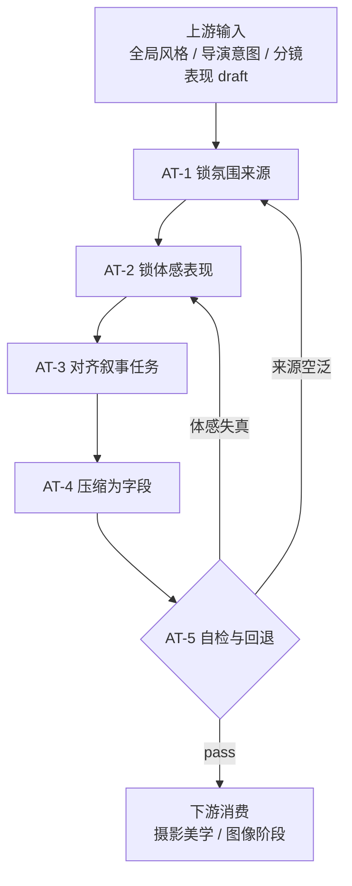

# 场景氛围维度细则

## 负责字段

- `场景氛围`

## 着手方面

1. 氛围来自什么物理或体感来源
2. 这种来源如何服务镜头任务
3. 是否可被摄影和画面阶段继续消费

## 思维·执行节点

| node_id | objective | inputs | actions | evidence | route_out | gate |
| --- | --- | --- | --- | --- | --- | --- |
| `AT-1 锁氛围来源` | 明确氛围来自哪里 | 全局风格、导演意图、分镜表现 draft | 在时间/天气/温度/湿度/空气密度/压迫感中选主要来源 | `atmosphere_source_note` | pass -> `AT-2` | 来源必须具体 |
| `AT-2 锁体感表现` | 把来源转为可感知条件 | `atmosphere_source_note` | 写空气、回声、冷暖、湿度、安静/危险来源 | `sensory_list` | pass -> `AT-3` | 不能只剩情绪词 |
| `AT-3 对齐叙事任务` | 确认氛围不会压过信息主任务 | `sensory_list`、skeleton | 检查氛围是否支持当前镜头目标 | `atmosphere_alignment_note` | pass -> `AT-4` | 不可喧宾夺主 |
| `AT-4 压缩为字段` | 生成 `场景氛围` 文本 | `atmosphere_alignment_note` | 写成简洁、可体验、可继承的氛围描述 | `atmosphere_patch` | pass -> `AT-5` | 不得写成摄影参数 |
| `AT-5 自检与回退` | 留下边界与风险 | `atmosphere_patch` | 记录为何成立、哪些浓度被主动压低 | `atmosphere_note` 或 `atmosphere_report` | pass -> 父链；fail -> 回 `AT-1/2` | 通过后才可交给摄影链 |

## Mermaid 拓扑

## 质量门禁

- 氛围来源明确。
- 描述具备体感，不靠抽象情绪词堆砌。
- 可被摄影和图像阶段理解为环境条件，而不是口号。

## 回退策略

- 只能写抽象情绪词时，返回 `report`。
- 若浓烈氛围会压过信息清晰度，回退到更克制的中性方案。
