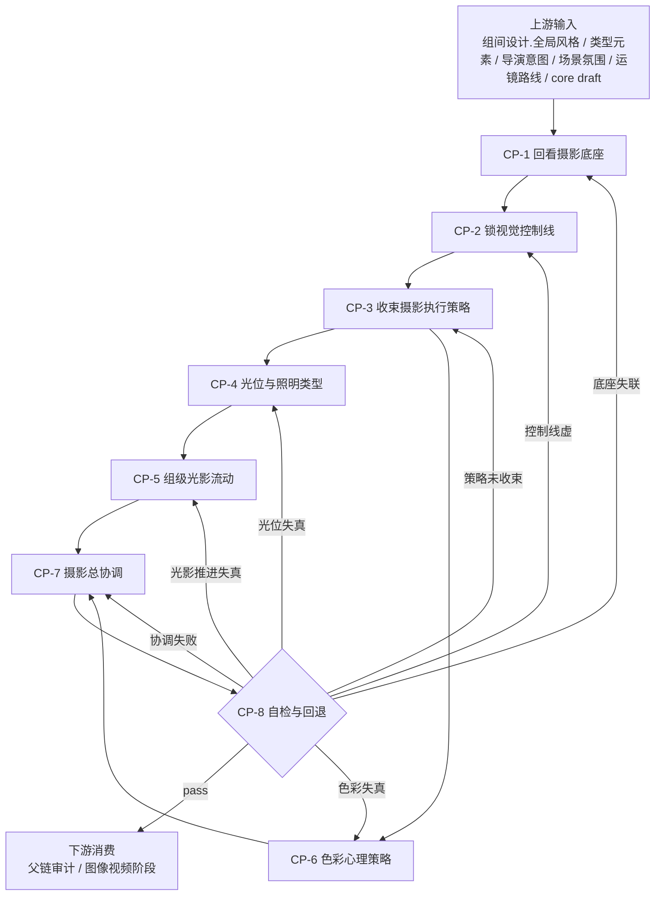

# 摄影美学维度细则

## 负责字段

- `摄影美学`

## 子链

- `摄影前置回看`
- `光位与照明推进`
- `色彩心理`
- `摄影总协调`

## 着手方面

1. 先回看上游 `组间设计.全局风格 / 类型元素 / 导演意图`，锁当前组镜必须继承的摄影承诺与禁区。
2. 再锁视觉控制线，明确主体控制、空间剥离、质感方向与观看压力。
3. 再收束当前镜组的摄影执行策略，明确哪些判断必须稳定贯穿后续光位与色彩分支。
4. 再决定怎样打光：`主光源 / 辅助光 / 逆光 / 照明类型 / 组内光影流动`。
5. 再决定色彩策略：`色相 / 明度 / 饱和度 / 色温 / 色彩心理`。
6. 最后把上述判断压成单一、可执行、可下游消费的 `摄影美学`。

## 项目内摄影判断映射

| 摄影链节点 | 主要判断来源 | 转译方向 |
| --- | --- | --- |
| `CP-3 收束摄影执行策略` | `组间设计.全局风格 / 类型元素 / 导演意图`、场景氛围、运镜路线、当前镜观看压力 | 压成当前镜组的布光与色彩优先级 |
| `CP-4 光位与照明类型` | 主体控制、空间剥离、观看压力、叙事重点 | 决定主光方向、质地、光比与轮廓剥离方式 |
| `CP-5 组级光影流动` | 组内节奏、运镜推进、前后镜关系 | 决定组内镜头如何从压暗到释放、从显形到剪影、从对比到统一 |
| `CP-6 色彩心理策略` | 氛围目标、类型元素、导演意图、当前镜的情绪压力 | 决定 `明度 / 色相 / 饱和度 / 色温 / 色彩心理` |
| `CP-7 摄影总协调` | 光位、光影推进、色彩心理、运镜路线 | 压成最终 single-line `摄影美学` |

## 内部子补丁约定

- `lighting_patch` 至少回答：
  - `主光源`
  - `辅助光`
  - `逆光`
  - `照明类型`
- `group_lighting_note` 至少回答：
  - `光影流动`
- `color_patch` 至少回答：
  - `色相`
  - `明度`
  - `饱和度`
- `色温`
- `色彩心理`
- `cinematography_strategy_note` 至少回答：
  - 当前镜组最应该坚持的布光或色彩优先级
  - 哪些判断被压进 `光位 / 组级光影推进 / 色彩心理`
  - 哪些备选方向被放弃以及为什么不适用

这些子补丁是 `cinematography_engine` 的内部证据，不是 episode schema 的新增业务字段。最终写回字段仍然只有 `摄影美学`。

## 思维·执行节点

| node_id | objective | inputs | actions | evidence | route_out | gate |
| --- | --- | --- | --- | --- | --- | --- |
| `CP-1 回看摄影底座` | 把上游 `组间设计` 的摄影承诺重新拉回当前镜组 | 组间设计.全局风格、组间设计.类型元素、组间设计.导演意图、参考锚点 | 提炼当前组镜必须继承的类型化光色倾向、导演情绪目标、允许偏离范围与禁区 | `cinematography_brief` | pass -> `CP-2` | 没有上游摄影底座不得直接下笔 |
| `CP-2 锁视觉控制线` | 先确定这一镜的视觉主线 | `cinematography_brief`、场景氛围、运镜路线、core draft | 提炼主体控制线、空间剥离线、质感方向、观看压力与镜头应保留的视觉承诺 | `visual_control_note` | pass -> `CP-3` | 没有控制线不得继续 |
| `CP-3 收束摄影执行策略` | 把项目级摄影底座压成当前镜组可执行策略 | `cinematography_brief`、`visual_control_note`、core draft | 提炼当前镜组最该坚持的布光与色彩优先级，并写明不采用的备选方向 | `cinematography_strategy_note` | pass -> `CP-4/6` | 策略必须能被后续光位与色彩阶段消费 |
| `CP-4 光位与照明类型` | 写清怎么打光 | `cinematography_brief`、`visual_control_note`、`cinematography_strategy_note`、core draft | 决定 `主光源 / 辅助光 / 逆光` 的方向、质地、强弱关系，并锁 `硬光 / 柔光 / 混合光` 等照明类型及其戏剧功能 | `lighting_patch` | pass -> `CP-5` | 光源逻辑必须说得通，且不能与场面调度冲突 |
| `CP-5 组级光影流动` | 让组内镜头共享同一套光影推进语法 | `lighting_patch`、skeleton、组级节奏、运镜路线、`cinematography_strategy_note` | 决定光影如何在组内镜头间推进，例如压暗到释放、剪影到显形、逆光增强到轮廓剥离 | `group_lighting_note` | pass -> `CP-7` | 组内镜头不能各打各的光 |
| `CP-6 色彩心理策略` | 写清色板与色温逻辑 | `cinematography_brief`、`visual_control_note`、`cinematography_strategy_note`、场景氛围 | 决定 `色相 / 明度 / 饱和度 / 色温 / 色彩心理`，并写明哪些色彩只能点到为止、哪些必须稳定压住 | `color_patch` | pass -> `CP-7` | 色彩功能必须具体，不能只剩审美标签 |
| `CP-7 摄影总协调` | 合成 single-line 摄影判断 | `lighting_patch`、`group_lighting_note`、`color_patch`、`cinematography_strategy_note`、运镜路线 | 吸收光位、照明推进、色彩心理与运镜路线，压缩成可执行 `摄影美学` | `cinematography_patch` | pass -> `CP-8` | 不得变成口号拼贴或字段枚举堆叠 |
| `CP-8 自检与回退` | 检查与其他维度兼容 | `cinematography_patch` | 检查是否越权到运镜/场景/表演字段，是否脱离上游风格与导演底座 | `cinematography_note` 或 `cinematography_report` | pass -> 父链；fail -> 回 `CP-1/2/3/4/5/6/7` | 通过后才可进入审计 |

## Mermaid 拓扑

## 质量门禁

- 摄影链必须先回看上游 `组间设计.全局风格 / 类型元素 / 导演意图`，不能只从当前镜的局部形容词直接下笔。
- 光影说明至少要交代 `主光源 / 辅助光 / 逆光 / 照明类型`，不是“电影感”“有层次”口号。
- `group_lighting_note` 必须说明组内光影如何推进，不能把每镜写成互不关联的独立布光。
- 色彩说明至少要交代 `色相 / 明度 / 饱和度 / 色温 / 色彩心理`，不是“高级感”“冷暖对比”标签。
- `摄影美学` 必须是一条可执行协调判断，而不是字段枚举堆叠。
- `group_lighting_note` 负责组级统一语法，不是逐镜复读模板；写回每个 shot 的 `摄影美学` 时，必须带当前镜头的局部光位或观看压力差异，禁止整组原句复制。

## 回退策略

- 光位、组级推进与色彩冲突时，优先保留更稳的叙事可读性与项目级摄影承诺。
- 如果只能给出抽象审美词，停止输出 patch，回到 `CP-1` 重读摄影底座。
- 如果摄影执行策略无法稳定转成当前项目语言，回到 `CP-3` 重收束策略，不得硬塞抽象术语。
- 如果组内镜头之间无法共用一套光影推进逻辑，回到 `CP-3/4` 重锁照明类型与流动方式。
