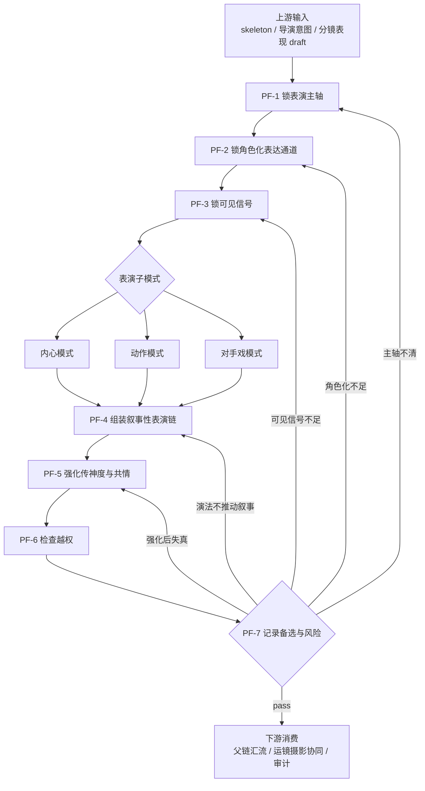

# 角色表现维度细则

## 负责字段

- `角色表现`
- 必要时补 `角色及站位和穿搭` 的动作/关系微调

## 子模式

- `内心模式`
- `动作模式`
- `对手戏模式`

## 共用着手方面

1. 谁在压住什么、暴露什么、推动什么
2. 当前表达是否贴合角色个性、习惯动作与下意识反应
3. 这些变化能否落成镜头可见动作，并真实推动叙事
4. 同一表现目标有没有更具象、更生动、更易引发共情的演法
5. 情绪高点是否能落实到眉眼、呼吸、嘴角、肩颈、手部等传神信号
6. 是否与已锁构图和空间兼容

## 思维·执行节点

| node_id | objective | inputs | actions | evidence | route_out | gate |
| --- | --- | --- | --- | --- | --- | --- |
| `PF-1 锁表演主轴` | 明确当前镜的情绪/动作/关系主轴 | skeleton、导演意图、分镜表现 draft | 选择内心/动作/对手戏之一或组合，并写清此镜真正要观众感到什么、看到什么变化 | `performance_route_note` | pass -> `PF-2` | 主轴不清不得继续 |
| `PF-2 锁角色化表达通道` | 避免把谁都能演的通用动作写进字段 | `performance_route_note`、导演意图中的角色线索、reference anchor | 为当前角色锁定个性化表达通道：性格特征、习惯动作、下意识反应、攻守方式、情绪遮掩方式 | `character_expression_note` | pass -> `PF-3` | 不能只剩“生气/难过/紧张”等通用情绪标签 |
| `PF-3 锁可见信号` | 把抽象意图转成可被镜头捕捉的外显信号 | `character_expression_note`、空间/站位 draft | 提炼视线、停顿、换气、发力、距离、眉眼、嘴角、肩颈、手部、步伐、攻守节奏等可见信号 | `visible_signal_list` | pass -> `PF-4` | 不得停留在心理词；至少要有一组可拍信号 |
| `PF-4 组装叙事性表演链` | 让表演不仅“说明情绪”，还推动镜头事件 | `visible_signal_list`、空间/站位 draft | 按子模式写情绪推进、动作因果、关系变化与叙事推进点，优先让行为触发信息揭示、关系转折或局势升级 | `performance_patch_candidate` | pass -> `PF-5` | 行为必须改变局面或推进理解，不能只是重复情绪 |
| `PF-5 强化传神度与共情` | 在不失真的前提下提升表演的感染力 | `performance_patch_candidate` | 比较克制版与强化版演法，优先保留更具象、更生动、更能让观众读懂角色处境与情绪重量的版本；必要时加强眉眼之间的微表情与呼吸节奏 | `performance_emphasis_note`、`performance_patch_candidate_v2` | pass -> `PF-6` | 强化不能脱离角色既有性格，也不能演成空洞煽情 |
| `PF-6 检查越权` | 防止写成摄影/运镜/分镜表现总论 | `performance_patch_candidate_v2` 或 `performance_patch_candidate` | 删除摄影语言、镜头运动语言、抽象内心独白，只保留表演字段自身应该承载的信息 | `performance_patch` | pass -> `PF-7` | 字段边界必须清楚 |
| `PF-7 记录备选与风险` | 留下返工依据 | `performance_patch`、`performance_emphasis_note` | 记录未采用的更夸张/更复杂处理、未采用原因以及需要摄影/运镜协同捕捉的微表情提示 | `performance_note` 或 `performance_report` | pass -> 父链；fail -> 回 `PF-1/2/3/4/5` | 必须能给出返工入口 |

## Mermaid 拓扑

## 子模式附加规则

### `内心模式`

1. 先找角色最想压住或暴露的东西。
2. 再判断这个角色是外露型、克制型、嘴硬型、冷处理型还是下意识逃避型。
3. 把内心变化写成停顿、换气、视线、肩颈、嘴角、手部等细微信号。
4. 优先让观众从“他怎么忍、怎么躲、怎么露馅”里读到情绪，而不是靠解释词。
5. 禁止直接写“很痛苦 / 很复杂 / 很愤怒”。

### `动作模式`

1. 写清动作起因。
2. 写清发力路径。
3. 写清结果与余波。
4. 优先选择能改变局面、暴露信息或升级关系的动作。
5. 同一目标若有多种动作表达，优先更贴角色个性、更利于镜头捕捉的版本。
6. 禁止把动作描述写成镜头运动。

### `对手戏模式`

1. 先锁谁压谁、谁让谁、谁转守为攻。
2. 再落到站位、距离、视线和出手时机。
3. 把关系变化写成一来一回的行为交换，而不是双人情绪标签并列。
4. 优先保留最能引发观众共情或紧张感的攻守转换点。
5. 禁止制造第二条空间逻辑。

## 共用深化规则

### 个性化表达

1. 表演不是“情绪模板填空”，而是角色性格、习惯和下意识在当前局势中的具体显影。
2. 每镜至少要回答：这个角色会如何表现，而不是一般人会如何表现。
3. 若缺角色化锚点，宁可回退克制版本，也不要编造浮夸动作。

### 动作用行为推动叙事

1. 优先选择会改变信息状态、关系状态或局面状态的动作。
2. 如果一个动作既不揭示人物，也不推动情节，应降级或删除。
3. 表演字段应让下游看到“为什么这个镜必须这样演”，而不是只看到“角色现在很有情绪”。

### 强化形象、生动与共情

1. 同一表现目标优先选择具象而非抽象、带阻力而非直给、带代价而非空喊的演法。
2. 共情通常来自角色想压住却露出来、想维持却失手、想强撑却被细节出卖。
3. 若要增强打动力，优先增加行为前后的犹豫、反应余波和身体小失控，而不是单纯加大情绪词。

### 眉眼与微表情

1. 强情绪不等于大动作；很多高强度情绪更适合落在眼神停留、目光躲闪、眼眶变化、嘴角绷紧、下颌发力、呼吸紊乱等细部。
2. 眉眼信号必须与角色状态一致，不能为了“有戏”而做无根据的夸饰。
3. 若镜头距离或构图条件不支持微表情识别，应把力度转移到姿态、步伐、停顿或攻守距离。

## 质量门禁

- 表演信息必须镜头可见。
- 表演必须带有角色个性、习惯动作或下意识痕迹，不能像通用模板。
- 动作或关系变化必须推动叙事，而不是只重复情绪状态。
- 情绪高点要有具体身体或眉眼承载点，不能只靠抽象形容词。
- 关系、动作、内心三类逻辑不能互相冒充。
- 表演不能破坏已锁定的空间与观看路径。

## 回退策略

- 动机、冲突或关系主轴不清时，返回 `report`。
- 角色化锚点不足时，优先保留更克制、更贴角色既有逻辑的版本。
- 多种演法都成立时，优先选择更具象、更易被镜头捕捉、且更能推动叙事的版本。
