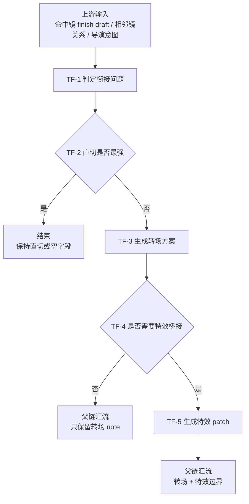

# 转场特效维度细则

## 负责字段

- `转场特效`

## 子模式

- `转场`
- `特效`

## 着手方面

1. 是否真的需要解决时间、空间或情绪衔接
2. 直切是否更强
3. 特效是否具有明确世界观或桥接收益

## 思维·执行节点

| node_id | objective | inputs | actions | evidence | route_out | gate |
| --- | --- | --- | --- | --- | --- | --- |
| `TF-1 判定衔接问题` | 明确需要解决什么衔接 | 命中镜 finish draft、相邻镜关系、导演意图 | 判断是时间、空间、情绪还是世界观桥接问题 | `transition_problem_note` | pass -> `TF-2` | 问题类型必须清楚 |
| `TF-2 判定直切` | 确认直切是否已经最强 | `transition_problem_note` | 比较直切与转场的叙事收益 | `cut_vs_transition_note` | pass -> `TF-3` 或直接结束 | 直切最强时停止继续设计 |
| `TF-3 生成转场方案` | 在必要时给出转场 | `cut_vs_transition_note` | 写转场方式、触发点、叙事收益 | `transition_note` | pass -> `TF-4` | 转场必须节制 |
| `TF-4 判定特效必要性` | 决定是否需要特效桥接 | `transition_note`、全局风格禁区 | 判断是否存在明确世界观或视觉桥接收益 | `fx_gate_note` | pass -> `TF-5` 或结束 | 默认不进入特效 |
| `TF-5 生成特效 patch` | 只在必要时补特效 | `fx_gate_note` | 写效果边界、触发条件、戏剧功能 | `fx_patch` 或 `transition_report` | pass -> 父链 | 特效不得喧宾夺主 |

## Mermaid 拓扑

## 质量门禁

- 先判断是否应保持直切。
- 转场和特效都必须说明叙事收益。
- 效果不能压过主体信息和镜头主任务。

## 回退策略

- 若收益不足，保持空字段或只留保守 note。
- 若效果边界说不清，直接 `report`，不要发明泛化特效。
