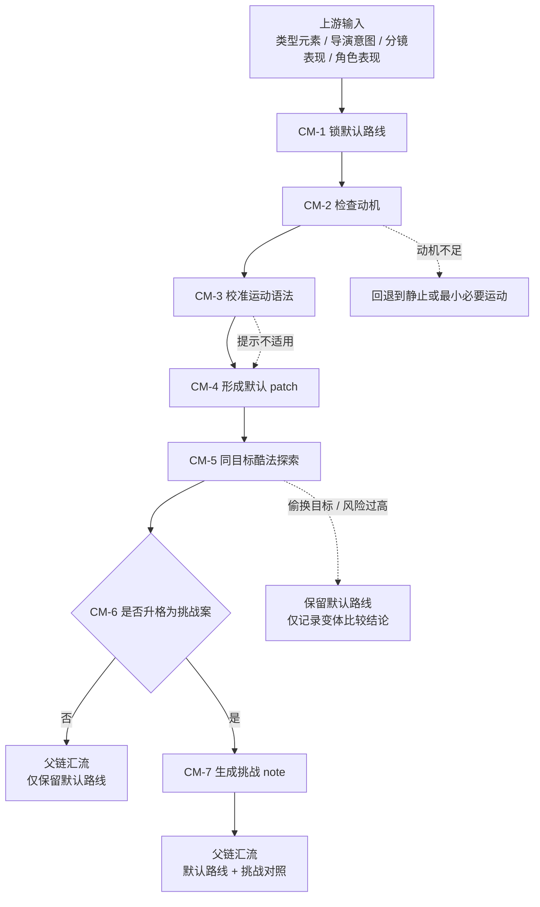

# 运镜手法维度细则

## 负责字段

- `运镜手法`

## 子模式

- `叙事派`：默认主路由
- `炫技派`：条件对照

## 着手方面

1. 为什么要动，或者为什么不动
2. 运镜如何服务信息递送与情绪推进
3. 结构链已经转译出的运动相关提示，是否值得吸收到当前运镜路线
4. 在不改变表现目标的前提下，是否存在更有冲击力的同目标变体
5. 挑战方案是否真的有收益

使用原则：

- 运镜层只处理“运动路径、视角跟随、揭示方式、速度/节奏变化、过轴/绕行/跟随”这类运动语法，不重做 `分镜表现` 已锁定的构图、景别、空间轴线与镜头描述子槽。
- 若 `references/分镜表现.md` 已产生 `academy_hit_note`，运镜层应优先复用其中已经转译好的运动相关部分，而不是重新起一条结构判断链。
- 只有在当前镜头的默认叙事路线已经锁定后，才允许吸收上游已转译的运动提示。
- 上游提示必须继续压缩成当前镜头的运动策略，例如“贴角色停走”“弧线逼近”“揭示式横移”“连续过轴建立新关系”，不得把参考说明直接搬进业务字段。

## 思维·执行节点

| node_id | objective | inputs | actions | evidence | route_out | gate |
| --- | --- | --- | --- | --- | --- | --- |
| `CM-1 锁默认路线` | 明确默认叙事运镜 | 组间设计.类型元素、组间设计.导演意图、core draft | 判断静止 / 轻推 / 跟移 / 摇移 / 手持哪种最稳 | `narrative_route_note` | pass -> `CM-2` | 默认路线必须先存在 |
| `CM-2 检查动机` | 回答为什么要动或不动 | `narrative_route_note` | 写清信息递送、情绪推进、视角跟随中的主原因 | `movement_reason_note` | pass -> `CM-3` | 动机不足时不得硬动 |
| `CM-3 校准运动语法` | 判断上游已转译的运动提示是否应吸收到当前路线 | `movement_reason_note`、`academy_hit_note`（若有）、组间设计.类型元素、组间设计.导演意图 | 只围绕运动相关提示提炼跟随、揭示、逼近、退让、弧线、过轴、停走配合、前后景穿行等模式，并写明为何适用或为何放弃 | `camera_strategy_note` | pass -> `CM-4` | 只能补运动语法，不得重写构图/空间/表演主任务 |
| `CM-4 形成默认 patch` | 生成可执行运镜字段 | `movement_reason_note`、`camera_strategy_note`、分镜表现/角色表现 draft | 压缩为 `运镜手法` 默认路线，并把上游提示吸收成当前镜头的运动语言 | `narrative_camera_patch` | pass -> `CM-5` | 默认路线必须叙事优先 |
| `CM-5 同目标酷法探索` | 在不改主任务的前提下比较更强镜头解法 | `narrative_camera_patch`、`camera_strategy_note`、组间设计.类型元素、组间设计.导演意图、场景氛围 draft | 固定同一表现目标，列出 2-3 个“更酷但仍同目标”的运镜变体，对比冲击力、信息清晰度、节奏收益、制作风险 | `camera_variant_note` | pass -> `CM-6` | 变体不得偷换表现目标或改写 core 事实 |
| `CM-6 判定是否需要挑战案` | 决定是否把某个同目标变体升格为挑战对照 | 用户显式要求、题材要求、表达上限需求、`camera_variant_note` | 只有当变体在同目标下提供明确额外收益，且风险可控时才进入挑战案 | `challenge_gate_note` | pass -> `CM-7` 或直接结束 | 没有明确增益时只保留默认路线 |
| `CM-7 生成挑战 note` | 给出挑战版本的收益和边界 | `challenge_gate_note`、`camera_variant_note` | 写明挑战版本、为何比默认路线更有冲击力、它仍服务同一表现目标、风险与不应默认采用的原因 | `showcase_camera_note` | pass -> 父链 | 挑战案不得自动覆盖默认路线 |

## 变体比较准则

比较“同一个表现目标怎样运镜更酷”时，必须先固定以下不变量，再允许比较变体：

1. 主叙事任务不变：仍然服务同一条信息递送、情绪推进或视角跟随。
2. core 事实不变：不借机篡改构图主重心、角色行为逻辑、空间轴线或氛围主线。
3. 下游可消费性不变：不能为了炫技让 `摄影美学`、`转场特效` 或下游设计/图像阶段失去稳定依据。

在不变量成立后，再从以下角度比较：

1. 冲击力是否更强：同样表达目标下，运动路径、速度变化、视角切入是否更有记忆点。
2. 节奏收益是否更大：是否让情绪波峰、揭示时刻、关系压迫感更集中。
3. 清晰度是否仍可守住：更酷不能以看不清动作、空间、主语为代价。
4. 风险是否可控：是否会显著提高实现复杂度、破坏统一风格或压过演员表演。

## Mermaid 拓扑

## 质量门禁

- 默认路线优先保护信息清晰度。
- 上游已转译的运动提示只能增强当前运动路线，不得把结构层 `academy_hit_note` 变成第二次镜头重设计。
- 运镜不得遮蔽构图、表演和空间信息。
- “更酷”必须是同目标升级，而不是另起一个目标。
- 挑战方案必须清楚说明收益、风险和适用边界。

## 回退策略

- 动机不足时，回退到静止或最小必要运动。
- 上游运动提示不适合当前镜头时，直接放弃该提示，只保留默认路线。
- 同目标变体一旦偷换主任务，立即回退到默认路线。
- 挑战收益说不清时，只保留默认路线。
