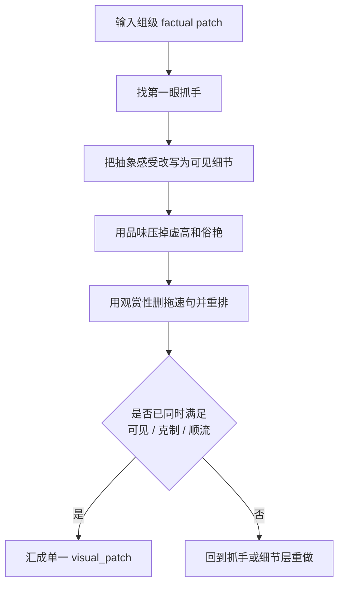

# 视觉强化 模块说明

## 定位

- 本分支负责面向 AIGC 生成母体，把第一眼抓手、审美克制和观看流动转成更具像、更可见、更可被模型消费的视觉信息增益，汇成 `visual_patch`。
- 它拥有“怎样把戏剧收益变得更可生成、更好看且更好读”的判断权，但不拥有脱离叙事制造奇观的权利。
- 它不是单独写美术设定，而是对现有组级 factual patch 做视觉收益增强，让下游模型更容易抓到焦点、质感和节奏。

## 具体创作方法

1. 先锁“这一组最值得被看见的东西”。
   只在主动作、主视线、关键物象、空间反差里选抓手，不从空泛美感词里找抓手。
2. 再把抽象感受压成可见细节。
   把“压迫、冷、脏、贵、危险、浪漫”这类感受改成光线、材质、姿态、遮挡、距离、反差、纹理。
3. 让 `品味` 负责收口。
   任何“电影感、高级感、绝美、震撼”这类偷懒表述，必须改写成更节制的可见信息。
4. 让 `观赏性` 负责顺流。
   检查哪一句在解释、哪一句在拖速，删掉不产生观看收益的说明。
5. 最后只留下一个清楚的 `visual_patch`。
   汇流时优先保留明确抓手、具像化信息、风格克制和阅读流动；若已经足够清楚，不要为了“更美”再加形容词。

## 思维·执行

- 先问“观众会先看见什么”，再问“这个看见是否服务主冲突”。
- 再问“这份好看是被看见的，还是只是被形容的”；若只是被形容，必须补物理可见信息。
- 最后问“这段读起来有没有顺着看下去”；若要靠解释才能显得高级，说明还没完成。

## 节点

| 节点 | 要回答的问题 | 执行动作 | 产出倾向 | 常见误差 |
| --- | --- | --- | --- | --- |
| `V1 抓手锁定` | 第一眼最该看哪里 | 从动作、视线、物象、反差中选一个主抓手 | `visual_hook` | 同时写多个抓手，导致焦点漂移 |
| `V2 具像落地` | 哪些感受还停留在抽象层 | 把抽象形容改写成光、色、材质、姿态、距离、遮挡 | `generation_ready_detail` | 只有氛围词，没有可见信息 |
| `V3 品味收口` | 哪些词显得虚高、俗艳、太满 | 删除空词，留下更耐看的具体细节 | `taste_filter` | 只会删词，不会补细节 |
| `V4 观看流整理` | 哪一句最拖速 | 删除解释句，压缩句长，调整信息顺序 | `viewing_flow` | 为了顺流把主抓手一并删掉 |
| `V5 汇流裁剪` | 最终该留下哪组视觉收益 | 只保留一个主抓手和少量必要反差 | 单一 `visual_patch` | 贪多，导致 patch 发闷 |

## 延展

### 组型适配

- 强动作组：优先从动作爆点、方向反差、接触瞬间找抓手，细节要短、硬、清楚。
- 情绪静场组：优先从视线、停顿、手部小动作、环境压迫感里找抓手，避免硬造大场面。
- 场景展示组：优先抓一个最能代表空间气质的物象或光感，不要把设定表平铺出来。
- 对话组：优先强化说话时的眼神、姿态、距离变化，让对白也有可见重心。

### 强化尺度

- 若原文已经有明确抓手，只做收束和净化，不重复造新亮点。
- 若主冲突本身很弱，不要指望视觉强化单独救场；应回到角色或动作层补主收益。
- 若项目整体风格偏克制，视觉强化应做“更准”，不是做“更满”。

## 失真与修正

- 若文字一眼很艳但不耐读，说明 `品味` 没有收口。
- 若抓手与主冲突无关，删除它，重新回到动作或视线节点找抓手。
- 若只有“氛围很好、感觉很强”却说不出具体看见了什么，说明还没有完成面向 AIGC 的具像化。
- 若观赏性通过解释堆出来，删掉拖速句，改保留更短的可见收益。
- 若 `visual_patch` 已经像独立美术设定，说明越权了；应回到“为当前 factual patch 增益”而不是另起炉灶。
