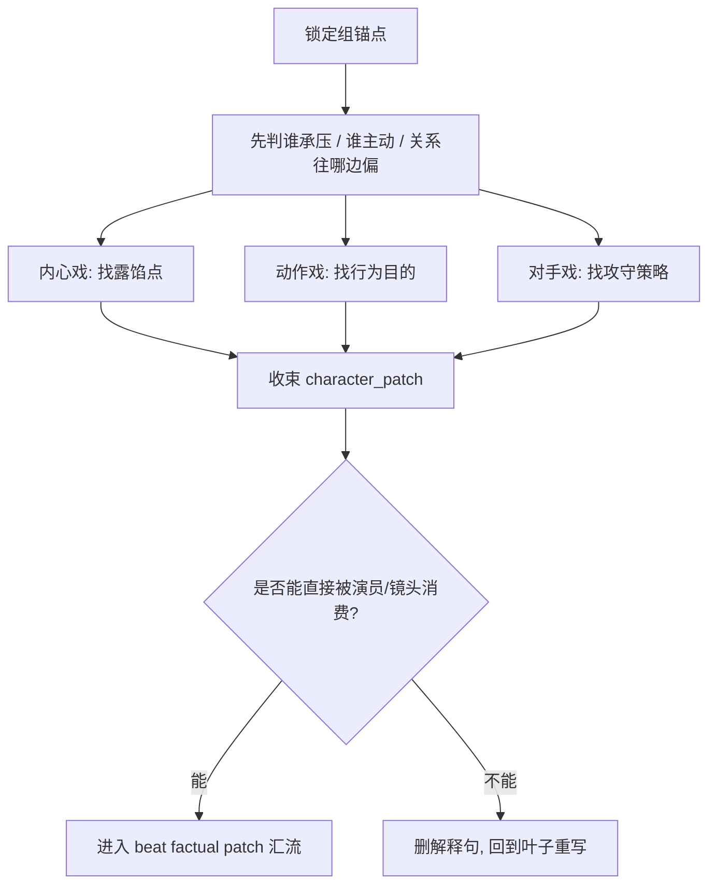

# 角色表现 模块说明

## 定位

- 本分支负责参照共享 [角色表现总则](module-spec.yaml)，把人物压力、行为目的和关系攻守收束成单一 `character_patch`。
- 它拥有“人物怎么显露自己”的判断权，不拥有空间调度、镜头组织和剪接策略的判断权。
- 它服务的是 `beat_patches[]` 的人物成立度，不是人物小传，不是情绪说明书，也不是第二份正文。
- 若命中有台词的对手戏，仍要把对白里的情绪、断句和气口压回 `对手戏` 叶子的可演策略，而不是把台词当纯文本处理。

## 创作目标

- 让读取者一眼看出：谁在承压，谁在主动，谁在躲，谁在逼。
- 让人物状态通过身体、动作和互动自己说话，而不是靠解释句代劳。
- 让 `内心戏 / 动作戏 / 对手戏` 三条叶子各补一类收益，最后汇流成一个可拍、可演、可 merge 的人物表达结果。

## 进入信号

- 分镜组里有人物行动、停顿、犹豫、试探、冲撞或回避。
- 对话之外，人物之间还有关系温差、权力拉扯或情绪压力。
- 上游 grouped script 已说清“发生了什么”，但还没说清“这个人怎么暴露自己”。

## 思维·执行骨架

## 思维·执行节点

| 节点 | 要回答的问题 | 执行动作 | 产出要求 |
| --- | --- | --- | --- |
| `C1-压强识别` | 这一拍到底谁在承压、谁在占先 | 从台词、动作、停顿、视线里识别当前压强方向 | 一句话说清本拍人物主态势 |
| `C2-叶子选路` | 这一组更需要先补身体露馅、行为推进，还是关系攻守 | 按主收益选择 `内心戏 / 动作戏 / 对手戏` 的主次顺序 | 明确主链和辅链，不三线平均发力 |
| `C3-局部落点` | 每条叶子各自提供了什么真正可见的结果 | 将叶子输出压成 `visible_emotion_signal / action_intent / relation_shift` | 只保留最有戏的一到两项收益 |
| `C4-人物汇流` | 最终人物是怎么被看见的 | 合并成一个可写入 `角色背景面 / 镜头消费提示` 的人物表达结果，而不是三段摘要 | 结果必须能直接进入 `character_patch` |

## 具体创作方法

### 1. 先锁“人物主问题”，不要先堆细节

- 每组只先抓一个主问题：是“压不住”、是“必须做”、还是“要和人过招”。
- 如果主问题没锁，后面三条叶子会同时加码，最后 factual patch 会变成人物信息拼盘。

### 2. 先定主链，再定辅链

- `压抑 / 掩饰 / 露馅` 明显时，以 `内心戏` 为主，`对手戏` 为辅。
- `冲突推进 / 出手 / 阻拦 / 交接` 明显时，以 `动作戏` 为主，`内心戏` 为辅。
- `试探 / 逼近 / 回避 / 权力交换` 明显时，以 `对手戏` 为主，`内心戏` 为辅。
- 另一条叶子只负责补刀，不负责争主轴。

### 3. 叶子落点必须可见

- `内心戏` 负责“身体哪一处先说真话”。
- `动作戏` 负责“这个人为何这样做，以及这一做怎么改了局面”。
- `对手戏` 负责“关系张力如何通过距离、视线和让压成立”。
- 任一叶子若不能落成可见动作或可感知信号，就暂时不能汇流。

### 4. 汇流时按“人先成立，再写得漂亮”处理

- 先合 `内心戏 + 动作戏`，确保人物本身站得住。
- 再让 `对手戏` 把关系攻守压进去，制造张力收益。
- 汇流后的结果应让父层能直接回填“这个人正在如何暴露自己”，而不是看到三条模块名。

## 常见判型

| 判型 | 优先叶子 | 写法抓手 | 不该做什么 |
| --- | --- | --- | --- |
| `压抑露馅型` | `内心戏` | 先抓微动作，再接表层维持 | 不要直接宣布“他很痛苦” |
| `行动破局型` | `动作戏` | 先写动作目的，再写阻断和结果 | 不要把动作写成热闹但无后果 |
| `攻守试探型` | `对手戏` | 先写逼近/回避，再写关系偏移 | 不要先解释关系史 |
| `混合型` | 主链 1 条 + 辅链 1 条 | 只保留一个主收益和一个辅助张力 | 不要三条叶子平均展开 |

## 汇流收束规则

- 优先保留：角色个性、行为目的、关系攻守。
- 优先删掉：抽象心理解释、重复形容词、总结式关系说明。
- 若多个信号同时成立，先保最能进入 `角色背景面 / 镜头消费提示` 的那一项，不保解释性冗余。

## 延展策略

- 若当前组以情绪压强为主，可把 `内心戏` 延展成“表层维持 -> 身体露馅 -> 下一拍余震”三拍结构。
- 若当前组以行为推进为主，可把 `动作戏` 延展成“出手前蓄压 -> 行为实施 -> 局面改写”。
- 若当前组以关系拉扯为主，可把 `对手戏` 延展成“试探 -> 逼近/回避 -> 权力转手或失手”。
- 延展只允许加强主收益，不允许另起第二主冲突。

## 失真与修正

- 若文本只剩“紧张、愤怒、悲伤”之类情绪标签，说明 `内心戏` 没有落成可见信号。
- 若人物写得很满但空间开始混乱，立刻把方位和动作连续性交还 `运动表现`。
- 若关系判断变成解释说明，删掉结论句，改回逼近、回避、失手或对视等可演动作。
- 若三条叶子都很成立，但放在一起像三份笔记，说明还没完成 `character_patch` 汇流，应回到 `C4-人物汇流` 重写。
- 若结果开始像独立 prose 段落，而不是可并入 factual patch 的字段块，说明已经越过 `水月` 的字段边界。
