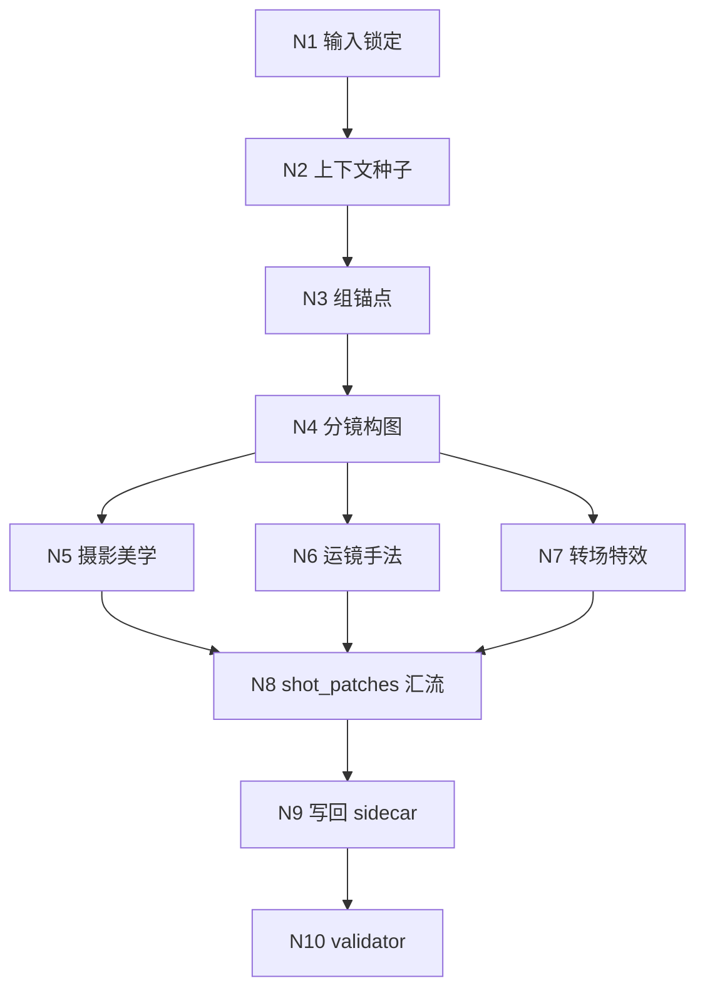

# 3-Detail / 镜花

## 概述

`镜花` 是 `3-Detail` 下的 stage-local child skill。

它不再承接 `水月` 的 markdown 成稿做二次融写，而是直接围绕固定 `剧本正文` 生成 **shot skeleton + cinematic patch**：

- 主输入：`projects/aigc/<项目名>/3-Detail/第N集.json`
- 辅助输入：`projects/aigc/<项目名>/1-Planning/3-分组/第N集.md`
- 必需前置：shared root 中稳定的 `分镜切换`
- 必需辅助：`projects/aigc/<项目名>/3-Detail/水月/第N集.field-patch.json`
- canonical 输出：`projects/aigc/<项目名>/3-Detail/镜花/第N集.field-patch.json`

内部思考链已收束为 `分镜构图` 先行、后三链默认并行的结构：

1. `分镜构图`
2. `摄影美学`
3. `运镜手法`
4. `转场特效`

但最终落盘不再是 `[分镜N ...]` prose，而是：

- `shot_patches[].分镜ID`
- `shot_patches[].时间段`
- `shot_patches[].景别 / 镜头属性 / 镜头框架 / 镜头类型 / 镜头视角`
- `shot_patches[].运镜手法 / 镜头速度`
- `shot_patches[].摄影美学 / 转场特效`
- `shot_patches[].beat_refs[]`

## Child-Skill Positioning

### `镜花` 拥有

- 生成 group-level shot skeleton
- 为每个 shot 生成 cinematic patch
- 把附加上下文真正压入镜头组织、画面策略和字段表达
- 写回 `projects/aigc/<项目名>/3-Detail/镜花/第N集.field-patch.json`

### `镜花` 不拥有

- 改写 `1-Planning/3-分组` 的组界、组序、组 ID
- 改写 shared root 的 `剧本正文`
- 生成 `组间设计.*`
- 生成 factual 字段 `角色背景面 / 角色站位走位 / 道具及状态 / 镜头消费提示`
- 改写 shared root 中的 `分镜切换`
- 直接维护 `projects/aigc/<项目名>/3-Detail/第N集.json`

## When to Use

- shared root 已存在且包含稳定 `剧本正文`
- 需要把每个分镜组整理成 shot skeleton
- 需要补齐导演调度、摄影执行、运镜与转场字段
- 需要在既定 `分镜切换 + 水月 evidence` 基础上生成 cinematic patch sidecar

## When Not to Use

- shared root 还没有稳定 `剧本正文`
- shared root 缺失稳定的 `分镜切换`
- `水月` factual evidence 还未稳定
- 当前任务只涉及 factual 字段或 `出场角色及穿搭`
- 用户要求直接改写剧情正文

## Canonical Source Contract (Mandatory)

- 第一输入真源固定为：`projects/aigc/<项目名>/3-Detail/第N集.json`
- `1-Planning/3-分组/第N集.md` 只用于组界复核与 beat 锚点补证
- shared root 中的 `分镜切换` 是真实切镜的上游真值，不得默认改写
- `水月` sidecar 是实际落镜的 factual 前置，不得当作可选装饰
- `0-Init` 只提供题材、人物、世界、禁区与 north star 边界
- `2-Global` 只提供 `类型元素 / 全局风格 / 设计元素` 的项目级或组级附加证据
- `.agents/skills/aigc/_shared/director_episode_output.schema.json#/$defs/detail_patch_sidecar`
  - 持有 patch sidecar 的唯一结构真源
- 最终真源只允许落在：
  - `projects/aigc/<项目名>/3-Detail/镜花/第N集.field-patch.json`

硬规则：

1. 不得改组 ID、组序、组边界。
2. 不得改写 `剧本正文`。
3. 不得写 `组间设计.*`。
4. 必须先形成 shot spine，再做摄影、运镜、转场补全。
5. `beat_refs[]` 必须优先回指共享 `beat_id`；若无法稳定回指，不得硬写 ready。

## Business Requirement Analysis Contract (Mandatory)

| analysis_slot | 当前结论 |
| --- | --- |
| `business_goal` | 在固定 `剧本正文` 基础上，为每个分镜组补齐 shot skeleton、摄影执行、运镜和转场设计，使其进入可被父层直接合成的镜级 cinematic patch 状态。 |
| `business_object` | `3-Detail/第N集.json`、`1-Planning/3-分组/第N集.md`、`0-Init/*`、`2-Global/*`、必需 `水月/第N集.field-patch.json`。 |
| `constraint_profile` | `剧本正文` 保持不动；shared root 中 `分镜切换` 默认继承不改写，且 former `1-切换` 已内化到 `2-Global` 的固定镜数裁决逻辑；`分镜构图` 必须先行，`摄影美学 / 运镜手法 / 转场特效` 默认并行且只产 shot-level patch；实际落镜必须依赖 `水月` factual evidence；不得写 factual 字段。 |
| `success_criteria` | 每组都有稳定的 shot spine、明确的导演/摄影收益、可感知的风格落点、克制的转场/特效，且所有镜头组织都能回指到固定 `剧本正文` 与 `beat_refs[]`。 |
| `non_goals` | 不写 episode JSON；不写二次正文融写稿；不接管 factual patch。 |
| `complexity_source` | 顶层从“前置切换叶子 + 三段顺推”改成“`分镜构图` 先行 + 三条默认并行分支”；需要在不改 `剧本正文` 的前提下把镜头语言压成可 merge 字段，并保证并发分支不互相越权。 |
| `topology_fit` | 采用“输入锁定 -> 检查 `分镜切换 + 水月 evidence` -> `分镜构图` 先行 -> `摄影美学 / 运镜手法 / 转场特效` 默认并行 -> shot_patches 汇流 -> validator 校验”的混合思行网络。 |
| `step_strategy` | `SKILL.md` 保留骨架、Mermaid、门禁和字段表；具体模块细则下沉到 `references/*.yaml`；模板与 validator 负责落盘稳定性。 |

## Context Preload (Mandatory)

固定加载顺序：

1. 根 `AGENTS.md`
2. `.agents/skills/aigc/SKILL.md + CONTEXT.md`
3. `.agents/skills/aigc/3-Detail/SKILL.md + CONTEXT.md`
4. 本 `SKILL.md + CONTEXT.md`
5. `.agents/skills/aigc/_shared/director_episode_output.schema.json#/$defs/detail_patch_sidecar`
6. `.agents/skills/aigc/3-Detail/_shared/node-pack-contract.md`
7. `.agents/skills/aigc/3-Detail/_shared/creative-guidance-contract.md`
8. `projects/aigc/<项目名>/0-Init/north_star.yaml`
9. `projects/aigc/<项目名>/0-Init/init_handoff.yaml`
10. `projects/aigc/<项目名>/0-Init/story-source-manifest.yaml`（若存在）
11. `projects/aigc/<项目名>/3-Detail/第N集.json`
12. `projects/aigc/<项目名>/1-Planning/3-分组/第N集.md`（若存在）
13. `projects/aigc/<项目名>/3-Detail/水月/第N集.field-patch.json`
14. `projects/aigc/<项目名>/2-Global/全集类型元素.md`（若存在）
15. `projects/aigc/<项目名>/2-Global/分组类型元素.md`（若存在）
16. `projects/aigc/<项目名>/2-Global/全局风格.md`（若存在）
17. `projects/aigc/<项目名>/2-Global/导演意图.md`（若存在）
18. `references/module-index.md`
19. `references/route-profile.yaml`
20. 按需读取各分类 `module-spec.yaml` 与命中叶子 `module-spec.yaml`
21. `references/examples.md`
22. `references/creative-review-rubric.md`
23. `templates/field-patch.template.json`

## Watermoon Relationship Contract (Mandatory)

`镜花` 的真实切镜不再把 `水月` 当可选提示，而是把它视为实际落镜前置。

规则如下：

1. `镜花` 的第一事实层是 shared root 中固定 `剧本正文 + 分镜切换`。
2. `水月` sidecar 是真实切镜与 `beat_refs[]` 稳定化的直接前置，不得默认跳过。
3. 若 `水月` sidecar 缺失，父层应先补 `水月` 或显式确认只做 seed-level审阅；`镜花` 不得默认代替 `水月` 补事实。
4. `镜花` 不得为了配合镜头语言而反向发明新的剧情事实，也不得重判 shared root 已定的组级镜数。

## Internal Sequencing Gate (Mandatory)

`镜花` 对内是严格的组级串行阶段链；对外也默认承接 `2-Global seed + 水月 evidence` 之后再进入实际落镜。

规则如下：

1. 每个 group 必须先完成 `分镜构图`，之后 `摄影美学 / 运镜手法 / 转场特效` 默认并行展开。
2. `分镜构图` 必须直接承接 `2-Global` 已内化的固定 `分镜切换`，在不改镜头数的前提下一体完成 `时间段 + slot_id + 构图骨架 + descriptor lock + beat_refs[]`。
3. 若 `分镜构图` 一落下去就破坏动作连续、空间连续或 fixed shot count integrity，必须回退到 shared root `分镜切换` 与 `水月` evidence 重新解释，而不是让后续分支继续叠词。
4. `摄影美学 / 运镜手法 / 转场特效` 都只允许消费已稳定的 shot spine，不得反向增减镜头数、改写 slot 映射或重判组级镜序；三者默认互为 side input，而不是串行前置。

## Thinking-Action Network (Mandatory)

| node_id | 对应 Step | 聚焦字段 | objective | actions | evidence | route_out | gate |
| --- | --- | --- | --- | --- | --- | --- | --- |
| `N1-INPUT-LOCK` | `S1` | `FIELD-JH-01` | 锁定唯一 shared root 与 group scope | 读取 `第N集.json`，识别组 ID、组标题、固定 `剧本正文` 与总时长 | `input_lock_note` | -> `N2` | shared root 可用后才可继续 |
| `N2-CONTEXT-SEED` | `S2` | `FIELD-JH-02` | 提炼 `Init / Global` 中可进入镜头语法的约束 | 抽取题材、风格、设计元素、类型打法与禁区 | `context_seed_note` | -> `N3` | 附加上下文必须可转译为镜头语言 |
| `N3-GROUP-ANCHOR` | `S3` | `FIELD-JH-03` | 为每组提炼 shot 锚点与 beat 对齐线索 | 锁 `场景 / 冲突 / 情绪 / 视觉任务 / 总时长 / beat hints` | `group_anchor_table` | -> `N4` | 每组都要有主冲突与主视线 |
| `N4-SHOT-STAGE` | `S4` | `FIELD-JH-04` | 完成 `分镜构图` 先行阶段 | 直接承接 `2-Global` 已内化的固定 `分镜切换 + 水月 evidence`，一体锁 `时间段 / slot / 构图 / descriptor / beat_refs[]`，形成 shot spine | `shot_spine_patch` | -> `N5/N6/N7` | 未按既定镜数形成 shot skeleton 前不得进入后续阶段 |
| `N5-CINEMATOGRAPHY-STAGE` | `S5` | `FIELD-JH-05` | 完成 `摄影美学` 并行分支 | 锁 `visual_control_line`，再分发 `光影 / 色彩 / 质感`，压成摄影 patch | `cinematography_patch` | -> `N8` | 摄影信息必须依附 shot spine |
| `N6-CAMERA-STAGE` | `S6` | `FIELD-JH-06` | 完成 `运镜手法` 并行分支 | 并发思考 `变化 / 组合 / 速度`，汇成运镜 patch | `camera_patch` | -> `N8` | 运镜必须有动机 |
| `N7-TRANSITION-STAGE` | `S7` | `FIELD-JH-07` | 完成 `转场特效` 并行分支 | 并发思考 `组内 / 组间 / 特效`，只保留有叙事收益项 | `transition_fx_patch` | -> `N8` | 无收益项允许为空 |
| `N8-CONVERGE` | `S8` | `FIELD-JH-08` | 把各阶段 patch 收束成 `shot_patches[]` | 生成 `slot_id / 分镜ID / 时间段 / descriptors / cinematic fields / beat_refs[]` | `shot_patch_summary` | -> `N9` | 不得回写 prose |
| `N9-WRITEBACK` | `S9` | `FIELD-JH-09` | 按模板一次性写回 sidecar | 落盘 `projects/aigc/<项目名>/3-Detail/镜花/第N集.field-patch.json` | `writeback_note` | -> `N10` | 只写一个 canonical 文件 |
| `N10-VALIDATE` | `S10` | `FIELD-JH-09` | 校验 sidecar 结构与 ownership | 执行 `scripts/validate_jinghua_output.py` | `validation_verdict` | pass -> `done`；fail -> 回 `S8/S9` | 通过前不得结案 |

## Output Contract (Mandatory)

### 输出路径

- `projects/aigc/<项目名>/3-Detail/镜花/第N集.field-patch.json`

### 输出格式

- 顶层必须符合 `.agents/skills/aigc/_shared/director_episode_output.schema.json#/$defs/detail_patch_sidecar`
- 只允许出现：
  - `shot_patches[].分镜ID`
  - `shot_patches[].时间段`
  - `shot_patches[].景别 / 镜头属性 / 镜头框架 / 镜头类型 / 镜头视角`
  - `shot_patches[].运镜手法 / 镜头速度`
  - `shot_patches[].摄影美学 / 转场特效`
  - `shot_patches[].beat_refs[]`
- 不得包含 `剧本正文`
- 不得包含 `组间设计.*`
- 不得包含 `分镜切换`
- 不得包含 factual 字段 `角色背景面 / 角色站位走位 / 道具及状态 / 镜头消费提示`

## Field Master

| field_id | 输出位置/字段 | 内容要求 | 默认责任 Step | 质量维度 | 失败码 |
| --- | --- | --- | --- | --- | --- |
| `FIELD-JH-01` | 输入锁定 | shared root 与 episode scope 唯一 | `S1` | 真源稳定性 | `FAIL-JH-01` |
| `FIELD-JH-02` | 附加上下文种子 | `Init / Global` 被转译成镜头语言约束 | `S2` | 上下文利用率 | `FAIL-JH-02` |
| `FIELD-JH-03` | 组锚点 | 每组有主冲突、主视线、总时长与 beat hints | `S3` | 锚点清晰度 | `FAIL-JH-03` |
| `FIELD-JH-04` | shot spine | `分镜ID / 时间段 / beat_refs[]` 可稳定成形 | `S4` | 骨架稳定性 | `FAIL-JH-04` |
| `FIELD-JH-05` | 摄影 patch | 摄影信息可依附 shot spine | `S5` | 摄影可执行性 | `FAIL-JH-05` |
| `FIELD-JH-06` | 运镜 patch | 运镜有动机且不炫技 | `S6` | 运动合理性 | `FAIL-JH-06` |
| `FIELD-JH-07` | 转场 patch | 转场克制且有叙事收益 | `S7` | 转场节制性 | `FAIL-JH-07` |
| `FIELD-JH-08` | shot patch 汇流 | cinematic patch 被收束成合法 `shot_patches[]` | `S8` | 收束能力 | `FAIL-JH-08` |
| `FIELD-JH-09` | 最终 sidecar | 结构、ownership 与 validator 全通过 | `S9/S10` | 落盘可消费性 | `FAIL-JH-09` |

## Thought Pass Map

| step_id | 聚焦字段 | 核心问题 | 生成动作 | 未达标信号 |
| --- | --- | --- | --- | --- |
| `S1` | `FIELD-JH-01` | 这轮到底命中哪一集、哪几个 group | 锁 shared root 与组序 | 输入漂移、scope 不稳 |
| `S2` | `FIELD-JH-02` | 哪些 `Init / Global` 约束必须进入镜头语言 | 提炼镜头语言约束种子 | 附加上下文只被罗列，不被消费 |
| `S3` | `FIELD-JH-03` | 每组最该被镜头放大的主冲突和主视线是什么 | 生成组锚点表 | 后续 shot spine 没有主视点 |
| `S4` | `FIELD-JH-04` | 如何先锁 shot skeleton，而不是直接堆摄影词 | 生成 `分镜ID / 时间段 / beat_refs[]` | 有镜头感但无结构骨架 |
| `S5` | `FIELD-JH-05` | 摄影信息如何依附 skeleton | 压摄影 patch | 摄影词漂浮、无依附 |
| `S6` | `FIELD-JH-06` | 运镜是否真的服务信息推进 | 压运镜 patch | 动镜无动机 |
| `S7` | `FIELD-JH-07` | 转场是否真正有收益 | 压转场 patch | 特效喧宾夺主 |
| `S8` | `FIELD-JH-08` | 如何把各阶段 patch 合成 `shot_patches[]` | 汇流 sidecar | 输出像散碎注释，不像 patch |
| `S9` | `FIELD-JH-09` | 如何按模板一次性写回 | 落盘 sidecar | 结构不稳、字段越权 |
| `S10` | `FIELD-JH-09` | sidecar 是否真能交付父层 merge | 跑 validator | ownership 或结构未过 |

## Pass Table

| field_id | Pass Standard | Fail Code | Rework Entry |
| --- | --- | --- | --- |
| `FIELD-JH-01` | shared root 与 group scope 唯一 | `FAIL-JH-01` | `S1` |
| `FIELD-JH-02` | `Init / Global` 被压成镜头语言约束 | `FAIL-JH-02` | `S2` |
| `FIELD-JH-03` | 每组锚点足以支撑 shot skeleton | `FAIL-JH-03` | `S3` |
| `FIELD-JH-04` | shot skeleton 可回链 `剧本正文` 与 `beat_refs[]` | `FAIL-JH-04` | `S4` |
| `FIELD-JH-05` | 摄影 patch 依附骨架且不空泛 | `FAIL-JH-05` | `S5` |
| `FIELD-JH-06` | 运镜 patch 有叙事动机 | `FAIL-JH-06` | `S6` |
| `FIELD-JH-07` | 转场 patch 克制且有收益 | `FAIL-JH-07` | `S7` |
| `FIELD-JH-08` | cinematic patch 被收束成合法 `shot_patches[]` | `FAIL-JH-08` | `S8` |
| `FIELD-JH-09` | 模板结构与 validator 同时通过 | `FAIL-JH-09` | `S9/S10` |

## Root-Cause Execution Contract (Mandatory)

出现以下任一情况时，必须先修源层再继续下游：

- `镜花` sidecar 越权写 factual 或 group 级字段
- shot skeleton 缺 `beat_refs[]` 或时间段不闭合
- 只有镜头感，没有可 merge 的字段结构
- 为了镜头语言反向发明剧情事实

强制追因链：

`Symptom/Failure -> Direct Technical Cause -> Rule Source -> Meta Rule Source -> Fix Landing Points`

## Completion Contract (Mandatory)

只有同时满足以下条件，`镜花` 才允许宣布完成：

1. `projects/aigc/<项目名>/3-Detail/镜花/第N集.field-patch.json` 已写回。
2. sidecar 不包含 `剧本正文`。
3. sidecar 不包含 `组间设计.*` 与 factual 字段。
4. `shot_patches[]` 已对命中 group 成形，且 `beat_refs[]` 尽量稳定。
5. `validate_jinghua_output.py` 返回通过。
